# Use ALB and NLB to route the traffic to instance hosted in Peering VPC

## Prepare
1. Setup the VPC peering between `VPC-80-Port` and `VPC-9080-Port`
2. Setup the Security group allow 80 and 9080 port
3. Create EC2 with c4.large in `VPC-80-Port` and EC2 with t2.medium in `VPC-9080-Port`


## ALB
1. Create ALB in `VPC-9080-Port`

2. Target group for ALB which point to IP address in peered VPC `VPC-80-Port` and Port is 80
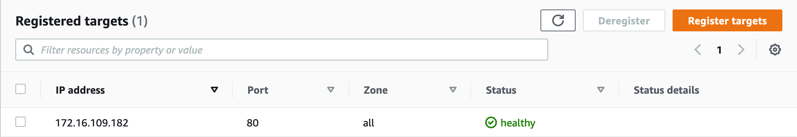

3. Target group for ALB which point to IP address in local VPC `VPC-9080-Port` and Port is 9080
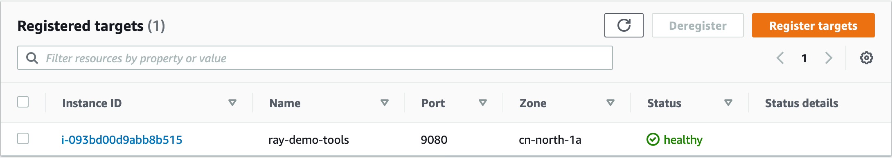

4. ALB Listener
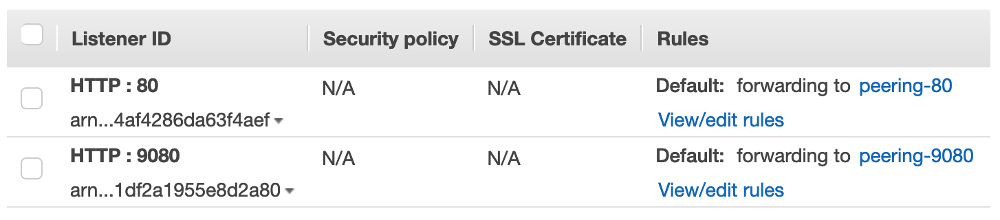

5. Verify access ALB 80 and 9080 can get success response

## NLB
1. Create NLB in `VPC-9080-Port`

2. Target group for NLB which point to IP address in peered VPC `VPC-80-Port` and Port is 80
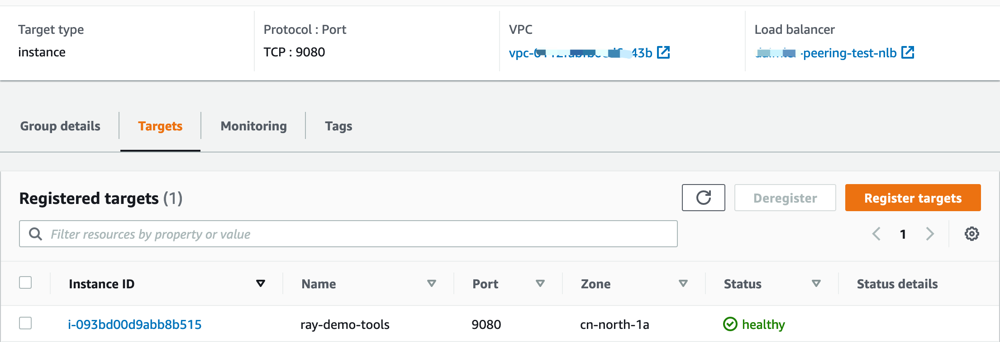

3. Target group for NLB which point to IP address in local VPC `VPC-9080-Port` and Port is 9080


4. NLB Listener
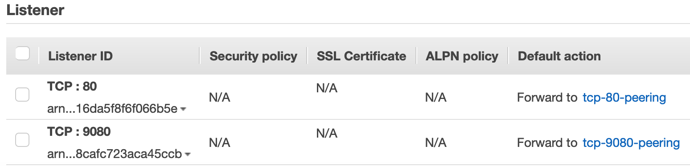

5. Verify access NLB 80 and 9080 can get success response

## Auto Scaling group support

When you use Elastic Load Balancing with your Auto Scaling group, it's not necessary to register individual EC2 instances with the load balancer. Instances that are launched by your Auto Scaling group are automatically registered with the load balancer. Likewise, instances that are terminated by your Auto Scaling group are automatically deregistered from the load balancer. 

There is a key difference in how the load balancer types are configured. With Application Load Balancers, Network Load Balancers, instances are registered as targets with a target group, and you route traffic to the target group. With Classic Load Balancers, instances are registered directly with the load balancer. 

Right now, Application or Network Load Balancer target groups are only support instance target groups that belong to the same VPC as your Auto Scaling group are available for selection. Classic Load Balancers can only attach the instance in the same VPC. 

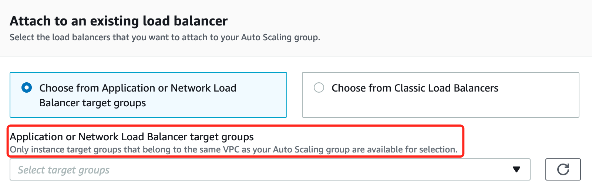

I would suggest below approaches:

- (1) Adjust your network design to avoid cross VPC Load Balancer and Keep Autoscaling group and Load Balancer within same VPC (Recommanded)

- (2) Internet facing ALB in public VPC and Intranet NLB with auto-scaling group in private VPC, setup the AWS PrivateLink to integrate Internet facing ALB with Intranet NLB
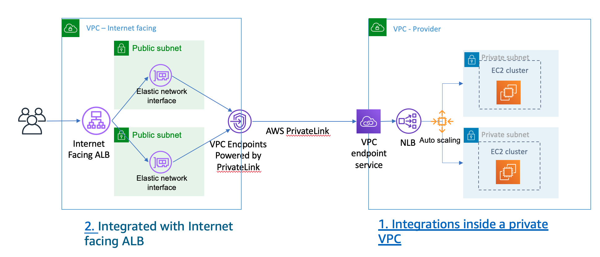

Now let's work on PrivateLink

**Note: When you use the PrivateLink, there is no need setup the VPC peering between two VPC.**

You can also use the [PrivateLink to do blue-green deloyment](https://aws.amazon.com/blogs/networking-and-content-delivery/how-to-securely-publish-internet-applications-at-scale-using-application-load-balancer-and-aws-privatelink/)

1. Create the Auto-Scaling Group Launch template
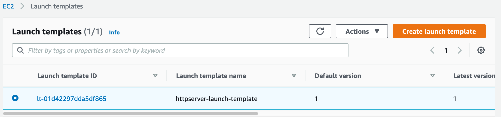

2. Create the Endpoint Service in Private VPC
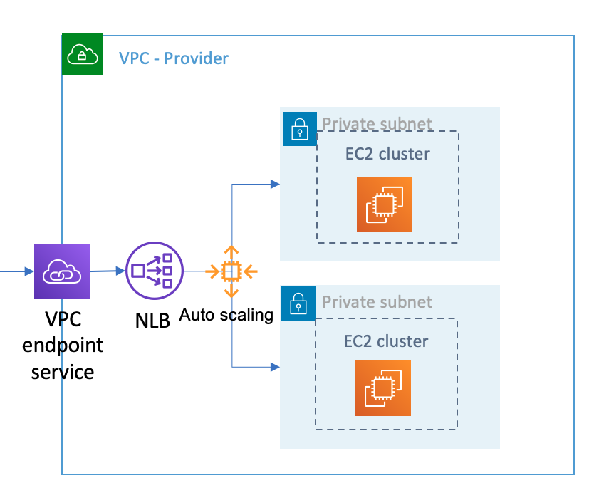
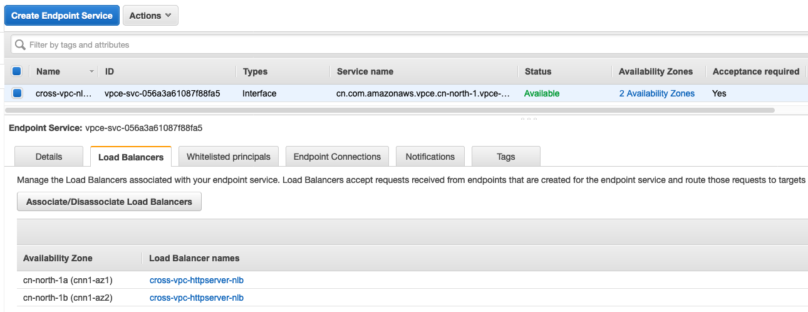

3. Create the Endpoint in Public VPC and Record the subnet ENI IP
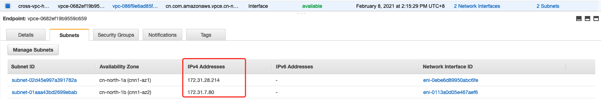

4. Create the Internet facing ALB in Public VPC and the Target group point to VPC Endpoint subnet ENI IP
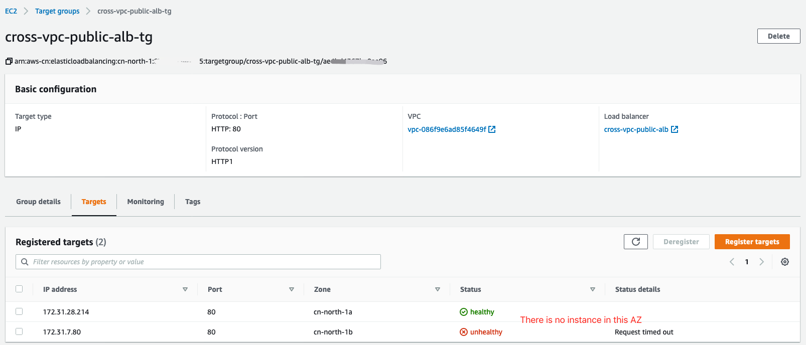

    You can see the Internet facing ALB in Public VPC and Intranet NLB with auto-scaling group in private VPC

    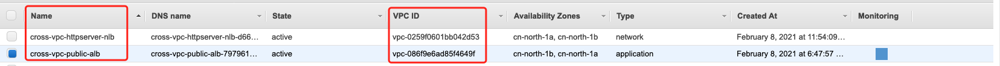

5. Verify the ALB response and running load testing with apache ab to verify the auto-scaling
```bash
curl http://<public-alb>
```

