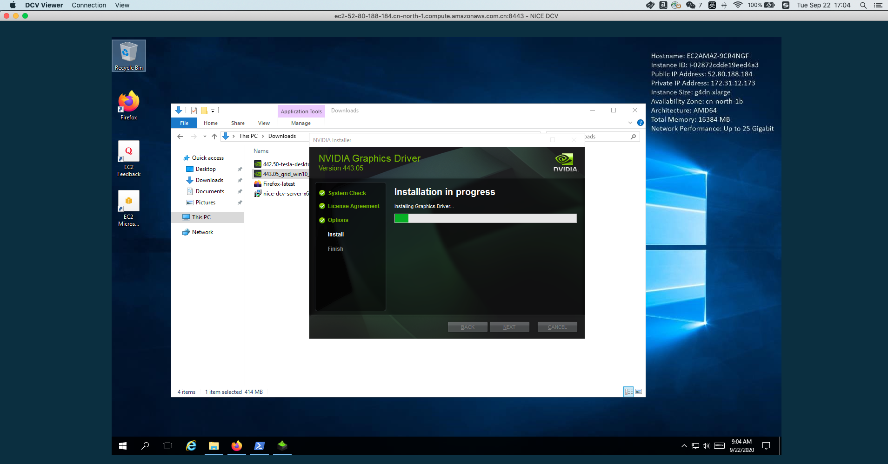

# How to install LInux NICE DCV Servers on Amazon EC2 Instances

This document explains how to install the NICE DCV which enables clients to access a remote graphical X session on a Linux server. Here use Amazon Linux 2 as example

# Prerequisites for Linux NICE DCV Servers 

## Install a Desktop Environment and Desktop Manager
```
sudo yum install -y gdm gnome-session gnome-classic-session gnome-session-xsession
sudo yum install -y xorg-x11-server-Xorg xorg-x11-fonts-Type1 xorg-x11-drivers
sudo yum install -y gnome-terminal gnu-free-fonts-common gnu-free-mono-fonts gnu-free-sans-fonts gnu-free-serif-fonts
sudo yum upgrade -y
sudo reboot
```

## Install the glxinfo Utility
```bash
sudo yum install -y glx-utils
```

## Verify OpenGL Software Rendering
```bash
sudo DISPLAY=:0 XAUTHORITY=$(ps aux | grep "X.*\-auth" | grep -v grep | sed -n 's/.*-auth \([^ ]\+\).*/\1/p') glxinfo | grep -i "opengl.*version"

# sample output
OpenGL version string: 2.1 Mesa 18.3.4
OpenGL shading language version string: 1.20
OpenGL ES profile version string: OpenGL ES 2.0 Mesa 18.3.4
OpenGL ES profile shading language version string: OpenGL ES GLSL ES 1.0.16
```

## Install the Nvidia Drivers

https://docs.amazonaws.cn/AWSEC2/latest/UserGuide/install-nvidia-driver.html

For example, install the NVIDIA GRID driver on your Linux instance
```bash
sudo yum install -y gcc make
sudo yum update -y
# Reboot your instance to load the latest kernel version.
sudo reboot
# Install the gcc compiler and the kernel headers package
sudo yum install -y gcc kernel-devel-$(uname -r)
# Download the GRID driver installation utility
mkdir griddriver && cd griddriver
aws s3 ls --recursive s3://ec2-linux-nvidia-drivers/  --region us-east-1 --no-sign-request --profile global

aws s3 cp --recursive s3://ec2-linux-nvidia-drivers/latest/ . --region us-east-1 --no-sign-request --profile global

# Install GRID Driver
chmod +x NVIDIA-Linux-x86_64*.run
sudo /bin/sh ./NVIDIA-Linux-x86_64*.run
sudo reboot
nvidia-smi -q | head
```

In case you encount below error
```bash
ERROR: You appear to be running an X server; please exit X before installing.  For further details, please see the section INSTALLING THE NVIDIA
         DRIVER in the README available on the Linux driver download page at www.nvidia.com.
ERROR: Installation has failed.  Please see the file '/var/log/nvidia-installer.log' for details.  You may find suggestions on fixing installation
         problems in the README available on the Linux driver download page at www.nvidia.com.

# Fix - Stop the X server and re-enable it after GRID Driver installation
sudo systemctl isolate multi-user.target
ps aux | grep X | grep -v grep
```

## Configure the X Server
```bash
sudo systemctl get-default
sudo systemctl set-default graphical.target
sudo systemctl isolate graphical.target
ps aux | grep X | grep -v grep

# Sample output
root      2616  6.4  0.2 602976 41176 tty1     Ssl+ 15:08   0:00 /usr/bin/X :0 -background none -noreset -audit 4 -verbose -auth /run/gdm/auth-for-gdm-omOaHk/database -seat seat0 -nolisten tcp vt1
```

## Configure NVIDIA Drivers
```bash
sudo rm -rf /etc/X11/XF86Config*
sudo nvidia-xconfig --preserve-busid --enable-all-gpus

# If you are using a G3 or G4 Amazon EC2 instance and you want to use a multi-monitor console session, include the --connected-monitor=DFP-0,DFP-1,DFP-2,DFP-3 parameter as follows. 
sudo nvidia-xconfig --preserve-busid --enable-all-gpus --connected-monitor=DFP-0,DFP-1,DFP-2,DFP-3

# sample output
Using X configuration file: "/etc/X11/xorg.conf".
Backed up file '/etc/X11/xorg.conf' as '/etc/X11/xorg.conf.backup'
New X configuration file written to '/etc/X11/xorg.conf'

# Restart the X server for the changes to take effect.
sudo systemctl isolate multi-user.target
sudo systemctl isolate graphical.target
ps aux | grep X | grep -v grep

# To verify that OpenGL hardware rendering is available
sudo DISPLAY=:0 XAUTHORITY=$(ps aux | grep "X.*\-auth" | grep -v grep | sed -n 's/.*-auth \([^ ]\+\).*/\1/p') glxinfo | grep -i "opengl.*version"
OpenGL core profile version string: 4.4.0 NVIDIA 450.89
OpenGL core profile shading language version string: 4.40 NVIDIA via Cg compiler
OpenGL version string: 4.6.0 NVIDIA 450.89
OpenGL shading language version string: 4.60 NVIDIA
OpenGL ES profile version string: OpenGL ES 3.2 NVIDIA 450.89
OpenGL ES profile shading language version string: OpenGL ES GLSL ES 3.20
```

# Install the NICE DCV Server on Linux
```bash
# import the NICE GPG key
sudo rpm --import https://d1uj6qtbmh3dt5.cloudfront.net/NICE-GPG-KEY
# Download and extract the packages
wget https://d1uj6qtbmh3dt5.cloudfront.net/2020.2/Servers/nice-dcv-2020.2-9662-el7-x86_64.tgz
tar -xvzf nice-dcv-2020.2-9662-el7-x86_64.tgz && cd nice-dcv-2020.2-9662-el7-x86_64
# Install
sudo yum install -y nice-dcv-server-2020.2.9662-1.el7.x86_64.rpm
# (Optional) If you plan to use virtual sessions, install the nice-xdcv package. 
sudo yum install -y nice-xdcv-2020.2.359-1.el7.x86_64.rpm
# (Optional) If you plan to use GPU sharing, install the nice-dcv-gl package
sudo yum install -y nice-dcv-gl-2020.2.881-1.el7.x86_64.rpm
# (Optional) If you plan to use NICE DCV with NICE EnginFrame, install the nice-dcv-simple-external-authenticator package.
sudo yum install -y nice-dcv-simple-external-authenticator-2020.2.125-1.el7.x86_64.rpm
# (Optional) If you plan to support specialized USB devices using USB remotization, install the DCV USB drivers. 
sudo yum install -y https://dl.fedoraproject.org/pub/epel/epel-release-latest-6.noarch.rpm
sudo yum install -y dkms
sudo dcvusbdriverinstaller
```

# Post-Installation Checks
1. Ensure the NICE DCV Server Is Reachable: Setup the secuirty group inbound rule open `8443` port

2. Ensure That the X Server Is Accessible
- Console Sessions, To verify that the dcv user can access the X server
```bash
sudo systemctl isolate multi-user.target
sudo systemctl isolate graphical.target
ps aux | grep X | grep -v grep

sudo DISPLAY=:0 XAUTHORITY=$(ps aux | grep "X.*\-auth" | grep -v grep | sed -n 's/.*-auth \([^ ]\+\).*/\1/p') xhost | grep "SI:localuser:dcv$"

# If the command returns SI:localuser:dcv, the dcv user can access the X server. 
```

- Virtual Sessions, To verify that local users can access the X server
```bash
sudo systemctl isolate multi-user.target
sudo dcvgladmin disable
sudo dcvgladmin enable
sudo systemctl isolate graphical.target

sudo DISPLAY=:0 XAUTHORITY=$(ps aux | grep "X.*\-auth" | grep -v grep | sed -n 's/.*-auth \([^ ]\+\).*/\1/p') xhost | grep "LOCAL:$"

# If the command returns LOCAL:, local users can access the X server. 
```

3. Verify That DCV GL Is Properly Installed
```bash
sudo dcvgldiag

# sample output
NICE DCV - Diagnostic Script
============================================

Date:             Mon, 14 Dec 2020 16:42:00 +0000

Host:             ip-172-31-13-58.cn-north-1.compute.internal
Architecture:     x86_64
Operating System: Amazon Linux 2
Kernel Version:   4.14.209-160.335.amzn2.x86_64
Nvidia GPU:       Tesla T4
Nvidia Driver:    450.89
Runlevel:         5

X configuration file: /etc/X11/xorg.conf

DCV GL (GLVND) is enabled for 64 bit applications.

Running tests: ................... DONE

INFO (1/1)

  The X server configuration does not contain the "HardDPMS" "false" option. Ignore this message if you are not experiencing GPU frame rate drops.

  Otherwise, if you are experiencing GPU frame rate drops, add the "HardDPMS" "false" option to the appropriate "Device" section of the '/etc/X11/xorg.conf' file.


There is 1 info message.

No problem found.

A detailed report about the tests is available in '/home/ec2-user/nice-dcv-2020.2-9662-el7-x86_64/dcvgldiag-G3mwny'
```

4. start the NICE DCV server on Linux
```bash
sudo systemctl start dcvserver

# To configure the NICE DCV server to start automatically on Linux
sudo systemctl enable dcvserver
```

5. Stop the NICE DCV Server
```bash
sudo systemctl stop dcvserver

# To prevent the NICE DCV server from starting automatically on Linux
sudo systemctl disable dcvserver
```

# Starting NICE DCV Sessions
1. 
```bash
dcv list-sessions
There are no sessions available.

sudo passwd ec2-user

# Example 1 - Console session
sudo dcv create-session --type=console --owner dcv-user --name "my graphics session" my-session

# Example 2 - Virtual Session (Linux NICE DCV servers only)
sudo dcv create-session --owner dcv-user --user dcv-user my-session

# Example 3 - Virtual Session (Linux NICE DCV servers only)
dcv create-session my-session

dcv close-session my-session

dcv describe-session my-session
dcv describe-session my-session --json
```

2. To enable an automatic console session on a Linux NICE DCV server
```bash
1. Navigate to /etc/dcv/ and open the dcv.conf with your preferred text editor.

2. Add the create-session and owner parameters to the [session-management/automatic-console-session] section using the following format:


[session-management]
create-session = true

[session-management/automatic-console-session]
owner="session-owner"
					

3. Save and close the file.

4. Stop and restart the NICE DCV server.
```

3. DCV Client

Follow the guide [download and install DCV Client](https://docs.aws.amazon.com/dcv/latest/userguide/client.html)

Connect to EC2 via DCV Client
- EC2 public IP or public DNS
`EC2 public IP:8443#my-session`
- username: ec2-user
- password: ec2-user password



# Reference
[Installing the NICE DCV Server on Linux](https://docs.aws.amazon.com/dcv/latest/adminguide/setting-up-installing-linux.html)

[Remote Visualization using NICE DCV](https://www.hpcworkshops.com/06-nice-dcv.html)

