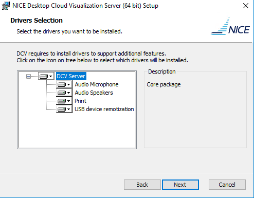

# How to install Windows NICE DCV Servers on Amazon EC2 Instances

This document explains how to install the NICE DCV server on Windows EC2 instance. Here use the GPU graphics instance G4 with Windows Server 2016 as example.

## Install NICE DCV Server

1. Create The IAM policy used for your IAM users or EC2 instance profile

China Region - NICE-DCV policy

```json
{
    "Version": "2012-10-17",
    "Statement": [
        {
            "Effect": "Allow",
            "Action": "s3:GetObject",
            "Resource": ["arn:aws-cn:s3:::dcv-license.cn-north-1/*","arn:aws-cn:s3:::dcv-license.cn-northwest-1/*"]
        }
    ]
}
```

2. Download the DCV Server from https://download.nice-dcv.com/ and install it



- On the DCV Service Configuration screen: 
  - `select No, I will manually configure my firewall later.`
  - `select No, I want to start a DCV Service manually`. 


- On the DCV Session Management Configuration screen, `select No, I will create the session manually` and specify the `Administrator` for the console session.


3. Setup the secuirty group inbound rule open `8443` port

4. DCV Client

Follow the guide [download and install DCV Client](https://docs.aws.amazon.com/dcv/latest/userguide/client.html)

Connect to EC2 via DCV Client
- EC2 public IP or public DNS
- username: Administrator
- password: Administrator password


# Reference
[Installing the NICE DCV Server on Windows](https://docs.aws.amazon.com/dcv/latest/adminguide/setting-up-installing-windows.html)

