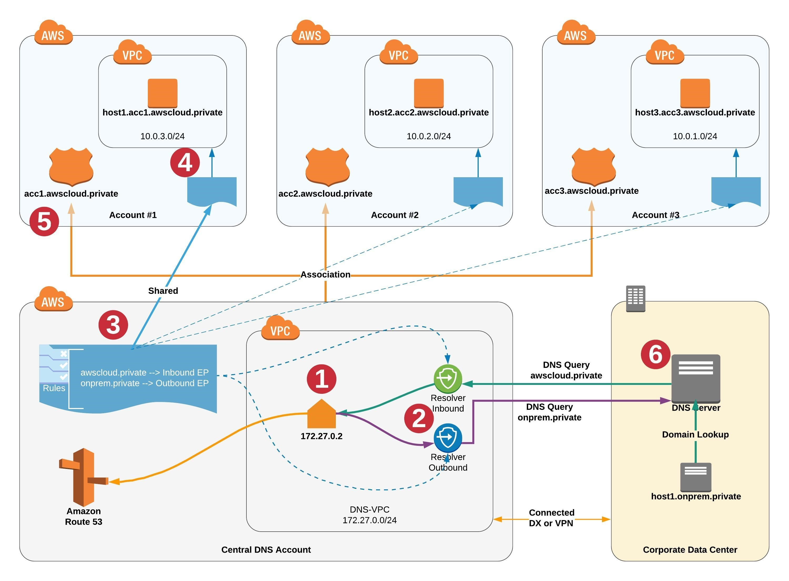

# Get Start https://mp.weixin.qq.com/s/FUaFcdz7KuZJQcANRNu_ew 

# Multi-Account
[Simplify DNS management in a multi-account environment with Route 53 Resolver](https://aws.amazon.com/blogs/security/simplify-dns-management-in-a-multiaccount-environment-with-route-53-resolver/)



1. This is the Amazon-provided default DNS server for the central DNS VPC, which we’ll refer to as the DNS-VPC. This is the second IP address in the VPC CIDR range (as illustrated, this is 172.27.0.2). This default DNS server will be the primary domain resolver for all workloads running in participating AWS accounts.
2. This shows the Route 53 Resolver endpoints. The inbound endpoint will receive queries forwarded from on-premises DNS servers and from workloads running in participating AWS accounts. The outbound endpoint will be used to forward domain queries from AWS to on-premises DNS.
3. This shows conditional forwarding rules. For this architecture, we need two rules, one to forward domain queries for onprem.private zone to the on-premises DNS server through the outbound endpoint, and a second rule to forward domain queries for awscloud.private to the resolver inbound endpoint in DNS-VPC.
4. This indicates that these two forwarding rules are shared with all other AWS accounts through AWS Resource Access Manager and are associated with all VPCs in these accounts.
5. This shows the private hosted zone created in each account with a unique subdomain of awscloud.private.
6. This shows the on-premises DNS server with conditional forwarders configured to forward queries to the awscloud.private zone to the IP addresses of the Resolver inbound endpoint.
```
**Note: This solution doesn’t require VPC-peering or connectivity between the source/destination VPCs and the DNS-VPC.**
```

# Reference
[How to configure a Route 53 Resolver outbound endpoint](https://aws.amazon.com/cn/premiumsupport/knowledge-center/route53-resolve-with-outbound-endpoint/)