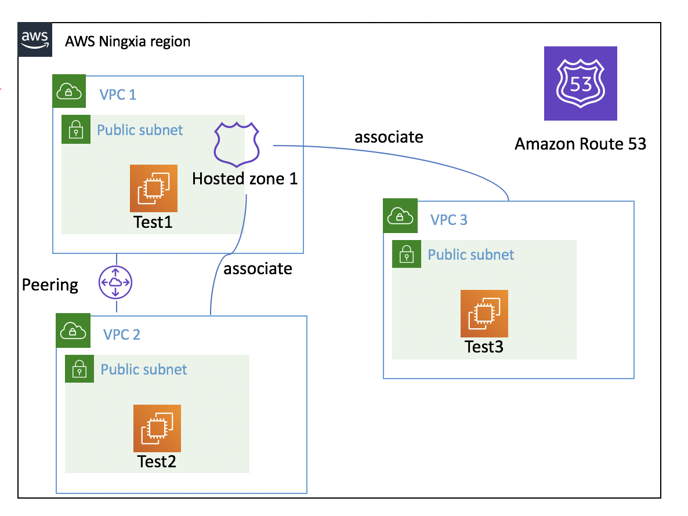
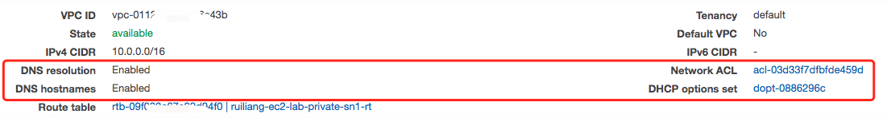
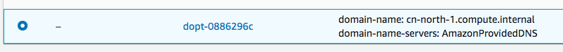

# 常见问题  FAQ

## How to migrate hosted zone to a different AWS account?

如何在不同账号间迁移hosted zone？

[migration guide](https://docs.aws.amazon.com/Route53/latest/DeveloperGuide/hosted-zones-migrating.html#hosted-zones-migrating-install-cli)

[3rd party tool](https://github.com/barnybug/cli53)

## R53的私有托管区域，是否可以取代客户自己的内部DNS服务器?
- Make sure you have enable the `enableDnsHostnames` and `enableDnsSupport` in your VPC setting


| Attribute | Description |
| :-------- | :---------- |
| enableDnsHostnames | Indicates whether instances with public IP addresses get corresponding public DNS hostnames.</br> If this attribute is true, instances in the VPC get public DNS hostnames, but only if the enableDnsSupport attribute is also set to true. |
| enableDnsSupport | Indicates whether the DNS resolution is supported. </br> If this attribute is false, the Amazon-provided DNS server that resolves public DNS hostnames to IP addresses is not enabled. </br> If this attribute is true, queries to the Amazon provided DNS server at the 169.254.169.253 IP address, or the reserved IP address .2 will succeed. |

More information, please check https://docs.aws.amazon.com/vpc/latest/userguide/vpc-dns.html

- If you use the default DHCP_Options, once you associate the private zone to your VPC, then you can query the record in private zone

 


- If you changed vpc dhcp optionset，you need create a new one with Name Server as AmazonProvidedDNS and associate with new DHCP_Options with your VPC

https://docs.aws.amazon.com/vpc/latest/userguide/VPC_DHCP_Options.html


When EC2 inside the VPC queries DNS by use the AmazonProvidedDNS, if there is a www.mycompany.com record in the private hosted zone, DNS Server will resolve to private hosted zone record address. If there is no www.mycompany.com record in the private hosted zone, DNS Server will forward it to the up Authoritative DNS server (such as public DNS) to resolve the name.

For example: 

```bash
[ec2-user@ip-10-0-2-83 workspace]$ nslookup www.amazon.com
Server:         10.0.0.2
Address:        10.0.0.2#53

Non-authoritative answer:
www.amazon.com  canonical name = tp.47cf2c8c9-frontier.amazon.com.
tp.47cf2c8c9-frontier.amazon.com        canonical name = www.amazon.com.edgekey.net.
www.amazon.com.edgekey.net      canonical name = e15316.e22.akamaiedge.net.
Name:   e15316.e22.akamaiedge.net
Address: 23.34.96.95
```

- If you use the hybrid cloud scenario，you need NDS forwarder

More details please check

[How to Set Up DNS Resolution Between On-Premises Networks and AWS Using AWS Directory Service and Amazon Route 53](https://aws.amazon.com/blogs/security/how-to-set-up-dns-resolution-between-on-premises-networks-and-aws-using-aws-directory-service-and-amazon-route-53/)

[How to Set Up DNS Resolution Between On-Premises Networks and AWS Using AWS Directory Service and Microsoft Active Directory](https://aws.amazon.com/blogs/security/how-to-set-up-dns-resolution-between-on-premises-networks-and-aws-using-aws-directory-service-and-microsoft-active-directory/)

In global region, you can leverage the [Route53 resolver](https://docs.aws.amazon.com/Route53/latest/DeveloperGuide/resolver.html)

## 如何在我的代码中使用 Route53 API?
How to use the Route53 API in my code

Please check the sample code writtern by go-sdk [route53-demo.go](R53/route53-demo.go)

## 如何在多个VPC直接使用同一个Hosted Zone?

1. VPC1 create host zone ZONE1 for example.local 
2. ZONE1 associate to VPC2
3. ZONE1 associate to VPC3



测试场景
1. Create DNS aaa.example.local record in ZONE1
2. Test 1 can nslookup the aaa.example.local 
3. VPC1 and VPC2 has peering， Test 2 can nslookup the aaa.example.local 
4. VPC1 and VPC3 without peering Test 3 can nslookup the aaa.example.local 

## 如何将 Route 53 Private Hosted Zone 与不同 AWS 账户上的 VPC 相关联？

[How do I associate a Route 53 private hosted zone with a VPC on a different AWS account?](https://aws.amazon.com/premiumsupport/knowledge-center/private-hosted-zone-different-account/)

The key points:

```bash
# authorize the association between the private hosted zone in Account A (hosted-zone-id) and the VPC in Account B (vpc-id).  Running on Account A

aws route53 create-vpc-association-authorization --hosted-zone-id <hosted-zone-id> --vpc VPCRegion=<region>,VPCId=<vpc-id>

# create the association between the private hosted zone in Account A (hosted-zone-id) and the VPC in Account B (vpc-id). Running on Account B

aws route53 associate-vpc-with-hosted-zone --hosted-zone-id <hosted-zone-id> --vpc VPCRegion=<region>,VPCId=<vpc-id>

# delete the association authorization after the association is created. Running on Account A

aws route53 delete-vpc-association-authorization --hosted-zone-id <hosted-zone-id>  --vpc VPCRegion=<region>,VPCId=<vpc-id>

# EC2 instances in the VPC from Account B can now resolve records in the private hosted zone in Account A.
```

## 如果EC2所在私有子网没有NAT也没有代理，能否正确进行域名解析？

Please make sure your VPC DNS setting and DHCP setting





```bash
[ec2-user@ip-10-0-7-116 ~]$ nslookup www.amazon.com
Server:		10.0.0.2
Address:	10.0.0.2#53

Non-authoritative answer:
www.amazon.com	canonical name = tp.47cf2c8c9-frontier.amazon.com.
tp.47cf2c8c9-frontier.amazon.com	canonical name = d3ag4hukkh62yn.cloudfront.net.
Name:	d3ag4hukkh62yn.cloudfront.net
Address: 13.225.132.237


[ec2-user@ip-10-0-7-116 ~]$ nslookup www.baidu.com
Server:  10.0.0.2
Address: 10.0.0.2#53

Non-authoritative answer:
www.baidu.com canonical name = www.a.shifen.com.
Name: www.a.shifen.com
Address: 220.181.38.149
Name: www.a.shifen.com
Address: 220.181.38.150
Name: www.a.shifen.com
Address: 240e:83:205:59:0:ff:b09b:159e
Name: www.a.shifen.com
Address: 240e:83:205:58:0:ff:b09f:36bf

```

Then I add the API Gateway VPC endpoint and query the API Gateway url domain name

- Private API

```bash
[ec2-user@ip-10-0-7-116 ~]$ nslookup gret8sxv4j.execute-api.cn-north-1.amazonaws.com.cn
Server:  10.0.0.2
Address: 10.0.0.2#53

Non-authoritative answer:
gret8sxv4j.execute-api.cn-north-1.amazonaws.com.cn canonical name = execute-api.cn-north-1.amazonaws.com.cn.
Name: execute-api.cn-north-1.amazonaws.com.cn
Address: 10.0.4.49
Name: execute-api.cn-north-1.amazonaws.com.cn
Address: 10.0.1.52
```

- Regional API

```bash
[ec2-user@ip-10-0-7-116 ~]$ nslookup 6foorhitui.execute-api.cn-north-1.amazonaws.com.cn
Server:  10.0.0.2
Address: 10.0.0.2#53

Non-authoritative answer:
6foorhitui.execute-api.cn-north-1.amazonaws.com.cn canonical name = execute-api.cn-north-1.amazonaws.com.cn.
Name: execute-api.cn-north-1.amazonaws.com.cn
Address: 10.0.1.52
Name: execute-api.cn-north-1.amazonaws.com.cn
Address: 10.0.4.49
```