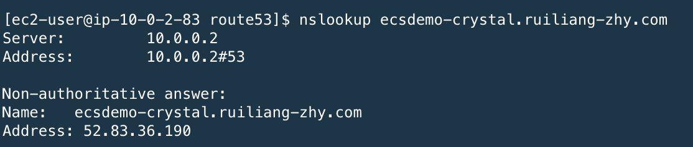
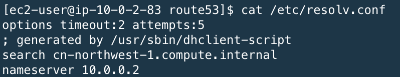
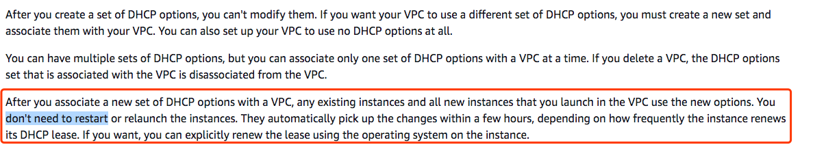

## Feature Availability and Implementation Differences
https://docs.amazonaws.cn/en_us/aws/latest/userguide/route53.html

You can't use Route 53 to register domains. However, you can create a hosted zone in one of the China Regions for DNS service

You can't create alias records that route traffic to AWS resources outside the China Regions.

You can't create records that use the geoproximity routing policy. 

You can't use Route 53 Resolver to forward DNS queries from your VPCs to your on-promise network or from your on-promise network to your VPCs. But you can setup DNS forward on EC2 to complete the similar function

When creating alias records for Amazon CloudFront distribution, use the following hosted zone ID: Z3RFFRIM2A3IF5.

## [Offical guide](https://docs.amazonaws.cn/Route53/latest/DeveloperGuide/index.html)

## [Offical API guide](https://docs.amazonaws.cn/Route53/latest/APIReference/Welcome.html)

## Public Zone
```bash
aws route53 create-hosted-zone --name 91aws.club --endpoint-url https://route53.amazonaws.com.cn --caller-reference "20191113" --region cn-northwest-1 --profile cn-north-1
```

## Private Zone
```bash
aws route53 create-hosted-zone --name ruiliang-bjs.com --caller-reference "20191113-private" \
--hosted-zone-config Comment="Private-Zone-Ray-General-VPC",PrivateZone=true --vpc VPCRegion="cn-north-1",VPCId="vpc-0112fabfb0ed6e43b" \
--endpoint-url https://route53.amazonaws.com.cn --region cn-northwest-1 --profile cn-north-1
```

## list-hosted-zones
```bash
aws route53 list-hosted-zones --endpoint-url https://route53.amazonaws.com.cn --region cn-northwest-1 --profile cn-north-1
```

## change-resource-record-sets
```bash
aws route53 change-resource-record-sets --hosted-zone-id Z0807456FWSN21W2TRAZ --change-batch file://ray-demo-tools-bjs.json --endpoint-url https://route53.amazonaws.com.cn --region cn-northwest-1 --profile cn-north-1
```


## list-resource-record-sets
```bash
aws route53 list-resource-record-sets --hosted-zone-id Z0807456FWSN21W2TRAZ --endpoint-url https://route53.amazonaws.com.cn --region cn-northwest-1 --profile cn-north-1
```

## alias target Test
1. Before you proceed, locate the HostedZoneId for Elastic Load Balancing, AWS Elastic Beanstalk, Amazon Simple Storage Service (Amazon S3), and Amazon CloudFront endpoints for each region.
[Route53 - Alias - target](https://docs.aws.amazon.com/AWSCloudFormation/latest/UserGuide/aws-properties-route53-aliastarget.html)
[Region Endpoint](https://docs.amazonaws.cn/en_us/general/latest/gr/rande.html#cnnorth_region)
[Values for alias Route53 records](https://docs.aws.amazon.com/Route53/latest/DeveloperGuide/resource-record-sets-values-alias.html)

- CloudFront
Alias records for CloudFront can't be created in a private zone. So you need public zone.
```bash
aws route53 change-resource-record-sets --hosted-zone-id Z2LUYG0HCUTETD --change-batch file://cn-cloudfront-alias.json --endpoint-url https://route53.amazonaws.com.cn --region cn-northwest-1 --profile cn-north-1
```

- NLB
```bash
aws route53 change-resource-record-sets --hosted-zone-id Z0807456FWSN21W2TRAZ --change-batch file://nlb-alias.json --endpoint-url https://route53.amazonaws.com.cn --region cn-northwest-1 --profile cn-north-1

aws route53 list-resource-record-sets --hosted-zone-id Z0807456FWSN21W2TRAZ --endpoint-url https://route53.amazonaws.com.cn --region cn-northwest-1 --profile cn-north-1
```

- ALB
```bash
aws route53 change-resource-record-sets --hosted-zone-id Z0807456FWSN21W2TRAZ --change-batch file://alb-alias.json --endpoint-url https://route53.amazonaws.com.cn --region cn-northwest-1 --profile cn-north-1

aws route53 list-resource-record-sets --hosted-zone-id Z0807456FWSN21W2TRAZ --endpoint-url https://route53.amazonaws.com.cn --region cn-northwest-1 --profile cn-north-1
```

- API Gateway
```bash
# Create CNAME in private Zone point to API GW private api domain
aws route53 change-resource-record-sets --hosted-zone-id Z0807456FWSN21W2TRAZ --change-batch file://apigw-privateapi-cname-bjs.json --endpoint-url https://route53.amazonaws.com.cn --region cn-northwest-1 --profile cn-north-1

# Create VPCE alias in private Zone point to APIGW VPCE which used by private API
aws route53 change-resource-record-sets --hosted-zone-id Z0807456FWSN21W2TRAZ --change-batch file://apigw-privateapi-vpce-alias-bjs.json --endpoint-url https://route53.amazonaws.com.cn --region cn-northwest-1 --profile cn-north-1

# create CNAME in private Zone point to API GW regional API domain
aws route53 change-resource-record-sets --hosted-zone-id Z0807456FWSN21W2TRAZ --change-batch file://apigw-regionalpi-cname-bjs.json --endpoint-url https://route53.amazonaws.com.cn --region cn-northwest-1 --profile cn-north-1

# Create APIGW alias in private Zone with regional API - Not support
aws route53 change-resource-record-sets --hosted-zone-id Z0807456FWSN21W2TRAZ --change-batch file://apigw-alias-bjs.json --endpoint-url https://route53.amazonaws.com.cn --region cn-northwest-1 --profile cn-north-1
An error occurred (NoSuchHostedZone) when calling the ChangeResourceRecordSets operation: The specified hosted zone does not exist.

aws route53 list-resource-record-sets --hosted-zone-id Z0807456FWSN21W2TRAZ --endpoint-url https://route53.amazonaws.com.cn --region cn-northwest-1 --profile cn-north-1
```


## Testing private zone
```
[ec2-user@ray-demo-tools ~]$ dig ray-demo-tools.ruiliang-bjs.com

[ec2-user@ray-demo-tools ~]$ dig mqtt-broker-nlb.ruiliang-bjs.com
```

## Management
aws route53 list-traffic-policies --endpoint-url https://route53.amazonaws.com.cn --region cn-northwest-1 --profile cn-north-1

# Monitoring

You need first enable the Health Check on Route53

```bash
aws cloudwatch list-metrics --namespace "AWS/Route53" --region cn-northwest-1 --profile cn-north-1
aws cloudwatch get-metric-data --metric-data-queries file://private-zone-metric.json --start-time 2019-11-20T04:01:00Z --end-time 2019-11-26T14:07:00Z \
--endpoint-url https://route53.amazonaws.com.cn --region cn-northwest-1 --profile cn-north-1
```

## Query logs
```bash
aws logs describe-log-groups --log-group-name-prefix /aws/route53/china-preview --region cn-northwest-1 --profile cn-north-1
```

# Migrating a hosted zone to a different AWS account
[migration guide](https://docs.aws.amazon.com/Route53/latest/DeveloperGuide/hosted-zones-migrating.html#hosted-zones-migrating-install-cli)

[3rd party tool](https://github.com/barnybug/cli53)

# FAQ
1. R53的私有托管区域，是否可以取代客户自己的内部DNS服务器?
- Make sure you have enable the `enableDnsHostnames` and `enableDnsSupport` in your VPC setting


| Attribute | Description |
| :-------- | :---------- |
| enableDnsHostnames | Indicates whether instances with public IP addresses get corresponding public DNS hostnames.</br> If this attribute is true, instances in the VPC get public DNS hostnames, but only if the enableDnsSupport attribute is also set to true. |
| enableDnsSupport | Indicates whether the DNS resolution is supported. </br> If this attribute is false, the Amazon-provided DNS server that resolves public DNS hostnames to IP addresses is not enabled. </br> If this attribute is true, queries to the Amazon provided DNS server at the 169.254.169.253 IP address, or the reserved IP address .2 will succeed. |

More information, please check https://docs.aws.amazon.com/vpc/latest/userguide/vpc-dns.html

- If you use the default DHCP_Options, once you associate the private zone to your VPC, then you can query the record in private zone

 





- If you changed vpc dhcp optionset，you need create a new one with Name Server as AmazonProvidedDNS and associate with new DHCP_Options with your VPC

https://docs.aws.amazon.com/vpc/latest/userguide/VPC_DHCP_Options.html



When EC2 inside the VPC queries DNS by use the AmazonProvidedDNS, if there is a www.mycompany.com record in the private hosted zone, DNS Server will resolve to private hosted zone record address. If there is no www.mycompany.com record in the private hosted zone, DNS Server will forward it to the up Authoritative DNS server (such as public DNS) to resolve the name.

For example: 

```bash
[ec2-user@ip-10-0-2-83 workspace]$ nslookup www.amazon.com
Server:         10.0.0.2
Address:        10.0.0.2#53

Non-authoritative answer:
www.amazon.com  canonical name = tp.47cf2c8c9-frontier.amazon.com.
tp.47cf2c8c9-frontier.amazon.com        canonical name = www.amazon.com.edgekey.net.
www.amazon.com.edgekey.net      canonical name = e15316.e22.akamaiedge.net.
Name:   e15316.e22.akamaiedge.net
Address: 23.34.96.95
```

- If you use the hybrid cloud scenario，you need NDS forwarder

More details please check

[How to Set Up DNS Resolution Between On-Premises Networks and AWS Using AWS Directory Service and Amazon Route 53](https://aws.amazon.com/blogs/security/how-to-set-up-dns-resolution-between-on-premises-networks-and-aws-using-aws-directory-service-and-amazon-route-53/)

[How to Set Up DNS Resolution Between On-Premises Networks and AWS Using AWS Directory Service and Microsoft Active Directory](https://aws.amazon.com/blogs/security/how-to-set-up-dns-resolution-between-on-premises-networks-and-aws-using-aws-directory-service-and-microsoft-active-directory/)

In global region, you can leverage the [Route53 resolver](https://docs.aws.amazon.com/Route53/latest/DeveloperGuide/resolver.html)