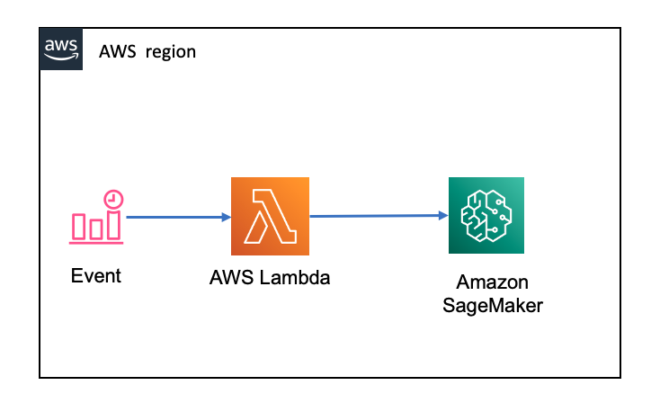

# How to Run a Sagemaker Notebook From AWS Lambdas、、

Requirement: trigger the SageMaker notebook .ipynb file by event



## Using Sagemaker LifeCycle Configurations

Create the LifeCycle Configurations with [script](script/LF_cycle_config.sh) for `Start Instance`. It is required Sagemaker instance has to be in Stop State before invocation

## Lambda Code
- Create Lambda function is Python 3.8 runtime with 60s timeout
- Lambda code:

```python
import json
import boto3

def lambda_handler(event, context):

    client = boto3.client('sagemaker')

    #wish to get current status of instance
    status = client.describe_notebook_instance(NotebookInstanceName='demo-notebook')
    print('NotebookInstanceStatus %s' % (status['NotebookInstanceStatus']))

    #Start the instance
    client.start_notebook_instance(NotebookInstanceName='demo-notebook')
    print("instance starting")

    # waiter = client.get_waiter('notebook_instance_in_service')
    # waiter.wait(
    #     NotebookInstanceName='demo-notebook',
    #     WaiterConfig={
    #         'Delay': 30,
    #         'MaxAttempts': 10
    #     }
    # )
    
    status = client.describe_notebook_instance(NotebookInstanceName='demo-notebook')
    print('NotebookInstanceStatus %s' % (status['NotebookInstanceStatus']))
```

```bash
2021-04-22T00:39:11.085+08:00   Successfully installed cycler-0.10.0 kiwisolver-1.3.1 matplotlib-3.3.4 pillow-8.2.0

2021-04-22T00:39:13.086+08:00   [NbConvertApp] WARNING | Config option `kernel_spec_manager_class` not recognized by `NbConvertApp`.

2021-04-22T00:39:13.086+08:00   [NbConvertApp] Converting notebook /home/ec2-user/SageMaker/notebook1.ipynb to html

2021-04-22T00:39:14.086+08:00   [NbConvertApp] Executing notebook with kernel: python3

2021-04-22T00:39:22.088+08:00   [NbConvertApp] Writing 344427 bytes to /home/ec2-user/SageMaker/notebook1.html
```

# Reference
[How to Run a Sagemaker Notebook From AWS Lambdas ?](https://www.linkedin.com/pulse/how-run-sagemaker-notebook-from-aws-lambdas-saurabh-aggarwal/)

[SageMaker Notebook Instance Lifecycle Config Samples](https://github.com/aws-samples/amazon-sagemaker-notebook-instance-lifecycle-config-samples)

[jupyter nbconvert](https://github.com/jupyter/nbconvert)

[convert-notebook](https://nbconvert.readthedocs.io/en/latest/usage.html#convert-notebook)