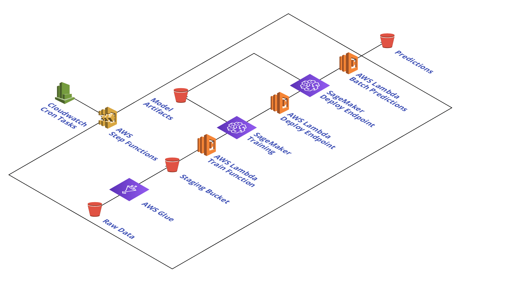

# SageMaker Workshop

## Next generation Amazon SageMaker Workshop
1. [Unified Studio](https://catalog.us-east-1.prod.workshops.aws/workshops/06dbe60c-3a94-463e-8ac2-18c7f85788d4/en-US)
   
## Immersion Day Workshop
1. [Lab- Notebook Instances and Feature Engineering](https://sagemaker-immersionday.workshop.aws/lab1.html)

2. [Lab - Train, Tune and Deploy model using SageMaker Built-in Algorithm](https://sagemaker-immersionday.workshop.aws/lab2.html)

3. [Lab - Bring your own Model](https://sagemaker-immersionday.workshop.aws/lab3.html)

4. [Lab - Model Debugging , Model Monitoring and AutoML](https://sagemaker-immersionday.workshop.aws/lab4.html)

## Explore the development cycle of machine learning model on AWS
1. [SageMaker get start](https://www.sagemakerworkshop.com/start/)

2. [Implementation-workflow-with-step-functions](https://www.sagemakerworkshop.com/step/)

3. [Machine learning (ML) workflows orchestrate and automate sequences of ML tasks with Airflow](https://www.sagemakerworkshop.com/airflow/)

4. [Amazon Personalize lab](https://www.sagemakerworkshop.com/personalize/)

5. [Clean up](https://www.sagemakerworkshop.com/cleanup/)

## Custom Algorithms and Security
1. [Prepare](https://sagemaker-workshop.com/prerequisites.html)

2. [Lab- Notebook Instances](https://sagemaker-workshop.com/introduction.html)

3. [Using Built-in Algorithms](https://sagemaker-workshop.com/builtin.html)
- Video Game Sales Prediction with XGBoost
- Image Classification with ResNet
- Anomaly Detection with Random Cut Forest
- Parallelized Data Distribution

4. [Using Custom Algorithms](https://sagemaker-workshop.com/custom.html)
- Use your own custom algorithms
- Use your own custom containers

5. [Building Secure Environments](https://sagemaker-workshop.com/security_for_sysops.html)
- Lab 1: Deploy the base infrastructure - Best Practice as Code
- Lab 2: Deploy the a secured project team’s resources
- Lab 3: Working Secrely: Deploy an Amazon SageMaker notebook
- Lab 4: Create a training job in line with security policy: Detection and Remediation
- Lab 5: Improve security controls - Preventive Controls

6. [Using Secure Environments](https://sagemaker-workshop.com/security_for_users.html)
- Compute and Network Isolation
- Authentication and Authorization
- Artifact Management
- Data Encryption
- Traceability and Auditability
- Explainability and Interpretability
- Real-time Model Monitoring
- Reproducibility

7. [Clean up](https://sagemaker-workshop.com/cleanup.html)

## Machine Learning Training using SageMaker Studio
1. [Overview](https://www.getstartedonsagemaker.com/workshop-studio-training/)

2. [Getting Started and Prepare](https://www.getstartedonsagemaker.com/workshop-studio-training/gettingstarted/)

3. [Training with Built-in Algorithm in SageMaker Studio](https://www.getstartedonsagemaker.com/workshop-studio-training/trainingbuilt-in/)
- House Price Prediction using Linear Learner
- House Price Prediction Experiment (a collection of trials)
- Image Classification using ResNet + Experiment

4. [Training with your own script](https://www.getstartedonsagemaker.com/workshop-studio-training/trainingscriptmode/)

5. [Training with your own container](https://www.getstartedonsagemaker.com/workshop-studio-training/trainingbyoc/)

6. [AutoPilot Workshop](https://www.getstartedonsagemaker.com/workshop/)

## SageMaker Operators for Kubernetes Workshop
Amazon SageMaker Operators for Kubernetes make it easier for developers and data scientists using Kubernetes to train, tune, and deploy machine learning (ML) models in Amazon SageMaker. 

[Use SageMaker operators to train and deploy a machine learning model, get inferences from the deployed model, and integrate these steps into a Kubeflow pipeline.](https://www.getstartedonsagemaker.com/workshop-k8s-operators/)

## SageMaker Components for Kubeflow Pipelines Workshop

Amazon SageMaker Components for Kubeflow Pipelines let you create and monitor training, tuning, endpoint deployment, and batch transform jobs in Amazon SageMaker. By running Kubeflow Pipeline jobs on Amazon SageMaker, you move data processing and training jobs from the Kubernetes cluster to Amazon SageMaker’s machine learning-optimized managed service.

[Use the SageMaker components for Kubeflow Pipelines to train, tune, and deploy a machine learning model, and get both batch and real-time inferences from the deployed model.](https://www.getstartedonsagemaker.com/workshop-k8s-pipeline/)

## Next Generation SageMaker Workshop
- [Next Generation SageMaker Workshop](https://catalog.us-east-1.prod.workshops.aws/workshops/06dbe60c-3a94-463e-8ac2-18c7f85788d4/en-US)
- [Amazon SageMaker Unified Studio Use Case Driven Workshop](https://catalog.us-east-1.prod.workshops.aws/workshops/7ac12eb2-6e1a-4939-a640-cdb5470fcb8e/en-US/1-introduction/use-case-intro)