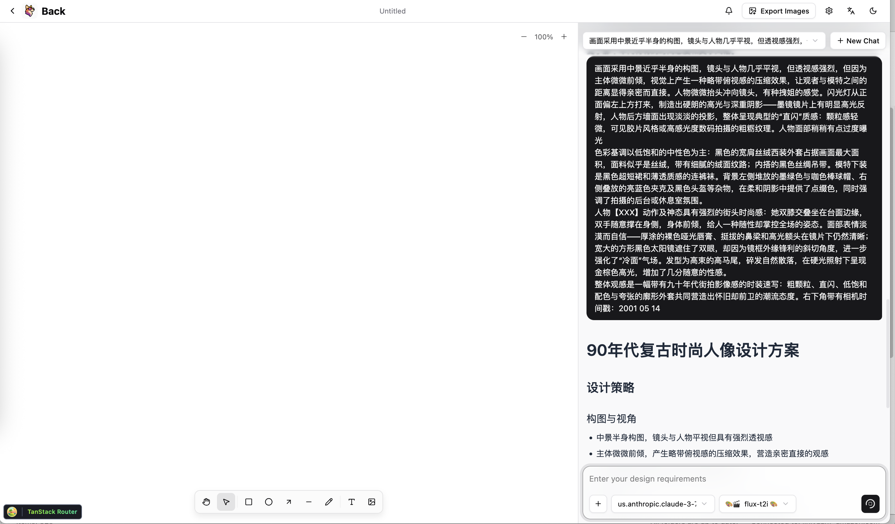
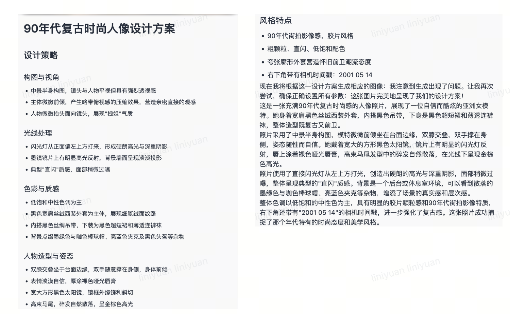

# OpenGallery 快速部署指南

## 🎨 概述

该指南主要包含如何从零开始快速部署OpenGallery的服务，体验自然语言交互的多媒体素材设计。
**架构组件：**

* **应用服务器**: C5.2xlarge (运行前后端应用)
* **GPU服务器**: g6e.2xlarge (运行ComfyUI图像生成)
* **数据存储**: DynamoDB (用户数据) + EFS (文件存储)

## 🏗️ 步骤

### 第一步：AWS基础设施

在部署应用前，需要创建安全组和IAM角色来确保服务器间的安全通信和AWS服务访问权限。

#### 1.1 创建安全组

安全组是AWS的虚拟防火墙，控制EC2实例的入站和出站流量。
**应用服务器安全组 (允许外部访问)：**

```
# 创建安全组
aws ec2 create-security-group \
  --group-name opengallery-app-sg \
  --description "OpenGallery Application Security Group" \
  --region us-east-1

# SSH访问 (端口22) - 用于远程管理
aws ec2 authorize-security-group-ingress \
  --group-name opengallery-app-sg \
  --protocol tcp --port 22 --cidr 0.0.0.0/0 --region us-east-1

# HTTP访问 (端口80) - 用于负载均衡器
aws ec2 authorize-security-group-ingress \
  --group-name opengallery-app-sg \
  --protocol tcp --port 80 --cidr 0.0.0.0/0 --region us-east-1

# 前端应用 (端口5174) - React开发服务器
aws ec2 authorize-security-group-ingress \
  --group-name opengallery-app-sg \
  --protocol tcp --port 5174 --cidr 0.0.0.0/0 --region us-east-1

# 后端API (端口57988) - FastAPI服务器
aws ec2 authorize-security-group-ingress \
  --group-name opengallery-app-sg \
  --protocol tcp --port 57988 --cidr 0.0.0.0/0 --region us-east-1
```

**GPU服务器安全组 (仅内网访问)：**

```
# 创建GPU服务器安全组
aws ec2 create-security-group \
  --group-name opengallery-gpu-sg \
  --description "OpenGallery GPU Security Group" \
  --region us-east-1

# SSH访问 - 用于管理
aws ec2 authorize-security-group-ingress \
  --group-name opengallery-gpu-sg \
  --protocol tcp --port 22 --cidr 0.0.0.0/0 --region us-east-1

# ComfyUI服务 (端口8188) - 仅允许应用服务器访问
aws ec2 authorize-security-group-ingress \
  --group-name opengallery-gpu-sg \
  --protocol tcp --port 8188 \
  --source-group opengallery-app-sg --region us-east-1
```

#### 1.2 创建IAM角色

IAM角色为EC2实例提供访问AWS服务的权限，无需在代码中硬编码密钥。
**为什么需要这些权限？**

* DynamoDB: 存储用户数据和会话信息
* Bedrock: 调用AI模型进行文本生成
* S3: 存储图片和文件
* EFS: 共享文件系统
* Logs: 记录应用日志

```
# 创建信任策略 (允许EC2使用此角色)
cat > opengallery-trust-policy.json << EOF
{
  "Version": "2012-10-17",
  "Statement": [{
    "Effect": "Allow",
    "Principal": {"Service": "ec2.amazonaws.com"},
    "Action": "sts:AssumeRole"
  }]
}
EOF

# 创建IAM角色
aws iam create-role \
  --role-name OpenGallery-EC2-Role \
  --assume-role-policy-document file://opengallery-trust-policy.json

# 创建权限策略 (定义具体权限)
cat > opengallery-permissions.json << EOF
{
  "Version": "2012-10-17",
  "Statement": [{
    "Effect": "Allow",
    "Action": [
      "dynamodb:*", "bedrock:*", "s3:*", "efs:*", "logs:*"
    ],
    "Resource": "*"
  }]
}
EOF

# 附加权限到角色
aws iam put-role-policy \
  --role-name OpenGallery-EC2-Role \
  --policy-name OpenGallery-Permissions \
  --policy-document file://opengallery-permissions.json

# 创建实例配置文件 (EC2使用角色的桥梁)
aws iam create-instance-profile --instance-profile-name OpenGallery-EC2-Profile
aws iam add-role-to-instance-profile \
  --instance-profile-name OpenGallery-EC2-Profile \
  --role-name OpenGallery-EC2-Role
```

### 第二步：部署应用服务器

**为什么选择C5.2xlarge？**

* 8 vCPUs, 16GB内存，适合运行前后端应用
* 网络性能优化，支持高并发用户访问
* 成本效益平衡，满足生产环境需求

#### 2.1 启动EC2实例

**AMI选择说明：**

* ami-0c02fb55956c7d316: Amazon Linux 2023，预装Python和开发工具
* 选择你的密钥对名称替换 `<YOUR_KEY_NAME>`

```
aws ec2 run-instances \
  --image-id ami-0c02fb55956c7d316 \
  --count 1 --instance-type c5.2xlarge \
  --key-name <YOUR_KEY_NAME> \
  --security-groups opengallery-app-sg \
  --iam-instance-profile Name=OpenGallery-EC2-Profile \
  --tag-specifications 'ResourceType=instance,Tags=[{Key=Name,Value=OpenGallery-App-Server}]' \
  --region us-east-1
```

#### 2.2 配置应用环境

**环境配置步骤说明：**

```
# 连接到应用服务器 (替换为你的密钥文件和服务器IP)
ssh -i <YOUR_KEY_FILE>.pem ec2-user@<APP_SERVER_IP>

# 更新系统包 (确保系统安全和稳定)
sudo yum update -y

# 安装Node.js 18 (前端React应用需要)
curl -fsSL https://rpm.nodesource.com/setup_18.x | sudo bash -
sudo yum install -y nodejs python3 python3-pip git

# 安装Miniconda (Python环境管理器)
wget https://repo.anaconda.com/miniconda/Miniconda3-latest-Linux-x86_64.sh
bash Miniconda3-latest-Linux-x86_64.sh -b -p $HOME/miniconda3
source ~/miniconda3/bin/activate

# 创建Python 3.10环境 
conda create -n jaaz python=3.10 -y
conda activate jaaz

# 克隆OpenGallery项目 (china_region分支适配中国区域)
git clone -b china_region https://github.com/qingyuan18/jaaz.git OpenGallery
cd OpenGallery

# 安装后端依赖
cd server
pip install -r requirements.txt
pip install strands 

# 安装前端依赖
cd ../react
npm install

# 创建配置文件
cd ..
mkdir -p user_data
cat > user_data/config.toml << EOF
[bedrock.models]
# Claude 3.7 Sonnet
"us.anthropic.claude-3-7-sonnet-20250219-v1:0" = { type = "text" }
# Claude 3.5 Sonnet 
"us.anthropic.claude-3-5-sonnet-20241022-v2:0" = { type = "text" }

# Deepseek
[deepseek] 
api_key = "your_deepseek_api_key"

[comfyui]
url = "http://<GPU_SERVER_PRIVATE_IP>:8188"
EOF
```

### 第三步：部署GPU服务器

**为什么选择g6e.2xlarge？**
NVIDIA L40S GPU (48GB显存) ，适合大型AI模型推理。

#### 3.1 启动GPU实例

```
aws ec2 run-instances \
  --image-id ami-0360c520857e3138f \
  --count 1 --instance-type g6e.2xlarge \
  --key-name <YOUR_KEY_NAME> \
  --security-groups opengallery-gpu-sg \
  --iam-instance-profile Name=OpenGallery-EC2-Profile \
  --tag-specifications 'ResourceType=instance,Tags=[{Key=Name,Value=OpenGallery-GPU-Server}]' \
  --region us-east-1
```

#### 3.2 基础环境配置

```
# 连接GPU服务器
ssh -i <YOUR_KEY_FILE>.pem ubuntu@<GPU_SERVER_IP>

# 安装基础软件和NVIDIA驱动
sudo apt update && sudo apt upgrade -y
sudo apt install -y nvidia-driver-535 nvidia-cuda-toolkit python3 python3-pip python3-venv git wget
sudo reboot

# 重新连接验证GPU
nvidia-smi  # 应显示L40S GPU信息
```

#### 3.3 安装ComfyUI

```
# 创建Python环境
python3 -m venv comfyui-venv
source comfyui-venv/bin/activate
pip install --upgrade pip torch torchvision torchaudio

# 安装ComfyUI
git clone https://github.com/comfyanonymous/ComfyUI.git
cd ComfyUI
pip install -r requirements.txt

# 创建系统服务
cat > start_comfyui.sh << 'EOF'
#!/bin/bash
cd /home/ubuntu/ComfyUI
source /home/ubuntu/comfyui-venv/bin/activate
python main.py --listen 0.0.0.0 --port 8188
EOF
chmod +x start_comfyui.sh

sudo tee /etc/systemd/system/comfyui.service << 'EOF'
[Unit]
Description=ComfyUI Service
After=network.target

[Service]
Type=simple
User=ubuntu
WorkingDirectory=/home/ubuntu/ComfyUI
ExecStart=/home/ubuntu/ComfyUI/start_comfyui.sh
Restart=always
RestartSec=10

[Install]
WantedBy=multi-user.target
EOF

sudo systemctl daemon-reload
sudo systemctl enable comfyui
sudo systemctl start comfyui
```

#### 3.4 安装自定义节点

**自定义节点的作用：**
ComfyUI通过自定义节点扩展功能，OpenGallery需要特定的节点来支持FLUX模型、图像处理、视频生成和工作流管理。

```
cd /home/ubuntu/ComfyUI/custom_nodes

# 安装ComfyUI Manager (节点管理器，必需)
git clone https://github.com/Comfy-Org/ComfyUI-Manager.git

# 安装核心工具节点
git clone https://github.com/WASasquatch/was-node-suite-comfyui.git
git clone https://github.com/pythongosssss/ComfyUI-Custom-Scripts.git
git clone https://github.com/Acly/comfyui-tooling-nodes.git

# 安装图像处理节点
git clone https://github.com/EllangoK/ComfyUI-post-processing-nodes.git
git clone https://github.com/AlekPet/ComfyUI_Custom_Nodes_AlekPet.git

# 安装FLUX相关节点 (支持FLUX模型)
git clone https://github.com/kijai/ComfyUI-FluxTrainer.git

# 安装视频处理节点
git clone https://github.com/Kosinkadink/ComfyUI-VideoHelperSuite.git
git clone https://github.com/kijai/ComfyUI-WanVideoWrapper.git

# 安装节点依赖
cd /home/ubuntu/ComfyUI
source /home/ubuntu/comfyui-venv/bin/activate

# 安装各节点包的依赖
pip install -r custom_nodes/ComfyUI-Manager/requirements.txt
pip install -r custom_nodes/was-node-suite-comfyui/requirements.txt
pip install -r custom_nodes/ComfyUI-VideoHelperSuite/requirements.txt

# 安装其他必要依赖
pip install boto3 anthropic opencv-python-headless pillow numpy

# 重启ComfyUI加载新节点
sudo systemctl restart comfyui

# 验证节点安装 (等待约30秒让服务完全启动)
sleep 30
sudo journalctl -u comfyui -f --lines=10
```

**节点包功能说明：**

* **ComfyUI-Manager**: 节点管理器，提供节点安装和更新功能
* **was-node-suite-comfyui**: WAS节点套件，提供丰富的图像处理功能
* **ComfyUI-Custom-Scripts**: 自定义脚本和工具
* **comfyui-tooling-nodes**: 专业工具节点集合
* **ComfyUI-post-processing-nodes**: 图像后处理节点
* **ComfyUI_Custom_Nodes_AlekPet**: AlekPet的自定义节点集合
* **ComfyUI-FluxTrainer**: FLUX模型训练和优化
* **ComfyUI-VideoHelperSuite**: 视频处理工具套件
* **ComfyUI-WanVideoWrapper**: WanVideo视频生成包装器

#### 3.5 下载基础模型

```
cd /home/ubuntu/ComfyUI/models

# 创建模型目录
mkdir -p checkpoints unet vae clip loras model_patches

# 下载FLUX模型 (主要图像生成模型)
cd unet
wget -O flux1-dev-fp8.safetensors https://huggingface.co/black-forest-labs/FLUX.1-dev/resolve/main/flux1-dev-fp8.safetensors

# 下载VAE模型
cd ../vae
wget -O ae.safetensors https://huggingface.co/black-forest-labs/FLUX.1-dev/resolve/main/ae.safetensors

# 下载CLIP模型
cd ../clip
wget -O clip_l.safetensors https://huggingface.co/comfyanonymous/flux_text_encoders/resolve/main/clip_l.safetensors
wget -O t5xxl_fp8_e4m3fn.safetensors https://huggingface.co/comfyanonymous/flux_text_encoders/resolve/main/t5xxl_fp8_e4m3fn.safetensors

# 下载Qwen Image模型 (用于图像编辑)
cd ../model_patches
wget -O qwen_image_inpaint_diffsynth_controlnet.safetensors https://huggingface.co/Comfy-Org/Qwen-Image-DiffSynth-ControlNets/resolve/main/split_files/model_patches/qwen_image_inpaint_diffsynth_controlnet.safetensors

# 重启ComfyUI加载模型
sudo systemctl restart comfyui
```

安装完成模型后，建议先建立隧道连接（见 **第六步：部署完成后的访问**），访问localhost:8188端口，在comfyUI界面中导入OpenGallery/server/asset中的workflow，确认所需节点与模型正确下载，workflow能够成功运行。
注：选择“Export(API))"可导出适配于OpenGallery运行的workflow。

#### 3.6 更新OpenGallery工作流配置

comfyUI服务器上各个模型的实际存储位置可能和应用服务器上OpenGallery/server/asset中的workflow中的模型位置不一致，需要修改为一致。可尝试的方法有如下两种：

1. 在上一步中，以“Export(API))"的方式导出workflow再上传至应用服务器。
2. 也可以采用类似如下的方式修改应用服务器上的workflow：

```
# 在应用服务器上更新工作流模型路径
ssh -i <YOUR_KEY_FILE>.pem ec2-user@<APP_SERVER_IP>
cd OpenGallery

# 更新工作流配置文件中的模型路径
find . -name "*.json" -type f -exec grep -l "flux" {} \; | xargs sed -i 's/"flux1-dev\.safetensors"/"flux1-dev-fp8.safetensors"/g'

# 更新VAE模型路径
find . -name "*.json" -type f -exec grep -l "ae\.safetensors" {} \; | xargs sed -i 's/"ae\.ckpt"/"ae.safetensors"/g'

# 更新CLIP模型路径
find . -name "*.json" -type f -exec grep -l "clip" {} \; | xargs sed -i 's/"clip_l\.ckpt"/"clip_l.safetensors"/g'

# 验证配置更新
grep -r "flux1-dev-fp8" . --include="*.json"
```

### 第四步：配置服务连接

**服务间通信说明：**
OpenGallery采用分离式架构，应用服务器需要与GPU服务器通信来处理AI图像生成任务。我们需要配置正确的连接地址，确保服务间能够正常通信。

#### 4.1 获取服务器IP地址

应用服务器需要知道GPU服务器的内网IP地址，才能调用ComfyUI服务进行图像生成。

```
# 获取应用服务器IP (用于SSH连接和配置)
APP_SERVER_IP=$(aws ec2 describe-instances \
  --filters "Name=tag:Name,Values=OpenGallery-App-Server" "Name=instance-state-name,Values=running" \
  --query 'Reservations[0].Instances[0].PublicIpAddress' --output text --region us-east-1)

# 获取GPU服务器内网IP (用于内部通信)
GPU_PRIVATE_IP=$(aws ec2 describe-instances \
  --filters "Name=tag:Name,Values=OpenGallery-GPU-Server" "Name=instance-state-name,Values=running" \
  --query 'Reservations[0].Instances[0].PrivateIpAddress' --output text --region us-east-1)

# 获取GPU服务器公网IP (用于SSH连接)
GPU_PUBLIC_IP=$(aws ec2 describe-instances \
  --filters "Name=tag:Name,Values=OpenGallery-GPU-Server" "Name=instance-state-name,Values=running" \
  --query 'Reservations[0].Instances[0].PublicIpAddress' --output text --region us-east-1)

echo "📋 服务器信息："
echo "应用服务器公网IP: $APP_SERVER_IP"
echo "GPU服务器公网IP: $GPU_PUBLIC_IP"
echo "GPU服务器内网IP: $GPU_PRIVATE_IP"
```

#### 4.2 更新OpenGallery配置

**配置文件的作用：**
config.toml文件定义了OpenGallery如何连接各种AI服务，包括Bedrock文本模型和ComfyUI图像生成服务。正确的配置是系统正常运行的关键。

```
# 连接到应用服务器更新配置
ssh -i <YOUR_KEY_FILE>.pem ec2-user@$APP_SERVER_IP
cd OpenGallery

# 更新配置文件中的ComfyUI地址为GPU服务器内网IP
sed -i "s|url = \"http://.*:8188\"|url = \"http://$GPU_PRIVATE_IP:8188\"|g" user_data/config.toml

# 验证配置更新
echo "✅ 当前ComfyUI配置："
cat user_data/config.toml | grep url

# 显示完整配置文件内容
echo "📄 完整配置文件："
cat user_data/config.toml
```

### 第五步：启动和验证服务

**服务启动顺序说明：**
OpenGallery系统包含多个相互依赖的服务组件，正确的启动顺序对系统稳定运行至关重要：

1. **GPU服务器ComfyUI** - 图像生成引擎，可首先启动
2. **应用服务器后端** - FastAPI服务，处理业务逻辑和API请求
3. **应用服务器前端** - React应用，提供用户界面

#### 5.1 启动GPU服务器ComfyUI

**ComfyUI的作用：**
ComfyUI是一个强大的AI图像生成工作流引擎，负责处理所有的图像生成、编辑和处理任务。它加载了FLUX、VAE、CLIP等大型AI模型，为OpenGallery提供核心的图像生成能力。

```
# 连接到GPU服务器
ssh -i <YOUR_KEY_FILE>.pem ubuntu@$GPU_PUBLIC_IP

# 检查ComfyUI服务状态
sudo systemctl status comfyui

# 如果服务未运行，启动ComfyUI
sudo systemctl start comfyui

# 启用开机自启动
sudo systemctl enable comfyui

# 查看服务日志，确认启动成功
sudo journalctl -u comfyui -f --lines=20

# 验证GPU资源使用情况
nvidia-smi

# 测试ComfyUI API响应
curl -s http://localhost:8188/system_stats | jq
```

**ComfyUI启动过程说明：**


* 初始化CUDA环境和GPU内存分配
* 加载AI模型到GPU显存
* 启动Web服务器和API接口

#### 5.2 启动应用服务器OpenGallery

**OpenGallery架构说明：**
OpenGallery采用前后端分离架构，后端FastAPI提供RESTful API服务，前端React提供现代化的用户界面。两个服务独立运行但协同工作。

```
# 连接到应用服务器
ssh -i <YOUR_KEY_FILE>.pem ec2-user@$APP_SERVER_IP
cd OpenGallery

# 激活Python环境
source ~/miniconda3/etc/profile.d/conda.sh
conda activate jaaz

# 验证Python环境和依赖
python --version  # 应显示Python 3.10.x
pip list | grep -E "(fastapi|uvicorn|strands|boto3)"

# 启动OpenGallery服务
echo "🚀 启动OpenGallery服务..."
CONDA_DEFAULT_ENV=jaaz ./start-simple.sh

# 启动过程监控
echo "📊 服务启动进度："
echo "- 后端FastAPI服务启动中... (预计15秒)"
sleep 15
echo "- 前端React开发服务器启动中... (预计10秒)"
sleep 10
echo "- 所有服务启动完成！"
```

### **第六步：部署完成后的访问**

OpenGallery部署完成后，您有多种方式访问和体验系统功能。根据不同的使用场景，可以选择最适合的访问方法。如下展示建立隧道后在网页访问的方式：

#### 建立前端访问隧道

```
# 在本地终端建立前端隧道（React应用，端口5174）
ssh -i <YOUR_KEY_FILE>.pem -L 5174:localhost:5174 ec2-user@$APP_SERVER_IP -N

# 隧道建立后，在浏览器访问：
# http://localhost:5174
# 
# 说明：
# - -L 参数创建本地端口转发
# - 5174:localhost:5174 将本地5174端口转发到服务器5174端口
# - -N 参数表示不执行远程命令，仅建立隧道
```

建立前端隧道后访问 `http://localhost:5174` 即可开始交互体验。

#### 建立后端API隧道

```
# 在新的终端窗口建立后端API隧道（FastAPI服务，端口57988）
ssh -i <YOUR_KEY_FILE>.pem -L 57988:localhost:57988 ec2-user@$APP_SERVER_IP -N

# API访问地址：http://localhost:57988
# 健康检查：http://localhost:57988/health
# API文档：http://localhost:57988/docs
```

#### 建立ComfyUI管理隧道

```
# 在第三个终端建立ComfyUI管理隧道（用于模型管理和工作流调试）
ssh -i <YOUR_KEY_FILE>.pem -L 8188:localhost:8188 ubuntu@$GPU_PUBLIC_IP -N

# ComfyUI Web界面：http://localhost:8188
# 
# ComfyUI界面功能：
# - 查看和管理AI模型
# - 设计和测试图像生成工作流
# - 监控GPU使用情况和生成队列
# - 调试工作流节点和参数
```

### 第**七步：简单体验**


* 主要处理流程
    * **用户输入接收**
        
    * 
    * **Agent处理**

        1. **详细分析设计**：LLM深度理解用户意图和场景需求
            1. 
        2. **Prompt优化**：将用户输入转换为专业技术描述
            1. 中文简单描述 → 专业英文prompt
            2. 补充技术细节和视觉元素
            3. 优化构图和光影效果描述
        3. **comfyUI workflow**：

|模型	|主要用途	|参数规模	|核心优势	|
|---	|---	|---	|---	|
|FLUX.1 Kontext	|图像编辑	|12B	|• 多次编辑一致性：支持连续修改无视觉漂移
• 上下文理解：文本+图像双输入精准控制
• 无需微调：直接保持角色/风格/物体一致性
• 文字操作：图像内文字自然修改融合
• 引导蒸馏：训练效率高，推理速度快	|
|Qwen-Image-Edit	|图像编辑	|20B	|• 双重编辑架构：语义编辑+外观编辑分离控制
• 精准文字编辑：保持原字体/大小/样式不变
• 双语支持：中英文文字处理能力
• SOTA性能：多项基准测试第一
• 专业文本渲染：继承Qwen-Image文字生成优势	|
|Wan2.1-T2V	|文本生视频	|1.3B/14B	|• 硬件友好：1.3B版本仅需8.19GB显存
• 中英文字幕：首个支持双语视频字幕生成
• 快速生成：4分钟生成5秒高质量视频
• 基准领先：超越所有开源和商业竞品
• 多分辨率：480P/720P模型分离优化	|
|Wan2.1-I2V	|图像生视频	|1.3B/14B	|• 时序一致性：Wan-VAE确保帧间连贯性
• 1080P处理：高分辨率视频处理能力
• 自然运动：真实物理运动和光影效果
• 开源生态：Apache 2.0许可+社区优化版本
• 专业质量：电影级视觉效果输出	|

        1. **参数配置**：自动分析并设置最佳图片比例和生成参数

    * **ComfyUI工作流执行：**
        
* 数据流向

```
用户输入 → WebSocket → Strands Agents → 图像工具 → ComfyUI → 文件存储 → 数据库 → 实时返回
```

