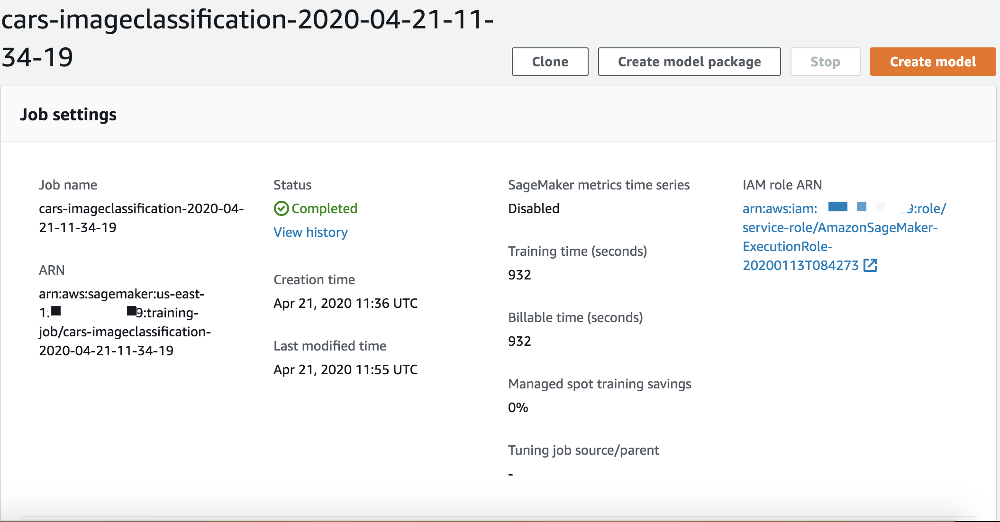
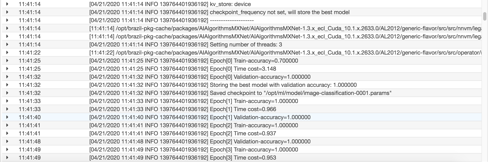
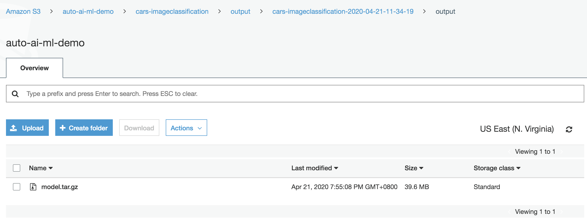
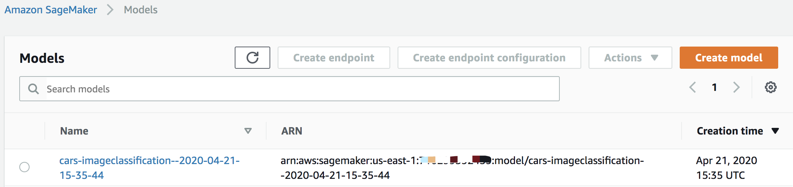
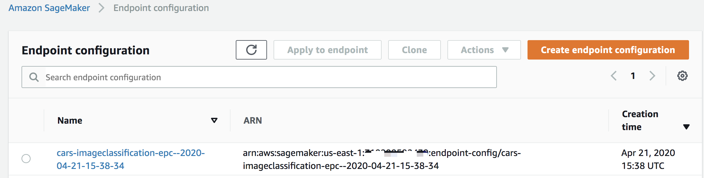
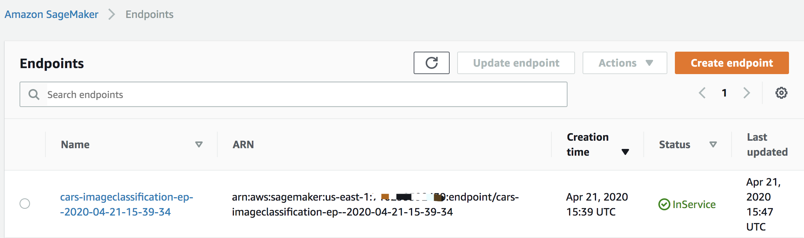

# 基于 Amazon SageMaker 进行汽车型号的图像识别 - 深度学习迁移学习的端到端图像分类器

[汽车型号的图像识别说明文档](https://amazonaws-china.com/cn/blogs/china/image-recognition-of-car-models-based-on-amazon-sagemaker/?from=timeline&isappinstalled=0)

在此示例中， 我们将使用Amazon SageMaker执行以下操作：
1. 环境准备
2. 使用Jupyter Notebook下载数据集并将其进行数据预处理
3. 使用预训练好的模型镜像进行模型微调
4. 将模型进行托管部署
5. 调用已部署的模型接口进行在线推理

# 环境准备
1. 创建Amazon SageMaker Notebook. 这里选择 ml.c5.xlarge 或者 ml.m5.xlarge 类型
2. 执行 `auto-image-classification.ipynb` - `环境准备`部分

# 数据预处理
1. 执行 `auto-image-classification.ipynb` - `数据预处理`部分
    1. 脚本下载斯坦福大学提供的开源数据集 http://imagenet.stanford.edu/internal/car196/car_ims.tgz
    2. 脚本执行invoke_im2rec.sh. 
    
        为提高IO效率, 不会直接读取图片文件, 而是先将图片列表和标签转换为RecordIO格式的二进制文件, 训练时就可以顺序读取数据, 大大提高了IO速率. 利用 MXNet 社区的图片转换工具 im2rec.py 进行快速图像转换: 生成 list 和 record 文件，并且按照validation 的数据和 training 数据的比例进行自动的数据拆分。
2. 执行 `auto-image-classification.ipynb` - `预处理部分上传到S3`部分

# 使用迁移学习进行模型训练
1. 执行 `auto-image-classification.ipynb` - `配置模型训练的超参数`部分
2. 执行 `auto-image-classification.ipynb` - `SageMaker API 的创建`部分
3. 执行 `auto-image-classification.ipynb` - `调用 SageMaker API 来启动训练任务`部分

完成上述步骤后，你可以在Sagemaker Console中看到自己的训练任务，当status为completed时，代表训练完成。整个训练过程大概持续15-20分钟，会根据你选择的机型和你设置的epochs个数等进行变化



同时，在训练过程中，您还可以通过监控cloudwatch logs来查看训练过程中的loss变化



# 部署模型

训练结束后，S3存储桶保存了最新的模型文件。下面我们将其进行线上部署，这样就可以通过接受来自客户端的Restful API请求进行预测



下面继续运行`auto-image-classification.ipynb`

1. 执行 `auto-image-classification.ipynb` - `模型部署-创建模型`部分

2. 执行 `auto-image-classification.ipynb` - `模型部署-配置推理Endpoint`部分

3. 执行 `auto-image-classification.ipynb` - `模型部署-创建推理Endpoint`部分

Endpoint creation ended with EndpointStatus = InService，代表成功创建了一个endpoint



# 推理及应用
1. 执行 `endpoint-auto-image-classification.ipynb` - `推理及应用`部分
鉴于我们作为范例只训练了不多的epoch，结果还算不错。如果想要得到更高的准确率，请使用更多的训练集进行更多轮次的训练。

    - 输入为一张acura的汽车型号Acura RL Sedan 2012的图片，可以看出品牌识别正确，但是型号识别错误
```bash
Endpoint Name = cars-imageclassification-ep--2020-04-21-15-39-34
Result: label - Acura Integra Type R 2001, probability - 0.9999878406524658
```

2. 更多测试图片可以从 s3://auto-ai-ml-demo/test-images 获得


# 参考资料
[Amazon Sagemaker](https://docs.aws.amazon.com/sagemaker/index.html)
[GluonCV- Image Classificaiton](https://gluon-cv.mxnet.io/build/examples_classification/index.html)
