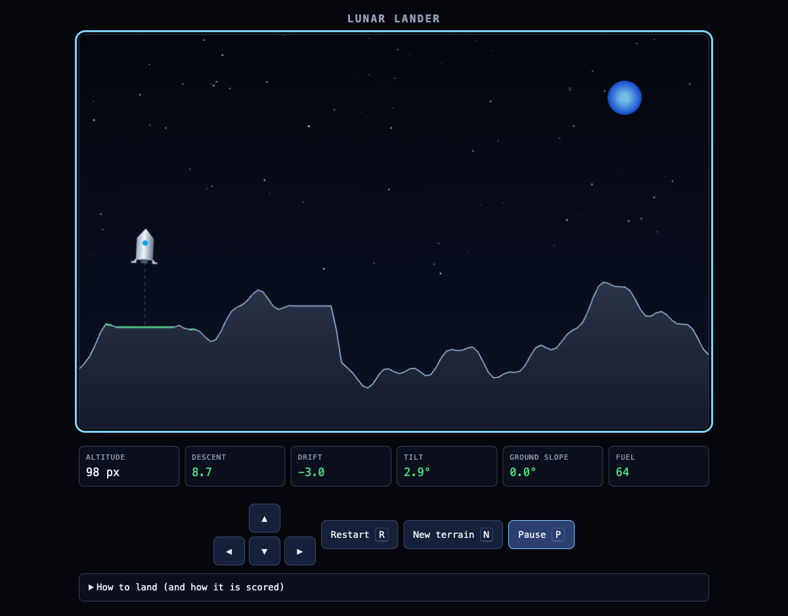
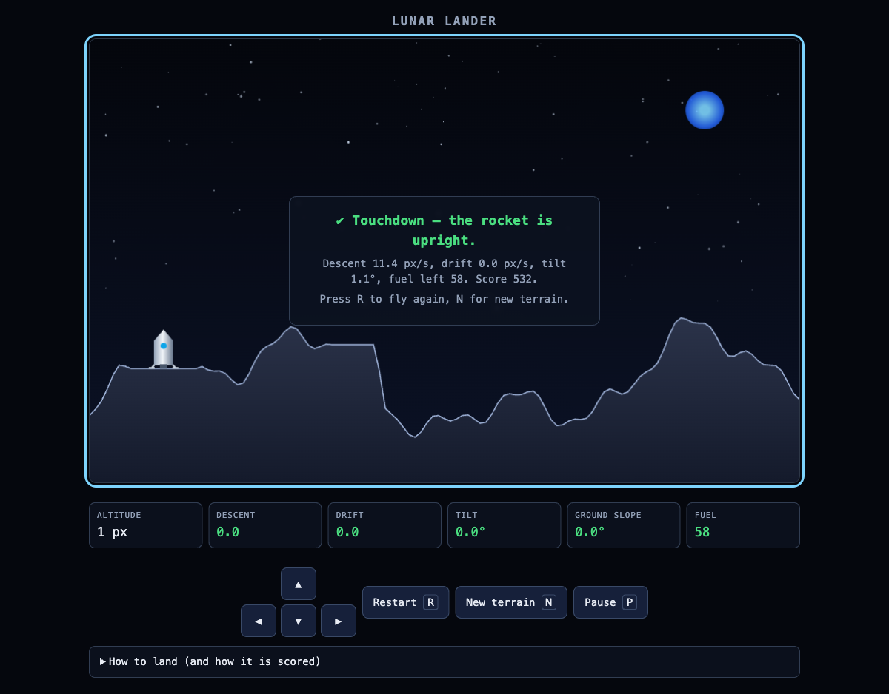

# Kimi K3 as a coding assistant: build a single-file lunar lander game

A worked example of driving [Kimi K3 on Amazon Bedrock](https://docs.aws.amazon.com/bedrock/latest/userguide/model-card-moonshot-ai-kimi-k3.html)
from a coding agent to build one self-contained artifact end to end.

Result: **[`moon_lander.html`](moon_lander.html)** — a single HTML file, no build step, no
dependencies. Open it in a browser and fly.



The rocket must come down **upright** on **flat** ground. Arrow keys: `←` `→` adjust attitude,
`↑` fires the main engine (which thrusts along the hull axis, so attitude steers the thrust),
`↓` fires a descent thruster. The surface is rugged, so picking the site is most of the game.



## Why Kimi K3 for this task

| Kimi K3 property | Why it matters here |
| --- | --- |
| Long-horizon coding | The game is one ~700-line file built over many turns: physics, terrain, collision rules, rendering, HUD, input, a11y. The model has to hold the whole file in its head across edits. |
| 1M-token context | The entire file plus the review transcript stays in context; no need to re-summarize between turns. |
| Native vision | You can paste a screenshot of the broken frame instead of describing it. This is how the D-pad layout bug below was caught. |
| Explicit prompt caching | A long coding-agent system prompt + repo rules is the exact "stable prefix reused across many calls" case. See [`kimi_k3_bedrock.py`](kimi_k3_bedrock.py) `cache` scenarios. |

## Wire Kimi K3 into a coding assistant

### Option A — OpenCode (native Amazon Bedrock provider)

`~/.config/opencode.json` (or a project-level `opencode.json`):

```json
{
  "$schema": "https://opencode.ai/config.json",
  "model": "amazon-bedrock/global.moonshotai.kimi-k3",
  "provider": {
    "amazon-bedrock": {
      "options": {
        "region": "us-west-2",
        "profile": "YOUR-AWS-PROFILE-NAME"
      }
    }
  }
}
```

Then `/models` → `global.moonshotai.kimi-k3`.

> **Converse caveat — read this before a long session.** OpenCode's `amazon-bedrock` provider
> talks to the **Converse** API, and the Kimi K3 model card documents two Converse limitations:
> replaying **reasoning content from earlier turns** in a multi-turn request throws
> `InternalServerException` (this is the default behavior of frameworks like LangChain and
> Strands Agents — strip prior-turn reasoning blocks to work around it), and Converse **rejects
> attached document inputs** such as PDF and HTML. If a long agent session starts failing on
> turn N with a 500, this is the first thing to check.

### Option B — any OpenAI-compatible tool (avoids Converse entirely)

Point the tool at the Bedrock OpenAI-compatible endpoint, which the model card recommends for
this model:

```bash
export OPENAI_BASE_URL="https://bedrock-runtime.us-west-2.amazonaws.com/openai/v1"
export OPENAI_API_KEY="<Amazon Bedrock API key>"   # Bedrock console → API keys
# model name: global.moonshotai.kimi-k3   (or us.moonshotai.kimi-k3 for US data residency)
```

Global CRIS (`global.`) routes to any supported commercial Region worldwide and costs ~10% less
than the US geo profile (`us.`), which keeps processing inside the US geography.

## The prompt

The task statement, given as one brief. Concrete, testable rules beat adjectives — every rule
below became an assertion in the verification step.

```text
Build a single-file browser game (one .html, no dependencies, no build step): land a rocket
on the moon.

Mechanics
- The rocket lands successfully only if it comes to rest UPRIGHT. If it topples over, the
  landing FAILS.
- Controls are the arrow keys: LEFT/RIGHT adjust the rocket's attitude (rotation); UP and DOWN
  control ascent and descent.
- The main engine thrusts along the rocket's own axis, so attitude steers the thrust.
- The lunar surface is rugged. The player must choose a suitable landing site: touching down on
  a slope steeper than 10 degrees topples the rocket.
- Explicit limits: tilt < 10 degrees, descent < 16 px/s, drift < 12 px/s. Outside those it
  crashes or tips over.
- Gravity is constant and gentle; the engine burns limited fuel.

Requirements
- Canvas 2D, procedurally generated rugged terrain with a few flat pads, reachable but not
  marked.
- HUD: altitude, descent rate, drift, tilt, ground slope under the rocket, fuel. Colour each
  value by whether it is inside its landing limit.
- Restart and new-terrain keys. Pause.
- Keyboard-only playable; also add on-screen buttons. Announce the outcome to screen readers.
- Comment the physics and the landing-verdict logic.
```

## Iterating with the agent

Turns that actually moved the build forward:

1. **Scaffold.** "Single HTML file, canvas, fixed-timestep loop, procedural terrain, rocket with
   position/velocity/angle/spin. No gameplay rules yet — just make the rocket fall and render."
2. **Landing verdict.** "Now the rules. One function that evaluates contact and returns exactly
   one of: landed, toppled, crashed. Comment why each threshold exists."
3. **Make it winnable.** "Terrain generation must guarantee at least 3 flat pads wide enough for
   the leg span, otherwise a perfect flight can still be unwinnable."
4. **Screenshot review (vision).** Paste the rendered frame: *"Here is a screenshot. The touch
   D-pad is laid out wrong — Left sits beside Up instead of below it. Fix the grid placement."*
   Faster and less error-prone than describing a layout bug in words.
5. **Adversarial review.** "Enumerate the ways the landing verdict can misfire, then write
   assertions for each." This is the turn that found the collision bug below.
6. **Accessibility pass.** "Keyboard-only play, visible focus rings, `aria-live` verdict
   announcements, touch buttons as real `<button>`s, respect `prefers-reduced-motion`."

### Two real bugs the loop caught

Worth reproducing, because both are the kind of thing that looks fine on screen and fails the rules:

- **Leg/hull collision overlap.** The hull's bottom edge and the footpads were at the same local
  `y`, so the "hull struck before the legs" check fired on the *same frame* as leg contact. Every
  tilted or steep-slope touchdown reported **"crashed"** instead of toppling — the spec's central
  rule, silently broken. Fix: the hull collision box now stops 6 px above the footpads, and leg
  contact is evaluated before the hull strike.
- **D-pad auto-placement.** With only `grid-column: 2` on the up button, CSS grid auto-flow put
  Left beside Up. Fix: place all four buttons explicitly.

## Verify before you believe it

Serve over HTTP — headless browser tooling commonly blocks `file://`:

```bash
python3 -m http.server 8731 --directory ai-ml/chatgpt/OpenWeights/Kimi
# http://127.0.0.1:8731/moon_lander.html
```

The file exposes a debug handle, `window.lander`, so the rules can be asserted headlessly
instead of play-tested by hand:

```js
// Paste in the devtools console. Each case asserts one rule from the brief.
const L = window.lander, wait = ms => new Promise(r => setTimeout(r, ms));
const t = L.terrain();
let pad = null, i = 1;
while (i < t.length) {                       // find the widest flat stretch
  let j = i;
  while (j < t.length && Math.abs(t[j] - t[i - 1]) < 0.01) j++;
  if (!pad || j - i > pad.len) pad = { start: i - 1, len: j - i };
  i = j + 1;
}
const padX = (pad.start + pad.len / 2) * L.step;
const place = (x, patch) => {
  L.reset(false);
  L.set({ x, y: L.groundAt(x) - 22, vx: 0, vy: 5, angle: 0, spin: 0, ...patch });
};

place(padX, {});                            await wait(1400);
console.log('flat + upright  ->', L.state().verdict.title);   // success
place(padX, { angle: 25 * Math.PI / 180 }); await wait(2600);
console.log('tilted 25 deg   ->', L.state().verdict.title);   // toppled
place(padX, { vy: 90 });                    await wait(1000);
console.log('fast descent    ->', L.state().verdict.title);   // crashed
```

Verified this way on Chromium: flat + upright + gentle → success; 8° tilt (inside the limit) →
success; 25° tilt → toppled; steepest slope on the map while perfectly upright → toppled;
90 px/s descent → crashed; 30 px/s drift → crashed. Controls: holding `↑` took descent from
+20 to −5.2 px/s and burned fuel; `←`/`→` reached −17.3°/+17.9° in 500 ms; `↓` increased descent
from 13 to 22.9 px/s over gravity alone; `R` cleared the verdict and refilled fuel. Console is
clean apart from a `favicon.ico` 404.

## Cost note for sessions like this

A coding agent resends a large stable prefix — system prompt, repo conventions, tool
definitions, and often the whole file under edit — on every turn. That is precisely what
Kimi K3's **explicit prompt caching** targets: mark the end of the stable prefix with a
`prompt_cache_breakpoint`, keep the changing instruction after it, and subsequent turns inside
the ≥30-minute TTL read the prefix at the discounted cache rate without counting against your
input-tokens-per-minute quota. Runnable scenarios: `python kimi_k3_bedrock.py cache agent`.

Measured on a 4-turn loop with a ~3.5k-token prefix: turn 1 wrote 3,478 tokens to cache, turns
2–4 each read 3,478 — but total list-price savings were only ~13.6%, because output tokens at
$15/1M dominated. The saving scales with how large the reused prefix is relative to the output,
so a real coding agent resending tens of thousands of prefix tokens per turn benefits far more
than this demo does.

One cost surprise worth planning for: Kimi K3 spends heavily on reasoning tokens, which are
billed as output. A single "design an architecture" answer measured 4,617 output tokens of which
2,513 were reasoning; an image transcription used 3,868 reasoning tokens of 4,196. Reasoning is
where the money goes in a coding session, not the prompt.

## Files

| File | What it is |
| --- | --- |
| [`moon_lander.html`](moon_lander.html) | The game. Single file, no dependencies. |
| [`kimi_k3_bedrock.py`](kimi_k3_bedrock.py) | Kimi K3 API examples: Chat Completions, Responses, tool use, vision, structured output, and 5 explicit prompt caching scenarios. |

## References

- [Introducing Kimi K3 on Amazon Bedrock](https://aws.amazon.com/blogs/machine-learning/introducing-kimi-k3-on-amazon-bedrock/)
- [Kimi K3 model card](https://docs.aws.amazon.com/bedrock/latest/userguide/model-card-moonshot-ai-kimi-k3.html)
- [Kimi K3 is GA on Amazon Bedrock](https://aws.amazon.com/about-aws/whats-new/2026/09/moonshot-ai-kimi-k3-on-amazon-bedrock/)
- [Prompt caching for faster model inference](https://docs.aws.amazon.com/bedrock/latest/userguide/prompt-caching.html)
