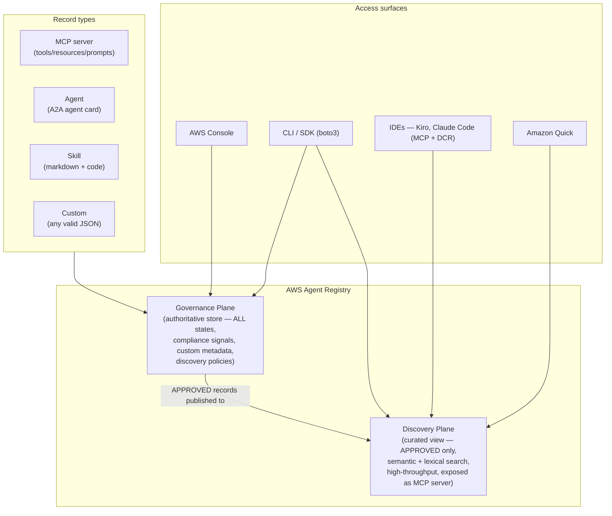
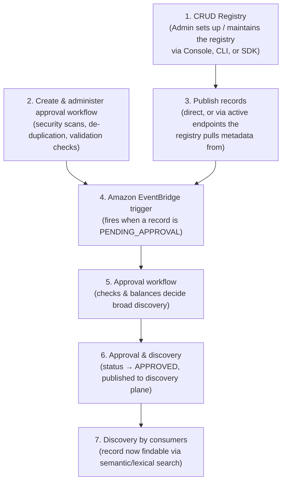
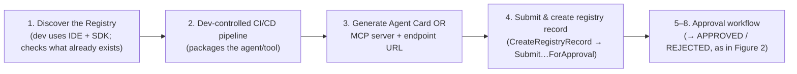
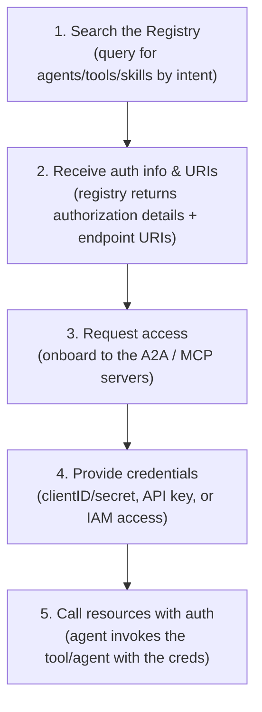
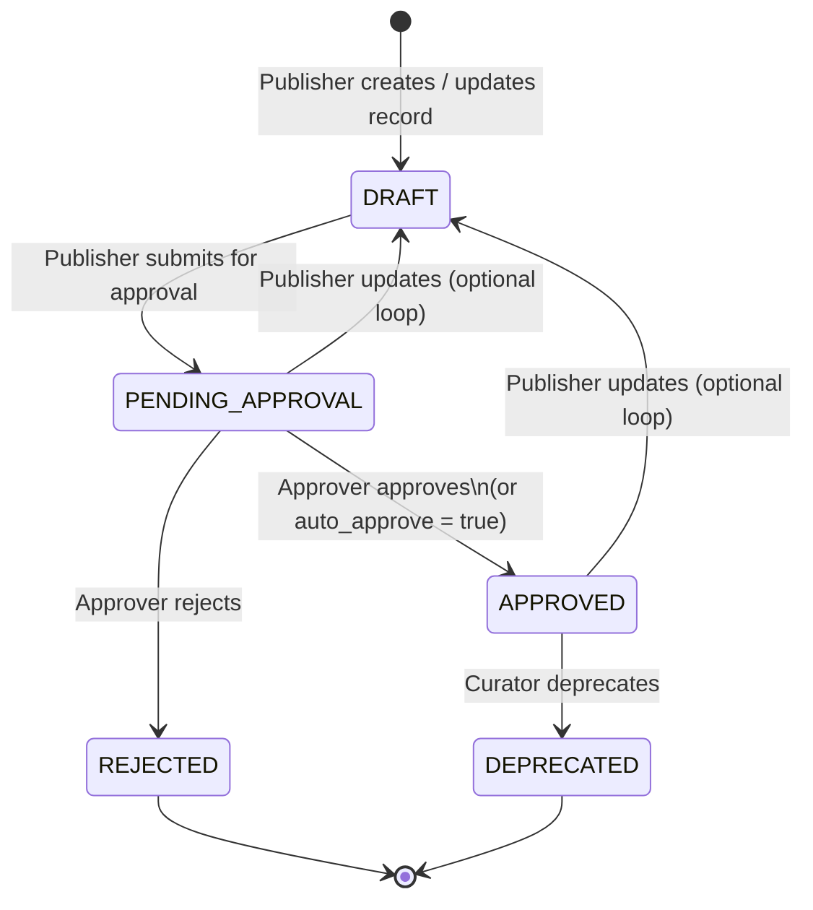

# AWS Agent Registry — Hands-on Lab

A runnable, heavily-commented Python lab that walks the **entire AWS Agent
Registry lifecycle against the REAL API** (Amazon Bedrock AgentCore capability,
GA 2026-08-31), plus a self-contained visualization of the value story.

Everything here was **verified live** on 2026-09-16 in account
`747411437379` / `us-east-1`.

> **Source / further reading:** this lab and the diagrams below follow the AWS
> announcement post
> [Manage agents, tools and skills at scale with AWS Agent Registry](https://aws.amazon.com/blogs/machine-learning/manage-agents-tools-and-skills-at-scale-with-aws-agent-registry/)
> (Chaitra Mathur, Anubhav Mangal, Amanda Lester — 31 Aug 2026). Each workflow
> section maps to a figure in that post (Figures 1–5). See also the
> [AWS Agent Registry Developer Guide](https://docs.aws.amazon.com/bedrock-agentcore/latest/devguide/registry.html)
> and the [agentcore-samples repo](https://github.com/awslabs/agentcore-samples).

---

## What Agent Registry is (30-second version)

A single, governed, **searchable catalog** for an org's Agents, Tools (MCP),
Skills, and Custom resources. It solves three problems at scale: no
authoritative inventory, no cross-team discovery, no governance/audit trail.

It runs across **two planes**:

| Plane | boto3 client | Who uses it | Sees |
|---|---|---|---|
| **Governance / control** | `agent-registry-control` | Admins, Publishers, Curators | ALL records, every lifecycle state |
| **Discovery / data** | `agent-registry` | Consumers (humans & agents) | ONLY `APPROVED` records |

Record **lifecycle**: `DRAFT → PENDING_APPROVAL → APPROVED / REJECTED → DEPRECATED`
Record **types**: `MCP`, `AGENT`, `SKILL`, `CUSTOM`.

---

## Architecture & workflows (mapped to the blog's figures)

The following five sections follow the diagrams in the
[AWS Agent Registry announcement post](https://aws.amazon.com/blogs/machine-learning/manage-agents-tools-and-skills-at-scale-with-aws-agent-registry/).
Each mermaid diagram reproduces the corresponding figure; the ⭐ notes tie every
step back to the real API calls this lab makes.

### 1. Overview architecture (Figure 1 — capabilities & access surfaces)

Agent Registry is one governed catalog exposed through two planes and reachable
from several access surfaces (Console, CLI/SDK, IDEs via MCP+DCR, Amazon Quick,
and the Search API — itself exposed as an MCP server).



> ⭐ In this lab: the **Governance Plane** = boto3 client `agent-registry-control`;
> the **Discovery Plane** = client `agent-registry`, op
> `search_discoverable_registry_records`. All four record types are supported;
> the lab uses `CUSTOM` for portability.

### 2. Administrator approval workflow (Figure 2 — 7 steps)

How an admin sets up the registry and wires the approval workflow that gates
what reaches the discovery plane.



> ⭐ In this lab: step 1 = `01_create_registry.py`; steps 3–4 =
> `02_publish_records.py` + `03_submit_for_approval.py`; steps 5–6 =
> `04_curator_approve.py` (`UpdateRegistryRecordStatus`, which **requires**
> `statusReason`); step 7 = `05_consumer_search.py`. EventBridge + the workflow
> engine (steps 2, 4, 5) are org hooks you configure — the lab plays the
> human-curator role directly.

### 3. Publishing workflow from CI/CD (Figure 3)

A developer's pipeline packages an agent/tool and pushes a record into the
registry, then it flows through the same approval gate.



> ⭐ In this lab: step 4 = `create_registry_record` +
> `submit_registry_record_for_approval`. Publishers can also let the registry
> **synchronize** metadata directly from external MCP/A2A servers (OAuth / IAM /
> unauthenticated) instead of hand-authoring records.

### 4. Discovery & access flow for consumers (Figure 4 — 5 steps)

How a consumer (developer or autonomous agent) finds and then actually calls a
resource.



> ⭐ In this lab: step 1 = `search_discoverable_registry_records` (returns only
> APPROVED records). Steps 2–5 are the onboarding + authenticated-call path to
> the underlying tool; the lab's records point at placeholder ARNs, so it
> demonstrates discovery (step 1) rather than a live tool invocation.
> From an IDE (Kiro, Claude Code) this is a natural-language MCP query wired up
> via Dynamic Client Registration (DCR) — no pre-provisioned OAuth.

### 5. Record lifecycle state transitions (Figure 5)



> ⭐ In this lab: `CreateRegistryRecord` → `DRAFT`;
> `SubmitRegistryRecordForApproval` → `PENDING_APPROVAL`;
> `UpdateRegistryRecordStatus(status=APPROVED|REJECTED, statusReason=…)` →
> `APPROVED`/`REJECTED`. `auto_approve` and `DEPRECATED` are supported by the
> API but not exercised by the numbered scripts. Only `APPROVED` records are
> ever returned on the discovery plane.

---

## The lab scripts

Run in order. Each is standalone, idempotent, and prints the real request /
response so it is self-documenting.

| # | Script | Role | What it does |
|---|---|---|---|
| 00 | `00_probe_api.py` | — | Read-only: dumps the exact API operation shapes. Creates nothing. |
| 01 | `01_create_registry.py` | Admin | Creates the lab registry (async `CREATING → READY`). Idempotent. |
| 02 | `02_publish_records.py` | Publisher | Publishes 3 `CUSTOM` records → all start `DRAFT`. |
| 03 | `03_submit_for_approval.py` | Publisher | `DRAFT → PENDING_APPROVAL`. |
| 04 | `04_curator_approve.py` | Curator | Approves 2, **rejects** 1 (`sentiment`) to show both paths. |
| 05 | `05_consumer_search.py` | Consumer | Semantic search on the discovery plane — only APPROVED records return. |
| 06 | `06_teardown.py` | Admin | Deletes all records, then the registry → **$0 residual**. |
| ⭐ | `end_to_end.py` | all | The whole lifecycle in ONE self-contained run (no shared module, no ordering). `--keep` to leave resources up. Start here for a quick tour. |

Convenience runner:

```bash
./run_all.sh            # 00 → 05 (probe → search), leaves resources up
./run_all.sh teardown   # 06 only
./run_all.sh all        # 00 → 06 (full cycle incl. cleanup)
```

---

## Prerequisites (important)

**boto3 >= 1.43.** The base system boto3 (1.34.x) does **not** know these
services. Install a recent boto3 into a venv:

```bash
python3 -m venv .venv && . .venv/bin/activate
pip install 'boto3>=1.43'
python 01_create_registry.py          # or: python end_to_end.py
```

IAM: the caller needs read+write on Agent Registry. For the discovery search
action the GA managed policy is `AgentRegistryFullAccess` (the old
`BedrockAgentCoreFullAccess` does **not** grant `agent-registry:*`).

---

## Gotchas learned the hard way (all verified live)

1. **GA vs preview namespace — the big one.**
   The discovery search op is **`search_discoverable_registry_records` on the
   `agent-registry` client**. The old preview client `bedrock-agentcore` +
   `search_registry_records` is a **separate namespace with a separate data
   store** — it returns `ResourceNotFoundException: Registry not found` for a
   registry created on the GA control plane, and the preview namespace is
   being retired. Use the GA client everywhere.

2. **Everything is async.** `CreateRegistry` → `CREATING → READY`;
   `CreateRegistryRecord` → `CREATING → DRAFT`. Poll before you act on them.
   A registry stuck in `CREATING` cannot be deleted yet.

3. **`UpdateRegistryRecordStatus` requires `statusReason`** (not optional) —
   it becomes part of the audit trail.

4. **Response key names** (from the live API):
   `list_registry_records` → `registryRecords` (not `records`);
   registry id is the short 16-char `registryId`; record id is the short
   `recordId`. The search op accepts the bare `registryId` OR the full
   `arn:aws:agent-registry:...:registry/<id>` ARN.

5. **Discovery is eventually consistent** after approval (seconds, up to a
   couple minutes). Script 05 retries. Note: index lag yields *empty results*,
   never a `Registry not found` — a 404 is the namespace mismatch (gotcha 1).

6. **Semantic search returns nearest neighbors with no relevance floor** — an
   unrelated query ("send SMS") still returns the closest APPROVED record.
   Filter client-side on a score threshold if you need a hard cutoff.

---

## The governance payoff (what the lab proves)

The curator **rejects** `customer-sentiment-agent`. In script 05, a consumer
query that clearly means "sentiment analysis" returns **no match** — the record
exists in the governance plane but is invisible on the discovery plane. That is
the entire value proposition: consumers only ever find vetted, approved
capabilities.

---

## Visualization

`../viz/index.html` — a self-contained single-page visualization (no build, no
backend) telling the same story: Publisher → Curator → Consumer, the animated
state machine, and the before/after governance contrast. Open it directly in a
browser. Its data is shaped to match the real API contract documented above.
