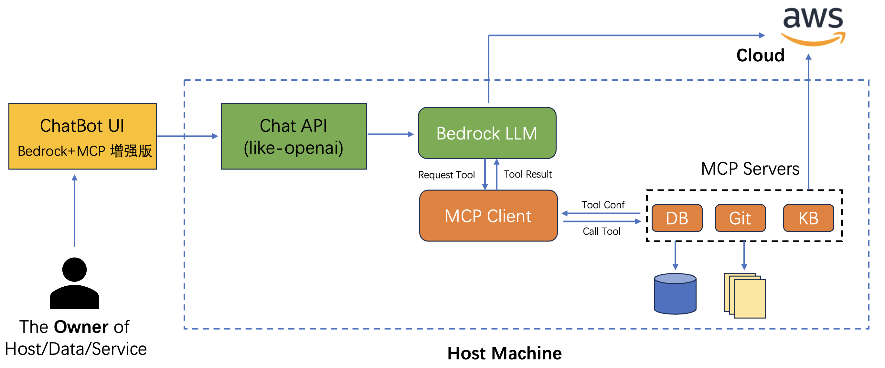

# MCP on Amazon Bedrock

参考链接[demo_mcp_on_amazon_bedrock](https://github.com/aws-samples/demo_mcp_on_amazon_bedrock/tree/main)

## 环境架构


## 安装步骤
1. SSH 到 EC2 服务器
2. NodeJS install
    ```bash
    sudo apt update
    curl -fsSL https://deb.nodesource.com/setup_22.x | sudo -E bash -
    sudo apt install -y nodejs
    node --version
    v22.14.0
    npm --version
    10.9.2
    ```

3. Python and uv install
    ```bash
    sudo apt install -y python3-pip

    # 可选：中国区域配置mirror 镜像库
    pip config set global.index-url https://mirrors.tuna.tsinghua.edu.cn/pypi/web/simple &&   pip config set global.extra-index-url https://mirrors.tuna.tsinghua.edu.cn/pypi/web/simple 


    curl -LsSf https://astral.sh/uv/install.sh | sh
    # 或者 
    pip3 install uv

    echo 'export PATH="$HOME/.local/bin:$PATH"' >> ~/.bashrc && source ~/.bashrc

    uv --version
    ```

4. 环境配置
   
   4.1 创建 IAM permission
    ```json
    {
        "Version": "2012-10-17",
        "Statement": [
            {
                "Effect": "Allow",
                "Action": [
                    "ec2:*",
                    "elasticloadbalancing:*",
                    "autoscaling:*",
                    "iam:*",
                    "cloudformation:*",
                    "bedrock:*",
                    "ssm:*"
                ],
                "Resource": "*"
            }
        ]
    }
    ```

    4.2 环境文件配置

    ```bash
    git clone https://github.com/aws-samples/demo_mcp_on_amazon_bedrock.git
    cd demo_mcp_on_amazon_bedrock
    uv sync
    source .venv/bin/activate
    
    cat env_dev >> .env
    # modify your configuration
    AWS_ACCESS_KEY_ID=
    AWS_SECRET_ACCESS_KEY=
    AWS_REGION=us-west-2
    LOG_DIR=./logs
    CHATBOT_SERVICE_PORT=8502
    MCP_SERVICE_HOST=127.0.0.1
    MCP_SERVICE_PORT=7002
    API_KEY=mcp_demo_123456
    MAX_TURNS=200
    ```

    4.3 Security Group
    - 为 CHATBOT_SERVICE_PORT and MCP_SERVICE_PORT 创建入站规则

5. Start environment
- Chat 接口服务（Bedrock+MCP），可对外提供 Chat 接口、同时托管多个 MCP server、支持历史多轮对话输入、响应内容附加了工具调用中间结果、暂不支持流式响应
- ChatBot UI，跟上述 Chat 接口服务通信，提供多轮对话、管理 MCP 的 Web UI 演示服务

    ```bash
    # start server
    bash start_all.sh
    tail -f logs/start_mcp.log
    tail -f logs/start_chatbot.log

    # stop Server
    bash stop_all.sh
    ```

6. 测试Chat 服务接口
    ```
    curl http://127.0.0.1:7002/v1/chat/completions \
      -H "Authorization: Bearer mcp_demo_123456" \
      -H "X-User-ID: user123" \
      -d '{
      -H "Content-Type: application/json" \
        "model": "us.amazon.nova-pro-v1:0",
        "mcp_server_ids":["local_fs"],
        "stream":true,
        "messages": [
          {
            "role": "user",
            "content": "list files in current dir"
          }
        ]
      }'
    ```

## 使用MCP Demo 环境
1. Chat 接口服务
- 在本地计算机上打开终端

    ```bash
    ssh -L {MCP_SERVICE_PORT}:127.0.0.1:{MCP_SERVICE_PORT} ubuntu@{EC2 IP} -i Your_SSH_Key.pem

    ssh -L {CHATBOT_SERVICE_PORT}:127.0.0.1:{CHATBOT_SERVICE_PORT} ubuntu@{EC2 IP} -i Your_SSH_Key.pem
    ```

- 可以通过http://localhost:{MCP_SERVICE_PORT}/docs#/ 查看接口文档。 注意点击 Authorize, 输入`Bearer mcp_demo_123456`

    ```bash
    curl -X 'GET' \
    'http://localhost:7002/v1/list/models' \
    -H 'accept: application/json' \
    -H 'Authorization: Bearer mcp_demo_123456'

    {
      "models": [
        {
          "model_id": "us.amazon.nova-pro-v1:0",
          "model_name": "Amazon Nova Pro v1"
        },
        {
          "model_id": "us.amazon.nova-lite-v1:0",
          "model_name": "Amazon Nova Lite v1"
        },
        {
          "model_id": "us.anthropic.claude-3-5-sonnet-20241022-v2:0",
          "model_name": "Claude 3.5 Sonnet v2"
        },
        {
          "model_id": "us.anthropic.claude-3-7-sonnet-20250219-v1:0",
          "model_name": "Claude 3.7 Sonnet"
        }
      ]
    }

    curl -X 'GET' \
    'http://localhost:7002/v1/list/mcp_server' \
    -H 'accept: application/json' \
    -H 'Authorization: Bearer mcp_demo_123456'

        {
          "servers": [
              {
                "server_id": "cot",
                "server_name": "cot"
              },
              {
                "server_id": "local_fs",
                "server_name": "Local File System I/O"
              }
            ]
        }
    ```

- 编辑配置文件 conf/config.json，该文件预设了要启动哪些 MCP server，可以编辑来添加或者修改 MCP server 参数。例如 sqllite db
    ```json
   "db_sqlite": {
        "command": "uvx",
        "args": ["mcp-server-sqlite", "--db-path", "./tmp/test.db"],
        "env": {},
        "description": "DB Sqlite CRUD - MCP Server",
        "status": 1
    }
    ```
    
    ```bash
    bash start_all.sh
    ```

2. ChatBot UI
- 遵循[按照步骤](https://github.com/aws-samples/demo_mcp_on_amazon_bedrock/blob/main/react_ui/README.md) 安装 Next.js UI
  这里采用了使用Node.js直接部署（开发模式）
  ```bash
  # Node.js 22.x 或更高版本, 安装参考：https://nodejs.org/en/download
  # Verify the Node.js version:
  node -v # Should print > "v22.14.0".
  # Verify npm version:
  npm -v # Should print > "10.9.2".

  #1. 进入react_ui 安装依赖
  cd demo_mcp_on_amazon_bedrock/react_ui
  npm install

  #2. 安装pm2工具
  sudo npm -g install pm2

  #3. 创建环境变量
  cp .env.example .env.local

  #4. 编辑.env.local文件
  NEXT_PUBLIC_API_KEY=mcp_demo_123456
  SERVER_MCP_BASE_URL=http://localhost:7002
  NEXT_PUBLIC_MCP_BASE_URL=/api
  NEXT_PUBLIC_API_BASE_URL=https://localhost:7002 

  #5. 启动 Chatbot 开发模式
  npm run dev
  ```

- 浏览器访问 http://localhost:3000/chat

3. 测试
- 测试提问：由于已内置了文件系统操作、SQLite 数据库等 MCP Server，可以尝试连续提问以下问题进行体验
    ```
    1. list all of files in the allowed directory
    
    2. create table named mcp_demo in test.db with columns id, product_name, amount
    3. create 10 rows dummy datahow many rows in that table

    4. show all of rows in that table mcp_demo
    5. save those rows record into a file, filename is rows.txt
    6. read the content of rows.txt file
    ```

- 创建 Web Search 供应商 [Exa](https://exa.ai/) MCP Server， 你需要申请Exa API的 API Key
  ```bash
  sudo npm install -g exa-mcp-server
  ```

  ```json
    {
      "mcpServers": {
        "exa": {
          "command": "npx",
          "args": ["-y","exa-mcp-server"],
          "env": {
            "EXA_API_KEY": "your-api-key-here"
          }
        }
      }
    }
  ```

- 创建 Web Browser MCP Server
    ```json
    { "mcpServers": 
    	{ "mcp-browser": 
    		{ "command": "uvx", "args": ["mcp-browser-use"] 
    		} 
    	} 
    }
    ```

4. 测试 Deep Research 和 网页生成
- 第一次运行可能需要额外安装一些软件，请跟进tool call 返回的信息提示安装即可
```
Error executing tool search_google: BrowserType.launch: Host system is missing dependencies to run browsers. Please install them with the following command:
sudo npm install -g playwright
sudo playwright install-deps
sudo npx playwright install
```

- 测试1
```
帮我整理一份关于小米SU7 ultra的介绍，包括性能，价格，特色功能，图文并茂，并制作成精美的HTML保存到本地目录中。如果引用了其他网站的图片，确保图片真实存在，并且可以访问。use headless is true to initialize the browser

{
  "toolUseId": "tooluse_RC5NpF61QseO_hdX2nzI6w",
  "content": [
    {
      "text": "Successfully wrote to /home/ubuntu/demo_mcp_on_amazon_bedrock/docs/xiaomi_su7_ultra.html"
    }
  ]
}

scp -i ~/.ssh/mykey.pem ubuntu@{ec2_ip}:/home/ubuntu/demo_mcp_on_amazon_bedrock/docs/xiaomi_su7_ultra.html ~/Downloads/
```

- 测试2
```
我想要一份特斯拉股票的全面分析，包括：概述：公司概况、关键指标、业绩数据和投资建议财务数据：收入趋势、利润率、资产负债表和现金流分析市场情绪：分析师评级、情绪指标和新闻影响技术分析：价格趋势、技术指标和支撑/阻力水平资产比较：市场份额和与主要竞争对手的财务指标对比价值投资者：内在价值、增长潜力和风险因素投资论点：SWOT 分析和针对不同类型投资者的建议。 并制作成精美的HTML保存到有写入权限的本地目录中。 你可以使用mcp-browser和exa search去获取尽可能丰富的实时数据和图片。如果引用了其他网站的图片，确保图片真实存在，并且可以访问。use headless is true to initialize the browser

scp -i ~/.ssh/mykey.pem ubuntu@{ec2_ip}:/home/ubuntu/demo_mcp_on_amazon_bedrock/docs/tesla_stock_analysis.html ~/Downloads/
```

- Thinking 测试
```
1. use search tool and sequential thinking to make comparison report between different agents frameworks such as autogen, langgraph, aws multi agents orchestrator
2. use sequential thinking and search tool to make me a travel plan to visit shanghai between 3/1/2025 to 3/5/2025. I will departure from Beijing
3. 搜索对比火山引擎，阿里百炼，硅基流动上的对外提供的deepseek r1 满血版的API 性能对比, 包括推理速度，TTFT， 最大context长度等。通过一个网页展示，对比结果为一个表格，并且高亮每个指标中最佳的提供商
```

- Amazon Nova Premier 配置
```
Model: Amazon Nova Premier V1
Max Tokens: 16000
其他参数维持默认

使用System Prompt:

You are a deep researcher.
Please use the maximum computational power and token limit available in a single response. Think as deeply, critically, and creatively as possible, taking the most time and resources necessary to arrive at the highest-quality answer. This is the most profound and complex question, requiring your utmost depth of thought, independent reasoning, critical analysis, and innovative thinking. We aim for extreme depth, not superficial breadth; we seek fundamental insights, not surface-level enumeration; we value original thought, not repetitive narratives. Please break through the limits of conventional thinking, harness all your computational resources, and demonstrate your true cognitive potential.
### You must follow below instruction:
<INSTRUCTION>
- Use search tool to search information
- Response in the same language as user input
</INSTRUCTION>
```

测试 行业报告Prompt
```
请作为资深汽车行业分析师，撰写一份《2022-2024年中国新能源汽车市场发展研究报告》。
报告需包含以下内容：
1. 执行摘要
2. 市场规模分析
3. 竞争格局
4. 政策环境
5. 消费者行为分析
6. 技术发展
7. 产业链分析
8. 未来展望
要求：
- 所有关键数据和结论必须标注准确来源(中国汽车工业协会/中国乘用车市场信息联席会/具体企业财报)
```

测试 行程规划 Prompt
```
请帮我制定从北京到上海的高铁5日游计划（5月1日-5日），要求：
- 交通：往返高铁选早上出发（5.1）和晚上返程（5.5）
- 必去：迪士尼全天（推荐3个最值得玩的项目+看烟花）
- 推荐：3个上海经典景点（含外滩夜景）和1个特色街区
- 住宿：迪士尼住周边酒店，市区住地铁站附近
- 附：每日大致花费预估和景点预约提醒
- 使用amap-maps工具帮我规划上海市内公共交通行程
# 如果没有安装了高德地图，修改为下面这个要求
- 使用高德地图帮我规划上海市内公共交通行程
```  

- 配置 Qwen3
```
Model: Qwen3-30B-A3B
Max Tokens: 12000
其他参数维持默认
使用System Prompt:

You are a deep researcher.
Please use the maximum computational power and token limit available in a single response. Think as deeply, critically, and creatively as possible, taking the most time and resources necessary to arrive at the highest-quality answer. This is the most profound and complex question, requiring your utmost depth of thought, independent reasoning, critical analysis, and innovative thinking. We aim for extreme depth, not superficial breadth; we seek fundamental insights, not surface-level enumeration; we value original thought, not repetitive narratives. Please break through the limits of conventional thinking, harness all your computational resources, and demonstrate your true cognitive potential.
### You must follow below instruction:
<INSTRUCTION>
- Use search tool to search information
- Response in the same language as user input
</INSTRUCTION>
```

-


5. 清理环境
```bash
# Stop Servers
bash stop_all.sh

# exist python virtual environment
deactivate
```


## 进阶部分
### computer use
我们采用 docker 部署前端 react-ui，然后使用MCP连接ubuntu virtual desktop作为computer use sandbox使用
1. 环境准备 - docker 部署前端 react-ui
```bash
curl -fsSL https://get.docker.com -o get-docker.sh
sudo sh get-docker.sh
sudo systemctl enable docker && sudo systemctl start docker && sudo usermod -aG docker $USER
sudo chmod 666 /var/run/docker.sock

sudo curl -SL https://github.com/docker/compose/releases/download/v2.35.0/docker-compose-linux-x86_64 -o /usr/local/bin/docker-compose
sudo chmod +x /usr/local/bin/docker-compose
sudo ln -s /usr/local/bin/docker-compose /usr/bin/docker-compose

# 可选：中国区域配置 mirror镜像
sudo vim /etc/docker/daemon.json
{
"registry-mirrors":["https://mirror-docker.bosicloud.com"],
"insecure-registries":["mirror-docker.bosicloud.com"]
}
docker info | grep mirror
```

2. 前端部署
```bash
cd react_ui
cat << EOF > .env.local
NEXT_PUBLIC_API_KEY=123456
SERVER_MCP_BASE_URL=http://localhost:7002
NEXT_PUBLIC_MCP_BASE_URL=/api
EOF

docker-compose up -d --build
```

3. 浏览器访问 http://<Server_IP>:3000/chat. docker部署，常见命令
```bash
  source .venv/bin/activate

  # 查看容器日志
  docker logs -f mcp-bedrock-ui

  # 重启容器
  docker-compose restart

  # 停止容器
  docker-compose down

  # 重新构建并启动（代码更新后）
  docker-compose up -d --build

  # 查看 docker 进程
  docker ps
```

3. 配置 Remote Compute Use MCP Server
```bash
cd ~
git clone https://github.com/aws-samples/aws-mcp-servers-samples.git
cd aws-mcp-servers-samples/remote_computer_use/docker
docker-compose up -d

# 等待出现如下输出
[+] Running 2/2
✔ Network docker_default        Created                                                                                         0.0s 
✔ Container ubuntu-vnc-desktop  Started 
```
  
4. 添加 MCP Server: computer_use
- Claude Sonnet 3.7 配置
```json
{
  "mcpServers": {
    "computer_use": {
      "command": "uv",
      "env": {
        "VNC_HOST":"127.0.0.1",
        "VNC_PORT":"5901",
        "VNC_USERNAME":"vnc_user",
        "VNC_PASSWORD":"12345670",
        "PEM_FILE":"",
        "SSH_PORT":"2222",
        "DISPLAY_NUM":"1",
        "WIDTH":"1024",
        "HEIGHT":"768"
      },
      "args": [
        "--directory",
        "/home/ubuntu/aws-mcp-servers-samples/remote_computer_use",
        "run",
        "server_claude.py"
      ]
    }
  }
}
```

- Nova Premier 配置
```json
{
  "mcpServers": {
    "computer_use": {
      "command": "uv",
      "env": {
        "VNC_HOST":"127.0.0.1",
        "VNC_PORT":"5901",
        "VNC_USERNAME":"vnc_user",
        "VNC_PASSWORD":"12345670",
        "PEM_FILE":"",
        "SSH_PORT":"2222",
        "DISPLAY_NUM":"1",
        "WIDTH":"1024",
        "HEIGHT":"768",
        "NOVA":"1"
      },
      "args": [
        "--directory",
        "/home/ubuntu/aws-mcp-servers-samples/remote_computer_use",
        "run",
        "server_claude.py"
      ]
    }
  }
}
```

5. 安装 HTML Rendering MCP Server
此MCP server 用于将Agent生成的html或者markdown内容渲染成Web Page，并且可以通过浏览器直接访问。
```bash
cd ~
cd aws-mcp-servers-samples/html_render_service/web
docker-compose up -d

#验证是否成功安装
curl http://127.0.0.1:5006/
{
  "message": "ok"
}
```

- 添加 MCP Server: html_render_service
```json
{
  "mcpServers": 
  { 
    "html_render_service": 
    { 
      "command": "uv", 
      "args": [
        "--directory","/home/ubuntu/aws-mcp-servers-samples/html_render_service/src",
        "run",
        "server.py"]
    } 
  }
}
```

6. 使用vnc桌面客户端连接到远程桌面
可以直接用系统自带的finder->go->server连接： VNC链接：vnc://{ec2服务器public ip}:5901
用户名:vnc_user
密码: 12345670
成功访问远程桌面之后 找到"applications" -> "Internet" -> "Firefox"，把"Firefox"图标拖拽到桌面上

7. 测试配置
```
You are an expert research assistant with deep analytical skills. When presented with a task, follow this structured approach:

you have capability:
<SYSTEM_CAPABILITY>
* You are utilising an Ubuntu virtual machine using Linux architecture with internet access.
* You can feel free to install Ubuntu applications with your bash tool. Use curl instead of wget.
* When viewing a page it can be helpful to zoom out so that you can see everything on the page.  Either that, or make sure you scroll down to see everything before deciding something isn't available.
* When using your computer function calls, they take a while to run and send back to you.  Where possible/feasible, try to chain multiple of these calls all into one function calls request.
* When using web browser, mouse double click to launch the application
</SYSTEM_CAPABILITY>

<IMPORTANT>
* Don't assume an application's coordinates are on the screen unless you saw the screenshot. To open an application, please take screenshot first and then find out the coordinates of the application icon. 
* When using Firefox, if a startup wizard or Firefox Privacy Notice appears, IGNORE IT.  Do not even click "skip this step".  Instead, click on the address bar where it says "Search or enter address", and enter the appropriate search term or URL there. Maximize the Firefox browser window to get wider vision.
* If the item you are looking at is a pdf, if after taking a single screenshot of the pdf it seems that you want to read the entire document instead of trying to continue to read the pdf from your screenshots + navigation, determine the URL, use curl to download the pdf, install and use pdftotext to convert it to a text file, and then read that text file directly with your StrReplaceEditTool.
* After each step, take a screenshot and carefully evaluate if you have achieved the right outcome. Explicitly show your thinking: "I have evaluated step X..." If not correct, try again. Only when you confirm a step was executed correctly should you move on to the next one.
</IMPORTANT>
```

8. 测试 Prompt
- 利用 compute use 进行 web 搜索，记得不要勾选 exa_search MCP Server
```
帮我总结下今天Amazon最新的deals里关于耳机的商品，列出一个top 3清单。
请使用工具获取最新的数据和信息，并制作成精美的图文并茂的HTML文件格式，并使用html render service上传html。
```

- 勾选 html render service
```
请作为资深汽车行业分析师，撰写一份《2022-2024年中国新能源汽车市场发展研究报告》。要求：
1. 关键结论需标注数据来源（中汽协/乘联会/企业财报）
请使用工具获取最新的数据和信息，网页搜索使用 www.bing.com。制作成精美的图文并茂的HTML文件格式，并使用html render service上传html。
```

- 勾选amap-maps工具帮我规划上海市内公共交通行程
```
请帮我制定从北京到上海的高铁5日游计划（5月1日-5日），要求：
- 交通：往返高铁选早上出发（5.1）和晚上返程（5.5）
- 必去：迪士尼全天（推荐3个最值得玩的项目+看烟花）
- 推荐：3个上海经典景点（含外滩夜景）和1个特色街区
- 住宿：迪士尼住周边酒店，市区住地铁站附近
- 附：每日大致花费预估和景点预约提醒
- 使用amap-maps工具帮我规划上海市内公共交通行程
需要制作成精美的 HTML，并使用html render service上传html
```

```
# 如果没有安装了高德地图，修改为下面这个要求

请帮我制定从北京到上海的高铁5日游计划（5月1日-5日），要求：
- 交通：往返高铁选早上出发（5.1）和晚上返程（5.5）
- 必去：迪士尼全天（推荐3个最值得玩的项目+看烟花）
- 推荐：3个上海经典景点（含外滩夜景）和1个特色街区
- 住宿：迪士尼住周边酒店，市区住地铁站附近
- 附：每日大致花费预估和景点预约提醒

网页搜索使用 www.bing.com，高铁信息通过www.12306.cn进行查询，使用高德地图帮我规划上海市内公共交通行程，需要制作成精美的 HTML，并使用html render service上传html
```

### MCP结合数据库应用 实现智能问数
参考link： https://catalog.us-east-1.prod.workshops.aws/workshops/d674f40f-d636-4654-9322-04dafc7cc63e/zh-CN/2-lab-1/2-5-database


### 清理环境
```bash
cd ~/demo_mcp_on_amazon_bedrock

# Stop Servers
bash stop_all.sh

# exist python virtual environment
deactivate

# 停止 docker
docker-compose down

cd ~/aws-mcp-servers-samples/html_render_service/web
docker-compose down

cd ~/aws-mcp-servers-samples/remote_computer_use/docker
docker-compose down

docker ps

# Stop EC2 instance
aws ec2 stop-instances --instance-ids i-0ba800546dc0acc5b --region us-west-2 --profile global_ruiliang
```

## Trouble Shooting
1. ERROR: Stream processing error: Expecting ',' delimiter: line 1 column 46 (char 45)
```
原因： 生成代码比较长，被截断了。 
解决： max output token需要设置长点，比如16k
```
