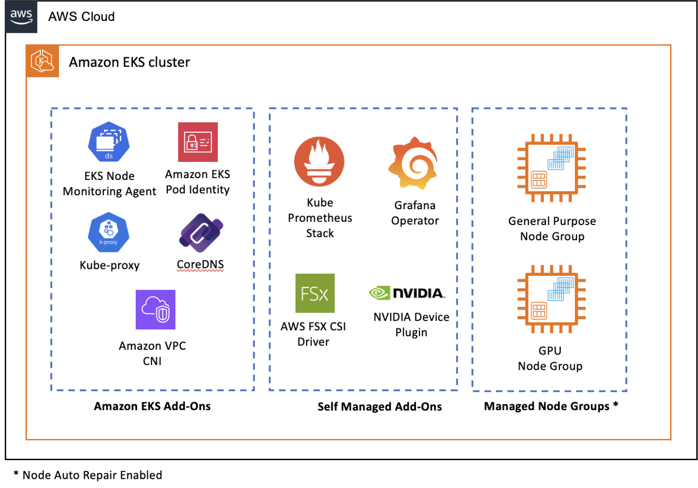

# vllm Quickstart
The quickstart is based on [official vllm guide]([https://](https://docs.vllm.ai/en/latest/getting_started/quickstart.html)) and modify with deploy [Qwen2.5-72B-Instruct](https://huggingface.co/Qwen/Qwen2.5-72B-Instruct) and Single-Node Multi-GPU (tensor parallel inference) on AWS g6e.12xlarge (4 L40s Nvida L40S Tensor Core GPUs, 192GiB GPU Memory, 3800GB nvme instance store SSD)

- [vllm Quickstart](#vllm-quickstart)
  - [Installation](#installation)
  - [Offline\_Batched\_Inference](#offline_batched_inference)
  - [OpenAI\_Compatible\_Server](#openai_compatible_server)
  - [Run\_Deepseek\_R1](#run_deepseek_r1)
  - [Open\_WebUI](#open_webui)
  - [Qwen QwQ-32B](#qwen-qwq-32b)
  - [Qwen3](#qwen3)
  - [Generative\_AI\_on\_EKS\_using\_NVIDIA\_GPU\_workshop](#generative_ai_on_eks_using_nvidia_gpu_workshop)
    - [Architecture](#architecture)
  - [OpenAI\_gpt\_oss\_20b\_gpt\_oss\_120b](#openai_gpt_oss_20b_gpt_oss_120b)
  - [Clean up](#clean-up)

## Installation
1. Launch a EC2 g6e.12xlarge instance with AMI `Deep Learning OSS Nvidia Driver AMI GPU PyTorch 2.6.0 (Ubuntu 22.04)`
2. install vllm
```bash
nvidia-smi
nvcc --version

+-----------------------------------------------------------------------------------------+
| NVIDIA-SMI 570.86.15              Driver Version: 570.86.15      CUDA Version: 12.8     |
|-----------------------------------------+------------------------+----------------------+
| GPU  Name                 Persistence-M | Bus-Id          Disp.A | Volatile Uncorr. ECC |
| Fan  Temp   Perf          Pwr:Usage/Cap |           Memory-Usage | GPU-Util  Compute M. |
|                                         |                        |               MIG M. |
|=========================================+========================+======================|
|   0  NVIDIA L40S                    On  |   00000000:38:00.0 Off |                    0 |
| N/A   26C    P8             22W /  350W |       1MiB /  46068MiB |      0%      Default |
|                                         |                        |                  N/A |
+-----------------------------------------+------------------------+----------------------+
|   1  NVIDIA L40S                    On  |   00000000:3A:00.0 Off |                    0 |
| N/A   26C    P8             22W /  350W |       1MiB /  46068MiB |      0%      Default |
|                                         |                        |                  N/A |
+-----------------------------------------+------------------------+----------------------+
|   2  NVIDIA L40S                    On  |   00000000:3C:00.0 Off |                    0 |
| N/A   27C    P8             22W /  350W |       1MiB /  46068MiB |      0%      Default |
|                                         |                        |                  N/A |
+-----------------------------------------+------------------------+----------------------+
|   3  NVIDIA L40S                    On  |   00000000:3E:00.0 Off |                    0 |
| N/A   26C    P8             19W /  350W |       1MiB /  46068MiB |      0%      Default |
|                                         |                        |                  N/A |
+-----------------------------------------+------------------------+----------------------+
                                                                                         
+-----------------------------------------------------------------------------------------+
| Processes:                                                                              |
|  GPU   GI   CI              PID   Type   Process name                        GPU Memory |
|        ID   ID                                                               Usage      |
|=========================================================================================|
|  No running processes found                                                             |
+-----------------------------------------------------------------------------------------+

# setup python environment
curl -LsSf https://astral.sh/uv/install.sh | sh
source $HOME/.local/bin/env

uv venv myenv --python 3.12 --seed
source myenv/bin/activate

# install vllm
uv pip install vllm

uv pip show vllm
uv pip show pynvml
uv pip show pytorch
uv pip show torch

# validation pythorch is right version and avaiable
python -c "import torch; print(torch.version.cuda)"
python -c 'import torch; print(torch.cuda.is_available())'
```

## Offline_Batched_Inference
1. quick test based on [offline_inference basic guide](https://github.com/vllm-project/vllm/blob/main/examples/offline_inference/basic/README.md)
    ```
    git clone https://github.com/vllm-project/vllm.git
    cd vllm
    python examples/offline_inference/basic/basic.py
    ```
2. Run [Single-Node Multi-GPU (tensor parallel inference)](https://docs.vllm.ai/en/stable/serving/distributed_serving.html) with `--tensor-parallel-size 4`
    ```python
    from vllm import LLM
    import torch._dynamo
    torch._dynamo.config.suppress_errors = True

    llm = LLM("mistralai/Mistral-7B-Instruct-v0.3", device="cuda", tensor_parallel_size=4)

    print(llm.generate("What is batch inference?"))
    ```
    Or using bash
    ```bash
    python -m vllm.entrypoints.openai.api_server \
    --model mistralai/Mixtral-8x7B-Instruct-v0.1 \
    --device cuda \
    --tensor-parallel-size 4
    ```

3. Trouble shooting
- `RuntimeError: Failed to infer device type`. The error "RuntimeError: Failed to infer device type" in vLLM on Ubuntu indicates that the system cannot determine whether to run vLLM on the CPU or GPU
  ```python
  # Specify the Device
  from vllm import LLM
  
  llm = LLM(model="Qwen/Qwen2-7B-Instruct", device="cuda") # For GPU
  # or
  # llm = LLM(model="Qwen/Qwen2-7B-Instruct", device="cpu")  # For CPU
  ```
  ```bash
  export VLLM_TARGET_DEVICE="cpu"  # For CPU
  # or
  export VLLM_TARGET_DEVICE="cuda" # For GPU
  python your_script.py
  ```

- `raise NotImplementedError` The error NotImplementedError indicates that a specific function or method, in this case, is_async_output_supported(), lacks a concrete implementation for the environment where vLLM is running. vLLM contains pre-compiled C++ and CUDA (12.1) binaries.
  - select the NVIDIA deep learning AMI such as `Deep Learning OSS Nvidia Driver AMI GPU PyTorch 2.6.0 (Ubuntu 22.04)`. Follow this blog [self-host-llm-with-ec2-vllm-langchain-fastapi-llm](https://medium.com/@chinmayd49/self-host-llm-with-ec2-vllm-langchain-fastapi-llm-cache-and-huggingface-model-7a2efa2dcdab)
  - Ensure CUDA is correctly installed. Check the CUDA version with `nvcc --version; nvidia-smi`
    - If no nvidia-smi return message or nvcc return not installed
        ```sudo apt install nvidia-utils-570-server
        sudo apt install nvidia-driver-570
        sudo apt install nvidia-cuda-toolkit
        pip install torch torchvision
        sudo reboot
        ```
  - Check the known issue [is_async_output_supported raise NotImplementedError](https://github.com/vllm-project/vllm/issues/13405) `pip install --upgrade pynvml`
  - Check if you have gpu support `python -c "import torch; print(torch.version.cuda)"`; `python -c 'import torch; print(torch.cuda.is_available())'`. torch.cuda.is_available() 返回 False. 这个错误表示 PyTorch 未检测到 CUDA。可能的原因有 CUDA 未正确安装、CUDA 版本不兼容等。可以尝试重新安装适合的 CUDA 和 PyTorch 版本。

- `Cannot access gated repo for url https://huggingface.co/mistralai/Mixtral-8x7B-Instruct-v0.1/resolve/main/config.json.`
Access to model mistralai/Mixtral-8x7B-Instruct-v0.1 is restricted. You must have access to it and be authenticated to access it. Please log in. check the [Cannot access gated repo You must be authenticated to access it.](https://huggingface.co/mistralai/Mistral-7B-Instruct-v0.2/discussions/93)
    ```python
    from huggingface_hub import login
    login(token="your_access_token")
    ```
    or 
    ```
    pip install --upgrade huggingface_hub
    huggingface-cli login
    YOUR_ACCESS_TOKEN
    ```

## OpenAI_Compatible_Server
1. start hosting
    ```bash
    vllm serve Qwen/Qwen2.5-1.5B-Instruct
    ```
2. testing with curl
    ```bash
    curl http://localhost:8000/v1/models

    curl http://localhost:8000/v1/completions \
        -H "Content-Type: application/json" \
        -d '{
            "model": "Qwen/Qwen2.5-1.5B-Instruct",
            "prompt": "San Francisco is a",
            "max_tokens": 7,
            "temperature": 0.7
        }'
    ```
3. testing with python
    ```python
    from openai import OpenAI
    # Set OpenAI's API key and API base to use vLLM's API server.
    openai_api_key = "EMPTY"
    openai_api_base = "http://localhost:8000/v1"

    client = OpenAI(
        api_key=openai_api_key,
        base_url=openai_api_base,
    )

    chat_response = client.chat.completions.create(
        model="Qwen/Qwen2.5-1.5B-Instruct",
        messages=[
            {"role": "system", "content": "You are a helpful assistant."},
            {"role": "user", "content": "Tell me a joke."},
        ]
    )
    print("Chat response:", chat_response)

    chat_response = client.chat.completions.create(
        model="Qwen/Qwen2.5-1.5B-Instruct",
        messages=[
            {"role": "user", "content": "Who won the world series in 2020?"}
        ]
    )
    print("Chat response:", chat_response)
    ```


## Run_Deepseek_R1
1. Single GPU hosting
    ```bash
    vllm serve deepseek-ai/DeepSeek-R1-Distill-Qwen-7B  --max-model-len 32768

    curl http://localhost:8000/v1/chat/completions \
        -H "Content-Type: application/json" \
        -d '{
            "model": "deepseek-ai/DeepSeek-R1-Distill-Qwen-7B",
            "messages": [{"role": "user", "content": "Please reason step by step, and put your final answer within \boxed{}. 用 4、1、9 组成的三位数造减法塔，最后一层的算式是什么?"} ],
            "temperature": 0.7
        }'

    ​
    curl http://localhost:8000/v1/chat/completions \
        -H "Content-Type: application/json" \
        -d '{
        "model": "deepseek-ai/DeepSeek-R1-Distill-Qwen-7B",
        "messages": [{"role": "user", "content": "Please reason step by step. 甲、乙、丙、丁四个人上大学的时候在一个宿舍住，毕业10年后他们又约好回母校相聚。老朋友相见分外热情。四个人聊起来，知道了这么一些情况：只有三个人有自己的车 ;只有两个人有自己喜欢的工作；只有一个人有了自己的别墅；每个人至少具备一样条件；甲和乙对自己的工作条件感觉一样；乙和丙的车是同一牌子的；丙和丁中只有一个人有车。如果有一个人三种条件都具备，那么，你知道他是谁吗 ?"} ],
        "temperature": 0.7 
        }'

    ```
2. multi GPU on Single Node
    ```bash
    VLLM_LOG_LEVEL=debug vllm serve deepseek-ai/DeepSeek-R1-Distill-Qwen-7B --tensor-parallel-size 4 --max-model-len 32768 --max_num_seqs 2048 --enforce-eager --gpu_memory_utilization=0.8 --enable-chunked-prefill

    curl http://localhost:8000/v1/chat/completions \
        -H "Content-Type: application/json" \
        -d '{
            "model": "deepseek-ai/DeepSeek-R1-Distill-Qwen-7B",
            "messages": [{"role": "user", "content": "Please reason step by step, and put your final answer within \boxed{}. AI是否取代人类？AI和人类如何共处？"} ],
            "temperature": 0.7
        }'
    ```

## Open_WebUI
Chatting with DeepSeek under Linux by Command Line is not very friendly. We can install Open WebUI as a web interface. 

1. Install Open WebUI on the same g6e.12xlarge.
```bash
# install Conda
mkdir -p ~/miniconda3
wget https://repo.anaconda.com/miniconda/Miniconda3-latest-Linux-x86_64.sh -O ~/miniconda3/miniconda.sh
bash ~/miniconda3/miniconda.sh -b -u -p ~/miniconda3
rm ~/miniconda3/miniconda.sh
~/miniconda3/bin/conda init bash

# Install Open WebUI
source ~/.bashrc
pip install open-webui
open-webui serve
```
2. Access http://localhost:8080 or http://IP:8080

## Qwen QwQ-32B
1. Host Qwen/QwQ-32B
```bash
source myenv/bin/activate
export CUDA_VISIBLE_DEVICES=0,1,2,3
python -c 'import torch; print(torch.cuda.current_device())'
vllm serve Qwen/QwQ-32B  --port 8000 --host 0.0.0.0 --tensor-parallel-size 4 --max-model-len 46448
```

2. Testing
```bash
    curl http://localhost:8000/v1/completions \
        -H "Content-Type: application/json" \
        -d '{
            "model": "Qwen/QwQ-32B",
            "temperature": 0.6,
            "top_k": 40,
            "top_p": 0.95,
            "prompt": "San Francisco is a"
        }'

    curl http://localhost:8000/v1/chat/completions \
        -H "Content-Type: application/json" \
        -d '{
            "model": "Qwen/QwQ-32B",
            "temperature": 0.6,
            "top_k": 40,
            "top_p": 0.95,
            "messages": [{"role": "user", "content": "我要玩24点游戏，我手里的牌是5、5、7、9，穷举所有的可能性"}],
            "stream": true
        }'

    curl http://localhost:8000/v1/chat/completions \
        -H "Content-Type: application/json" \
        -d '{
            "model": "Qwen/QwQ-32B",
            "temperature": 0.6,
            "top_k": 40,
            "top_p": 0.95,
            "messages": [{"role": "user", "content": "Please reason step by step, and put your final answer within \boxed{}. AI是否取代人类？AI和人类如何共处？"} ]
        }'
```

3. testing with python
```python
from openai import OpenAI
# Set OpenAI's API key and API base to use vLLM's API server.
openai_api_key = "EMPTY"
openai_api_base = "http://localhost:8000/v1"
client = OpenAI(
    api_key=openai_api_key,
    base_url=openai_api_base,
)

def process_response(chat_response, is_answering):
    reasoning_content = ""
    content = ""

    print("\n" + "=" * 20 + "reasoning content" + "=" * 20 + "\n")
    for chunk in chat_response:
    # If chunk.choices is empty, print usage
        if not chunk.choices:
            print("\nUsage:")
            print(chunk.usage)
        else:
            delta = chunk.choices[0].delta
        # Print reasoning content
            if hasattr(delta, 'reasoning_content') and delta.reasoning_content is not None:
                print(delta.reasoning_content, end='', flush=True)
                reasoning_content += delta.reasoning_content
            else:
                if delta.content != "" and is_answering is False:
                    print("\n" + "=" * 20 + "content" + "=" * 20 + "\n")
                    is_answering = True
            # Print content
                print(delta.content, end='', flush=True)
                content += delta.content

is_answering = False
chat_response = client.chat.completions.create(
    model="Qwen/QwQ-32B",
    temperature=0.6,
    top_p=0.95,
    stream=True,
    messages=[
        {"role": "user", "content": "Which is larger, 9.9 or 9.11?"}
    ]
)

process_response(chat_response, is_answering)

chat_response = client.chat.completions.create(
    model="Qwen/QwQ-32B",
    temperature=0.6,
    top_p=0.95,
    stream=True,
    messages=[
        {"role": "system", "content": "You are a helpful assistant."},
        {"role": "user", "content": "Create a Flappy Bird game in Python. You must include these things:\n 1. You must pygame.\n 2. The background color should be randomly chosen and is a light shade. Start with a light blue color.\nPressing SPACE multiple times will accelerate the bird.\n 4. The bird's shape should be randomly chosen as a squacircle or triangle. The color should be randomly chosen as a dark color.\n 5. Place on the bottom some land coloreddark brown or yellow chosen randomly.\n 6. Make a score shown on the top right side. Increment if you pass pipes and dohit them.\n 7. Make randomly spaced pipes with enough space. Color them randomly as dark green or light brown or a dgray shade.\n 8. When you lose, show the best score. Make the text inside the screen. Pressing q or Esc will quit game. Restarting is pressing SPACE again.\n The final game should be inside a markdown section in Python. Check your cfor errors and fix them before the final markdown section."}
    ]
)

process_response(chat_response, is_answering)

```   


4. Performance Testing with [evalscope](https://evalscope.readthedocs.io/en/latest/get_started/installation.html)
```bash
pip install gradio
pip install evalscope
pip install evalscope[perf] -U

CUDA_VISIBLE_DEVICES=0,1,2,3 evalscope perf \
 --parallel 1 \
 --model Qwen/QwQ-32B \
 --log-every-n-query 1 \
 --connect-timeout 60000 \
 --read-timeout 60000\
 --max-tokens 2048 \
 --min-tokens 2048 \
 --api local_vllm \
 --dataset speed_benchmark
```


## Qwen3
1. Host Qwen3
```bash
source myenv/bin/activate
export CUDA_VISIBLE_DEVICES=0,1,2,3
python -c 'import torch; print(torch.cuda.current_device())'
pip install --upgrade transformers
pip install --upgrade setuptools
pip install --upgrade vllm
vllm serve Qwen/Qwen3-30B-A3B --enable-reasoning --reasoning-parser deepseek_r1 --port 8000 --host 0.0.0.0 --tensor-parallel-size 4 --max-model-len 32768
```

2. Testing
```bash
    curl http://localhost:8000/v1/completions \
        -H "Content-Type: application/json" \
        -d '{
            "model": "Qwen/Qwen3-30B-A3B",
            "temperature": 0.6,
            "top_k": 40,
            "top_p": 0.95,
            "prompt": "San Francisco is a"
        }'

    curl http://localhost:8000/v1/chat/completions \
        -H "Content-Type: application/json" \
        -d '{
            "model": "Qwen/Qwen3-30B-A3B",
            "temperature": 0.6,
            "top_k": 40,
            "top_p": 0.95,
            "messages": [{"role": "user", "content": "我要玩24点游戏，我手里的牌是5、5、7、9，穷举所有的可能性"}],
            "stream": true
        }'

    curl http://localhost:8000/v1/chat/completions \
        -H "Content-Type: application/json" \
        -d '{
            "model": "Qwen/Qwen3-30B-A3B",
            "temperature": 0.6,
            "top_k": 40,
            "top_p": 0.95,
            "messages": [{"role": "user", "content": "Please reason step by step, and put your final answer within \boxed{}. AI是否取代人类？AI和人类如何共处？"} ]
        }'
```

## Generative_AI_on_EKS_using_NVIDIA_GPU_workshop
[Workshop link](https://catalog.workshops.aws/genai-on-eks/en-US)

### Architecture


1. vLLM  is one of several popular, open-source LLM models inference and serving engines. vLLM can provide up to 24x higher throughput compared to standard PyTorch implementations and it can support continuous batching for optimal GPU utilization and reduce GPU memory usage by up to 60% with dynamic memory allocation for KV cache. It provides OpenAI-compatible API server for easy integration, distributed inference with tensor parallelism and built-in streaming responses and request scheduling

2. While Ray can be deployed directly on Kubernetes and KubeRay Operator provides significant advantages for production environments: (1) Zero-downtime upgrades for model updates (2) High availability through external Redis for Global Control Service (3) Automated cluster lifecycle management (4) Native Kubernetes integration with custom resources (5) Simplified scaling and monitoring

3. Observability Stack with Prometheus, Grafana, NVIDIA DCGM Monitoring Dashboard and Ray Monitoring. It also provides the vLLM Model Monitoring with vLLM-specific metrics collection, track token generation and latency metrics, monitor inference queue and processing times, monitor worker node health, analyze task scheduling efficiency


## OpenAI_gpt_oss_20b_gpt_oss_120b
1. Host [gpt-oss-20b](https://huggingface.co/openai/gpt-oss-20b) and [gpt-oss-120b](https://huggingface.co/openai/gpt-oss-120b) on G5.2xlarge (1 NVIDIA A10G Tensor Core GPU, 32 GPU Memeory) instance with OS AMI 'Deep Learning OSS Nvidia Driver AMI GPU PyTorch 2.7 (Ubuntu 22.04)'

```bash
nvidia-smi

+-----------------------------------------------------------------------------------------+
| NVIDIA-SMI 570.172.08             Driver Version: 570.172.08     CUDA Version: 12.8     |
|-----------------------------------------+------------------------+----------------------+
| GPU  Name                 Persistence-M | Bus-Id          Disp.A | Volatile Uncorr. ECC |
| Fan  Temp   Perf          Pwr:Usage/Cap |           Memory-Usage | GPU-Util  Compute M. |
|                                         |                        |               MIG M. |
|=========================================+========================+======================|
|   0  NVIDIA A10G                    On  |   00000000:00:1E.0 Off |                    0 |
|  0%   30C    P8              9W /  300W |       0MiB /  23028MiB |      0%      Default |
|                                         |                        |                  N/A |
+-----------------------------------------+------------------------+----------------------+
                                                                                         
+-----------------------------------------------------------------------------------------+
| Processes:                                                                              |
|  GPU   GI   CI              PID   Type   Process name                        GPU Memory |
|        ID   ID                                                               Usage      |
|=========================================================================================|
|  No running processes found                                                             |
+-----------------------------------------------------------------------------------------+

nvcc --version

nvcc: NVIDIA (R) Cuda compiler driver
Copyright (c) 2005-2025 NVIDIA Corporation
Built on Fri_Feb_21_20:23:50_PST_2025
Cuda compilation tools, release 12.8, V12.8.93
Build cuda_12.8.r12.8/compiler.35583870_0

# setup python environment

Ppython3 --versionython 3.10.12
# Because gpt-oss==0.1.0 requires Python >=3.12, <3.13 and vllm==0.10.1+gptoss depends on gpt-oss==0.1.0
# need install Python 3.12
sudo add-apt-repository ppa:deadsnakes/ppa
sudo apt update
sudo apt install python3.12 -y

sudo update-alternatives --install /usr/bin/python3 python3 /usr/bin/python3.10 1
sudo update-alternatives --install /usr/bin/python3 python3 /usr/bin/python3.12 2
sudo update-alternatives --config python3
python3 --version

# setup the virtual environment
sudo apt install python3-venv -y --only-upgrade

curl -LsSf https://astral.sh/uv/install.sh | sh
source $HOME/.local/bin/env

python3.12 -m venv myenv
source myenv/bin/activate
python --version

uv pip install -U transformers kernels torch setuptools
python -c 'import torch; print(torch.cuda.current_device())'

uv pip install --pre vllm==0.10.1+gptoss \
    --extra-index-url https://wheels.vllm.ai/gpt-oss/ \
    --extra-index-url https://download.pytorch.org/whl/nightly/cu128 \
    --index-strategy unsafe-best-match

vllm serve openai/gpt-oss-20b

Report error assert self.vllm_flash_attn_version == 3, (
(EngineCore_0 pid=4124) ERROR 08-06 01:53:31 [core.py:718]            ^^^^^^^^^^^^^^^^^^^^^^^^^^^^^^^^^
(EngineCore_0 pid=4124) ERROR 08-06 01:53:31 [core.py:718] AssertionError: Sinks are only supported in FlashAttention 3
google了一下，类似这个问题，从官方文档看，offical支持上面GPU 跑vLLM
https://github.com/vllm-project/vllm/issues/22279
https://docs.vllm.ai/projects/recipes/en/latest/OpenAI/GPT-OSS.html 

In vLLM, you can run it on NVIDIA H100, H200, B200 as well as MI300x, MI325x, MI355x and Radeon AI PRO R9700.
```

2. Host [gpt-oss-20b](https://huggingface.co/openai/gpt-oss-20b) and [gpt-oss-120b](https://huggingface.co/openai/gpt-oss-120b) on G6e.12xlarge (4 NVIDIA L40S Tensor Core GPU, 192 GPU Memeory) instance with OS AMI 'Deep Learning OSS Nvidia Driver AMI GPU PyTorch 2.7 (Ubuntu 22.04)'

```bash
uv pip install --pre vllm==0.10.1+gptoss \
    --extra-index-url https://wheels.vllm.ai/gpt-oss/ \
    --extra-index-url https://download.pytorch.org/whl/nightly/cu128 \
    --index-strategy unsafe-best-match

vllm serve openai/gpt-oss-20b --tensor-parallel-size 4 --async-scheduling --port 8000 --host 0.0.0.0

# Same error as G5
(VllmWorker TP2 pid=4268) ERROR 08-06 02:11:23 [multiproc_executor.py:559]     assert self.vllm_flash_attn_version == 3, (
(VllmWorker TP2 pid=4268) ERROR 08-06 02:11:23 [multiproc_executor.py:559]            ^^^^^^^^^^^^^^^^^^^^^^^^^^^^^^^^^
(VllmWorker TP2 pid=4268) ERROR 08-06 02:11:23 [multiproc_executor.py:559] AssertionError: Sinks are only supported in FlashAttention 3
```

3. Host [gpt-oss-20b](https://huggingface.co/openai/gpt-oss-20b) and [gpt-oss-120b](https://huggingface.co/openai/gpt-oss-120b) on p5.48xlarge (8 NVIDIA H100 Tensor Core GPU, 640 GPU Memeory) instance with OS AMI 'Deep Learning OSS Nvidia Driver AMI GPU PyTorch 2.7 (Ubuntu 22.04)'

```bash
nvidia-smi
Wed Aug  6 02:43:14 2025       
+-----------------------------------------------------------------------------------------+
| NVIDIA-SMI 570.172.08             Driver Version: 570.172.08     CUDA Version: 12.8     |
|-----------------------------------------+------------------------+----------------------+
| GPU  Name                 Persistence-M | Bus-Id          Disp.A | Volatile Uncorr. ECC |
| Fan  Temp   Perf          Pwr:Usage/Cap |           Memory-Usage | GPU-Util  Compute M. |
|                                         |                        |               MIG M. |
|=========================================+========================+======================|
|   0  NVIDIA H100 80GB HBM3          On  |   00000000:53:00.0 Off |                    0 |
| N/A   31C    P0             68W /  700W |       0MiB /  81559MiB |      0%      Default |
|                                         |                        |             Disabled |
+-----------------------------------------+------------------------+----------------------+
|   1  NVIDIA H100 80GB HBM3          On  |   00000000:64:00.0 Off |                    0 |
| N/A   32C    P0             68W /  700W |       0MiB /  81559MiB |      0%      Default |
|                                         |                        |             Disabled |
+-----------------------------------------+------------------------+----------------------+
|   2  NVIDIA H100 80GB HBM3          On  |   00000000:75:00.0 Off |                    0 |
| N/A   30C    P0             66W /  700W |       0MiB /  81559MiB |      0%      Default |
|                                         |                        |             Disabled |
+-----------------------------------------+------------------------+----------------------+
|   3  NVIDIA H100 80GB HBM3          On  |   00000000:86:00.0 Off |                    0 |
| N/A   33C    P0             70W /  700W |       0MiB /  81559MiB |      0%      Default |
|                                         |                        |             Disabled |
+-----------------------------------------+------------------------+----------------------+
|   4  NVIDIA H100 80GB HBM3          On  |   00000000:97:00.0 Off |                    0 |
| N/A   35C    P0            119W /  700W |       0MiB /  81559MiB |      0%      Default |
|                                         |                        |             Disabled |
+-----------------------------------------+------------------------+----------------------+
|   5  NVIDIA H100 80GB HBM3          On  |   00000000:A8:00.0 Off |                    0 |
| N/A   33C    P0            119W /  700W |       0MiB /  81559MiB |      0%      Default |
|                                         |                        |             Disabled |
+-----------------------------------------+------------------------+----------------------+
|   6  NVIDIA H100 80GB HBM3          On  |   00000000:B9:00.0 Off |                    0 |
| N/A   34C    P0            123W /  700W |       0MiB /  81559MiB |      0%      Default |
|                                         |                        |             Disabled |
+-----------------------------------------+------------------------+----------------------+
|   7  NVIDIA H100 80GB HBM3          On  |   00000000:CA:00.0 Off |                    0 |
| N/A   31C    P0            115W /  700W |       0MiB /  81559MiB |      0%      Default |
|                                         |                        |             Disabled |
+-----------------------------------------+------------------------+----------------------+
                                                                                         
+-----------------------------------------------------------------------------------------+
| Processes:                                                                              |
|  GPU   GI   CI              PID   Type   Process name                        GPU Memory |
|        ID   ID                                                               Usage      |
|=========================================================================================|
|  No running processes found                                                             |
+-----------------------------------------------------------------------------------------+

nvcc --version
nvcc: NVIDIA (R) Cuda compiler driver
Copyright (c) 2005-2025 NVIDIA Corporation
Built on Fri_Feb_21_20:23:50_PST_2025
Cuda compilation tools, release 12.8, V12.8.93
Build cuda_12.8.r12.8/compiler.35583870_0

python3 --version
Python 3.10.12
# Because gpt-oss==0.1.0 requires Python >=3.12, <3.13 and vllm==0.10.1+gptoss depends on gpt-oss==0.1.0
# need install Python 3.12
sudo add-apt-repository ppa:deadsnakes/ppa
sudo apt update
sudo apt install python3.12 -y

sudo update-alternatives --install /usr/bin/python3 python3 /usr/bin/python3.10 1
sudo update-alternatives --install /usr/bin/python3 python3 /usr/bin/python3.12 2
sudo update-alternatives --config python3
python3 --version

# setup the virtual environment
sudo apt install python3-venv -y --only-upgrade

curl -LsSf https://astral.sh/uv/install.sh | sh
source $HOME/.local/bin/env

python3.12 -m venv myenv
source myenv/bin/activate
python --version

uv pip install --pre vllm==0.10.1+gptoss \
    --extra-index-url https://wheels.vllm.ai/gpt-oss/ \
    --extra-index-url https://download.pytorch.org/whl/nightly/cu128 \
    --index-strategy unsafe-best-match

# H100 & H200¶
# openai/gpt-oss-20b should run in single GPU
vllm serve openai/gpt-oss-20b --async-scheduling --port 8000 --host 0.0.0.0

# gpt-oss-120b will fit in a single H100/H200, but scaling it to higher TP sizes can help with throughput
vllm serve openai/gpt-oss-120b --tensor-parallel-size 8 --async-scheduling --port 8000 --host 0.0.0.0
```

4. Testing
```bash
    curl http://localhost:8000/v1/completions \
        -H "Content-Type: application/json" \
        -d '{
            "model": "openai/gpt-oss-20b",
            "temperature": 0.7,
            "top_p": 0.95,
            "prompt": "San Francisco is a"
        }'

    curl http://localhost:8000/v1/chat/completions \
        -H "Content-Type: application/json" \
        -d '{
            "model": "openai/gpt-oss-120b",
            "temperature": 0.7,
            "top_p": 0.95,
            "messages": [{"role": "user", "content": "我要玩24点游戏，我手里的牌是5、5、7、9，穷举所有的可能性。总结你的答案，一次性输出"}],
            "stream": true
        }'

    curl http://localhost:8000/v1/chat/completions \
        -H "Content-Type: application/json" \
        -d '{
            "model": "openai/gpt-oss-120b",
            "temperature": 0.7,
            "top_p": 0.95,
            "messages": [{"role": "user", "content": "Please reason step by step, and put your final answer within \boxed{}. AI是否取代人类？AI和人类如何共处？"} ]
        }'
```

## Clean up
```bash
rm -rf ~/.cache/huggingface/hub/models--<org>--<model_name>
```