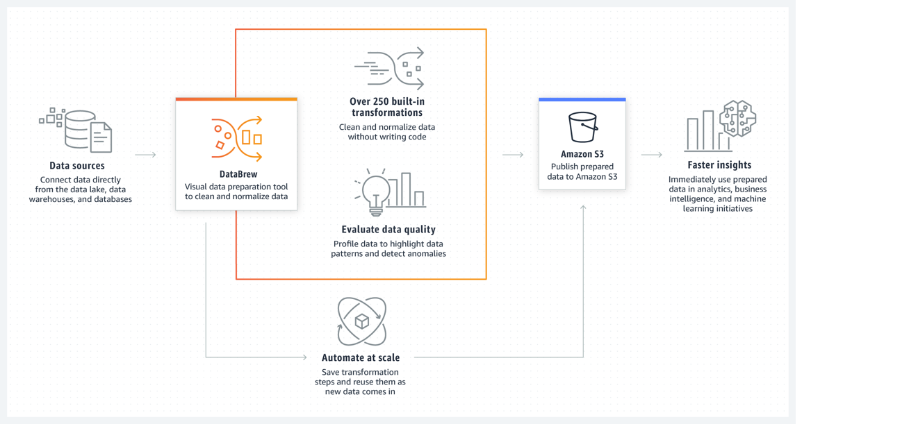

# AWS Glue DataBrew QuickStart
AWS Glue DataBrew is a visual data preparation tool that enables users to clean and normalize data without writing any code. 
Using DataBrew, business analysts, data scientists, and data engineers can more easily collaborate to get insights from raw data. DataBrew is serverless, you can explore and transform terabytes of raw data without needing to create clusters or manage any infrastructure. 

## Setting up IAM policies for DataBrew
Follow up the guide to [setting up IAM policies for DataBrew](https://docs.aws.amazon.com/databrew/latest/dg/setting-up-iam-policies-for-databrew.html)

1. Setting up permissions for a user to reach DataBrew on the console

2. Setting up an IAM role that AWS Glue DataBrew can used to connect to data. 

## ETL the sample data `Famous chess game moves`
1. [Create a project](https://docs.aws.amazon.com/databrew/latest/dg/getting-started.html) `chess-project`

2. Build a DataBrew recipe — a set of transformations to summarize the data

3. Create a data profile - data statistics information

## Using DataBrew as an extension in JupyterLab
https://docs.aws.amazon.com/databrew/latest/dg/jupyter.html