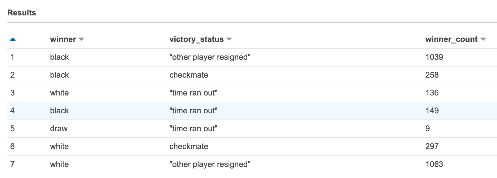
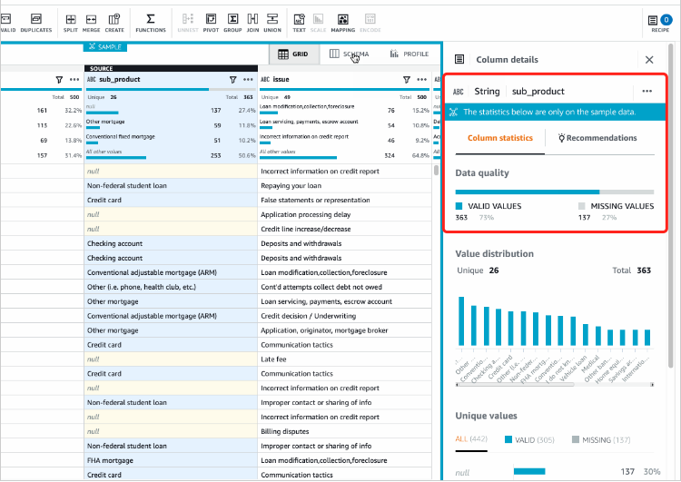
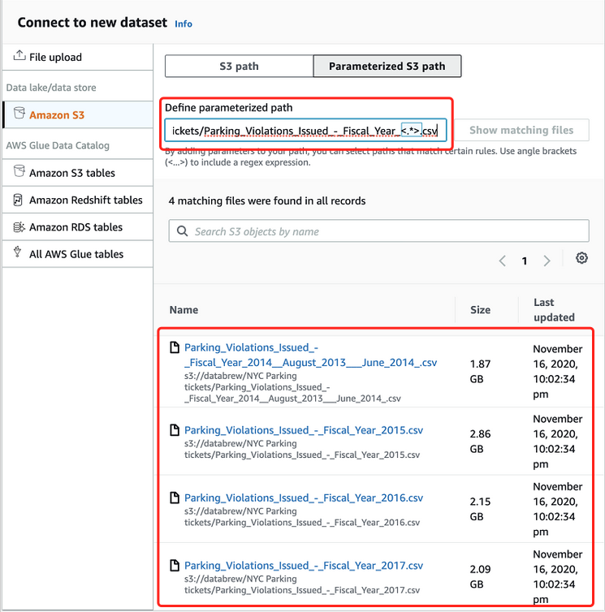

# AWS Glue DataBrew QuickStart
AWS Glue DataBrew is a visual data preparation tool that enables users to clean and normalize data without writing any code. 
Using DataBrew, business analysts, data scientists, and data engineers can more easily collaborate to get insights from raw data. DataBrew is serverless, you can explore and transform terabytes of raw data without needing to create clusters or manage any infrastructure. 


## Setting up IAM policies for DataBrew
Follow up the guide to [setting up IAM policies for DataBrew](https://docs.aws.amazon.com/databrew/latest/dg/setting-up-iam-policies-for-databrew.html)

1. Setting up permissions for a user to reach DataBrew on the console

2. Setting up an IAM role that AWS Glue DataBrew can used to connect to data. 

## ETL the sample data `Famous chess game moves`
1. [Create a project](https://docs.aws.amazon.com/databrew/latest/dg/getting-started.01.html) `chess-project`

2. [Build a DataBrew recipe](https://docs.aws.amazon.com/databrew/latest/dg/getting-started.02.html) — a set of transformations actions to the data
 - Filter players were Class A which their ratings were >= 1800
 - Change the victory_status value to more meaningful string and remove the games that were played to a draw

3. Create a [data profile](https://docs.aws.amazon.com/databrew/latest/dg/getting-started.05.html) - data statistics information

4. Transform the dataset - [Create the recipe job](https://docs.aws.amazon.com/databrew/latest/dg/getting-started.06.html) to run the ETL based on the versioned recipe

5. Review the ETL result in Athena
    ```sql
    CREATE EXTERNAL TABLE `chess_winner_summary`(
    `winner` string, 
    `victory_status` string, 
    `winner_count` bigint)
    ROW FORMAT DELIMITED 
    FIELDS TERMINATED BY ',' 
    STORED AS INPUTFORMAT 
    'org.apache.hadoop.mapred.TextInputFormat' 
    OUTPUTFORMAT 
    'org.apache.hadoop.hive.ql.io.HiveIgnoreKeyTextOutputFormat'
    LOCATION
    's3://ray-data-engineering-lab/glue_databrew/chess-games/chess-winner-summary_08Jun2021_1623128515651/'
    TBLPROPERTIES (
    'classification'='csv', 
    'columnsOrdered'='true', 
    'compressionType'='none', 
    'delimiter'=',', 
    'skip.header.line.count'='1', 
    'typeOfData'='file')
    ```

    ```sql
    SELECT * FROM "databrew_demo"."chess_winner_summary" limit 50;
    ```

    

6. [Recipe action reference](https://docs.aws.amazon.com/databrew/latest/dg/recipe-actions-reference.html) - recipe actions that you can use programmatically to transform the dataset

## Using DataBrew as an extension in JupyterLab
https://docs.aws.amazon.com/databrew/latest/dg/jupyter.html

## Common data preparation transformations use cases
1. Handling/Imputing missing values



For any data column you can choose to either remove the missing rows or fill it with valid value or an empty string, NONE, etc. For numerical data columns you can also fill missing values with numerical aggregates of values like average, mode, sum or median of values.

2. Combining datasets

- Consolidate all parts of the splited or partitioned files into single dataset via parameterized input path



- Union and Join to combine data from multiple datasets. 