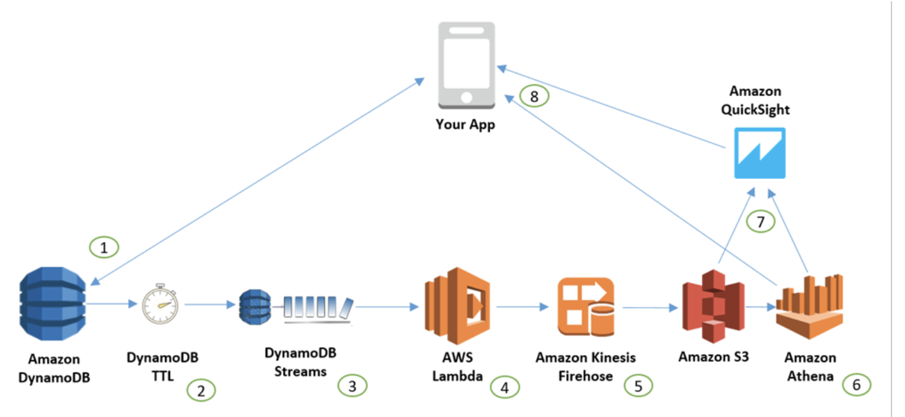

# How-to-do-Virtulization-DynamoDB

Simlar, if you configure the desitnation of Firehose is S3, you can use the S3 + Athena + superset to do analysis

[Kinesis Firehose + S3 + Athena](https://aws.amazon.com/blogs/database/how-to-perform-advanced-analytics-and-build-visualizations-of-your-amazon-dynamodb-data-by-using-amazon-athena/)

Simlar, if you configure the desitnation of Firehose is redshift, you can use the redshift + superset to do analysis

[Kinesis Firehose + Redshift](https://rockset.com/blog/tableau-operational-dashboards-reporting-dynamodb-redshift-athena/)

If you consider the Comerical version

[Comerical version - Rockset](https://rockset.com/)

[Comerical version - panoply.io](https://panoply.io/integrations/amazon-dynamodb/apache-superset/)
