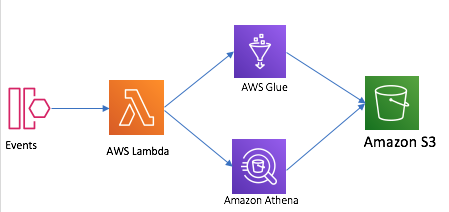
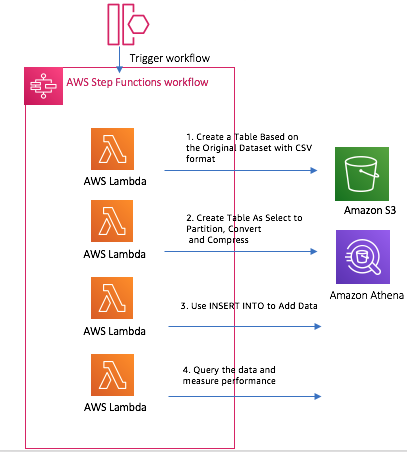
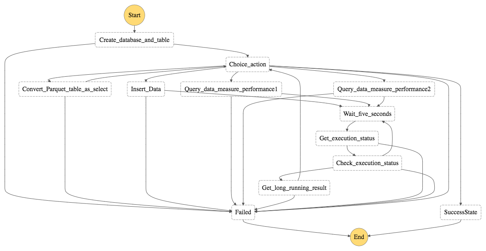
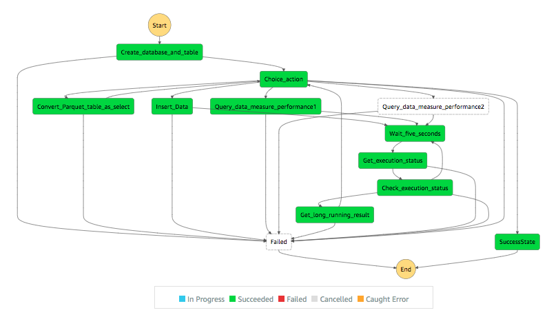
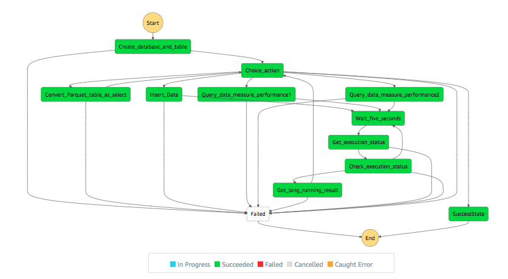
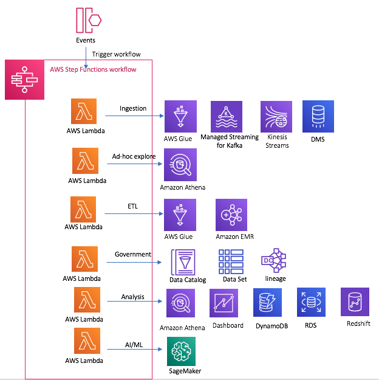
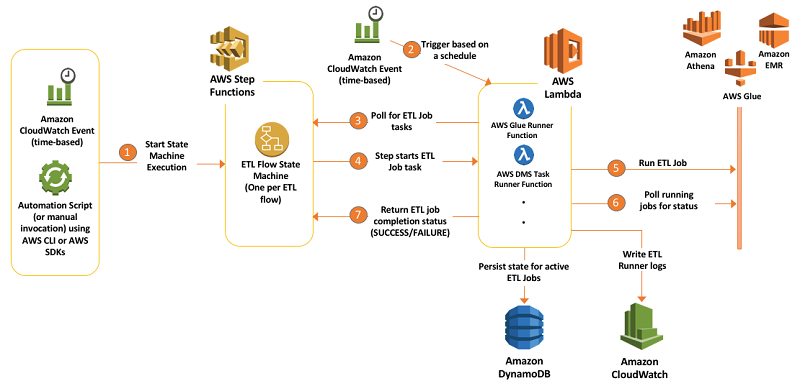
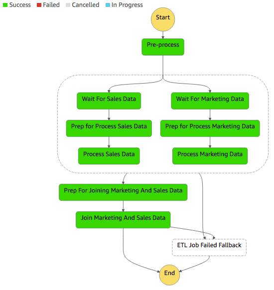

# Automate the Athena query

Every 2 hour, I need execute the 
1. Create external Table for json files stored in S3 bucket
2. Run the query to get the result

- Use single lambda file



- Step function orchestration



## Use single lambda file

### Build the lambda function

1. Build the lambda function deployment package
```bash
mkdir package && cd package
pip install retrying -t ./
pip install boto3 -t ./
chmod -R 755 .
zip -r9 ../function.zip .

cd .. && zip -g function.zip basic-athena-query-lambda.py athena_query_helper.py
```

2. Create lambda function
```bash
aws lambda create-function --function-name  BasicAthenaQuery --runtime python3.7 \
--zip-file fileb://function.zip --handler basic-athena-query-lambda.lambda_handler \
--role arn:aws-cn:iam::$account_id:role/lambda_basic_execution \
--timeout 300 --memory-size 256

aws lambda invoke --function-name BasicAthenaQuery \
--payload '{ "database": "sampledb", "table": "user_email", "s3_location": "s3://ray-datalake-lab/sample/user_email" }' \
out --log-type Tail --query 'LogResult' --output text |  base64 -d

cat out 
#[{"name": "user1", "email": "user1@example.com"}, {"name": "user2", "email": "user2@example.com"}, {"name": "user3", "email": "user3@example.com"}, {"name": "user4", "email": "user4@example.com"}, {"name": "user5", "email": "user5@example.com"}, {"name": "user6", "email": "user6@example.com"}]

zip -g function.zip basic-athena-query-lambda.py
aws lambda update-function-code --function-name BasicAthenaQuery \
--zip-file fileb://function.zip
```

3. Check the Lambda execution result and verify the Athena query executed successfully

4. cleanup
```bash
# lambda
aws lambda delete-function --function-name BasicAthenaQuery
drop table user_email
drop database sampledb
```

### Lambda code ananlysis

  Below is main logic to run query against Athena by SDK. 

```python
import boto3

query = "Your query"
database = "database_name"
athena_result_bucket = "s3://my-bucket/"

response = athena_client.start_query_execution(
    QueryString=query,
    QueryExecutionContext={
        'Database': database
    },
    ResultConfiguration={
        'OutputLocation': athena_result_bucket,
    }
)

query_execution_id = response["QueryExecutionId"]
result = poll_status(query_execution_id)
if result['QueryExecution']['Status']['State'] == 'SUCCEEDED':
    # get query results
    result = athena_client.get_query_results(
            QueryExecutionId=query_execution_id)
```

But if the query take long time, I use the python retry annotation to polling the execution status. 

Seems OK, but it is not Loose couple appoarch, if my query take longer time, I have to modify my code. 

```python
@retry(stop_max_attempt_number=10,
       wait_exponential_multiplier=300,
       wait_exponential_max=1 * 60 * 1000)
def poll_status(_id):
    result = athena_client.get_query_execution(QueryExecutionId=_id)
    state = result['QueryExecution']['Status']['State']
    logger.info("STATUS:" + state)

    if state == 'SUCCEEDED':
        logger.info(result)
        return result
    elif state == 'FAILED':
        logger.error(result)
        return result
    else:
        logger.info(result)
        raise Exception
```

**I need a way to resolve below 2 requirements:**

- Need a Lambda trigger, when the query terminates
- Need a integration like SNS or SQS for queries that finish and make the other Athena process moving forward.

Seems Step function can orchestrate workflow, let's try it.


# Step function orchestration

## Overview

Let's make the scenaio more complex:

1. Create Orignal Table from CSV files stored in S3 bucket as raw data
2. Query the Orignal Table to get business payload
3. Create Target table as JSON format based on business payload query result
4. Insert additional data to Target table to enrich the table content
5. Query the Target table to generate the report

Let make the workflow automated

1. Prepare Lambda functions
2. Build the Step function orchestration workflow
3. Testing

## Prepare Lambda functions
- Create the lambda function: athena_createdb_createtable
```bash
zip -g function.zip athena_createdb_createtable.py athena_query_helper.py

aws lambda create-function --function-name  athena_createdb_createtable --runtime python3.7 \
--zip-file fileb://function.zip --handler athena_createdb_createtable.lambda_handler \
--role arn:aws-cn:iam::$account_id:role/lambda_basic_execution \
--timeout 300 --memory-size 256
```

- Create the lambda functions: athena_automate_handler
```bash
zip -g function.zip athena_automate_handler.py athena_query_helper.py

aws lambda create-function --function-name  athena_short_running_query --runtime python3.7 \
--zip-file fileb://function.zip --handler athena_automate_handler.athena_short_running_query \
--role arn:aws-cn:iam::$account_id:role/lambda_basic_execution \
--timeout 300 --memory-size 256

aws lambda create-function --function-name  athena_start_long_running_query --runtime python3.7 \
--zip-file fileb://function.zip --handler athena_automate_handler.athena_start_long_running_query \
--role arn:aws-cn:iam::$account_id:role/lambda_basic_execution \
--timeout 300 --memory-size 256

aws lambda create-function --function-name  athena_get_long_running_status --runtime python3.7 \
--zip-file fileb://function.zip --handler athena_automate_handler.athena_get_long_running_status \
--role arn:aws-cn:iam::$account_id:role/lambda_basic_execution \
--timeout 300 --memory-size 256

aws lambda create-function --function-name  athena_get_long_running_result --runtime python3.7 \
--zip-file fileb://function.zip --handler athena_automate_handler.athena_get_long_running_result \
--role arn:aws-cn:iam::$account_id:role/lambda_basic_execution \
--timeout 300 --memory-size 256
```

## Build the Step function orchestration workflow



The definition of Step function can be found in [scripts/stepfunction.json](scripts/stepfunction.json), replace the lambda arn with your environment value

1. Step 1: Create a Table Based on the Original Dataset with CSV format

- Define the state machine trigger event

```json
{
  "InputData": {
    "Athena_Database": "blogdb",
    "Athena_Table": "original_csv",
    "Output_Data_Bucket": "ray-datalake-lab",
    "Output_Prefix": "results/blogdb",
    "Athena_DDL_Bucket": "ray-datalake-lab"
  }
}
```

- Define the step function parameter
```json
            "ResultPath": "$.taskresult",
            "Parameters":{
                "TaskName": "Create_database_and_table",
                "Athena_DDL_File": "scripts/blogdb/create_blogdb_original_csv.ddl",
                "Athena_Database.$":"$.InputData.Athena_Database",
                "Athena_Table.$": "$.InputData.Athena_Table",
                "Output_Data_Bucket.$": "$.InputData.Output_Data_Bucket",
                "Output_Prefix.$": "$.InputData.Output_Prefix",
                "Athena_DDL_Bucket.$": "$.InputData.Athena_DDL_Bucket"
            }
```

2. Step 2: Use CTAS (Create Table As Select) to create a table with partitions for the years 2015 to 2019. 

- Define the step function parameter
```json
            "ResultPath": "$.taskresult",
            "Parameters": {
                "TaskName": "Convert_Parquet_table_as_select",
                "Athena_DDL_File": "scripts/blogdb/create_blogdb_new_parquet.ddl",
                "Athena_Database.$": "$.InputData.Athena_Database",
                "Athena_Table": "new_parquet",
                "Output_Data_Bucket.$": "$.InputData.Output_Data_Bucket",
                "Output_Prefix.$": "$.InputData.Output_Prefix",
                "Athena_DDL_Bucket.$": "$.InputData.Athena_DDL_Bucket"
            }
```

- Step function task will create new table `new_parquet`

Partition the data by year, Convert the data to Parquet, and Compress the Data with Snappy

- Check the partitions and parquet files created by the CTAS statement
```bash
aws s3 ls s3://ray-datalake-lab/sample/athena-ctas-insert-into-optimized/ --region cn-northwest-1
    # PRE year=2015/
    # PRE year=2016/
    # PRE year=2017/
    # PRE year=2018/
    # PRE year=2019/

aws s3 ls s3://ray-datalake-lab/sample/athena-ctas-insert-into-optimized/ --recursive --human-readable --region cn-northwest-1 | head -5
# 2020-06-04 23:43:28    0 Bytes sample/athena-ctas-insert-into-optimized/
# 2020-06-08 22:37:59   12.9 MiB sample/athena-ctas-insert-into-optimized/year=2015/20200608_143644_00003_8kimg_0b2b66b0-7655-4169-bf0c-02a9b5fc1ec6
# 2020-06-08 22:37:59   15.0 MiB sample/athena-ctas-insert-into-optimized/year=2015/20200608_143644_00003_8kimg_267acb54-6ce8-4834-836a-ec7f0992517e
# 2020-06-08 22:37:59   13.5 MiB sample/athena-ctas-insert-into-optimized/year=2015/20200608_143644_00003_8kimg_3c0de4c9-0806-435e-bdb9-0bb0f9346508
# 2020-06-08 22:37:59   12.5 MiB sample/athena-ctas-insert-into-optimized/year=2015/20200608_143644_00003_8kimg_64337ca9-63b6-4af9-8dcd-bcae8f57bbbf

```

3. Step 3: Use INSERT INTO to Add Data from years 2010 to 2014.

- Define the step function parameter

```json
            "ResultPath": "$.taskresult",
            "Parameters": {
                "TaskName": "Insert_Data",
                "Athena_DDL_File": "scripts/blogdb/insert_blogdb_new_parquet.ddl",
                "Athena_Database.$": "$.InputData.Athena_Database",
                "Athena_Table": "new_parquet",
                "Output_Data_Bucket.$": "$.InputData.Output_Data_Bucket",
                "Output_Prefix.$": "$.InputData.Output_Prefix",
                "Athena_DDL_Bucket.$": "$.InputData.Athena_DDL_Bucket"
            }
```

- Step function task will INSERT INTO to Add Data from years 2010 to 2014 to `new_parquet`.

- Check the partitions and parquet files created by the CTAS statement
```bash
aws s3 ls s3://ray-datalake-lab/sample/athena-ctas-insert-into-optimized/ --region cn-northwest-1
    # PRE year=2010/
    # PRE year=2011/
    # PRE year=2012/
    # PRE year=2013/
    # PRE year=2014/
    # PRE year=2015/
    # PRE year=2016/
    # PRE year=2017/
    # PRE year=2018/
    # PRE year=2019/

aws s3 ls s3://ray-datalake-lab/sample/athena-ctas-insert-into-optimized/ --recursive --human-readable --summarize --region cn-northwest-1
# 2020-06-04 23:43:28    0 Bytes sample/athena-ctas-insert-into-optimized/
# 2020-06-08 22:42:21   14.6 MiB sample/athena-ctas-insert-into-optimized/year=2010/20200608_144118_00022_8kimg_0ee1ad3a-bafc-4d95-8542-c4da39eef1d3
# 2020-06-08 22:42:21   15.6 MiB sample/athena-ctas-insert-into-optimized/year=2010/20200608_144118_00022_8kimg_4caac24e-54fa-4f5b-92f4-0e3b6f39f7d9
# 2020-06-08 22:42:21   14.5 MiB sample/athena-ctas-insert-into-optimized/year=2010/20200608_144118_00022_8kimg_52f51cbc-086f-4a56-81e6-28d481f4ad71
# .....
# 2020-06-08 22:38:01    9.3 MiB sample/athena-ctas-insert-into-optimized/year=2019/20200608_143644_00003_8kimg_efcb12dc-6371-4ae3-adcd-2af9106ee811

# Total Objects: 91
#    Total Size: 1.2 GiB
```

4. Step 4: Query the data and measure performance

- Define the step function parameter

```json
            "ResultPath": "$.taskresult",
            "Parameters": {
                "TaskName": "Query_data_measure_performance1",
                "Athena_DDL_File": "scripts/blogdb/query_orders_group_by_year.ddl",
                "Athena_Database.$": "$.InputData.Athena_Database",
                "Athena_Table": "new_parquet",
                "Output_Data_Bucket.$": "$.InputData.Output_Data_Bucket",
                "Output_Prefix.$": "$.InputData.Output_Prefix",
                "Athena_DDL_Bucket.$": "$.InputData.Athena_DDL_Bucket"
            }
```

- Step function task will invoke the query

- The output result
```json
{"query_execution_result":[{"year":"2014","_col1":"41278"},{"year":"2013","_col1":"41955"},{"year":"2012","_col1":"42088"},{"year":"2011","_col1":"41076"},{"year":"2010","_col1":"40289"}]}
```


- Define the step function parameter for second query

```json
            "ResultPath": "$.taskresult",
            "Parameters": {
                "TaskName": "Query_data_measure_performance2",
                "Athena_DDL_File": "scripts/blogdb/analysis_orders_in_2018.ddl",
                "Athena_Database.$": "$.InputData.Athena_Database",
                "Athena_Table": "new_parquet",
                "Output_Data_Bucket.$": "$.InputData.Output_Data_Bucket",
                "Output_Prefix.$": "$.InputData.Output_Prefix",
                "Athena_DDL_Bucket.$": "$.InputData.Athena_DDL_Bucket"
            },
```

- Step function task will invoke the query

## The step function execution status and result





# Cleanup
```bash
aws lambda delete-function --function-name athena_createdb_createtable
aws lambda delete-function --function-name athena_short_running_query
aws lambda delete-function --function-name athena_start_long_running_query
aws lambda delete-function --function-name athena_get_long_running_status
aws lambda delete-function --function-name athena_get_long_running_result
DROP TABLE IF EXISTS new_parquet
DROP TABLE IF EXISTS original_csv
DROP DATABASE blogdb
clean up the data under s3://ray-datalake-lab/sample/athena-ctas-insert-into-optimized/
```

## You can extend the Step function to data analytics workflow


# Reference
1. https://pypi.org/project/pythena/
2. https://boto3.amazonaws.com/v1/documentation/api/latest/reference/services/athena.html
3. [Creating a Table from Query Results](https://docs.aws.amazon.com/athena/latest/ug/ctas.html)
4. [Orchestrate multiple ETL jobs using AWS Step Functions and AWS Lambda](https://aws.amazon.com/blogs/big-data/orchestrate-multiple-etl-jobs-using-aws-step-functions-and-aws-lambda/)





5. [Replace Data pipeline to export an Amazon DynamoDB table to Amazon S3 using AWS Step Functions and AWS Glue](https://aws.amazon.com/blogs/big-data/how-to-export-an-amazon-dynamodb-table-to-amazon-s3-using-aws-step-functions-and-aws-glue/)