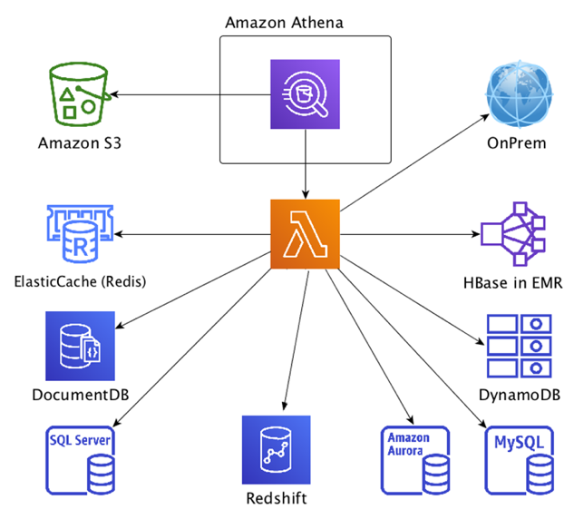
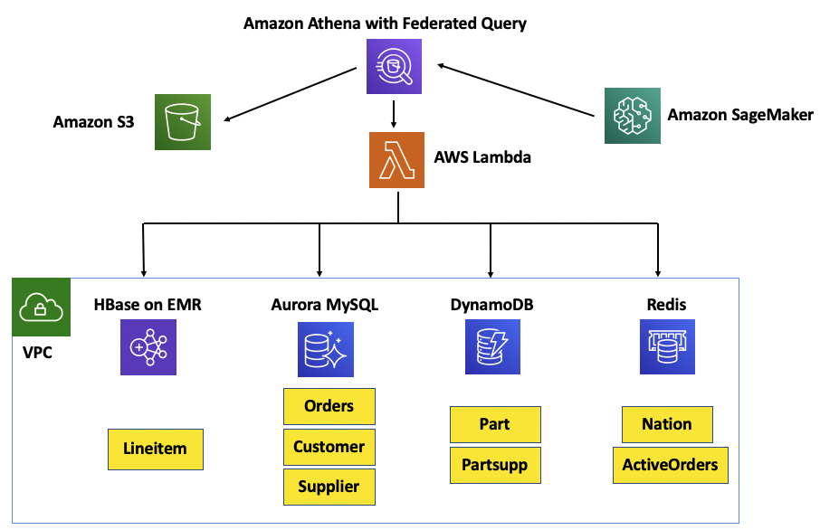
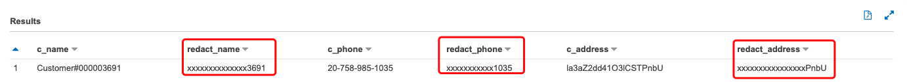
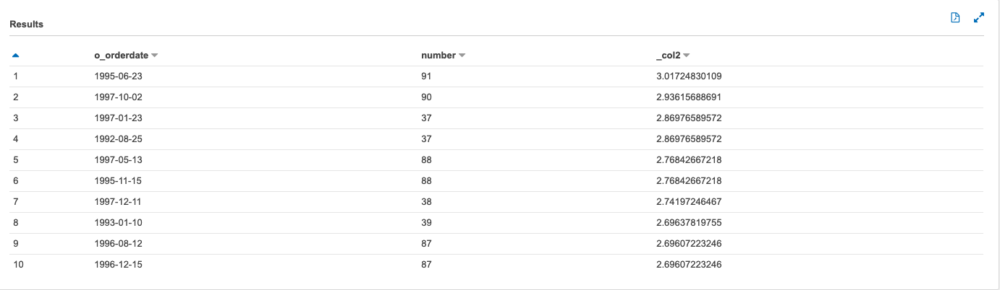

# Athena Workshop

# Preparation
Using [AWS CloudFormation to launch the envrionment of Labs](https://athena-in-action.workshop.aws/20-howtostart/201-self-paced/2013-cloudformation.html)

1. Labs - Athena Basics
2. Labs - Federated Queries
3. Labs - User Defined Functions
4. Labs - Custom Connector
5. Labs - Machine Learning

## Labs - Athena Basics
1. [Prepare Datasets](https://athena-in-action.workshop.aws/30-basics.html)
2. [Create Athena Table](https://athena-in-action.workshop.aws/30-basics/301-create-tables.html)
3. [Create Tables with Glue](https://athena-in-action.workshop.aws/30-basics/302-create-glue.html)
4. [Athena Create View](https://athena-in-action.workshop.aws/30-basics/303-create-view.html)
5. [ETL using Athena CTAS](https://athena-in-action.workshop.aws/30-basics/305-etl-ctas.html)
6. [Use Athena workgroups to separate users, teams, applications, or workloads, to set limits on amount of data each query or the entire workgroup can process, and to track costs](https://athena-in-action.workshop.aws/30-basics/306-workgroups.html)
7. [Visualize with QuickSight using Athena](https://athena-in-action.workshop.aws/30-basics/307-quicksight.html)

## Labs - Federated Queries
1. [Athena Federation - Query Data Anywhere](https://athena-in-action.workshop.aws/40-federatedquery.html)

Athena uses data source connectors that run on AWS Lambda to execute federated queries. A data source connector is a piece of code that can translate between your target data source and Athena.


2. [Prepare TPCH Database & Tables and Data Sources](https://athena-in-action.workshop.aws/40-federatedquery/data-sources.html)


3. [Aurora Connector setup by using Serverless Application Repository AthenaJdbcConnector](https://athena-in-action.workshop.aws/40-federatedquery/403-aurora-connector.html)

This will deploy Athena JDBC connector for Aurora Mysql and you can refer to this lambda function in your queries as "lambda:mysql"

4. [DynamoDB Connector setup by using Serverless Application Repository AthenaDynamoDBConnector](https://athena-in-action.workshop.aws/40-federatedquery/402-dynamodb-connector.html)

This will deploy Athena DynamoDB connector and you can refer to this lambda function in your queries as "lambda:dynamo"

5. [HBase Connector setup by using Serverless Application Repository AthenaHBaseConnector](https://athena-in-action.workshop.aws/40-federatedquery/404-hbase-connector.html)

This will deploy Athena HBase connector and you can refer to this lambda function in your queries as “lambda:hbase”

6. [Redis Connector setup by using Serverless Application Repository ](https://athena-in-action.workshop.aws/40-federatedquery/405-redis-connector.html)

This will deploy Athena Redis connector and you can refer to this lambda function in your queries as "lambda:redis"

Since Redis doesn't have a schema of it's own the Redis Connector can't infer the columns or data type from Redis. Redis connector needs a Glue database and tables to be setup to be able to associate the data to the schema.

7. [Run Federated Queries](https://athena-in-action.workshop.aws/40-federatedquery/406-federated-queries.html)

No need`Switch workgroup` to `AmazonAthenaPreviewFunctionality`, you can keep in `primary` workgroup

## Labs - User Defined Functions
Athena User Defined Function enables customers to write custom scalar functions and invoke them in SQL queries.

When a UDF is used in a SQL query submitted to Athena, it is invoked and executed on AWS Lambda. UDFs can be used in both SELECT and FILTER clauses of a SQL query. Users can invoke multiple UDFs in the same query.

UDFs enable customers to perform custom processing such as compressing and decompressing data, redacting sensitive data, or applying customized decryption.

1. [Setup the Cloud9](https://athena-in-action.workshop.aws/50-udf/501-cloud9-ide.html)
    - Resize the disk to 20GB.
    - [Setting Development Environment](https://athena-in-action.workshop.aws/50-udf/502-dev-env.html)
    ```bash
    git clone https://github.com/awslabs/aws-athena-query-federation.git 
    cd aws-athena-query-federation
    sudo chown ec2-user:ec2-user ~/.profile
    ./tools/prepare_dev_env.sh
    source ~/.profile
    mvn clean install -DskipTests=true > /tmp/log
    ```
2. [Create UDF Code and Publish to Serverless Application Repository](https://athena-in-action.workshop.aws/50-udf/503-udf-code.html)

3. [UDF Connector Setup](https://athena-in-action.workshop.aws/50-udf/504-udf-setup.html)

4. [Querying with UDF to mask the sensitive data](https://athena-in-action.workshop.aws/50-udf/505-udf-query.html)
To learn more about UDF syntax click here : [UDF Query Syntax](https://docs.aws.amazon.com/athena/latest/ug/querying-udf.html#udf-query-syntax)



## Labs - Custom Connector

Deploy a custom Athena connector and then configure it and run Athena Federated query against this connector.

A custom connector can be useful when you have a legacy datasource or you want to have a connector to a datastore which doesn't currently exist. In these cases you can write and deploy your own custom connector to Private Serverless Application Repository and use it.

Here is an [example custom connector](https://github.com/awslabs/aws-athena-query-federation/tree/master/athena-example)

1. [Develop Custom Connector Code](https://athena-in-action.workshop.aws/60-connector/601-connector-code.html)
```bash
../tools/publish.sh S3_BUCKET_NAME athena-example
```

2. [Custom Connector Setup](https://athena-in-action.workshop.aws/60-connector/602-connector-setup.html)

3. [Querying with Connector](https://athena-in-action.workshop.aws/60-connector/603-connector-query.html)
    - Upload Sample Data to the S3 Bucket for the Example Connector
    ```bash
    aws s3 cp ~/environment/aws-athena-query-federation/athena-example/sample_data.csv s3://athena-federation-workshop-744670048729/2017/11/1/sample_data.csv
    ```

## Labs - Machine Learning
You can use Athena to write SQL statements that run Machine Learning (ML) inference using Amazon SageMaker. This feature simplifies access to ML models for data analysis, eliminating the need to use complex programming methods to run inference.

To use ML with Athena, you define an ML with Athena function with the USING FUNCTION clause.

1. [Setup SageMaker Notebook](https://athena-in-action.workshop.aws/70-advanced/701-launch-jupyter-notebook.html)

2. [Download the Jupyter Notebook](https://athena-in-action.workshop.aws/images/Athena-ML-AnamolyDetection.ipynb)

3. [Run Jupyter Notebook](https://athena-in-action.workshop.aws/70-advanced/701-launch-jupyter-notebook/7012-run-jupyter-python-code.html)

Train a RandomCutForest Model to detect anomalies and deploy the model to a SageMaker endpoint that the application or Athena can call

4. [Run Athena ML Query](https://athena-in-action.workshop.aws/70-advanced/701-launch-jupyter-notebook/6013-run-ml-query.html)



As you can see from the results, With each data point, Random Cut Forest algorithm associates an anomaly score. Low score values indicate that the data point is considered “normal.” High values indicate the presence of an anomaly in the data. The definitions of “low” and “high” depend on the application but common practice suggests that scores beyond three standard deviations from the mean score are considered anomalous.

## Reference
[Workshop URL](https://athena-in-action.workshop.aws/)
