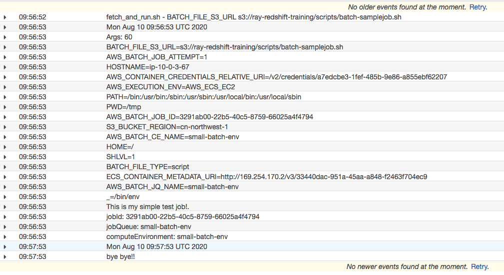

# AWS Batch Getting Start demo

## Configure the Compute Environment and Job Queue
Follow up the guide: [Batch_GetStarted](https://docs.aws.amazon.com/batch/latest/userguide/Batch_GetStarted.html) to create the Compute Environment and Job Queue
Follow up the guide [ECS instance_IAM_role](https://docs.aws.amazon.com/batch/latest/userguide/instance_IAM_role.html) to create the EC2 instance role: `ecsInstanceRole`

```bash
1. Define a Job: select `No job submission`, then click Next
2. Compute environment name: `small-batch-env`
3. Service role: `AWSBatchServiceRole`
4. EC2 instance role: `ecsInstanceRole`
5. Provisioning Model: `On-Demand`
6. Allowed instance types: `optimal`
7. Minimum vCPUs: 1; Desired vCPUs: 2; Maximum vCPUs: 4
8. VPC Setting: select a VPC, subnet with Amazon ECS service endpoint or NAT Gateway configured. Select Security group with 443 port open.
9. Tag your instance with: `Name=small-batch-env-instance`
10. Job queue name: `small-batch-env`
```

## Building the fetch & run Docker image
1. Build the docker images

```bash
wget https://github.com/awslabs/aws-batch-helpers/archive/master.zip
unzip master.zip
cd aws-batch-helpers-master/fetch-and-run

docker build -t awsbatch/fetch_and_run .

docker images
REPOSITORY                TAG        IMAGE ID            CREATED             SIZE
awsbatch/fetch_and_run    latest     1545fa79d6e5        2 minutes ago       438MB
amazonlinux               latest     7f335821efb5        3 months ago        163MB
```

Sample docker build result
```bash
[ec2-user@ip-10-0-2-83 fetch-and-run]$ docker build -t awsbatch/fetch_and_run .
Sending build context to Docker daemon  8.192kB
Step 1/6 : FROM amazonlinux:latest
 ---> 7f335821efb5
Step 2/6 : RUN yum -y install which unzip aws-cli
 ---> Running in bd2069b1f02e
Loaded plugins: ovl, priorities
Resolving Dependencies
....
Dependencies Resolved
....
Dependency Installed:
....                              

Complete!
Removing intermediate container bd2069b1f02e
 ---> f7a70a704b04
Step 3/6 : ADD fetch_and_run.sh /usr/local/bin/fetch_and_run.sh
 ---> 6374b423068a
Step 4/6 : WORKDIR /tmp
 ---> Running in faa0f1806114
Removing intermediate container faa0f1806114
 ---> f22a510524ad
Step 5/6 : USER nobody
 ---> Running in 5601a768135e
Removing intermediate container 5601a768135e
 ---> 26a13becc9a6
Step 6/6 : ENTRYPOINT ["/usr/local/bin/fetch_and_run.sh"]
 ---> Running in 0b6e16271694
Removing intermediate container 0b6e16271694
 ---> 1545fa79d6e5
Successfully built 1545fa79d6e5
Successfully tagged awsbatch/fetch_and_run:latest
```

2. Push the image to ECR
```bash
aws ecr create-repository --repository-name awsbatch/fetch_and_run --region cn-north-1

aws ecr get-login-password --region cn-north-1 | docker login --username AWS --password-stdin 012345678901.dkr.ecr.cn-north-1.amazonaws.com.cn
docker tag awsbatch/fetch_and_run:latest 012345678901.dkr.ecr.cn-north-1.amazonaws.com.cn/awsbatch/fetch_and_run:latest
docker push 012345678901.dkr.ecr.cn-north-1.amazonaws.com.cn/awsbatch/fetch_and_run:latest
```

## Batch Job preparation

1. Sample job script
```bash
#!/bin/bash

date
echo "Args: $@"
env
echo "This is my simple test job!."
echo "jobId: $AWS_BATCH_JOB_ID"
echo "jobQueue: $AWS_BATCH_JQ_NAME"
echo "computeEnvironment: $AWS_BATCH_CE_NAME"
sleep $1
date
echo "bye bye!!"
```

2. upload to S3 bucket
```bash
aws s3 cp myjob.sh s3://<bucket>/batch-samplejob.sh
#aws s3 cp myjob.sh s3://ray-redshift-training/scripts/batch-samplejob.sh
```

3. Create an IAM role

Create a batchJobRole IAM role with permission of `AmazonS3ReadOnlyAccess` for type of trusted entity as `ecs-tasks.amazonaws.com`


## Create a Batch job

1. Create a job definition
```bash
Job Definition Name: fetch_and_run.
Job attempts: 1
Execution timeout: 300 seconds
IAM Role: batchJobRole.
ECR Repository URI: 012345678901.dkr.ecr.cn-north-1.amazonaws.com.cn/awsbatch/fetch_and_run:latest
Command field: Leave blank.
For vCPUs, enter 1. For Memory, enter 500. For GPU: enter 0
For User, enter nobody.
```

2. Submit and run a job
```bash
Job name: fetch_and_run_script_test
Job definition: fetch_and_run:1
Job queue: small-batch-env
Job Type: Single
Command: enter `myjob.sh 60`
environment variables
Key=BATCH_FILE_TYPE, Value=script
Key=BATCH_FILE_S3_URL, Value=s3://ray-redshift-training/scripts/batch-samplejob.sh. Don’t forget to use the correct URL for your file.
Optional: key=S3_BUCKET_REGION, Value=cn-northwest-1
```

Note: the BATCH_FILE_S3_URL should be the same region with batch job, otherwise, you need modify the fetch_and_run.sh to export the S3_BUCKET_REGION.

3. Check Job status

After the job is completed, check the final status in the console.

| Job ID | Job name | Array size | Number of nodes | Status | Created at | Started at | Run time |
| ---- | ---- | ---- | ---- | ---- | ---- | ---- | ---- |
| 3291ab00-22b5-40c5-8759-66025a4f4794 | fetch_and_run_script_test | -- | -- | SUCCEEDED | 05:56:36 pm 08/10/20 | 05:56:52 pm 08/10/20 | a minute |

In the job details page, you can also choose View logs for this job in CloudWatch console to see your job log


# Reference
[Creating a Simple “Fetch & Run” AWS Batch Job](https://aws.amazon.com/blogs/compute/creating-a-simple-fetch-and-run-aws-batch-job/)