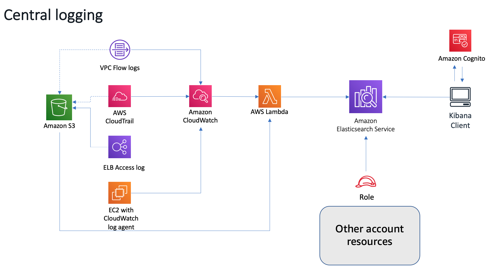
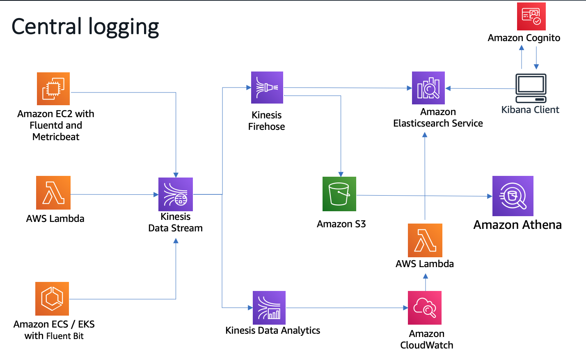

# Centralized Logging

- Basic Deployment - CloudWatch logs to ElasticSearch
- Advance Deployment - Logstash, Fluentd and Metricbeat
- Ingest AWS logs from S3 to Elasticsearch by using Filebeat.
- [Logging with Elasticsearch, Fluent Bit, and Kibana for Amazon EKS and Amazon ECS]

## Basic Deployment - CloudWatch logs to ElasticSearch

Overall solutions can be found in [Centralized Logging](https://docs.aws.amazon.com/solutions/latest/centralized-logging/overview.html)



This solution launches an Amazon EC2 instance with a Apache server that hosts a simple web application in an Amazon VPC. During initial launch, the Amazon CloudWatch Logs agent is automatically installed on the instance, which is used to direct raw log data to Amazon CloudWatch.

VPC Flow Logs are enabled in the VPC to capture information about IP traffic to, from, and within the network. Customers can use this example to enable VPC Flow Logs in other VPCs; this data is automatically published to a log group in Amazon CloudWatch Logs.

The AWS CloudTrail and creates a trail for the account, and also creates an Amazon Simple Storage Service (Amazon S3) bucket to store CloudTrail logs, which are automatically delivered to Amazon CloudWatch.

An Amazon CloudWatch event triggers the solution’s custom AWS Lambda function, which uploads any new log data (VPC flow logs, CloudTrail logs, and Apache logs) from Amazon CloudWatch to Amazon ES for analysis and visualization.

1. Deploy the [centralized-logging-primary](scripts/centralized-logging-primary.template) CloudFormation template to create
  - Amazon Elasticsearch Service cluster with Kibana and Elasticsearch endpoints
  - Amazon Cognito user pool and identity pool so that Kibana can be accessed securely with a login
  - Amazon EC2 instance demo Apache server that hosts a simple web application

2. Deploy the [S3-Traffic-Gen-Lambda](scripts/S3-Traffic-Gen-Lambda.json) CloudFormation template to create
 - A Lambda function to put random keys to S3.
 - S3 bucket for file upload


## Basic Testing
1. Login Kibana Configure an index pattern, set the Index name or pattern field to cwl-*.  Time Filter field name, choose @timestamp.
2. On the Saved Objects tab, choose Import and select the [basic-dashboard.json](scripts/basic-dashboard.json) file
3. Visit the `Basic` dashboard
4. Generate the sample web request
```bash
# Generate the 200 OK request
curl http://13.229.236.131/

# Gnerate the 404 Error request
curl http://13.229.236.131/nopage
```
5. Go to `Discover` on Kibana
 - Query the "es.amazonaws.com" cloudtrail event and add to Virtualizaiton
 - Filter the eventName:\"GetObject\", eventName:\"PutObject\", eventName:\"DeleteObject\" for virtualization


## Advance Deployment - Logstash, Fluentd and Metricbeat

The logging infrastructure, comprised of Fluentd and Metricbeat, sends metrics and application logs to Amazon ES via Amazon Kinesis Data Streams. Kinesis Data Streams buffers the log lines for architectural separation of delivery components and a highly available buffer to mitigate “load storms”. Finally, Logstash transforms and delivers records to Amazon ES.



[Loading Data with Logstash](https://docs.aws.amazon.com/elasticsearch-service/latest/developerguide/es-managedomains-logstash.html)

1. Deploy the [bootcamp-aes-network](scripts/bootcamp-aes-network.json) CloudFormation template to create
  - All the necessary network components such as the VPC, subnets, routes and baseline security elements

2. Deploy the [bootcamp-aes-kinesis](scripts/bootcamp-aes-kinesis.json) CloudFormation template to create
  - Kinesis stream used for buffering data to Elasticsearch cluster

3. Deploy the [bootcamp-aes-kibana-proxy](scripts/bootcamp-aes-kibana-proxy.json) CloudFormation template to create
  - NGINX proxy server to broker public internet calls via Kibana to the Elasticsearch domain and load sample data to Elasticsearch domain

4. Deploy the [bootcamp-aes-lab1](scripts/bootcamp-aes-lab1.json) CloudFormation template to create
 - Apache webserver and React application on EC2 behind an Application Load Balancer to provide a movie search experience across 5,000 movies

5. Load data into the domain

Using System Manager Session Manager to login the `central-logging-kibana-proxy` EC2 instance

```bash
ls -al /usr/share/es-scripts/
total 12
drwxr-xr-x  2 root root   58 Sep 10 09:31 .
drwxr-xr-x 82 root root 4096 Sep 10 09:32 ..
-rwxr-xr-x  1 root root  796 Sep 10 09:31 es-commands.sh
-rwxr-xr-x  1 root root  287 Sep 10 09:31 es-proxy-downloader.sh

cat es-commands.sh
cat es-proxy-downloader.sh

sh-4.2$ cd
sh-4.2$ pwd
/home/ssm-user


aws sts get-caller-identity
# Make the the output like
{
    "Account": "account-id",
    "UserId": "xxxxxxxxxxxxx:i-0b857ed5866b8f806",
    "Arn": "arn:aws:sts::account-id:assumed-role/central-logging-kibana-proxy-role/i-0b857ed5866b8f806"
}

# replace the scripts/put-data.py and scripts/put-mappings.py on central-logging-kibana-proxy EC2
. /usr/share/es-scripts/es-proxy-downloader.sh
. /usr/share/es-scripts/es-commands.sh
```

On Kibana, check the DevTool run query 

```bash
GET movies/_search
```

6. Deploy the [bootcamp-aes-lab2](scripts/bootcamp-aes-lab2.json)
 - Logstash used to complete the log delivery pipeline of Fluentd -> Amazon Kinesis Data Streams -> Logstash -> Elasticsearch

7. Logstash configuration for Metricbeat and Kinesis

- Using System Manager Session Manager to login the `central-logging-logstash-servers` EC2 instance

- Review the configuration for Metricbeat and Kinesis for the Logstash process

```bash
sudo su - root
cd /etc/logstash
cat pipelines.yml
- pipeline.id: metricbeat
  path.config: "/etc/logstash/conf.d/metricbeat.cfg"
- pipeline.id: kinesis
  path.config: "/etc/logstash/conf.d/kinesis.cfg"

cd conf.d/
ls -al

cat metricbeat.cfg

less kinesis.cfg
```

- Start Logstash and monitor the startup log
```bash
sudo su - root
service logstash start
service logstash status
less /var/log/logstash/logstash-plain.log

[metricbeat] Installing amazon_es template to /_template/logstash
[kinesis] Installing amazon_es template to /_template/logstash
[kinesis] Pipeline started {"pipeline.id"=>"kinesis"}
[metricbeat] Pipeline started {"pipeline.id"=>"metricbeat"}
Successfully started Logstash API endpoint {:port=>9600}
```

- Review the Metricbeat configuration and Install Metricbeat agent
```bash
less /etc/metricbeat/metricbeat.yml
yum install -y metricbeat
service metricbeat start
service metricbeat status
```

On Kibana, create new index `metricbeat-*` with `@timestamp` as time field

8. Logstash configuration for web-server-react

- Using System Manager Session Manager to login the `central-logging-web-server-react` EC2 instance

- Review the configuration for Fluentd agent and Kinesis for the Logstash process

```bash
sudo su - root
cd /etc/td-agent/
ls -al
less td-agent.conf
```

- Start the Fluentd agent
```bash
chown -R root:td-agent /var/log/httpd
chmod -R 777 /var/log/httpd/
service td-agent start
service td-agent status
less /var/log/td-agent/td-agent.log

2020-09-11 05:23:55 +0000 [info]: #0 following tail of /var/log/httpd/2020-09/2020-09-10-website.log
2020-09-11 05:23:55 +0000 [info]: #0 following tail of /var/log/httpd/2020-09/2020-09-11-website.log
2020-09-11 05:23:55 +0000 [info]: #0 fluentd worker is now running worker=0
```

On Kibana, check the DevTool, run query
```bash
GET _cat/indices

green open metricbeat-7.9.1-2020.09.11 CkOGo_avQkOtQ2NQ7NGQTw 5 1  8213 0     7mb   3.5mb
green open cwl-2020.09.10              4Pk7yCK8TJWjLREw3tGdhw 5 1 34568 0   144mb  72.1mb
green open movies                      JxKlSwCHTEKNiZtfhJfYpw 1 2  5001 0  15.7mb   5.2mb
green open .kibana                     SzmOp7fUTZq5ADZQKWjrmA 1 1    24 0 148.2kb  74.1kb
green open cwl-2020.09.09              B7uDVviESjqtBcQ6EZF-Xg 5 1  9047 0  40.1mb  19.9mb
green open webapp-2020.09.11           f72ouz0oRbeXziT3Y8q6hw 5 1    19 0 357.6kb 170.8kb
green open cwl-2020.09.11              Ss-qhjI3TdiuuUrhjk6wIQ 5 1  9327 0  59.3mb    39mb
```

On Kibana, create new index `webapp-*` with `@timestamp` as time field

9. Logstash configuration for central-logging-kibana-proxy

- Using System Manager Session Manager to login the `central-logging-kibana-proxy` EC2 instance

- Review the configuration for Fluentd agent and Kinesis for the Logstash process

```bash
sudo su - root
cd /etc/td-agent/
ls -al
less td-agent.conf
```

- Start the Fluentd agent
```bash
service td-agent start
service td-agent status
less /var/log/td-agent/td-agent.log

2020-09-11 05:35:50 +0000 [info]: #0 starting fluentd worker pid=8423 ppid=8416 worker=0
2020-09-11 05:35:50 +0000 [info]: #0 fluentd worker is now running worker=0
```

On Kibana, check the DevTool, run query
```bash
GET _cat/indices
```

10. Build a Kibana dashboard
 - index `metricbeat-*` for CPU, Memory, Network
 - index `webapp-*` for Resposne code and Host


11. AWS ALB access log

Below is example to ingest the ALB access log to ElasticSearch once the new log upload to S3 bucket

https://github.com/jSherz/alb-logs-parser.git

- Deploy

    ```bash
    # Edit the index.ts under src/
    httpAuth: 'user:password' or base64 encoding the user:password

    yarn
    yarn package

    cd infrastructure
    #edit the variable.tf
    variable "access_logs_bucket" {
        type = string
        default = "central-logging-alb-access"
    }
    variable "elasticsearch_host" {
        type = string
        default = "elasticsearch_endpoint_without_https"
    }

    #edit setup.tf
    provider "aws" {
    version = "~> 2.12"
    region  = "ap-southeast-1"
    }
    export AWS_DEFAULT_REGION="ap-southeast-1"
    terraform init
    terraform plan
    terraform apply

    #Update single resource: 
    terraform plan -target=aws_lambda_function.access_logs
    terraform apply -target=aws_lambda_function.access_logs
    ```

- S3 bucket policy
```json
{
  "Version": "2012-10-17",
  "Statement": [
    {
      "Effect": "Allow",
      "Principal": {
        "AWS": "arn:aws:iam::elb-account-id:root"
      },
      "Action": "s3:PutObject",
      "Resource": [
        "arn:aws:s3:::bucket-name",
        "arn:aws:s3:::bucket-name/*"
      ]
    },
    {
      "Effect": "Allow",
      "Principal": {
        "Service": "delivery.logs.amazonaws.com"
      },
      "Action": "s3:PutObject",
      "Resource": [
        "arn:aws:s3:::bucket-name",
        "arn:aws:s3:::bucket-name/*"
      ],
      "Condition": {
        "StringEquals": {
          "s3:x-amz-acl": "bucket-owner-full-control"
        }
      }
    },
    {
      "Effect": "Allow",
      "Principal": {
        "Service": "delivery.logs.amazonaws.com"
      },
      "Action": "s3:GetBucketAcl",
      "Resource": [
        "arn:aws:s3:::bucket-name",
        "arn:aws:s3:::bucket-name/*"
      ]
    },
    {
      "Effect": "Allow",
      "Principal": {
        "Service": "lambda.amazonaws.com"
      },
      "Action": "s3:*",
      "Resource": [
        "arn:aws:s3:::bucket-name",
        "arn:aws:s3:::bucket-name/*"
      ]
    }
  ]
}
```

- Cleanup
    ```bash
    terraform destroy
    ```

# Ingest AWS logs from S3 to Elasticsearch by using Filebeat.

- Enable the S3 event notification using SQS
- Filebeat s3 input
- Filebeat AWS module: s3access
- Filebeat AWS module: elb

Reference [getting-aws-logs-from-s3-using-filebeat-and-the-elastic-stack](https://www.elastic.co/blog/getting-aws-logs-from-s3-using-filebeat-and-the-elastic-stack)

Filebeat [filebeat-reference-yml](https://www.elastic.co/guide/en/beats/filebeat/master/filebeat-reference-yml.html)

## Enable the S3 event notification using SQS

1. Create an SQS queue `alb-access-log-queue`

Here is access policy of SQS queue `alb-access-log-queue` for S3 bucket `central-logging-alb-access-bucket` store the ALB access log

```json
{
 "Version": "2012-10-17",
 "Id": "alb-access-log-queue-ID",
 "Statement": [
  {
   "Sid": "alb-access-log-queue-SID",
   "Effect": "Allow",
   "Principal": {
    "AWS":"*"  
   },
   "Action": [
    "SQS:SendMessage"
   ],
   "Resource": "arn:aws:sqs:ap-southeast-1:account-id:alb-access-log-queue",
   "Condition": {
      "ArnLike": { "aws:SourceArn": "arn:aws:s3:*:*:central-logging-alb-access-bucket" },
      "StringEquals": {"aws:SourceAccount": "account-id"}
   }
  }
 ]
}
```

2. Configure S3 bucket event to pulish `s3:ObjectCreated:*` events to your Amazon SQS queue

3. Upload an object to the S3 bucket and verify the event notification in the Amazon SQS console. 

## Using the Filebeat s3 input

Using only the s3 input, log messages will be stored in the message field in each event without any parsing. 

1. Setup the EC2 to host the Filebeat

- IAM Policy for instance profile
```json
{
            "Action": "sqs:*",
            "Resource": "arn:aws:sqs:ap-southeast-1:account-id:alb-access-log-queue",
            "Effect": "Allow"
},
{
            "Action": [
                "es:ESHttp*"
            ],
            "Resource": "arn:aws:es:ap-southeast-1:account-id:domain/centralizedlogging/*",
            "Effect": "Allow"
},
{
            "Effect": "Allow",
            "Action": [
                "s3:GetObject",
                "s3:DeleteObject",
                "s3:PutObject"
            ],
            "Resource": "arn:aws:s3:::central-logging-alb-access-bucket/*"
        },
```

- Using System Manager Session Manager to login the `central-logging-filebeat` EC2 instance

2. Install the filebeat
```bash
sudo su - root
curl -L -O https://artifacts.elastic.co/downloads/beats/filebeat/filebeat-7.5.2-linux-x86_64.tar.gz
tar xzvf filebeat-7.5.2-linux-x86_64.tar.gz
cd filebeat-7.5.2-linux-x86_64/

#OR install on Amazon Linux
curl -L -O https://artifacts.elastic.co/downloads/beats/filebeat/filebeat-7.5.2-x86_64.rpm
rpm -vi filebeat-7.5.2-x86_64.rpm
service filebeat start
service filebeat status
filebeat test output
journalctl -f
```

3. Configure the s3 input

Note it only work for your Amazon ES domain uses fine-grained access control with HTTP basic authentication or using Cognito authentication

vi filebeat.yml

```yaml
filebeat.inputs:
- type: s3
  enabled: true
  queue_url: https://sqs.ap-southeast-1.amazonaws.com/account-id/alb-access-log-queue
  visibility_timeout: 300s
  credential_profile_name: elastic-beats
  index: "%{[agent.name]}-s3input-index-%{+yyyy.MM.dd}"

output.elasticsearch:
  hosts: ["https://search-centralizedlogging-g4ybhxmqmgktv6lm63stgap6ge.ap-southeast-1.es.amazonaws.com:443"]
  protocol: "https"
  username: "some-user"
  password: "some-password"
```

4. Start Filebeat
```bash
chown root filebeat.yml
./filebeat -e
```

5. Check the Kibana
```bash
aws s3 sync . s3://central-logging-alb-access-bucket/ --region ap-southeast-1
GET _cat/indices 
```

## Collecting ALB access logs using the elb fileset

[filebeat-module-aws](https://www.elastic.co/guide/en/beats/filebeat/master/filebeat-module-aws.html)

1. Enable aws module in Filebeat
```bash
./filebeat modules enable aws
```

2. Configure aws module

vi filebeat.yml
```yaml
- module: aws
  s3access:
    enabled: false

    # AWS SQS queue url
    #var.queue_url: https://sqs.myregion.amazonaws.com/123456/myqueue

    # Profile name for aws credential
    #var.credential_profile_name: fb-aws

  elb:
    enabled: true

    # AWS SQS queue url
    var.queue_url: https://sqs.ap-southeast-1.amazonaws.com/account-id/alb-access-log-queue

    # Profile name for aws credential
    var.credential_profile_name: elastic-beats
    var.role_arn: arn:aws:iam::123456789012:role/test-mb

output.elasticsearch:
  hosts: ["https://search-centralizedlogging-g4ybhxmqmgktv6lm63stgap6ge.ap-southeast-1.es.amazonaws.com:443"]
```

3. Start Filebeat
```bash
chown root filebeat.yml
./filebeat -e
```

4. Check the Kibana
```bash
GET _cat/indices 
```

# Logging with Elasticsearch, Fluent Bit, and Kibana

Fluent Bit, Elasticsearch and Kibana is also known as “EFK stack”. It can be used for Amazon EKS and Amazon ECS central logging.

Fluent Bit: an open source and multi-platform Log Processor and Forwarder which allows you to collect data/logs from different sources, unify and send them to multiple destinations. It’s fully compatible with Docker and Kubernetes environments.

Fluent Bit will forward logs from the individual instances in the cluster to a centralized logging backend where they are combined for higher-level reporting using ElasticSearch and Kibana.

[Logging with Elasticsearch, Fluent Bit, and Kibana for Amazon EKS](https://www.eksworkshop.com/intermediate/230_logging/)

[Fluent Bit for Amazon ECS](https://github.com/aws-samples/amazon-ecs-fluent-bit-daemon-service)

[centralized ECS logging with Fluent Bit](https://amazonaws-china.com/cn/blogs/china/centralized-container-logging-fluent-bit/)


# Cleanup
```bash
# delete the SQS: 
aws sqs delete-queue --queue-url https://sqs.ap-southeast-1.amazonaws.com/710299592439/alb-access-log-queue --region ap-southeast-1

# termiate the central-logging-filebeat EC2
terminate-instances --instance-ids [central-logging-filebeat-instance-id] --region ap-southeast-1

# Disable the S3 central-logging-alb-access-bucket event notification

# Delete the CloudFormation Stack
aws cloudformation delete-stack --stack-name central-logging-adv-lab2 --region ap-southeast-1
aws cloudformation delete-stack --stack-name central-logging-s3gen --region ap-southeast-1
aws cloudformation delete-stack --stack-name central-logging-aes-kibana-proxy --region ap-southeast-1
aws cloudformation delete-stack --stack-name central-logging-adv-lab1 --region ap-southeast-1
aws cloudformation delete-stack --stack-name central-logging-kinesis --region ap-southeast-1
aws cloudformation delete-stack --stack-name central-logging-network --region ap-southeast-1
aws cloudformation delete-stack --stack-name central-logging --region ap-southeast-1
```

# Reference
[aws elasticsearch for ad-hoc elb log analysis](https://blog.jasonantman.com/2018/04/aws-elasticsearch-for-ad-hoc-elb-log-analysis/)

[利用Amazon CloudWatch 搭建无人值守的监控预警平台](https://amazonaws-china.com/cn/blogs/china/cloudwatch-aws/)

[Amazon CloudWatch Events监控您应用的安全](https://amazonaws-china.com/cn/blogs/china/cloudwatch-events/)
