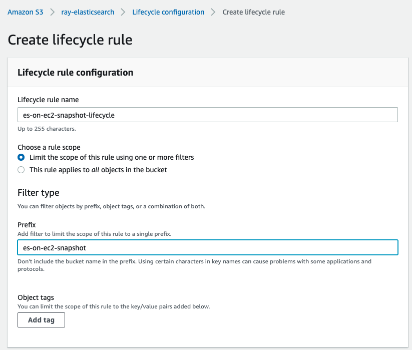
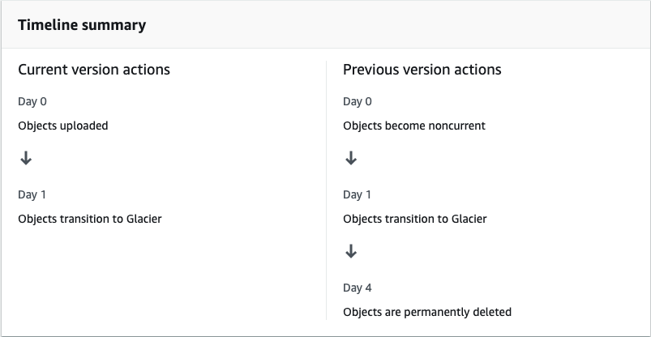

# ElasticSearch Snapshot Lifecycle Management

## Preparation

1. [Install ElasticSearch and Kibana on EC2](Install-ES-On-EC2.md)

2. Generate the Sample data
```bash
pip install requests pytz elasticsearch --user
python es_createIndex.py
```

3. Check the index should contain 1000 documents
```bash
curl -XGET 'localhost:9200/_cat/indices?v&pretty'

health status index  uuid  pri rep docs.count docs.deleted store.size pri.store.size
yellow open   testes-lifecycle-2020-11-25     7fluXBYtRRqz_Ai-J5BqVQ   1   1       1000            0    109.6kb        109.6kb
```

## Install S3 repository plugin

The S3 repository plugin adds support for using AWS S3 as a repository for Snapshot/Restore.

1. Install 
```
sudo /usr/share/elasticsearch/bin/elasticsearch-plugin install repository-s3
systemctl daemon-reload
systemctl restart elasticsearch.service
```

2. Configure
- Create S3 bucket `ray-elasticsearch` with Server-side encryption with CMK and disable versioning

- Enable the S3 lifecycle rule `es-on-ec2-snapshot-lifecycle`, for testing, I set the as below
1 day transition to Glacier glacier and 4 days permanently delete 





- Config the S3 repository
```bash
curl -X PUT "localhost:9200/_snapshot/my_s3_repository?pretty" -H 'Content-Type: application/json' -d'
{
  "type": "s3",
  "settings": {
    "bucket": "ray-elasticsearch",
    "base_path": "es-on-ec2-snapshot"
  }
}
'
```

- Config the credentials to access S3
```bash
/usr/share/elasticsearch/bin/elasticsearch-keystore passwd
/usr/share/elasticsearch/bin/elasticsearch-keystore add s3.client.default.access_key
/usr/share/elasticsearch/bin/elasticsearch-keystore add s3.client.default.secret_key

curl -X POST "localhost:9200/_nodes/reload_secure_settings?pretty" -H 'Content-Type: application/json' -d'
{
  "secure_settings_password": "YOUR_keystore_Passwd" 
}
'
```

- Verify the snapshot can be taken and stored into S3 bucket
```bash
curl -X PUT "localhost:9200/_snapshot/my_s3_repository/snapshot_1?wait_for_completion=true&pretty" -H 'Content-Type: application/json' -d'
{
  "indices": ["testes-lifecycle-*"],
  "ignore_unavailable": true,
  "include_global_state": false
}
'

{
  "snapshot" : {
    "snapshot" : "snapshot_1",
    "uuid" : "rtGY13HjTZyQDr9jo_Paow",
    "version_id" : 7100099,
    "version" : "7.10.0",
    "indices" : [
      "testes-lifecycle-2020-11-25"
    ],
    "data_streams" : [ ],
    "include_global_state" : false,
    "state" : "SUCCESS",
    "start_time" : "2020-11-25T09:29:01.859Z",
    "start_time_in_millis" : 1606296541859,
    "end_time" : "2020-11-25T09:29:02.660Z",
    "end_time_in_millis" : 1606296542660,
    "duration_in_millis" : 801,
    "failures" : [ ],
    "shards" : {
      "total" : 1,
      "failed" : 0,
      "successful" : 1
    }
  }
}

aws s3 ls s3://ray-elasticsearch/es-on-ec2-snapshot/

                           PRE indices/
2020-11-25 08:42:29          0
2020-11-25 09:29:04        457 index-0
2020-11-25 09:29:04          8 index.latest
2020-11-25 09:29:03        234 meta-rtGY13HjTZyQDr9jo_Paow.dat
2020-11-25 09:29:04        289 snap-rtGY13HjTZyQDr9jo_Paow.dat
```

## Automate daily backups of Elasticsearch data using an Elasticsearch SLM policy

1. Define a daily-snapshots policy to back up all of your data streams and indices daily at 10:00AM UTC.

```bash
curl -X PUT "localhost:9200/_slm/policy/daily-snapshots?pretty" -H 'Content-Type: application/json' -d'
{
  "schedule": "0 0 10 * * ?", 
  "name": "<daily-snap-{now/d}>", 
  "repository": "my_s3_repository", 
  "config": { 
    "indices": ["testes-lifecycle-*"] 
  },
  "retention": { 
    "expire_after": "2d", 
    "min_count": 1, 
    "max_count": 3 
  }
}
'
```

2. Create some new index or add data to existed index
- Add data to existed index
```bash
python es_createIndex.py
```

- Check the index should contain 2000 documents
```bash
curl -XGET 'localhost:9200/_cat/indices?v&pretty' | grep testes

health status index  uuid pri rep docs.count docs.deleted store.size pri.store.size
yellow open   testes-lifecycle-2020-11-25     7fluXBYtRRqz_Ai-J5BqVQ   1   1       2000            0      175kb          175kb
```

- To verify the policy, take a snapshot using the configuration right now
```bash
curl -X POST "localhost:9200/_slm/policy/daily-snapshots/_execute?pretty"
{
  "snapshot_name" : "daily-snap-2020.11.25-igijobi3qimbfxcsedixtq"
}

curl -X GET "localhost:9200/_slm/policy/daily-snapshots?human&pretty"
```

- check all snapshot
```bash
curl -X GET "localhost:9200/_snapshot/my_s3_repository/_all?pretty"
{
  "snapshots" : [
    {
      "snapshot" : "snapshot_1",
      "uuid" : "rtGY13HjTZyQDr9jo_Paow",
      "version_id" : 7100099,
      "version" : "7.10.0",
      "indices" : [
        "testes-lifecycle-2020-11-25"
      ],
      "data_streams" : [ ],
      "include_global_state" : false,
      "state" : "SUCCESS",
      "start_time" : "2020-11-25T09:29:01.859Z",
      "start_time_in_millis" : 1606296541859,
      "end_time" : "2020-11-25T09:29:02.660Z",
      "end_time_in_millis" : 1606296542660,
      "duration_in_millis" : 801,
      "failures" : [ ],
      "shards" : {
        "total" : 1,
        "failed" : 0,
        "successful" : 1
      }
    },
    {
      "snapshot" : "daily-snap-2020.11.25-igijobi3qimbfxcsedixtq",
      "uuid" : "lt8KPEloSUiiwaeyxkSBCA",
      "version_id" : 7100099,
      "version" : "7.10.0",
      "indices" : [
        "testes-lifecycle-2020-11-25"
      ],
      "data_streams" : [ ],
      "include_global_state" : true,
      "metadata" : {
        "policy" : "daily-snapshots"
      },
      "state" : "SUCCESS",
      "start_time" : "2020-11-25T10:31:28.002Z",
      "start_time_in_millis" : 1606300288002,
      "end_time" : "2020-11-25T10:31:28.602Z",
      "end_time_in_millis" : 1606300288602,
      "duration_in_millis" : 600,
      "failures" : [ ],
      "shards" : {
        "total" : 1,
        "failed" : 0,
        "successful" : 1
      }
    }
  ]
}

# Snapshot retention task history
curl -X GET "localhost:9200/_slm/stats?pretty"
{
  "retention_runs" : 0,
  "retention_failed" : 0,
  "retention_timed_out" : 0,
  "retention_deletion_time" : "0s",
  "retention_deletion_time_millis" : 0,
  "total_snapshots_taken" : 1,
  "total_snapshots_failed" : 0,
  "total_snapshots_deleted" : 0,
  "total_snapshot_deletion_failures" : 0,
  "policy_stats" : [
    {
      "policy" : "daily-snapshots",
      "snapshots_taken" : 1,
      "snapshots_failed" : 0,
      "snapshots_deleted" : 0,
      "snapshot_deletion_failures" : 0
    }
  ]
}
```

## Test Elasticsearch SLM policy and S3 lifecycle rule

Create Elasticsearch daily. And create the snapshot daily; Set the S3 lifecycle transit standard class to Glacier after 1 day when snapshot upload to S3; Set Glacier delele the objects after 4 days when snapshot upload to S3; Set the SLM policy after 2 days when snapshot taken. 

1. Check Elasticsearch whether can get the snapshot status

- Result: Failed to Elasticsearch retrieve the snapshot info when the snapshot has been convert to Glacier storage class

```bash
curl -X GET "localhost:9200/_snapshot/my_s3_repository/_all?pretty"
{
  "error" : {
    "root_cause" : [
      {
        "type" : "snapshot_exception",
        "reason" : "[my_s3_repository:daily-snap-2020.11.25-igijobi3qimbfxcsedixtq/lt8KPEloSUiiwaeyxkSBCA] Snapshot could not be read"
      }
    ],
    "type" : "snapshot_exception",
    "reason" : "[my_s3_repository:daily-snap-2020.11.25-igijobi3qimbfxcsedixtq/lt8KPEloSUiiwaeyxkSBCA] Snapshot could not be read",
    "caused_by" : {
      "type" : "amazon_s3_exception",
      "reason" : "The operation is not valid for the object's storage class (Service: Amazon S3; Status Code: 403; Error Code: InvalidObjectState; Request ID: 8BFA2EC093F962BC; S3 Extended Request ID: LfCQ1SNoe4sChGDnUxHZXQDEAszjMEjb4RU/JFjDbM6mUDbWKdkbDsBMjHOWtzzjbgbVj2nFj38=)"
    }
  },
  "status" : 500
}
```


2. Check using Elasticsearch snapshot delete API to delete the snapshot when the snapshot has been convert to Glacier storage class

- Result: Success

```bash
# Manual created snapshot
curl -X DELETE "localhost:9200/_snapshot/my_s3_repository/snapshot_1?pretty"
{
  "acknowledged" : true
}

curl -X GET "localhost:9200/_snapshot/my_s3_repository/snapshot_1?pretty"
{
  "error" : {
    "root_cause" : [
      {
        "type" : "snapshot_missing_exception",
        "reason" : "[my_s3_repository:snapshot_1] is missing"
      }
    ],
    "type" : "snapshot_missing_exception",
    "reason" : "[my_s3_repository:snapshot_1] is missing"
  },
  "status" : 404
}

# SLM created snapshot
curl -X GET "localhost:9200/_snapshot/my_s3_repository/daily-snap-2020.11.25-igijobi3qimbfxcsedixtq?pretty"
{
  "error" : {
    "root_cause" : [
      {
        "type" : "snapshot_exception",
        "reason" : "[my_s3_repository:daily-snap-2020.11.25-igijobi3qimbfxcsedixtq/lt8KPEloSUiiwaeyxkSBCA] Snapshot could not be read"
      }
    ],
    "type" : "snapshot_exception",
    "reason" : "[my_s3_repository:daily-snap-2020.11.25-igijobi3qimbfxcsedixtq/lt8KPEloSUiiwaeyxkSBCA] Snapshot could not be read",
    "caused_by" : {
      "type" : "amazon_s3_exception",
      "reason" : "The operation is not valid for the object's storage class (Service: Amazon S3; Status Code: 403; Error Code: InvalidObjectState; Request ID: 74183000200A1160; S3 Extended Request ID: N9S8m2yVyuHymAlOJfnKJ7tGKn5XVTO/P/MneLO+ZAb9b/rpzljM1LtM6vdGoWRu1Xn47HXXnHQ=)"
    }
  },
  "status" : 500
}

curl -X DELETE "localhost:9200/_snapshot/my_s3_repository/daily-snap-2020.11.25-igijobi3qimbfxcsedixtq?pretty"
{
  "acknowledged" : true
}

curl -X GET "localhost:9200/_snapshot/my_s3_repository/daily-snap-2020.11.25-igijobi3qimbfxcsedixtq?pretty"
{
  "error" : {
    "root_cause" : [
      {
        "type" : "snapshot_missing_exception",
        "reason" : "[my_s3_repository:daily-snap-2020.11.25-igijobi3qimbfxcsedixtq] is missing"
      }
    ],
    "type" : "snapshot_missing_exception",
    "reason" : "[my_s3_repository:daily-snap-2020.11.25-igijobi3qimbfxcsedixtq] is missing"
  },
  "status" : 404
}
```

3. Check Elasticsearch SLM whether can successfully delete the snapshot when the snapshot has been convert to Glacier storage class

```bash
# Deletes any snapshots that are expired according to the policy’s retention rules.
curl -X POST "localhost:9200/_slm/_execute_retention?pretty"

curl -XGET 'localhost:9200/_cat/indices?v&pretty' | grep testes
health status index   uuid  pri rep docs.count docs.deleted store.size pri.store.size
yellow open   testes-lifecycle-2020-11-25     7fluXBYtRRqz_Ai-J5BqVQ   1   1       2000            0      175kb          175kb
yellow open   testes-lifecycle-2020-11-26     XBqHH3CTRDOaNIC8LbviJg   1   1       2000            0    162.9kb        162.9kb
yellow open   testes-lifecycle-2020-11-27         n0YnPNKWTIehqcmR_J0c1Q   1   1       1000            0       89kb           89kb

curl -X GET "localhost:9200/_slm/stats?pretty"
{
  "retention_runs" : 1,
  "retention_failed" : 0,
  "retention_timed_out" : 0,
  "retention_deletion_time" : "0s",
  "retention_deletion_time_millis" : 0,
  "total_snapshots_taken" : 2,
  "total_snapshots_failed" : 0,
  "total_snapshots_deleted" : 0,
  "total_snapshot_deletion_failures" : 0,
  "policy_stats" : [
    {
      "policy" : "daily-snapshots",
      "snapshots_taken" : 2,
      "snapshots_failed" : 0,
      "snapshots_deleted" : 0,
      "snapshot_deletion_failures" : 0
    }
  ]
}


curl -X GET "localhost:9200/_slm/policy/daily-snapshots?human&pretty"
{
  "daily-snapshots" : {
    "version" : 1,
    "modified_date" : "2020-11-25T10:31:14.039Z",
    "modified_date_millis" : 1606300274039,
    "policy" : {
      "name" : "<daily-snap-{now/d}>",
      "schedule" : "0 0 10 * * ?",
      "repository" : "my_s3_repository",
      "config" : {
        "indices" : [
          "testes-lifecycle-*"
        ]
      },
      "retention" : {
        "expire_after" : "2d",
        "min_count" : 1,
        "max_count" : 3
      }
    },
    "last_success" : {
      "snapshot_name" : "daily-snap-2020.11.26-91n9xu-xr0m2gqutcq7uxw",
      "time_string" : "2020-11-26T10:00:01.793Z",
      "time" : 1606384801793
    },
    "next_execution" : "2020-11-27T10:00:00.000Z",
    "next_execution_millis" : 1606471200000,
    "stats" : {
      "policy" : "daily-snapshots",
      "snapshots_taken" : 2,
      "snapshots_failed" : 0,
      "snapshots_deleted" : 0,
      "snapshot_deletion_failures" : 0
    }
  }
}
```

4. Before Glacier delete the snapshot, try restore snapshot into Elasticsearch.

- Result: Failed to Elasticsearch restore the snapshot info when the snapshot has been convert to Glacier storage class

```bash
curl -X POST "localhost:9200/_snapshot/my_s3_repository/snapshot_1/_restore?pretty" -H 'Content-Type: application/json' -d'
{
  "indices": "testes-lifecycle-2020-11-25",
  "ignore_unavailable": true,
  "include_global_state": false,              
  "rename_pattern": "index_(.+)",
  "rename_replacement": "restored_index_$1",
  "include_aliases": false
}
'
{
  "error" : {
    "root_cause" : [
      {
        "type" : "amazon_s3_exception",
        "reason" : "The operation is not valid for the object's storage class (Service: Amazon S3; Status Code: 403; Error Code: InvalidObjectState; Request ID: B39F7DDAF28ADC5E; S3 Extended Request ID: kBsluVu+LSfdXZ4603C627ZrI6ssVg0Q6McGxhbZQOWFInJ2zZt8K93kutMS1amxqBN4Pzm7DGA=)"
      }
    ],
    "type" : "amazon_s3_exception",
    "reason" : "The operation is not valid for the object's storage class (Service: Amazon S3; Status Code: 403; Error Code: InvalidObjectState; Request ID: B39F7DDAF28ADC5E; S3 Extended Request ID: kBsluVu+LSfdXZ4603C627ZrI6ssVg0Q6McGxhbZQOWFInJ2zZt8K93kutMS1amxqBN4Pzm7DGA=)"
  },
  "status" : 500
}
```

5. Before Glacier delete the snapshot, convert the snapshot back to S3 Standard storage class and try restore snapshot into Elasticsearch.
