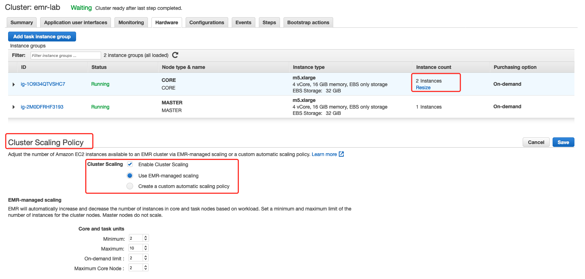
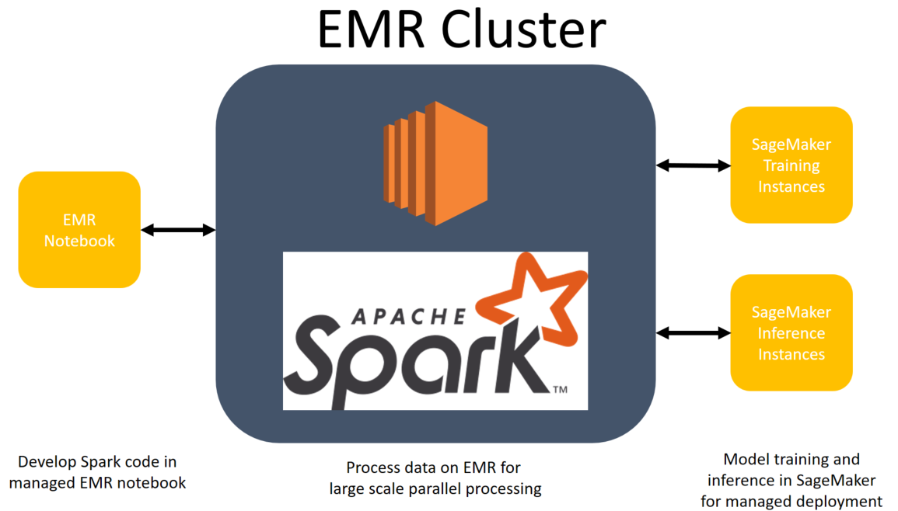
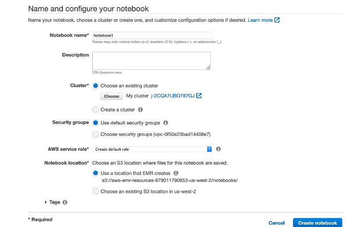
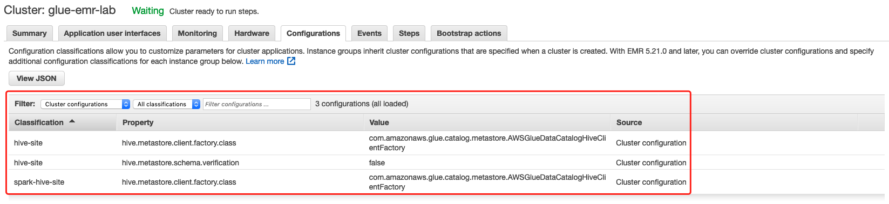

# EMR Immersion Day

## Cluster Creation
- Create EMR cluster
```bash
aws emr create-cluster --name "emr-lab" --release-label emr-5.30.1 \
--applications Name=Hadoop Name=Pig Name=Hue Name=Spark Name=Hive Name=Tez Name=HBase Name=Presto Name=JupyterHub \
--ec2-attributes KeyName=EMRKeyPair,SubnetIds=subnet-0a5ba02735f8cb53d \
--instance-groups InstanceGroupType=MASTER,InstanceCount=1,InstanceType=m5.xlarge InstanceGroupType=CORE,InstanceCount=2,InstanceType=m5.xlarge \
--use-default-roles --log-uri s3://aws-logs-747411437379-ap-east-1/elasticmapreduce/ \
--region ap-east-1

aws emr describe-cluster --cluster-id j-N99HEXWVFXSW --query 'Cluster.Status.State' --region ap-east-1
```

- SSH to EMR Cluster Master
```bash
cd ~/environment/SSH
ssh -i EMRKeyPair.pem hadoop@ec2-18-162-232-142.ap-east-1.compute.amazonaws.com
```

- Emr transient cluster enable auto-termination

Spark cluster

```bash
aws emr create-cluster --name "Add Spark Step Cluster" --release-label emr-5.30.1 \
--applications Name=Spark Name=Hadoop Name=Pig Name=Hue Name=Hive Name=Tez \
--ec2-attributes KeyName=EMRKeyPair,SubnetIds=subnet-0a5ba02735f8cb53d \
--instance-groups InstanceGroupType=MASTER,InstanceCount=1,InstanceType=m5.xlarge InstanceGroupType=CORE,InstanceCount=2,InstanceType=m5.xlarge \
--use-default-roles --log-uri s3://aws-logs-747411437379-ap-east-1/elasticmapreduce/ \
--steps Type=CUSTOM_JAR,Name="Spark Program",Jar="command-runner.jar",ActionOnFailure=CONTINUE,Args=[spark-example,SparkPi,10] \
--use-default-roles --auto-terminate --region ap-east-1 --profile hongkong
```

Hive Cluster

```bash
aws emr create-cluster --name "emr-lab-transient" --release-label emr-5.30.1 \
--applications Name=Hadoop Name=Pig Name=Hue Name=Hive Name=Tez \
--ec2-attributes KeyName=EMRKeyPair,SubnetIds=subnet-0a5ba02735f8cb53d \
--instance-groups InstanceGroupType=MASTER,InstanceCount=1,InstanceType=m5.xlarge InstanceGroupType=CORE,InstanceCount=2,InstanceType=m5.xlarge \
--use-default-roles --log-uri s3://aws-logs-747411437379-ap-east-1/elasticmapreduce/ \
--steps Type=Hive,Name="ny_taxi_test",ActionOnFailure=CONTINUE,Args=[-f,s3://emr-workshop-lab-747411437379/files/ny-taxi.hql,-d,INPUT=s3://emr-workshop-lab-747411437379/input/,-d,OUTPUT=s3://emr-workshop-lab-747411437379/output/hive/,-hiveconf,hive.support.sql11.reserved.keywords=false] \
--auto-terminate --region ap-east-1 --profile hongkong
```


## Hive Workshop
Run some Hive SQL queries through Hive on Amazon EMR cluster to analysis New York Taxi dataset in S3 bucket.

1. Create S3 bucket: `emr-workshop-lab-747411437379` and folder for `files, logs, input, output`

2. Upload the data
```bash
aws s3 ls --recursive s3://emr-workshop-lab-747411437379/ --region ap-east-1 --profile hongkong
2020-08-26 08:24:00          0 files/
2020-08-26 08:24:07          0 input/
2020-08-26 08:25:13    1497006 input/tripdata.csv
2020-08-26 08:24:03          0 logs/
2020-08-26 08:24:11          0 output/
```

3. Hive CLI

- Define External Table in Hive
```bash
ssh -i EMRKeyPair.pem hadoop@ec2-18-162-232-142.ap-east-1.compute.amazonaws.com
hive
hive> CREATE EXTERNAL TABLE ny_taxi_test (
              vendor_id int,
              lpep_pickup_datetime string,
              lpep_dropoff_datetime string,
              store_and_fwd_flag string,
              rate_code_id smallint,
              pu_location_id int,
              do_location_id int,
              passenger_count int,
              trip_distance double,
              fare_amount double,
              mta_tax double,
              tip_amount double,
              tolls_amount double,
              ehail_fee double,
              improvement_surcharge double,
              total_amount double,
              payment_type smallint,
              trip_type smallint
       )
       ROW FORMAT DELIMITED
       FIELDS TERMINATED BY ','
       LINES TERMINATED BY '\n'
       STORED AS TEXTFILE
       LOCATION "s3://emr-workshop-lab-747411437379/input/";

hive> SELECT DISTINCT rate_code_id FROM ny_taxi_test;
hive> SELECT count(1) FROM ny_taxi_test;
```

4. HIVE - EMR Steps

- Analysis New York Taxi dataset

```bash
aws emr add-steps --cluster-id j-N99HEXWVFXSW \
--steps Type=Hive,Name="ny_taxi_test",ActionOnFailure=CONTINUE,Args=[-f,s3://emr-workshop-lab-747411437379/files/ny-taxi.hql,-d,INPUT=s3://emr-workshop-lab-747411437379/input/,-d,OUTPUT=s3://emr-workshop-lab-747411437379/output/hive/,-hiveconf,hive.support.sql11.reserved.keywords=false] \
--region ap-east-1 --profile hongkong
```

- Check status
```bash
aws emr describe-step --cluster-id j-N99HEXWVFXSW --step-id s-2K6IA2D3CALDN --region ap-east-1 --profile hongkong
#aws emr cancel-steps --cluster-id j-N99HEXWVFXSW --step-ids s-2K6IA2D3CALDN --region ap-east-1 --profile hongkong
aws s3 ls --recursive s3://emr-workshop-lab-747411437379/ --region ap-east-1 --profile hongkong
```

## Pig Workshop
- Use Pig script to parse the data in CSV format and transform into TSV format

```bash
aws emr add-steps --cluster-id j-N99HEXWVFXSW \
--steps Type=Pig,Name="ny_taxi_pig",ActionOnFailure=CONTINUE,Args=[-f,s3://emr-workshop-lab-747411437379/files/ny-taxi.pig,-p,INPUT=s3://emr-workshop-lab-747411437379/input/tripdata.csv,-p,OUTPUT=s3://emr-workshop-lab-747411437379/output/pig] \
--region ap-east-1 --profile hongkong
```

- Generate a report containing the total bytes transferred, a list of the top 50 IP addresses, a list of the top 50 external referrers, and the top 50 search terms using Bing and Google

```bash
aws emr add-steps --cluster-id j-N99HEXWVFXSW \
--steps Type=PIG,Name="TopIpAndRef",ActionOnFailure=CONTINUE,Args=[-f,s3://emr-workshop-lab-747411437379/files/do-reports3.pig,-p,INPUT=s3://emr-workshop-lab-747411437379/samples/pig-apache/input,-p,OUTPUT=s3://emr-workshop-lab-747411437379/output/pig-apache] \
--region ap-east-1 --profile hongkong
```

- Check status
```bash
aws emr describe-step --cluster-id j-N99HEXWVFXSW --step-id s-1UOFBY7HPV3C8 --region ap-east-1 --profile hongkong
#aws emr cancel-steps --cluster-id j-N99HEXWVFXSW --step-ids s-1UOFBY7HPV3C8 --region ap-east-1 --profile hongkong
aws s3 ls --recursive s3://emr-workshop-lab-747411437379/ --region ap-east-1 --profile hongkong
```

## Spark-based ETL

1. spark-shell
Read log and count the keywords

```bash
# connecting to the master node with SSH
spark-shell

scala> sc
scala> val textFile = sc.textFile("s3://emr-workshop-lab-747411437379/samples/hive-ads/tables/impressions/dt=2009-04-13-08-05/ec2-0-51-75-39.amazon.com-2009-04-13-08-05.log")
scala> val linesWithCartoonNetwork = textFile.filter(line => line.contains("cartoonnetwork.com")).count()
linesWithCartoonNetwork: Long = 9                                               

scala> linesWithCartoonNetwork
res1: Long = 9
```

2. Add EMR Step
```bash
aws emr add-steps --cluster-id j-N99HEXWVFXSW --steps Type=Spark,Name="Spark Program",ActionOnFailure=CONTINUE,Args=[--class,org.apache.spark.examples.SparkPi,/usr/lib/spark/examples/jars/spark-examples.jar,10] --region ap-east-1 --profile hongkong

aws emr add-steps --cluster-id j-N99HEXWVFXSW --steps Type=CUSTOM_JAR,Name="Spark NY Texi",Jar="command-runner.jar",ActionOnFailure=CONTINUE,Args=[spark-submit,s3://emr-workshop-lab-747411437379/files/spark-etl.py,s3://emr-workshop-lab-747411437379/input/tripdata.csv,s3://emr-workshop-lab-747411437379/output] --region ap-east-1 --profile hongkong
```

3. spark-submit
Read CSV data from Amazon S3; Add current date to the dataset; Write updated data back to Amazon S3 in Parquet format

```bash
# connecting to the master node with SSH
spark-submit --executor-memory 1g spark-etl.py s3://emr-workshop-lab-747411437379/input/ s3://emr-workshop-lab-747411437379/output/spark
```

- output
```bash
20/08/26 09:45:23 INFO DAGScheduler: Job 1 finished: csv at NativeMethodAccessorImpl.java:0, took 3.052585 s
20/08/26 09:45:23 INFO YarnScheduler: Removed TaskSet 1.0, whose tasks have all completed, from pool 
20/08/26 09:45:23 INFO ContextCleaner: Cleaned accumulator 3
20/08/26 09:45:23 INFO ContextCleaner: Cleaned accumulator 1
20/08/26 09:45:23 INFO ContextCleaner: Cleaned accumulator 2
20/08/26 09:45:23 INFO ContextCleaner: Cleaned accumulator 4
20/08/26 09:45:23 INFO ContextCleaner: Cleaned accumulator 5
20/08/26 09:45:23 INFO ContextCleaner: Cleaned accumulator 6
root
 |-- VendorID: integer (nullable = true)
 |-- lpep_pickup_datetime: string (nullable = true)
 |-- lpep_dropoff_datetime: string (nullable = true)
 |-- store_and_fwd_flag: string (nullable = true)
 |-- RatecodeID: integer (nullable = true)
 |-- PULocationID: integer (nullable = true)
 |-- DOLocationID: integer (nullable = true)
 |-- passenger_count: integer (nullable = true)
 |-- trip_distance: double (nullable = true)
 |-- fare_amount: double (nullable = true)
 |-- extra: double (nullable = true)
 |-- mta_tax: double (nullable = true)
 |-- tip_amount: double (nullable = true)
 |-- tolls_amount: double (nullable = true)
 |-- ehail_fee: string (nullable = true)
 |-- improvement_surcharge: double (nullable = true)
 |-- total_amount: double (nullable = true)
 |-- payment_type: integer (nullable = true)
 |-- trip_type: integer (nullable = true)
 |-- current_date: timestamp (nullable = false)


 20/08/26 09:45:24 INFO DAGScheduler: Job 2 finished: showString at NativeMethodAccessorImpl.java:0, took 0.306120 s
+--------+--------------------+---------------------+------------------+----------+------------+------------+---------------+-------------+-----------+-----+-------+----------+------------+---------+---------------------+------------+------------+---------+--------------------+
|VendorID|lpep_pickup_datetime|lpep_dropoff_datetime|store_and_fwd_flag|RatecodeID|PULocationID|DOLocationID|passenger_count|trip_distance|fare_amount|extra|mta_tax|tip_amount|tolls_amount|ehail_fee|improvement_surcharge|total_amount|payment_type|trip_type|        current_date|
+--------+--------------------+---------------------+------------------+----------+------------+------------+---------------+-------------+-----------+-----+-------+----------+------------+---------+---------------------+------------+------------+---------+--------------------+
|       2|         1/1/17 0:01|          1/1/17 0:11|                 N|         1|          42|         166|              1|         1.71|        9.0|  0.0|    0.5|       0.0|         0.0|     null|                  0.3|         9.8|           2|        1|2020-08-26 09:45:...|
|       2|         1/1/17 0:03|          1/1/17 0:09|                 N|         1|          75|          74|              1|         1.44|        6.5|  0.5|    0.5|       0.0|         0.0|     null|                  0.3|         7.8|           2|        1|2020-08-26 09:45:...|
|       2|         1/1/17 0:04|          1/1/17 0:12|                 N|         1|          82|          70|              5|         3.45|       12.0|  0.5|    0.5|      2.66|         0.0|     null|                  0.3|       15.96|           1|        1|2020-08-26 09:45:...|
|       2|         1/1/17 0:01|          1/1/17 0:14|                 N|         1|         255|         232|              1|         2.11|       10.5|  0.5|    0.5|       0.0|         0.0|     null|                  0.3|        11.8|           2|        1|2020-08-26 09:45:...|
|       2|         1/1/17 0:00|          1/1/17 0:18|                 N|         1|         166|         239|              1|         2.76|       11.5|  0.5|    0.5|       0.0|         0.0|     null|                  0.3|        12.8|           2|        1|2020-08-26 09:45:...|
|       2|         1/1/17 0:00|          1/1/17 0:13|                 N|         1|         179|         226|              1|         4.14|       15.0|  0.5|    0.5|       0.0|         0.0|     null|                  0.3|        16.3|           1|        1|2020-08-26 09:45:...|
|       2|         1/1/17 0:02|          1/1/17 0:26|                 N|         1|          74|         167|              1|         4.22|       19.0|  0.5|    0.5|       0.0|         0.0|     null|                  0.3|        20.3|           2|        1|2020-08-26 09:45:...|
|       2|         1/1/17 0:15|          1/1/17 0:28|                 N|         1|         112|          37|              1|         2.83|       11.0|  0.5|    0.5|       0.0|         0.0|     null|                  0.3|        12.3|           2|        1|2020-08-26 09:45:...|
|       2|         1/1/17 0:06|          1/1/17 0:11|                 N|         1|          36|          37|              1|         0.78|        5.0|  0.5|    0.5|       0.0|         0.0|     null|                  0.3|         6.3|           2|        1|2020-08-26 09:45:...|
|       2|         1/1/17 0:14|          1/1/17 0:28|                 N|         1|         127|         174|              5|         3.49|       13.5|  0.5|    0.5|       0.0|         0.0|     null|                  0.3|        14.8|           2|        1|2020-08-26 09:45:...|
|       2|         1/1/17 0:01|          1/1/17 0:09|                 N|         1|          41|         238|              1|         1.61|        8.5|  0.5|    0.5|      1.96|         0.0|     null|                  0.3|       11.76|           1|        1|2020-08-26 09:45:...|
|       2|         1/1/17 0:31|          1/1/17 0:52|                 N|         1|          97|         228|              1|         5.63|       21.0|  0.5|    0.5|       1.0|         0.0|     null|                  0.3|        23.3|           1|        1|2020-08-26 09:45:...|
|       2|         1/1/17 0:01|          1/1/17 0:22|                 N|         1|         255|          26|              5|        10.24|       30.0|  0.5|    0.5|       0.0|         0.0|     null|                  0.3|        31.3|           2|        1|2020-08-26 09:45:...|
|       2|         1/1/17 0:00|          1/1/17 0:09|                 N|         1|          70|         173|              1|         0.97|        7.0|  0.5|    0.5|       0.0|         0.0|     null|                  0.3|         8.3|           1|        1|2020-08-26 09:45:...|
|       2|         1/1/17 0:03|          1/1/17 0:18|                 N|         1|         255|          40|              1|         5.56|       18.5|  0.5|    0.5|      5.94|         0.0|     null|                  0.3|       25.74|           1|        1|2020-08-26 09:45:...|
|       2|         1/1/17 0:03|          1/1/17 0:03|                 N|         1|          82|         260|              1|         1.75|       10.0|  0.5|    0.5|       0.0|         0.0|     null|                  0.3|        11.3|           2|        1|2020-08-26 09:45:...|
|       2|         1/1/17 0:00|          1/1/17 0:00|                 N|         5|          36|          36|              1|          0.0|        3.0|  0.0|    0.0|       0.0|         0.0|     null|                  0.0|         3.0|           1|        2|2020-08-26 09:45:...|
|       2|         1/1/17 0:01|          1/1/17 0:11|                 N|         1|           7|         223|              1|          2.0|        9.0|  0.5|    0.5|      2.06|         0.0|     null|                  0.3|       12.36|           1|        1|2020-08-26 09:45:...|
|       2|         1/1/17 0:26|          1/1/17 0:38|                 N|         1|         256|         106|              1|         5.48|       17.0|  0.5|    0.5|      3.29|         0.0|     null|                  0.3|       21.59|           1|        1|2020-08-26 09:45:...|
|       2|         1/1/17 0:49|          1/1/17 1:00|                 N|         1|         181|         228|              1|          2.0|       10.5|  0.5|    0.5|       0.0|         0.0|     null|                  0.3|        11.8|           2|        1|2020-08-26 09:45:...|
+--------+--------------------+---------------------+------------------+----------+------------+------------+---------------+-------------+-----------+-----+-------+----------+------------+---------+---------------------+------------+------------+---------+--------------------+
only showing top 20 rows


20/08/26 09:45:25 INFO DAGScheduler: Job 4 finished: count at NativeMethodAccessorImpl.java:0, took 0.125519 s
Total number of records: 20000


20/08/26 09:45:27 INFO DAGScheduler: Job 5 finished: parquet at NativeMethodAccessorImpl.java:0, took 1.499231 s
20/08/26 09:45:27 INFO MultipartUploadOutputStream: close closed:false s3://emr-workshop-lab-747411437379/output/spark/_SUCCESS
 ```

- Overriding Spark Default Configuration Settings
```bash
spark-submit --executor-memory 1g --class org.apache.spark.examples.SparkPi /usr/lib/spark/examples/jars/spark-examples.jar 10
20/08/26 11:18:27 INFO DAGScheduler: Job 0 finished: reduce at SparkPi.scala:38, took 14.544719 s
Pi is roughly 3.138783138783139
```

3. Monitor the job
- Check Spark job logs on the command line
- Check YARN Application logs on Amazon EMR Console
- Check status and logs on Spark UI
```
ssh -i ~/.ssh/EMRKeyPair.pem -ND 8157 hadoop@ec2-18-162-232-142.ap-east-1.compute.amazonaws.com

installing and configureFoxyProxy

access http://ec2-18-162-232-142.ap-east-1.compute.amazonaws.com:18080/
```

4. JupyterHub Notebooks
- login the JupyterHub Notebooks

```bash
https://ec2-18-162-232-142.ap-east-1.compute.amazonaws.com:9443
Username: jovyan
Password: jupyter
```

- create a new PySpark Notebook
```python
import sys
from datetime import datetime
from pyspark.sql import SparkSession
from pyspark.sql.functions import *

input_path = "s3://emr-workshop-lab-747411437379/input/tripdata.csv"
output_path = "s3://emr-workshop-lab-747411437379/output/"

nyTaxi = spark.read.option("inferSchema", "true").option("header", "true").csv(input_path)

nyTaxi.count()

nyTaxi.show()

nyTaxi.printSchema()

updatedNYTaxi = nyTaxi.withColumn("current_date", lit(datetime.now()))

updatedNYTaxi.printSchema()
```

## Scaling Cluster Resources

| Items | EMR managed scaling | Custom automatic scaling |
| ---- |    ---- |  ---- |
| Scaling policies and rules | No policy required. EMR manages the automatic scaling activity by continuously evaluating cluster metrics and making optimized scaling decisions. | You need to define and manage the automatic scaling policies and rules, such as the specific conditions that trigger scaling activities, evaluation periods, cooldown periods, etc. |
| Supported EMR release versions | Amazon EMR version 5.30.0 and later (except Amazon EMR version 6.0.0) | Amazon EMR version 4.0.0 and later | 
| Supported cluster composition | Instance groups or instance fleets | Instance groups only |
| Scaling limits configuration  | Scaling limits are configured for the entire cluster. | Scaling limits can only be configured for each instance group. |
| Metrics evaluation frequency | Every 5 to 10 seconds | More frequent evaluation of metrics allows EMR to make more precise scaling decisions. | You can define the evaluation periods only in five-minute increments.
| Supported applications | Only YARN applications are supported, such as Spark, Hadoop, Hive, Flink. Other applications, such as Presto, are currently not supported. | You can choose which applications are supported when defining the automatic scaling rules. | 



```bash
aws emr create-cluster --release-label emr-5.30.1 \
 --name EMR_Managed_Scaling_Enabled_Cluster \
 --applications Name=Spark Name=Hbase \
 --ec2-attributes KeyName=EMRKeyPair,SubnetIds=subnet-0a5ba02735f8cb53d \
 --instance-groups InstanceType=m5.xlarge,InstanceGroupType=MASTER,InstanceCount=1 InstanceType=m5.xlarge,InstanceGroupType=CORE,InstanceCount=2 \
 --managed-scaling-policy ComputeLimits='{MinimumCapacityUnits=2,MaximumCapacityUnits=4,UnitType=Instances}' \
  --region ap-east-1 --profile ap-east-1
```

## HBase
```
hbase shell

hbase(main):001:0> create 'ODS_DT_ONLINE_TRAIN_DATA_LOG', {NAME => 'F_DATA', TTL => '31536000 SECONDS (365 DAYS)', COMPRESSION => 'SNAPPY'};
hbase(main):002:0* 
```

## Real-time Stream Processing Using Amazon Managed Streaming for Apache Kafka (MSK) and EMR Spark
1. Follow up the [guide to create the MSK cluster](https://docs.aws.amazon.com/msk/latest/developerguide/getting-started.html)

Create the MSKDemoConfig cluster configuration when you create the cluter

```bash
 auto.create.topics.enable = true
 delete.topic.enable = true
 log.retention.hours = 8
```

2. Access the MSK to test
- Test the cluster
```bash
sudo yum install java-1.8.0
export JAVA_HOME="/usr/lib/jvm/jre-1.8.0-openjdk.x86_64"
export PATH=$JAVA_HOME/bin:$PATH

wget https://archive.apache.org/dist/kafka/2.2.1/kafka_2.12-2.2.1.tgz
tar -xzf kafka_2.12-2.2.1.tgz
cd kafka_2.12-2.2.1/

ClusterArn=YOUR_CLUSTER_ARN
ZookeeperConnectString=$(aws kafka describe-cluster --cluster-arn $ClusterArn --region ap-east-1 | jq .ClusterInfo.ZookeeperConnectString | sed 's/"//g' )
echo ${ZookeeperConnectString}
bin/kafka-topics.sh --create --zookeeper $ZookeeperConnectString --replication-factor 3 --partitions 1 --topic blog-replay
bin/kafka-topics.sh --zookeeper $ZookeeperConnectString --list

cp $JAVA_HOME/jre/lib/security/cacerts /tmp/kafka.client.truststore.jks

# create client.properties
cat kafka_2.12-2.2.1/config/client.properties
security.protocol=SSL
ssl.truststore.location=/tmp/kafka.client.truststore.jks

BootstrapBrokerString=$(aws kafka get-bootstrap-brokers --cluster-arn $ClusterArn --region ap-east-1 | jq .BootstrapBrokerString | sed 's/"//g' )
echo ${BootstrapBrokerString}

BootstrapBrokerStringTls=$(aws kafka get-bootstrap-brokers --cluster-arn $ClusterArn --region ap-east-1 | jq .BootstrapBrokerStringTls | sed 's/"//g' )
echo ${BootstrapBrokerStringTls}
```

3. Run the Spark Streaming app to process clickstream events
```bash
# Build application
git clone https://github.com/awslabs/aws-big-data-blog.git
cd aws-big-data-blog/aws-blog-sparkstreaming-from-kafka
mvn clean install

aws s3 cp target/kafkaandsparkstreaming-0.0.1-SNAPSHOT-jar-with-dependencies.jar s3://emr-workshop-lab-747411437379/files/ --region ap-east-1

# Run the Spark Streaming app and process clickstream events from the Kafka topic.
aws emr add-steps --cluster-id j-N99HEXWVFXSW --region ap-east-1 \
--steps Type=spark,Name=SparkstreamingfromKafka,Args=[--deploy-mode,cluster,--master,yarn,--conf,spark.yarn.submit.waitAppCompletion=true,--conf,spark.sql.catalogImplementation=hive,--num-executors,3,--executor-cores,3,--executor-memory,3g,--class,com.awsproserv.kafkaandsparkstreaming.ClickstreamSparkstreaming,s3://emr-workshop-lab-747411437379/files/kafkaandsparkstreaming-0.0.1-SNAPSHOT-jar-with-dependencies.jar,$BootstrapBrokerString,blog-replay],ActionOnFailure=CONTINUE

# Use the Kafka producer app to publish clickstream events into the Kafka topic
java -cp target/kafkaandsparkstreaming-0.0.1-SNAPSHOT-jar-with-dependencies.jar com.awsproserv.kafkaandsparkstreaming.ClickstreamKafkaProducer 25 blog-replay $BootstrapBrokerString
log4j:WARN No appenders could be found for logger (kafka.utils.VerifiableProperties).
log4j:WARN Please initialize the log4j system properly.
log4j:WARN See http://logging.apache.org/log4j/1.2/faq.html#noconfig for more info.
sent per second: 1785
```

4. Explore clickstream event data with SparkSQL
```bash
# connecting to the master node with SSH to launch the spark-sql CLI session:
spark-sql 

select * from csmessages_hive_table limit 10;
```

## EMR Notebooks and SageMaker
EMR Notebooks are serverless Jupyter notebooks that connect to an EMR cluster using Apache Livy. They come preconfigured with Spark, allowing you to interactively run Spark jobs in a familiar Jupyter environment. 



1. Attach the `AmazonSageMakerFullAccess` to `EMR_EC2_DefaultRole` Role
2. Create the `SageMaker-EMR-ExecutionRole` Role for SageMaker service
3. Create an EMR Notebook and choice cluster created in this lab



4. Run the Jupyter notebook [EMRSparkNotebook.ipynb](scripts/EMRSparkNotebook.ipynb) for training and inference

Remember enter the `SageMaker-EMR-ExecutionRole` ARN and the region code in the first cell.

# Using the AWS Glue Data Catalog as the Metastore for Hive and Spark SQL
```bash
aws emr create-cluster --name "glue-emr-lab" \
--configurations file://configurations.json \
--release-label emr-5.32.0 \
--applications Name=Hadoop Name=Pig Name=Hue Name=Spark Name=Hive Name=Tez \
--ec2-attributes KeyName=EMRKeyPair,SubnetIds=subnet-id \
--instance-groups InstanceGroupType=MASTER,InstanceCount=1,InstanceType=m5.xlarge InstanceGroupType=CORE,InstanceCount=2,InstanceType=m5.xlarge \
--use-default-roles \
--region cn-north-1
```



[Using the AWS Glue Data Catalog as the Metastore for Hive](https://docs.aws.amazon.com/emr/latest/ReleaseGuide/emr-hive-metastore-glue.html)

## Cleanup
```bash
- delete the EMR Notebook
- aws emr terminate-clusters --cluster-id j-N99HEXWVFXSW --region ap-east-1
- delete the MSK cluter
- termiate the MSK client EC2
- delete the S3 bucket
```

## Reference:
[Workshop Link](https://emr-etl.workshop.aws/)

[Amazon EMR 6.0.0 supports Hadoop 3, which allows the YARN NodeManager to launch Docker containers](https://docs.aws.amazon.com/emr/latest/ManagementGuide/emr-plan-docker.html)

[Introducing Amazon EMR Managed Scaling – Automatically Resize Clusters to Lower Cost](https://aws.amazon.com/blogs/big-data/introducing-amazon-emr-managed-scaling-automatically-resize-clusters-to-lower-cost/)

[Managed Streaming for Apache Kafka](https://noise.getoto.net/tag/managed-streaming-for-apache-kafka/)

[Get Start MSK](https://aws.amazon.com/blogs/aws/amazon-managed-streaming-for-apache-kafka-msk-now-generally-available/)

[Real-time Stream Processing Using Apache Spark Streaming and Apache Kafka on AWS](https://aws.amazon.com/blogs/big-data/real-time-stream-processing-using-apache-spark-streaming-and-apache-kafka-on-aws/)