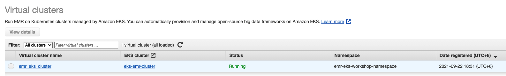
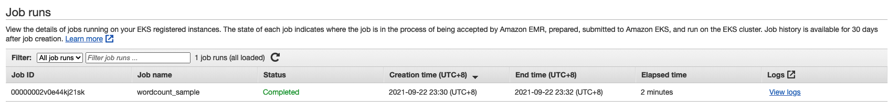
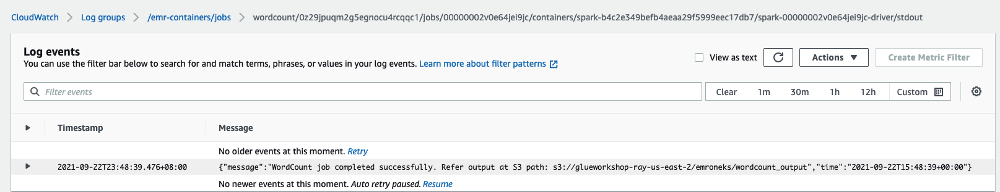
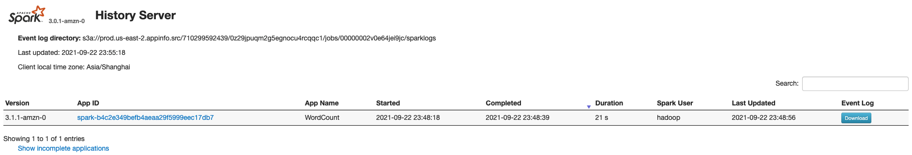
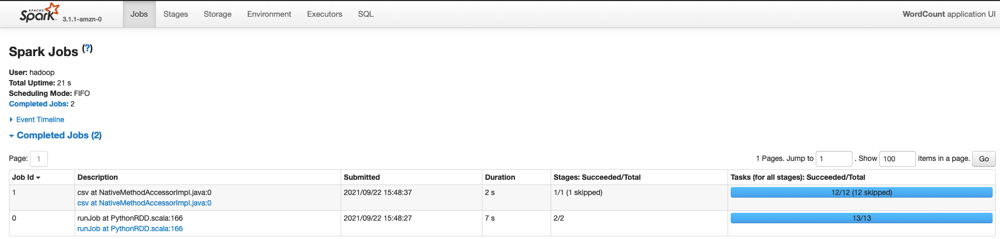
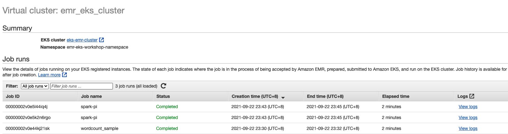
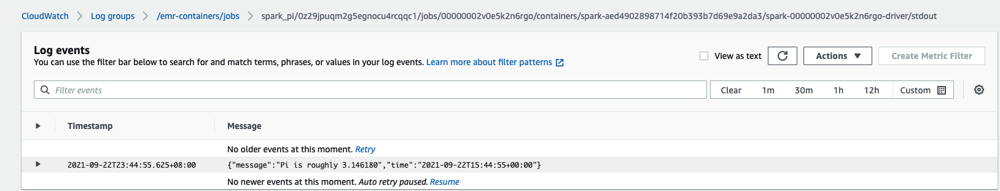
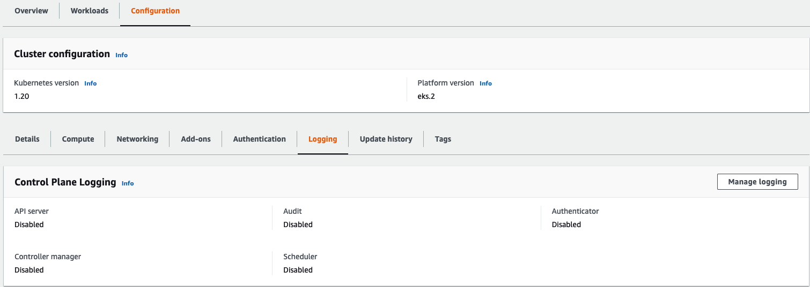
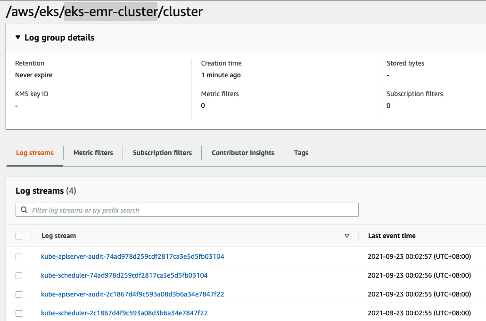

#  Running Spark applications with Amazon EMR on EKS 

This workshop help to learn how Amazon EMR on EKS works and how to run spark applications using this deployment option
 - Create EMR virtual clusters that point to namespace on Amazon EKS
- Submit Spark jobs to virtual clusters
- Use managed linux nodes or fargate profiles for Amazon EKS nodegroup
- Use Spark UI and Kubernetes dashboard for monitoring and debugging
- Use advanced features such as pod templates

## Follow up the guide to setup the environment
1. (optional) Setup the VPC by using [CloudFormation Template](https://aws-data-analytics-workshops.s3.amazonaws.com/emr-eks-workshop/cloudformation/eks_vpc_stack.yml)

2. Setup the tools
- The latest version of AWS CLI.
- kubectl version 1.20 or later.
- The latest version of eksctl .

3. Set up an Amazon EKS cluster
```bash
eksctl create cluster \
--name eks-emr-cluster --region us-east-2 \
--with-oidc \
--ssh-access --ssh-public-key ruiliang-keypair-us-east-2 \
--instance-types=m5.xlarge --managed

[✔]  EKS cluster "eks-emr-cluster" in "us-east-2" region is ready

kubectl get nodes -o wide
NAME                                          STATUS   ROLES    AGE    VERSION
ip-192-168-45-41.us-east-2.compute.internal   Ready    <none>   106m   v1.20.7-eks-135321   
ip-192-168-66-41.us-east-2.compute.internal   Ready    <none>   106m   v1.20.7-eks-135321 

kubectl get pods --all-namespaces
NAMESPACE     NAME                       READY   STATUS    RESTARTS   AGE
kube-system   aws-node-n8rh7             1/1     Running   1          107m
kube-system   aws-node-vgg2f             1/1     Running   1          107m
kube-system   coredns-5c778788f4-484bp   1/1     Running   1          119m
kube-system   coredns-5c778788f4-p2dx2   1/1     Running   1          119m
kube-system   kube-proxy-nnw5x           1/1     Running   1          107m
kube-system   kube-proxy-pbv2p           1/1     Running   1          107m
```

4. Enable cluster access for Amazon EMR on EKS

You must allow Amazon EMR on EKS access to a specific namespace in your cluster by taking the following actions: creating a Kubernetes role, binding the role to a Kubernetes user, and mapping the Kubernetes user with the service linked role `AWSServiceRoleForAmazonEMRContainers`.

```bash
#Create a namespace on EKS for EMR cluster
kubectl create namespace emr-eks-workshop-namespace

#Create a namespace on EKS Fargate for EMR cluster
kubectl create namespace eks-fargate

# IAM identity mapping the Amazon EMR on EKS service-linked role with the emr-containers user.
eksctl create iamidentitymapping \
    --cluster eks-emr-cluster --region us-east-2 \
    --namespace emr-eks-workshop-namespace \
    --service-name "emr-containers"

# Create Amazon EMR Cluster in EKS eks-fargate namespace
eksctl create iamidentitymapping \
    --cluster eks-emr-cluster --region us-east-2 \
    --namespace eks-fargate \
    --service-name "emr-containers"
```

5. Enable IAM Roles for Service Accounts (IRSA) on the EKS cluster 

```bash
# To get cluster.identity.oidc.issuer
aws eks describe-cluster --name eks-emr-cluster --query "cluster.identity.oidc.issuer" --region us-east-2 --output text

# Create your OIDC identity provider for your cluster
eksctl utils associate-iam-oidc-provider --cluster eks-emr-cluster --approve --region us-east-2
```

6. Create a job execution role
- Role: EMR_EKS_Job_Execution_Role for eks.amazonaws.com
- Role Policy
```json
{
    "Version": "2012-10-17",
    "Statement": [
        {
            "Effect": "Allow",
            "Action": [
                "s3:PutObject",
                "s3:GetObject",
                "s3:ListBucket",
                "s3:DeleteObject"
            ],
            "Resource": "*"
        },
        {
            "Effect": "Allow",
            "Action": [
                "logs:PutLogEvents",
                "logs:CreateLogStream",
                "logs:CreateLogGroup",
                "logs:DescribeLogGroups",
                "logs:DescribeLogStreams"
            ],
            "Resource": [
                "arn:aws:logs:*:*:*"
            ]
        }
    ]
}  
```
- Update the trust policy of the job execution role
```bash
 aws emr-containers update-role-trust-policy \
       --cluster-name eks-emr-cluster --region us-east-2 \
       --namespace emr-eks-workshop-namespace \
       --role-name EMR_EKS_Job_Execution_Role

aws emr-containers update-role-trust-policy \
       --cluster-name eks-emr-cluster --region us-east-2 \
       --namespace eks-fargate \
       --role-name EMR_EKS_Job_Execution_Role
```

7. Grant users access to Amazon EMR on EKS
- Policy： AmazonEMROnEKSPolicy
```json
{
    "Version": "2012-10-17",
    "Statement": [
        {
            "Effect": "Allow",
            "Action": [
                "iam:CreateServiceLinkedRole"
            ],
            "Resource": "*",
            "Condition": {
                "StringLike": {
                    "iam:AWSServiceName": "emr-containers.amazonaws.com"
                }
            }
        },
        {
            "Effect": "Allow",
            "Action": [
                "emr-containers:CreateVirtualCluster",
                "emr-containers:ListVirtualClusters",
                "emr-containers:DescribeVirtualCluster",
                "emr-containers:DeleteVirtualCluster"
            ],
            "Resource": "*"
        },
        {
            "Effect": "Allow",
            "Action": [
                "emr-containers:StartJobRun",
                "emr-containers:ListJobRuns",
                "emr-containers:DescribeJobRun",
                "emr-containers:CancelJobRun"
            ],
            "Resource": "*"
        },
        {
            "Effect": "Allow",
            "Action": [
                "emr-containers:DescribeJobRun",
                "elasticmapreduce:*"
            ],
            "Resource": "*"
        },
        {
            "Effect": "Allow",
            "Action": [
                "s3:GetObject",
                "s3:ListBucket"
            ],
            "Resource": "*"
        },
        {
            "Effect": "Allow",
            "Action": [
                "logs:Get*",
                "logs:DescribeLogGroups",
                "logs:DescribeLogStreams"
            ],
            "Resource": "*"
        }
    ]
}
```

8. Register the Amazon EKS cluster with Amazon EMR
```bash
aws emr-containers create-virtual-cluster \
--name emr_eks_cluster --region us-east-2 \
--container-provider '{
    "id":   "eks-emr-cluster",
    "type": "EKS",
    "info": {
        "eksInfo": {
            "namespace": "emr-eks-workshop-namespace"
        }
    }
}' 

eksctl get cluster --region us-east-2
NAME            REGION          EKSCTL CREATED
eks-emr-cluster us-east-2       True

aws emr-containers list-virtual-clusters --region us-east-2
```



# Submit jobs to EMR on EKS
1. Prepare the required info for job submit
```bash
export EMR_EKS_CLUSTER_ID=<virtual-cluster-id>
export EMR_EKS_EXECUTION_ARN=<arn:aws:iam::xxxxx:role/EMR_EKS_Job_Execution_Role>
export S3_BUCKET=<S3Bucket>
```

2. Submit wordcount pySpark job
```bash
aws emr-containers start-job-run \
--virtual-cluster-id ${EMR_EKS_CLUSTER_ID} \
--name wordcount_sample  --region us-east-2 \
--execution-role-arn ${EMR_EKS_EXECUTION_ARN} \
--release-label emr-6.3.0-latest \
--job-driver '{
  "sparkSubmitJobDriver": {
    "entryPoint": "s3://us-east-2.elasticmapreduce/emr-containers/samples/wordcount/scripts/wordcount.py",
    "entryPointArguments": ["s3://'"${S3_BUCKET}"'/emroneks/wordcount_output"],
    "sparkSubmitParameters": "--conf spark.executor.instances=2 --conf spark.executor.memory=2G --conf spark.executor.cores=2 --conf spark.driver.cores=1"
  }
}' \
--configuration-overrides '{
  "monitoringConfiguration": {
    "cloudWatchMonitoringConfiguration": {
      "logGroupName": "/emr-containers/jobs",
      "logStreamNamePrefix": "wordcount"
    },
    "s3MonitoringConfiguration": {
       "logUri": "s3://'"${S3_BUCKET}"'/emroneks/loggings/"
    }
  }
}'
```

3. Check the job status and logging
- You can check your job on EMR console


- Logging
    - S3 bucket: `s3://${S3_BUCKET}/emroneks/loggings/${EMR_EKS_CLUSTER_ID}/jobs/${JOB_ID}/`
    - CloudWatch logs: 
    

- Spark History Server - `Choose View logs` on EMR console job



4. Running the same job with a different EMR version
```bash
# emr-6.2.0-latest
aws emr-containers start-job-run \
--virtual-cluster-id ${EMR_EKS_CLUSTER_ID} \
--name spark-pi --region us-east-2 \
--execution-role-arn ${EMR_EKS_EXECUTION_ARN} \
--release-label emr-6.2.0-latest \
--job-driver '{
    "sparkSubmitJobDriver": {
        "entryPoint": "s3://aws-data-analytics-workshops/emr-eks-workshop/scripts/pi.py",
        "sparkSubmitParameters": "--conf spark.executor.instances=2 --conf spark.executor.memory=2G --conf spark.executor.cores=2 --conf spark.driver.cores=1"
        }
    }' \
--configuration-overrides '{
  "applicationConfiguration": [
      {
        "classification": "spark-defaults", 
        "properties": {
          "spark.driver.memory":"2G"
         }
      }
    ], 
  "monitoringConfiguration": {
    "cloudWatchMonitoringConfiguration": {
      "logGroupName": "/emr-containers/jobs",
      "logStreamNamePrefix": "spark_pi"
    },
    "s3MonitoringConfiguration": {
       "logUri": "s3://'"${S3_BUCKET}"'/emroneks/loggings/"
    }
  }
}'

# emr-5.33.0-latest
aws emr-containers start-job-run \
--virtual-cluster-id ${EMR_EKS_CLUSTER_ID} \
--name spark-pi --region us-east-2 \
--execution-role-arn ${EMR_EKS_EXECUTION_ARN} \
--release-label emr-5.33.0-latest \
--job-driver '{
    "sparkSubmitJobDriver": {
        "entryPoint": "s3://aws-data-analytics-workshops/emr-eks-workshop/scripts/pi.py",
        "sparkSubmitParameters": "--conf spark.executor.instances=2 --conf spark.executor.memory=2G --conf spark.executor.cores=2 --conf spark.driver.cores=1"
        }
    }' \
--configuration-overrides '{
  "applicationConfiguration": [
      {
        "classification": "spark-defaults", 
        "properties": {
          "spark.driver.memory":"2G"
         }
      }
    ], 
  "monitoringConfiguration": {
    "cloudWatchMonitoringConfiguration": {
      "logGroupName": "/emr-containers/jobs",
      "logStreamNamePrefix": "spark_pi"
    },
    "s3MonitoringConfiguration": {
       "logUri": "s3://${S3_BUCKET}/emroneks/loggings/"
    }
  }
}'
    
```





5. EKS Cluster Logging

    You can enable the 5 types of EKS Cluster control plane logs 
    - api
    - audit
    - authenticator
    - controllerManager
    - scheduler
    

- Enable Audit and Scheduler and choose Save changes. 
- Submit sample job
    ```bash
    aws emr-containers start-job-run \
    --virtual-cluster-id ${EMR_EKS_CLUSTER_ID} \
    --name spark-pi \
    --execution-role-arn ${EMR_EKS_EXECUTION_ARN} \
    --release-label emr-6.2.0-latest \
    --job-driver '{
        "sparkSubmitJobDriver": {
            "entryPoint": "s3://aws-data-analytics-workshops/emr-eks-workshop/scripts/pi.py",
            "sparkSubmitParameters": "--conf spark.executor.instances=2 --conf spark.executor.memory=2G --conf spark.executor.cores=2 --conf spark.driver.cores=1"
            }
        }'
    ```

- Choose Logs -> Log groups -> /aws/eks/${EKS_CLUSTER_NAME}/cluster 


# Reference
[emr-on-eks.workshop](https://emr-on-eks.workshop.aws/introduction.html)