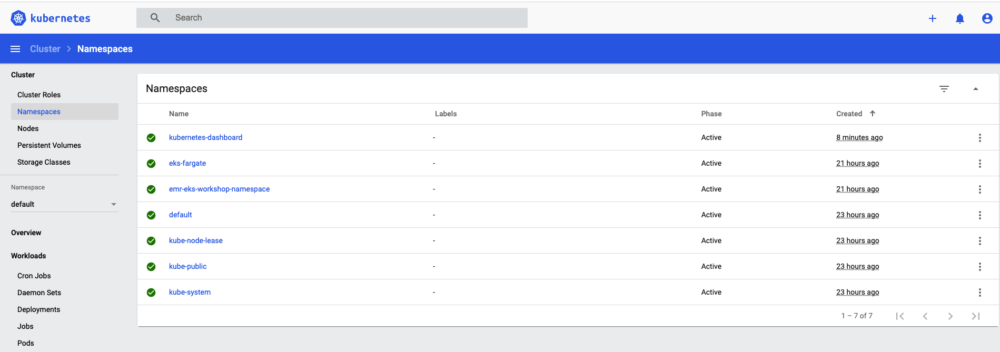
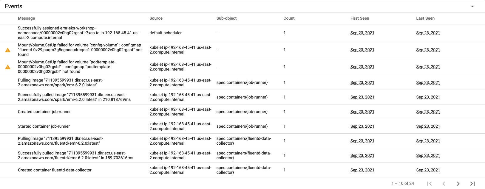
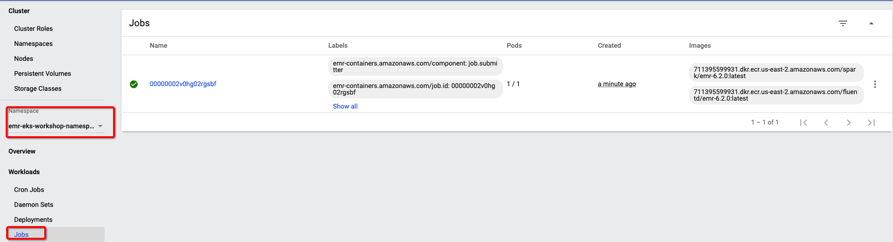
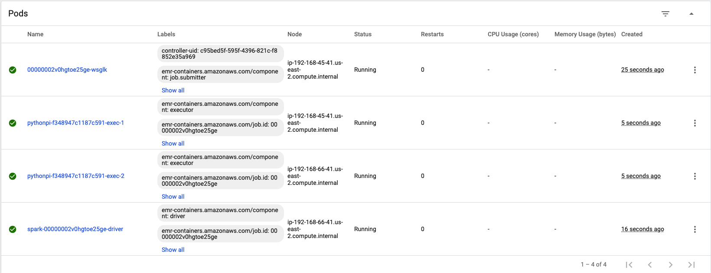
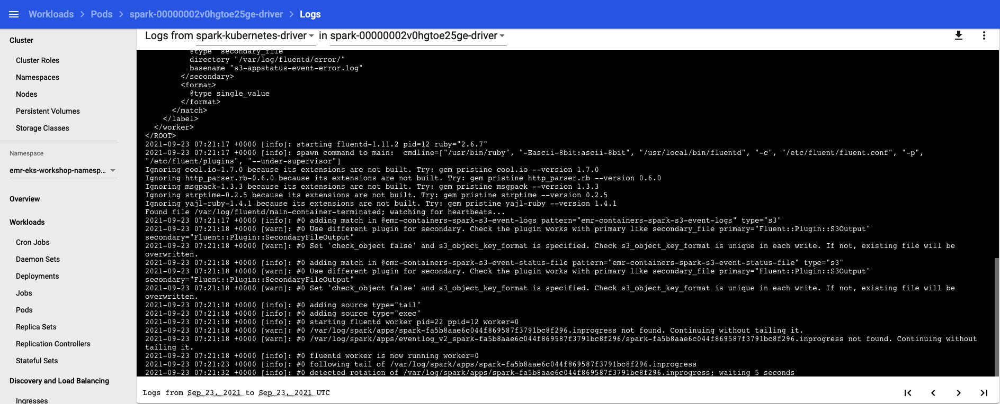

# Monitoring and logging

1. Check the job status and logging
- You can check your job on EMR console


- Logging
    - S3 bucket: `s3://${S3_BUCKET}/emroneks/loggings/${EMR_EKS_CLUSTER_ID}/jobs/${JOB_ID}/`
    - CloudWatch logs: 
    

2. Spark History Server - `Choose View logs` on EMR console job


3. EKS Cluster Logging

    You can enable the 5 types of EKS Cluster control plane logs 
    - api
    - audit
    - authenticator
    - controllerManager
    - scheduler
    

- Enable Audit and Scheduler and choose Save changes. 
- Submit sample job
    ```bash
    aws emr-containers start-job-run \
    --virtual-cluster-id ${EMR_EKS_CLUSTER_ID} \
    --name spark-pi --region us-east-2 \
    --execution-role-arn ${EMR_EKS_EXECUTION_ARN} \
    --release-label emr-6.2.0-latest \
    --job-driver '{
        "sparkSubmitJobDriver": {
            "entryPoint": "s3://aws-data-analytics-workshops/emr-eks-workshop/scripts/pi.py",
            "sparkSubmitParameters": "--conf spark.executor.instances=2 --conf spark.executor.memory=2G --conf spark.executor.cores=2 --conf spark.driver.cores=1"
            }
        }'
    ```

- Choose Logs -> Log groups -> /aws/eks/${EKS_CLUSTER_NAME}/cluster 


4. Deploy Kubernetes Dashboard

- You can use Dashboard to get an overview of applications running on your cluster

```bash
export DASHBOARD_VERSION="v2.0.0"
kubectl apply -f https://raw.githubusercontent.com/kubernetes/dashboard/${DASHBOARD_VERSION}/aio/deploy/recommended.yaml

kubectl get pods -n kubernetes-dashboard
NAME                                         READY   STATUS    RESTARTS   AGE
dashboard-metrics-scraper-7b59f7d4df-4tzbl   1/1     Running   0          17s
kubernetes-dashboard-74d688b6bc-c59tb        1/1     Running   0          17s
k
ubectl get svc -n kubernetes-dashboard
NAME                        TYPE        CLUSTER-IP       EXTERNAL-IP   PORT(S)    AGE
dashboard-metrics-scraper   ClusterIP   10.100.229.115   <none>        8000/TCP   55s
kubernetes-dashboard        ClusterIP   10.100.166.102   <none>        443/TCP    55s

# You can access Dashboard using the kubectl command-line tool by running proxy
# This will start the proxy, listen on port 8080, listen on all interfaces, and will disable the filtering of non-localhost requests.
kubectl proxy --port=8080 --address=0.0.0.0 --disable-filter=true &

# Access the Web GUI
/api/v1/namespaces/kubernetes-dashboard/services/https:kubernetes-dashboard:/proxy/

# Token Value
aws eks get-token --cluster-name eks-emr-cluster --region us-east-2 | jq -r '.status.token'
```



- Submit the sample job
```bash
aws emr-containers start-job-run \
--virtual-cluster-id ${EMR_EKS_CLUSTER_ID} \
--name spark-pi-dashboard --region us-east-2 \
--execution-role-arn ${EMR_EKS_EXECUTION_ARN} \
--release-label emr-6.2.0-latest \
--job-driver '{
    "sparkSubmitJobDriver": {
        "entryPoint": "s3://aws-data-analytics-workshops/emr-eks-workshop/scripts/pi.py",
        "sparkSubmitParameters": "--conf spark.executor.instances=2 --conf spark.executor.memory=2G --conf spark.executor.cores=2 --conf spark.driver.cores=1"
        }
    }'
```

- Change the namespace to `emr-eks-workshop-namespace` 

- Check the events


- On Kubernetes Dashboard choose Jobs


- On Kubernetes Dashboard choose Pods.


    Click the three dots on the running driver pod and choose logs. Select spark-kubernetes-driver from the drop down and view the driver logs.


# Reference
[emr-on-eks.workshop](https://emr-on-eks.workshop.aws/introduction.html)

[emr-on-eks guide](https://docs.aws.amazon.com/emr/latest/EMR-on-EKS-DevelopmentGuide/emr-eks.html)