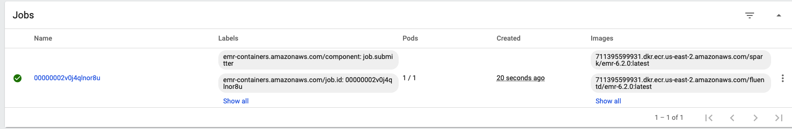
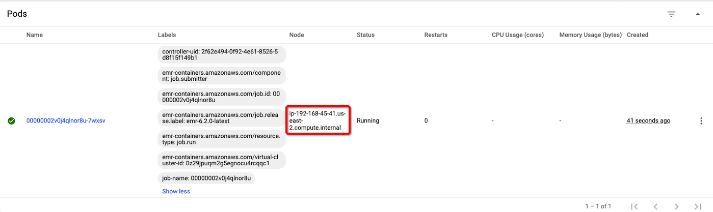

# Adance: Node Placement

A Spark application whose driver and executor pods are distributed across multiple AZs can incur inter-AZ data transfer costs. To minimize or eliminate inter-AZ data transfer costs, you can configure the application to only run on the nodes within a single AZ. Also, depending on your use case you might prefer to run the Spark application on specific Instance Types.

## Single AZ Placement
1. Go to Kubernetes Dashboard and choose Nodes and get the label of AZ of one Node to be submit job, for example: `topology.kubernetes.io/zone: us-east-2a`

`zone` is a built in label that EKS assigns to every EKS worker Node. The config will ensure to schedule the driver and executor pod on those EKS worker nodes labeled - `topology.kubernetes.io/zone:` . However, user defined labels can also be assigned to EKS worker nodes and used as node selector.

2. Submit the job to run only in Single AZ

```bash
--conf spark.kubernetes.node.selector.topology.kubernetes.io/zone='<availability zone>'
```

```bash
# Prepare the required info for job submit
export EMR_EKS_CLUSTER_ID=<virtual-cluster-id>
export EMR_EKS_EXECUTION_ARN=<arn:aws:iam::xxxxx:role/EMR_EKS_Job_Execution_Role>
export S3_BUCKET=<S3Bucket>
export AZ_LABLE=us-east-2a

# Submit job
aws emr-containers start-job-run \
--virtual-cluster-id ${EMR_EKS_CLUSTER_ID} \
--name spark-pi-single-az --region us-east-2 \
--execution-role-arn ${EMR_EKS_EXECUTION_ARN} \
--release-label emr-6.2.0-latest \
--job-driver '{
    "sparkSubmitJobDriver": {
        "entryPoint": "s3://aws-data-analytics-workshops/emr-eks-workshop/scripts/pi.py",
        "sparkSubmitParameters": "--conf spark.kubernetes.node.selector.topology.kubernetes.io/zone='"${AZ_LABLE}"' --conf spark.executor.instances=1 --conf spark.executor.memory=2G --conf spark.executor.cores=1 --conf spark.driver.cores=1"
        }
    }' \
--configuration-overrides '{
    "applicationConfiguration": [
      {
        "classification": "spark-defaults", 
        "properties": {
          "spark.driver.memory":"2G"
         }
      }
    ], 
    "monitoringConfiguration": {
      "cloudWatchMonitoringConfiguration": {
        "logGroupName": "/emr-containers/jobs", 
        "logStreamNamePrefix": "emr-eks-workshop"
      }, 
      "s3MonitoringConfiguration": {
       "logUri": "s3://'"${S3_BUCKET}"'/emroneks/loggings/"
      }
    }
}'

aws emr-containers cancel-job-run \
--virtual-cluster-id ${EMR_EKS_CLUSTER_ID} \
--id <JOB_ID> --region us-east-2
```

3. Go to Kubernetes Dashboard to check the job and pod





4. Single AZ and Instance Type Placement

The label related to Single AZ and Instance Type Placement `topology.kubernetes.io/zone: us-east-1b` and `node.kubernetes.io/instance-type: r5.xlarge`. You can use it when you node groups is mixed instance type fleet.

```bash
spark.kubernetes.node.selector.topology.kubernetes.io/zone:<availability zone>
spark.kubernetes.node.selector.node.kubernetes.io/instance-type:<instance type>
```

```bash
aws emr-containers start-job-run \
--virtual-cluster-id ${EMR_EKS_CLUSTER_ID} \
--name spark-pi-single-az-instance-type --region us-east-2 \
--execution-role-arn ${EMR_EKS_EXECUTION_ARN} \
--release-label emr-6.2.0-latest \
--job-driver '{
    "sparkSubmitJobDriver": {
        "entryPoint": "s3://aws-data-analytics-workshops/emr-eks-workshop/scripts/pi.py",
        "sparkSubmitParameters": "--conf spark.executor.instances=1 --conf spark.executor.memory=2G --conf spark.executor.cores=1 --conf spark.driver.cores=1"
        }
    }' \
--configuration-overrides '{
    "applicationConfiguration": [
      {
        "classification": "spark-defaults", 
        "properties": {
          "spark.driver.memory":"2G",
          "spark.kubernetes.node.selector.topology.kubernetes.io/zone":"us-east-1b",
          "spark.kubernetes.node.selector.node.kubernetes.io/instance-type":"m5.xlarge"
         }
      }
    ], 
    "monitoringConfiguration": {
      "cloudWatchMonitoringConfiguration": {
        "logGroupName": "/emr-containers/jobs", 
        "logStreamNamePrefix": "emr-eks-workshop"
      }, 
      "s3MonitoringConfiguration": {
        "logUri": "s3://'"${S3_BUCKET}"'/emroneks/loggings/"
      }
    }
}'
```

# Reference
[emr-on-eks.workshop](https://emr-on-eks.workshop.aws/introduction.html)

[emr-on-eks guide](https://docs.aws.amazon.com/emr/latest/EMR-on-EKS-DevelopmentGuide/emr-eks.html)

