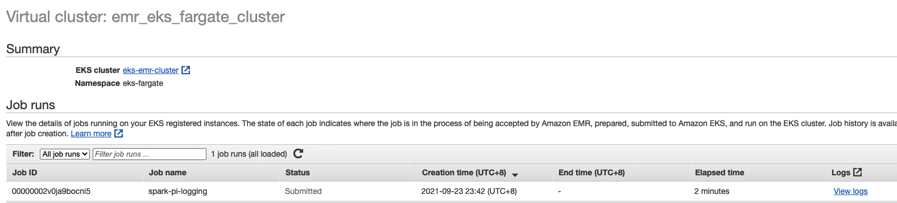
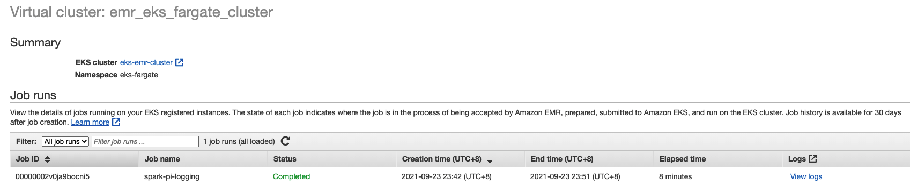

# Spark with AWS Fargate

1. Create the Fargate profiles
```bash
eksctl create fargateprofile --cluster eks-emr-cluster \
    --name emr_eks_default --namespace eks-fargate --region us-east-2
```

2. Create a new EMR virtual cluster to be used with fargate profile
```bash
aws emr-containers create-virtual-cluster \
--name emr_eks_fargate_cluster --region us-east-2 \
--container-provider '{
    "id":   "eks-emr-cluster",
    "type": "EKS",
    "info": {
        "eksInfo": {
            "namespace": "eks-fargate"
        }
    }
}'

eksctl get cluster --region us-east-2
NAME            REGION          EKSCTL CREATED
eks-emr-cluster us-east-2       True

aws emr-containers list-virtual-clusters --region us-east-2

export EMR_FARGATE_VIRTUAL_CLUSTER_ID=<EMR_FARGATE_VIRTUAL_CLUSTER_ID>
```

3. Submit jobs to Fargate.

You can control which pods start on Fargate and how they run with Fargate profiles

```bash

aws emr-containers start-job-run \
--virtual-cluster-id ${EMR_FARGATE_VIRTUAL_CLUSTER_ID} \
--name spark-pi-logging --region us-east-2 \
--execution-role-arn ${EMR_EKS_EXECUTION_ARN} \
--release-label emr-6.2.0-latest \
--job-driver '{
    "sparkSubmitJobDriver": {
        "entryPoint": "s3://aws-data-analytics-workshops/emr-eks-workshop/scripts/pi.py",
        "sparkSubmitParameters": "--conf spark.executor.instances=2 --conf spark.executor.memory=2G --conf spark.executor.cores=2 --conf spark.driver.cores=1"
        }
    }' \
--configuration-overrides '{
    "applicationConfiguration": [
      {
        "classification": "spark-defaults", 
        "properties": {
          "spark.driver.memory":"2G"
         }
      }
    ], 
    "monitoringConfiguration": {
      "cloudWatchMonitoringConfiguration": {
        "logGroupName": "/emr-containers/jobs", 
        "logStreamNamePrefix": "spark-pi-fargate"
      }, 
      "s3MonitoringConfiguration": {
        "logUri": "s3://'"${S3_BUCKET}"'/emroneks/loggings/"
      }
    }
}'
```

3. Check the staus of job on Kubernetes Dashboard or by CLI
```bash
kubectl get all -n eks-fargate
NAME                                   READY   STATUS              RESTARTS   AGE
pod/00000002v0ja9bocni5-dvv8p          3/3     Running             0          4m40s
pod/spark-00000002v0ja9bocni5-driver   0/2     ContainerCreating   0          2m35s

NAME                                                            TYPE        CLUSTER-IP   EXTERNAL-IP   PORT(S)                      AGE
service/spark-00000002v0ja9bocni5-e710417c1354296b-driver-svc   ClusterIP   None         <none>        7078/TCP,7079/TCP,4040/TCP   2m33s

NAME                            COMPLETIONS   DURATION   AGE
job.batch/00000002v0ja9bocni5   0/1           4m40s      4m40s
```

4. Go to EMR Console -> Choose the emr_eks_fargate_cluster and check the status of the job.



5. Check the S3 bucket of logs. 
- Controller Logs - /logUri/virtual-cluster-id/jobs/job-id/containers/pod-name/(stderr.gz/stdout.gz)
- Driver Logs - /logUri/virtual-cluster-id/jobs/job-id/containers/spark-application-id/spark-job-id-driver/(stderr.gz/stdout.gz)
- Executor Logs - /logUri/virtual-cluster-id/jobs/job-id/containers/spark-application-id/executor-pod-name/(stderr.gz/stdout.gz)

Explore the contents of the Driver logs and run a S3 Select query on stdout.gz.

```sql
SELECT * FROM s3object s LIMIT 5

Pi is roughly 3.137640
```
