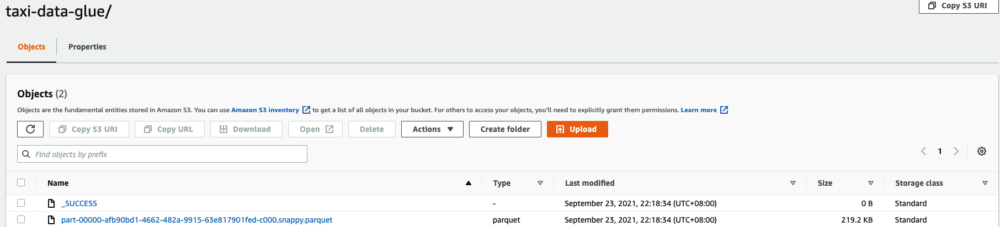
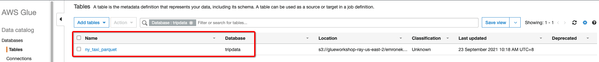

# Submit complex Spark ETL Job

Spark reads NY Taxi Trip data from Amazon S3. The script updates the timestamp column, prints the schema and row count and finally writes the data in parquet format to Amazon S3.

1. Submit complex Spark ETL Job
2. Glue MetaStore integraton

## Submit complex Spark ETL Job
1. Prepare the required info for job submit
```bash
export EMR_EKS_CLUSTER_ID=<virtual-cluster-id>
export EMR_EKS_EXECUTION_ARN=<arn:aws:iam::xxxxx:role/EMR_EKS_Job_Execution_Role>
export S3_BUCKET=<S3Bucket>
```

2. pySpark ETL Code
    ```python
    import sys
    from datetime import datetime

    from pyspark.sql import SparkSession
    from pyspark.sql.functions import *

    if __name__ == "__main__":

        print(len(sys.argv))
        if (len(sys.argv) != 3):
            print("Usage: spark-etl [input-folder] [output-folder]")
            sys.exit(0)

        spark = SparkSession\
            .builder\
            .appName("SparkETL")\
            .getOrCreate()

        nyTaxi = spark.read.option("inferSchema", "true").option("header", "true").csv(sys.argv[1])

        updatedNYTaxi = nyTaxi.withColumn("current_date", lit(datetime.now()))

        updatedNYTaxi.printSchema()

        print(updatedNYTaxi.show())

        print("Total number of records: " + str(updatedNYTaxi.count()))
        
        updatedNYTaxi.write.parquet(sys.argv[2])
    ```

3. Submit Job
    ```bash
    aws emr-containers start-job-run \
    --virtual-cluster-id ${EMR_EKS_CLUSTER_ID} \
    --name spark-etl --region us-east-2 \
    --execution-role-arn ${EMR_EKS_EXECUTION_ARN} \
    --release-label emr-5.33.0-latest \
    --job-driver '{
        "sparkSubmitJobDriver": {
            "entryPoint": "s3://aws-data-analytics-workshops/emr-eks-workshop/scripts/spark-etl.py",
            "entryPointArguments": ["s3://aws-data-analytics-workshops/shared_datasets/tripdata/",
            "'"s3://${S3_BUCKET}"'/emroneks/taxi-data/"
            ],
            "sparkSubmitParameters": "--conf spark.executor.instances=2 --conf spark.executor.memory=2G --conf spark.executor.cores=2 --conf spark.driver.cores=1"
            }
        }' \
    --configuration-overrides '{
        "applicationConfiguration": [
        {
            "classification": "spark-defaults", 
            "properties": {
            "spark.driver.memory":"2G"
            }
        }
        ], 
        "monitoringConfiguration": {
        "cloudWatchMonitoringConfiguration": {
            "logGroupName": "/emr-containers/jobs", 
            "logStreamNamePrefix": "spark-etl"
        }, 
        "s3MonitoringConfiguration": {
            "logUri": "s3://'"${S3_BUCKET}"'/emroneks/loggings/"
        }
        }
    }'
    ```

4. Check the S3 output of the Spark ETL job.
- Check the S3 output folder


- Using S3 select to check the output
    ```sql
    SELECT * FROM s3object s LIMIT 5
    {
    "VendorID": 2,
    "lpep_pickup_datetime": "1/1/17 0:01",
    "lpep_dropoff_datetime": "1/1/17 0:11",
    "store_and_fwd_flag": "N",
    "RatecodeID": 1,
    "PULocationID": 42,
    "DOLocationID": 166,
    "passenger_count": 1,
    "trip_distance": 1.71,
    "fare_amount": 9,
    "extra": 0,
    "mta_tax": 0.5,
    "tip_amount": 0,
    "tolls_amount": 0,
    "improvement_surcharge": 0.3,
    "total_amount": 9.8,
    "payment_type": 2,
    "trip_type": 1,
    "current_date": 4.5369416561201048367422296e+25
    }
    ```

## AWS Glue MetaStore Integration
1. Add the permission to $EMR_EKS_EXECUTION_ARN
    ```json
    {
                "Sid": "VisualEditor1",
                "Effect": "Allow",
                "Action": [
                    "glue:ListSchemaVersions",
                    "glue:DeleteDatabase",
                    "glue:DeleteTableVersion",
                    "glue:UpdateTable",
                    "glue:DeleteTable",
                    "s3:ListBucket",
                    "glue:GetSchema",
                    "glue:ImportCatalogToGlue",
                    "glue:DeleteSchema",
                    "glue:ListSchemas",
                    "glue:CreatePartition",
                    "s3:DeleteObject",
                    "glue:UpdatePartition",
                    "glue:GetSchemaByDefinition",
                    "glue:RegisterSchemaVersion",
                    "glue:UpdateDatabase",
                    "glue:CreateTable",
                    "glue:GetTables",
                    "glue:GetSchemaVersionsDiff",
                    "glue:UpdateSchema",
                    "glue:GetDatabases",
                    "glue:GetTable",
                    "glue:GetDatabase",
                    "glue:PutSchemaVersionMetadata",
                    "s3:PutObject",
                    "s3:GetObject",
                    "glue:GetSchemaVersion",
                    "glue:QuerySchemaVersionMetadata",
                    "glue:CreateDatabase",
                    "glue:BatchDeleteTableVersion",
                    "glue:CreateSchema",
                    "glue:BatchDeleteTable",
                    "glue:DeleteSchemaVersions",
                    "glue:DeletePartition"
                ],
                "Resource": "*"
    }
    ```
    
2. Using the Glue Metastore with SparkSQL
    ```python
    import sys
    from datetime import datetime

    from pyspark.sql import SparkSession
    from pyspark.sql import SQLContext
    from pyspark.sql.functions import *

    if __name__ == "__main__":

        print(len(sys.argv))
        if (len(sys.argv) != 4):
            print("Usage: spark-etl-glue [input-folder] [output-folder] [dbName]")
            sys.exit(0)

        spark = SparkSession\
            .builder\
            .appName("Python Spark SQL Glue integration example")\
            .enableHiveSupport()\
            .getOrCreate()

        nyTaxi = spark.read.option("inferSchema", "true").option("header", "true").csv(sys.argv[1])

        updatedNYTaxi = nyTaxi.withColumn("current_date", lit(datetime.now()))

        updatedNYTaxi.printSchema()

        print(updatedNYTaxi.show())

        print("Total number of records: " + str(updatedNYTaxi.count()))
        
        updatedNYTaxi.write.parquet(sys.argv[2])

        updatedNYTaxi.registerTempTable("ny_taxi_table")

        dbName = sys.argv[3]
        spark.sql("CREATE database if not exists " + dbName)
        spark.sql("USE " + dbName)
        spark.sql("CREATE table if not exists ny_taxi_parquet USING PARQUET LOCATION '" + sys.argv[2] + "' AS SELECT * from ny_taxi_table ")
    ```

3. Submit Job
    ```bash
    aws emr-containers start-job-run \
    --virtual-cluster-id ${EMR_EKS_CLUSTER_ID} \
    --name spark-etl-s3-awsglue-integration --region us-east-2 \
    --execution-role-arn ${EMR_EKS_EXECUTION_ARN} \
    --release-label emr-5.33.0-latest \
    --job-driver '{
        "sparkSubmitJobDriver": {
            "entryPoint": "s3://aws-data-analytics-workshops/emr-eks-workshop/scripts/spark-etl-glue.py",
            "entryPointArguments": [
            "s3://aws-data-analytics-workshops/shared_datasets/tripdata/","s3://'"${S3_BUCKET}"'/emroneks/taxi-data-glue/","tripdata"
            ],
            "sparkSubmitParameters": "--conf spark.executor.instances=2 --conf spark.executor.memory=2G --conf spark.executor.cores=2 --conf spark.driver.cores=1"
            }
        }' \
    --configuration-overrides '{
        "applicationConfiguration": [
        {
            "classification": "spark-defaults", 
            "properties": {
            "spark.hadoop.hive.metastore.client.factory.class":"com.amazonaws.glue.catalog.metastore.AWSGlueDataCatalogHiveClientFactory"
            }
        }
        ], 
        "monitoringConfiguration": {
        "cloudWatchMonitoringConfiguration": {
            "logGroupName": "/emr-containers/jobs", 
            "logStreamNamePrefix": "spark-etl-awsglue"
        }, 
        "s3MonitoringConfiguration": {
            "logUri": "s3://'"${S3_BUCKET}"'/emroneks/loggings/"
        }
        }
    }'
    ```

4. Check the S3 output of the Spark ETL job.
- Check the S3 output folder


- Using S3 select to check the output
    ```sql
    SELECT * FROM s3object s LIMIT 5
    {
    "VendorID": 2,
    "lpep_pickup_datetime": "1/1/17 0:01",
    "lpep_dropoff_datetime": "1/1/17 0:11",
    "store_and_fwd_flag": "N",
    "RatecodeID": 1,
    "PULocationID": 42,
    "DOLocationID": 166,
    "passenger_count": 1,
    "trip_distance": 1.71,
    "fare_amount": 9,
    "extra": 0,
    "mta_tax": 0.5,
    "tip_amount": 0,
    "tolls_amount": 0,
    "improvement_surcharge": 0.3,
    "total_amount": 9.8,
    "payment_type": 2,
    "trip_type": 1,
    "current_date": 4.5369416561201048367422296e+25
    }
    ```

5. The etl code create the database and table on Glue Catalog
    ```python
        dbName = sys.argv[3]
        spark.sql("CREATE database if not exists " + dbName)
        spark.sql("USE " + dbName)
        spark.sql("CREATE table if not exists ny_taxi_parquet USING PARQUET LOCATION '" + sys.argv[2] + "' AS SELECT * from ny_taxi_table ")
    ```

    Check the Glue console for new created table

    