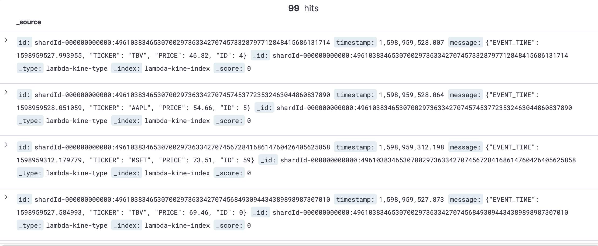
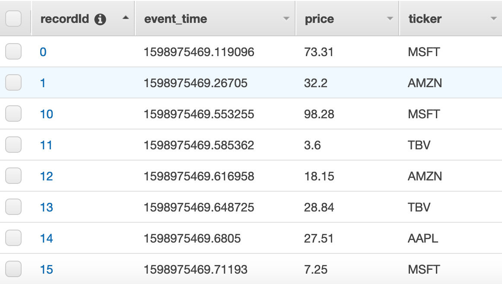

# Loading Streaming Data into Amazon Elasticsearch Service


- [Loading Streaming Data into Amazon ES from Amazon S3](https://docs.aws.amazon.com/elasticsearch-service/latest/developerguide/es-aws-integrations.html#es-aws-integrations-s3-lambda-es)
- [Loading Streaming Data into Amazon ES from Amazon Kinesis Data Streams](https://docs.aws.amazon.com/elasticsearch-service/latest/developerguide/es-aws-integrations.html#es-aws-integrations-kinesis)
- [Loading Streaming Data into Amazon ES from Amazon DynamoDB](https://docs.aws.amazon.com/elasticsearch-service/latest/developerguide/es-aws-integrations.html#es-aws-integrations-dynamodb-es)
- [Loading Streaming Data into Amazon ES from Amazon Kinesis Data Firehose](https://docs.aws.amazon.com/elasticsearch-service/latest/developerguide/es-aws-integrations.html#es-aws-integrations-fh)
- [Loading Streaming Data into Amazon ES from Amazon CloudWatch](https://docs.aws.amazon.com/elasticsearch-service/latest/developerguide/es-aws-integrations.html#es-aws-integrations-cloudwatch-es)
- [Loading Data into Amazon ES from AWS IoT](https://docs.aws.amazon.com/elasticsearch-service/latest/developerguide/es-aws-integrations.html#es-aws-integrations-cloudwatch-iot)

## Indexing Data in Amazon Elasticsearch Service Using AWS Lambda
1. Create the IAM Role `lambda-es-role` with `AWSLambdaExecute`, `AmazonESFullAccess`, `AmazonKinesisFullAccess`, `AmazonKinesisFirehoseFullAccess`, ` AWSLambdaVPCAccessExecutionRole` permissions
2. Create S3 bucket: `ray-aes-lab`
3. Create Amazon ES Domain: `lambda-es-endpoint` with version
  - Enable fine-grained access control
  - Create a Master User
  - Access Policy
  ```json
    {
      "Version": "2012-10-17",
      "Statement": [
        {
          "Effect": "Allow",
          "Principal": {
            "AWS": [
              "*"
            ]
          },
          "Action": [
            "es:*"
          ],
          "Resource": "arn:aws-cn:es:cn-north-1:account-id:domain/lambda-es-endpoint/*"
        }
      ]
    }
```

OR 

```json
{
      "Version": "2012-10-17",
      "Statement": [
        {
          "Effect": "Allow",
          "Principal": {
            "AWS": [
              "arn:aws-cn:iam::account-id:role/lambda-es-role"
            ]
          },
          "Action": [
            "es:*"
          ],
          "Resource": "arn:aws-cn:es:cn-north-1:account-id:domain/lambda-es-endpoint/*"
        }
      ]
    }
```

3. Create the function
```bash
cd s3-to-es
update the region = "cn-north-1" and es = "https://es_domain" in the sample.py

pip install requests -t .
pip install requests_aws4auth -t .
zip -r lambda.zip *

aws lambda create-function --function-name s3-es-indexing \
--zip-file fileb://lambda.zip --handler sample.handler --runtime python3.6 \
--role arn:aws-cn:iam::account-id:role/lambda-es-role --timeout 60 \
--vpc-config SubnetIds=subnet-08a7b60787d9ed6e6,subnet-0dc2a22813309951d,SecurityGroupIds=sg-0f9473a84c043ed49 \
--region cn-north-1

aws lambda update-function-code --function-name s3-es-indexing \
--zip-file fileb://lambda.zip --region cn-north-1
```

4. Set the S3 trigger
In `s3-es-indexing` configuration:
 - Choose S3 as trigger type
 - Choose the bucket `ray-aes-lab`
 - For Event type, choose `PUT`
 - For Prefix, type `logs/`
 - For Suffix, type `.log`.`
 - Select Enable trigger.

5. Create a file named sample.log with below content
```bash
12.345.678.90 - [01/Sep/2020:13:25:36 -0700] "PUT /some-file0.jpg"
12.345.678.91 - [01/Sep/2020:13:26:14 -0700] "GET /some-file1.jpg"
12.345.678.92 - [01/Sep/2020:13:26:15 -0700] "GET /some-file2.jpg"
12.345.678.91 - [01/Sep/2020:13:26:16 -0700] "GET /some-file3.jpg"
12.345.678.93 - [01/Sep/2020:13:26:18 -0700] "GET /some-file4.jpg"
12.345.678.91 - [01/Sep/2020:13:26:21 -0700] "GET /some-file5.jpg"
```

```
aws s3 cp sample.log s3://ray-aes-lab/logs/ --region cn-north-1
```

6. Verify the index created in ES domain
```bash
ssh -i ~/.ssh/your-key.pem ec2-user@your-ec2-instance-public-ip -N -L 9200:vpc-your-amazon-es-domain.region.es.amazonaws.com:443
Acccess: https://localhost:9200/_plugin/kibana/ in your web browser: username: TheMasterUser, password: your TheMasterUser password

Alternately, you can send requests
curl --user TheMasterUser:secrete https://localhost:9200/lambda-s3-index/_search?pretty

Or send request from ec2 in the same VPC of your ES domain
curl --user TheMasterUser:secrete $es_domain/lambda-s3-index/_search?pretty
```

Sample resposne

```json
{
  "took" : 5,
  "timed_out" : false,
  "_shards" : {
    "total" : 5,
    "successful" : 5,
    "skipped" : 0,
    "failed" : 0
  },
  "hits" : {
    "total" : {
      "value" : 6,
      "relation" : "eq"
    },
    "max_score" : 1.0,
    "hits" : [
      {
        "_index" : "lambda-s3-index",
        "_type" : "lambda-type",
        "_id" : "1q5hSHQB-eYtAfKokiN4",
        "_score" : 1.0,
        "_source" : {
          "ip" : "12.345.678.91",
          "timestamp" : "01/Sep/2020:13:26:14 -0700",
          "message" : "GET /some-file1.jpg"
        }
      },
      {
        "_index" : "lambda-s3-index",
        "_type" : "lambda-type",
        "_id" : "1a5hSHQB-eYtAfKokSPD",
        "_score" : 1.0,
        "_source" : {
          "ip" : "12.345.678.90",
          "timestamp" : "01/Sep/2020:13:25:36 -0700",
          "message" : "PUT /some-file0.jpg"
        }
      },
      {
        "_index" : "lambda-s3-index",
        "_type" : "lambda-type",
        "_id" : "165hSHQB-eYtAfKokyMX",
        "_score" : 1.0,
        "_source" : {
          "ip" : "12.345.678.92",
          "timestamp" : "01/Sep/2020:13:26:15 -0700",
          "message" : "GET /some-file2.jpg"
        }
      },
      {
        "_index" : "lambda-s3-index",
        "_type" : "lambda-type",
        "_id" : "2K5hSHQB-eYtAfKokyPM",
        "_score" : 1.0,
        "_source" : {
          "ip" : "12.345.678.91",
          "timestamp" : "01/Sep/2020:13:26:16 -0700",
          "message" : "GET /some-file3.jpg"
        }
      },
      {
        "_index" : "lambda-s3-index",
        "_type" : "lambda-type",
        "_id" : "2a5hSHQB-eYtAfKolCOA",
        "_score" : 1.0,
        "_source" : {
          "ip" : "12.345.678.93",
          "timestamp" : "01/Sep/2020:13:26:18 -0700",
          "message" : "GET /some-file4.jpg"
        }
      },
      {
        "_index" : "lambda-s3-index",
        "_type" : "lambda-type",
        "_id" : "2q5hSHQB-eYtAfKolSNl",
        "_score" : 1.0,
        "_source" : {
          "ip" : "12.345.678.91",
          "timestamp" : "01/Sep/2020:13:26:21 -0700",
          "message" : "GET /some-file5.jpg"
        }
      }
    ]
  }
}
```

7. Check the cloudwatch logs of lambda


## Loading Streaming Data into Amazon ES from Amazon Kinesis Data Streams
1. Create a Amazon Kinesis Data Streams `lambda-stream` with 1 Shard
```bash
aws kinesis create-stream --stream-name lambda-stream --shard-count 1 --region cn-north-1
```

2. Checkt below permisions included in IAM Role `lambda-es-role`
```json
{
  "Version": "2012-10-17",
  "Statement": [
    {
      "Effect": "Allow",
      "Action": [
        "es:ESHttpPost",
        "es:ESHttpPut",
        "logs:CreateLogGroup",
        "logs:CreateLogStream",
        "logs:PutLogEvents",
        "kinesis:GetShardIterator",
        "kinesis:GetRecords",
        "kinesis:DescribeStream",
        "kinesis:ListStreams"
      ],
      "Resource": "*"
    }
  ]
}
```

3. Create the function

```bash
cd kinesis-to-es
update the region = "cn-north-1" and es = "https://your_es_domain" in the sample.py

pip install requests -t .
pip install requests_aws4auth -t .
zip -r lambda.zip *

aws lambda create-function --function-name kinesis-es-indexing \
--zip-file fileb://lambda.zip --handler sample.handler --runtime python3.6 \
--role arn:aws-cn:iam::account-id:role/lambda-es-role --timeout 60 \
--vpc-config SubnetIds=subnet-08a7b60787d9ed6e6,subnet-0dc2a22813309951d,SecurityGroupIds=sg-0f9473a84c043ed49 \
--region cn-north-1

aws lambda update-function-code --function-name kinesis-es-indexing \
--zip-file fileb://lambda.zip --region cn-north-1
```

4. Add the Kinesis Trigger for lambda function `kinesis-es-indexing`
  - Kinesis stream: `lambda-stream`
  - Batch size: 100
  - Starting position: Trim horizon
  - Enable trigger

5. Testing and Verify the index created in ES domain
- Generate the steam data
```bash
python stock-producer.py
```

- Verify the index created in ES domain
```bash
ssh -i ~/.ssh/your-key.pem ec2-user@your-ec2-instance-public-ip -N -L 9200:vpc-your-amazon-es-domain.region.es.amazonaws.com:443
Acccess: https://localhost:9200/_plugin/kibana/ in your web browser: username: TheMasterUser, password: your TheMasterUser password

Alternately, you can send requests
curl --user TheMasterUser:secrete https://localhost:9200/lambda-kine-index/_search?pretty

Or send request from ec2 in the same VPC of your ES domain
curl --user TheMasterUser:secrete $es_domain/lambda-kine-index/_search?pretty
```

Sample resposne

```json
{
  "took" : 6,
  "timed_out" : false,
  "_shards" : {
    "total" : 5,
    "successful" : 5,
    "skipped" : 0,
    "failed" : 0
  },
  "hits" : {
    "total" : {
      "value" : 99,
      "relation" : "eq"
    },
    "max_score" : 1.0,
    "hits" : [
      {
        "_index" : "lambda-kine-index",
        "_type" : "lambda-kine-type",
        "_id" : "shardId-000000000000:49610383465307002973633427074573328797712848415686131714",
        "_score" : 1.0,
        "_source" : {
          "id" : "shardId-000000000000:49610383465307002973633427074573328797712848415686131714",
          "timestamp" : 1.598959528007E9,
          "message" : "{\"EVENT_TIME\": 1598959527.993955, \"TICKER\": \"TBV\", \"PRICE\": 46.82, \"ID\": 4}"
        }
      },
      {
        "_index" : "lambda-kine-index",
        "_type" : "lambda-kine-type",
        "_id" : "shardId-000000000000:49610383465307002973633427074574537723532463044860837890",
        "_score" : 1.0,
        "_source" : {
          "id" : "shardId-000000000000:49610383465307002973633427074574537723532463044860837890",
          "timestamp" : 1.598959528064E9,
          "message" : "{\"EVENT_TIME\": 1598959528.051059, \"TICKER\": \"AAPL\", \"PRICE\": 54.66, \"ID\": 5}"
        }
      },
      {
        "_index" : "lambda-kine-index",
        "_type" : "lambda-kine-type",
        "_id" : "shardId-000000000000:49610383465307002973633427074567284168614760426405625858",
        "_score" : 1.0,
        "_source" : {
          "id" : "shardId-000000000000:49610383465307002973633427074567284168614760426405625858",
          "timestamp" : 1.598959312198E9,
          "message" : "{\"EVENT_TIME\": 1598959312.179779, \"TICKER\": \"MSFT\", \"PRICE\": 73.51, \"ID\": 59}"
        }
      },
      {
        "_index" : "lambda-kine-index",
        "_type" : "lambda-kine-type",
        "_id" : "shardId-000000000000:49610383465307002973633427074568493094434389898987307010",
        "_score" : 1.0,
        "_source" : {
          "id" : "shardId-000000000000:49610383465307002973633427074568493094434389898987307010",
          "timestamp" : 1.598959527873E9,
          "message" : "{\"EVENT_TIME\": 1598959527.584993, \"TICKER\": \"TBV\", \"PRICE\": 69.46, \"ID\": 0}"
        }
      },
      {
        "_index" : "lambda-kine-index",
        "_type" : "lambda-kine-type",
        "_id" : "shardId-000000000000:49610383465307002973633427074522553913289019009502543874",
        "_score" : 1.0,
        "_source" : {
          "id" : "shardId-000000000000:49610383465307002973633427074522553913289019009502543874",
          "timestamp" : 1.598959310752E9,
          "message" : "{\"EVENT_TIME\": 1598959310.732428, \"TICKER\": \"AAPL\", \"PRICE\": 51.12, \"ID\": 22}"
        }
      },
      {
        "_index" : "lambda-kine-index",
        "_type" : "lambda-kine-type",
        "_id" : "shardId-000000000000:49610383465307002973633427074524971764928248267851956226",
        "_score" : 1.0,
        "_source" : {
          "id" : "shardId-000000000000:49610383465307002973633427074524971764928248267851956226",
          "timestamp" : 1.598959310848E9,
          "message" : "{\"EVENT_TIME\": 1598959310.809484, \"TICKER\": \"AMZN\", \"PRICE\": 64.72, \"ID\": 24}"
        }
      },
      {
        "_index" : "lambda-kine-index",
        "_type" : "lambda-kine-type",
        "_id" : "shardId-000000000000:49610383465307002973633427074505628951814414201056657410",
        "_score" : 1.0,
        "_source" : {
          "id" : "shardId-000000000000:49610383465307002973633427074505628951814414201056657410",
          "timestamp" : 1.598959310216E9,
          "message" : "{\"EVENT_TIME\": 1598959310.196727, \"TICKER\": \"AAPL\", \"PRICE\": 67.19, \"ID\": 8}"
        }
      },
      {
        "_index" : "lambda-kine-index",
        "_type" : "lambda-kine-type",
        "_id" : "shardId-000000000000:49610383465307002973633427074506837877634028830231363586",
        "_score" : 1.0,
        "_source" : {
          "id" : "shardId-000000000000:49610383465307002973633427074506837877634028830231363586",
          "timestamp" : 1.598959310255E9,
          "message" : "{\"EVENT_TIME\": 1598959310.235484, \"TICKER\": \"AMZN\", \"PRICE\": 34.21, \"ID\": 9}"
        }
      },
      {
        "_index" : "lambda-kine-index",
        "_type" : "lambda-kine-type",
        "_id" : "shardId-000000000000:49610383465307002973633427074515300358371331234454306818",
        "_score" : 1.0,
        "_source" : {
          "id" : "shardId-000000000000:49610383465307002973633427074515300358371331234454306818",
          "timestamp" : 1.598959310523E9,
          "message" : "{\"EVENT_TIME\": 1598959310.503564, \"TICKER\": \"AMZN\", \"PRICE\": 22.08, \"ID\": 16}"
        }
      },
      {
        "_index" : "lambda-kine-index",
        "_type" : "lambda-kine-type",
        "_id" : "shardId-000000000000:49610383465307002973633427074564866316975531168056213506",
        "_score" : 1.0,
        "_source" : {
          "id" : "shardId-000000000000:49610383465307002973633427074564866316975531168056213506",
          "timestamp" : 1.598959312123E9,
          "message" : "{\"EVENT_TIME\": 1598959312.103498, \"TICKER\": \"INTC\", \"PRICE\": 39.34, \"ID\": 57}"
        }
      }
    ]
  }
}
```

Kibana Index Data



## Loading Streaming Data into Amazon ES from Amazon DynamoDB 
1. Create a DynamoDB table `lambda-es` with Hash Key `recordId` (String type)
```
aws dynamodb create-table \
    --table-name lambda-es \
    --attribute-definitions AttributeName=recordId,AttributeType=S --key-schema AttributeName=recordId,KeyType=HASH \
    --provisioned-throughput ReadCapacityUnits=5,WriteCapacityUnits=5 \
    --region cn-north-1
```

2. Checkt below permisions included in IAM Role `lambda-es-role`
{
  "Version": "2012-10-17",
  "Statement": [
    {
      "Effect": "Allow",
      "Action": [
        "es:ESHttpPost",
        "es:ESHttpPut",
        "dynamodb:DescribeStream",
        "dynamodb:GetRecords",
        "dynamodb:GetShardIterator",
        "dynamodb:ListStreams",
        "logs:CreateLogGroup",
        "logs:CreateLogStream",
        "logs:PutLogEvents"
      ],
      "Resource": "*"
    }
  ]
}

3. Create the function

```bash
cd dynamo-to-es
update the region = "cn-north-1" and es = "https://your_es_domain" in the sample.py

pip install requests -t .
pip install requests_aws4auth -t .
zip -r lambda.zip *

aws lambda create-function --function-name dynamodb-es-indexing \
--zip-file fileb://lambda.zip --handler sample.handler --runtime python3.6 \
--role arn:aws-cn:iam::account-id:role/lambda-es-role --timeout 60 \
--vpc-config SubnetIds=subnet-08a7b60787d9ed6e6,subnet-0dc2a22813309951d,SecurityGroupIds=sg-0f9473a84c043ed49 \
--region cn-north-1

aws lambda update-function-code --function-name dynamodb-es-indexing \
--zip-file fileb://lambda.zip --region cn-north-1
```

4. Add the DyamoDB Trigger for lambda function `dynamodb-es-indexing`
  - Table: `lambda-es`
  - Batch size: 100
  - Starting position: Trim horizon
  - Enable trigger

5. Testing and Verify the index created in ES domain
- Generate the steam data
```bash
python stock-ddb.py
```

- Verify the index created in ES domain
```bash
ssh -i ~/.ssh/your-key.pem ec2-user@your-ec2-instance-public-ip -N -L 9200:vpc-your-amazon-es-domain.region.es.amazonaws.com:443
Acccess: https://localhost:9200/_plugin/kibana/ in your web browser: username: TheMasterUser, password: your TheMasterUser password

Alternately, you can send requests
curl --user TheMasterUser:secrete https://localhost:9200/lambda-ddb-index/_search?pretty

Or send request from ec2 in the same VPC of your ES domain
curl --user TheMasterUser:secrete $es_domain/lambda-ddb-index/_search?pretty
```

Sample resposne

```json
{
  "took" : 202,
  "timed_out" : false,
  "_shards" : {
    "total" : 5,
    "successful" : 5,
    "skipped" : 0,
    "failed" : 0
  },
  "hits" : {
    "total" : {
      "value" : 53,
      "relation" : "eq"
    },
    "max_score" : 1.0,
    "hits" : [
      {
        "_index" : "lambda-ddb-index",
        "_type" : "lambda-type",
        "_id" : "3",
        "_score" : 1.0,
        "_source" : {
          "recordId" : {
            "S" : "3"
          },
          "ticker" : {
            "S" : "MSFT"
          },
          "price" : {
            "N" : "87.32"
          },
          "event_time" : {
            "N" : "1598975469.330115"
          }
        }
      },
      {
        "_index" : "lambda-ddb-index",
        "_type" : "lambda-type",
        "_id" : "5",
        "_score" : 1.0,
        "_source" : {
          "recordId" : {
            "S" : "5"
          },
          "ticker" : {
            "S" : "MSFT"
          },
          "price" : {
            "N" : "66.32"
          },
          "event_time" : {
            "N" : "1598975469.392763"
          }
        }
      },
      {
        "_index" : "lambda-ddb-index",
        "_type" : "lambda-type",
        "_id" : "9",
        "_score" : 1.0,
        "_source" : {
          "recordId" : {
            "S" : "9"
          },
          "ticker" : {
            "S" : "INTC"
          },
          "price" : {
            "N" : "81.3"
          },
          "event_time" : {
            "N" : "1598975469.520152"
          }
        }
      },
      {
        "_index" : "lambda-ddb-index",
        "_type" : "lambda-type",
        "_id" : "11",
        "_score" : 1.0,
        "_source" : {
          "recordId" : {
            "S" : "11"
          },
          "ticker" : {
            "S" : "TBV"
          },
          "price" : {
            "N" : "3.6"
          },
          "event_time" : {
            "N" : "1598975469.585362"
          }
        }
      },
      {
        "_index" : "lambda-ddb-index",
        "_type" : "lambda-type",
        "_id" : "13",
        "_score" : 1.0,
        "_source" : {
          "recordId" : {
            "S" : "13"
          },
          "ticker" : {
            "S" : "TBV"
          },
          "price" : {
            "N" : "28.84"
          },
          "event_time" : {
            "N" : "1598975469.648725"
          }
        }
      },
      {
        "_index" : "lambda-ddb-index",
        "_type" : "lambda-type",
        "_id" : "16",
        "_score" : 1.0,
        "_source" : {
          "recordId" : {
            "S" : "16"
          },
          "ticker" : {
            "S" : "AMZN"
          },
          "price" : {
            "N" : "14.12"
          },
          "event_time" : {
            "N" : "1598975469.743607"
          }
        }
      },
      {
        "_index" : "lambda-ddb-index",
        "_type" : "lambda-type",
        "_id" : "17",
        "_score" : 1.0,
        "_source" : {
          "recordId" : {
            "S" : "17"
          },
          "ticker" : {
            "S" : "MSFT"
          },
          "price" : {
            "N" : "30.43"
          },
          "event_time" : {
            "N" : "1598975469.775091"
          }
        }
      },
      {
        "_index" : "lambda-ddb-index",
        "_type" : "lambda-type",
        "_id" : "19",
        "_score" : 1.0,
        "_source" : {
          "recordId" : {
            "S" : "19"
          },
          "ticker" : {
            "S" : "INTC"
          },
          "price" : {
            "N" : "74.17"
          },
          "event_time" : {
            "N" : "1598975469.838101"
          }
        }
      },
      {
        "_index" : "lambda-ddb-index",
        "_type" : "lambda-type",
        "_id" : "35",
        "_score" : 1.0,
        "_source" : {
          "recordId" : {
            "S" : "35"
          },
          "ticker" : {
            "S" : "INTC"
          },
          "price" : {
            "N" : "14.19"
          },
          "event_time" : {
            "N" : "1598975470.340143"
          }
        }
      },
      {
        "_index" : "lambda-ddb-index",
        "_type" : "lambda-type",
        "_id" : "36",
        "_score" : 1.0,
        "_source" : {
          "recordId" : {
            "S" : "36"
          },
          "ticker" : {
            "S" : "AMZN"
          },
          "price" : {
            "N" : "57.29"
          },
          "event_time" : {
            "N" : "1598975470.371415"
          }
        }
      }
    ]
  }
}
```

DyanmoDB Table



  

## Cleanup
```bash
aws lambda delete-function --function-name s3-es-indexing --region cn-north-1
aws lambda delete-function --function-name kinesis-es-indexing --region cn-north-1
aws lambda delete-function --function-name dynamodb-es-indexing --region cn-north-1
delete the S3 bucket
aws kinesis delete-stream --stream-name lambda-stream --region cn-north-1
aws dynamodb delete-table --table-name lambda-es --region cn-north-1
aws es delete-elasticsearch-domain --domain-name lambda-es-endpoint --region cn-north-1
```

## Reference
[How do I give internet access to my Lambda function in a VPC](https://aws.amazon.com/premiumsupport/knowledge-center/internet-access-lambda-function/)

[VPC Support for Amazon Elasticsearch Service Domains](https://docs.aws.amazon.com/elasticsearch-service/latest/developerguide/es-vpc.html#kibana-test)

[I get a "User: anonymous is not authorized" error when I try to access my Elasticsearch cluster](https://aws.amazon.com/premiumsupport/knowledge-center/anonymous-not-authorized-elasticsearch/)

[Indexing Metadata in Amazon Elasticsearch Service Using AWS Lambda and Python](https://aws.amazon.com/blogs/database/indexing-metadata-in-amazon-elasticsearch-service-using-aws-lambda-and-python/)

[amazon-elasticsearch-lambda-samples](https://github.com/aws-samples/amazon-elasticsearch-lambda-samples)