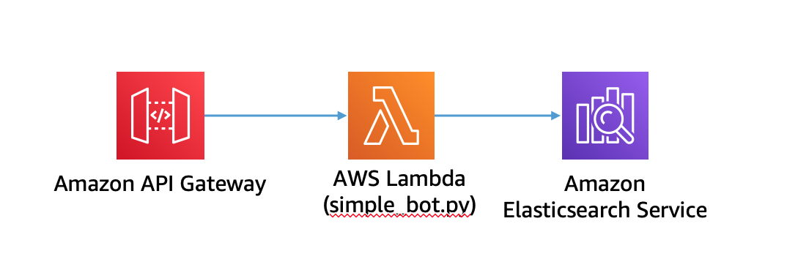
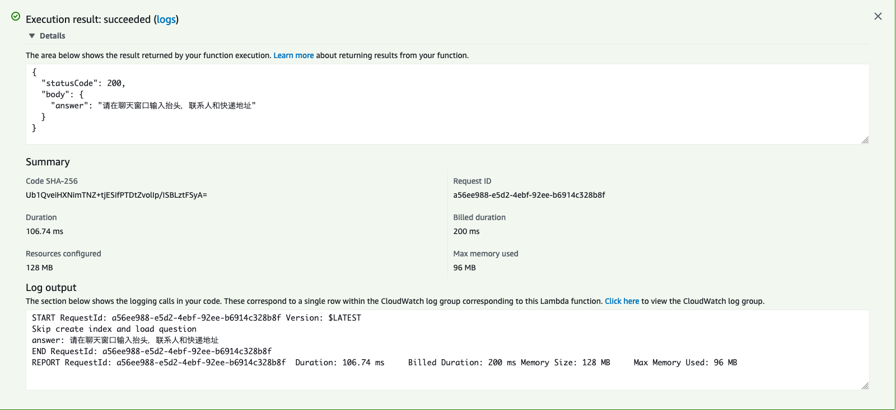
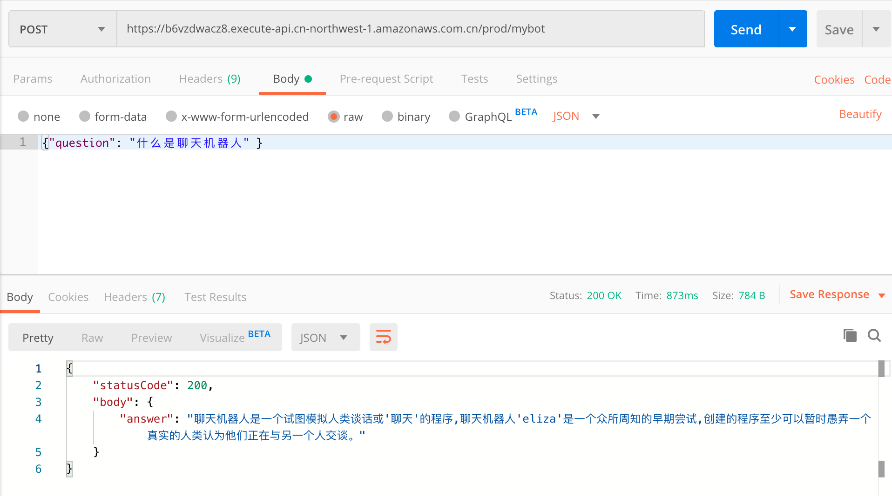

# FAQ ChatBot

## ElasticSearch Based
1. Create the Amezon ElasticSearch Domain: `faq-es`
 - For testing, I use the Development mode
 - Public access
 - Enable Fine–grained access control: Create the master user
 - Customer access Policy
 ```json
 {
  "Version": "2012-10-17",
  "Statement": [
    {
      "Effect": "Allow",
      "Principal": {
        "AWS": "*"
      },
      "Action": [
        "es:*"
      ],
      "Condition": {
        "IpAddress": {
          "aws:SourceIp": [
            "YOURID_CIDR"
          ]
        }
      },
      "Resource": "arn:aws-cn:es:cn-northwest-1:your-account:domain/faq-es/*"
    }
  ]
}
```
- Follow up the guide to finish the [Authentication and Authorization](https://docs.amazonaws.cn/en_us/elasticsearch-service/latest/developerguide/fgac.html#fgac-walkthrough-basic) if you need more secured protection of your domain

2. Testing the Smart Chinese Analysis
- Login the Kibana
- Navigate to DevTools
```json
POST _analyze
{
  "analyzer": "smartcn",
  "text": "中国东北虎"
}

{
  "tokens" : [
    {
      "token" : "中国",
      "start_offset" : 0,
      "end_offset" : 2,
      "type" : "word",
      "position" : 0
    },
    {
      "token" : "东北虎",
      "start_offset" : 2,
      "end_offset" : 5,
      "type" : "word",
      "position" : 1
    }
  ]
}

POST _analyze
{
  "analyzer": "smartcn",
  "text": "动手学做聊天机器人系列之三：从0到1构建一个Chatbot"
}

POST _analyze
{
  "analyzer": "smartcn",
  "text": "将传统Web应用程序迁移为Serverless架构"
}
```

- Setting for index

```json
PUT /your_index
{
  "settings": {
    "index": {
      "analysis": {
        "analyzer": {
          "default": {
            "type": "smartcn"
          }
        }
      }
    }
  }
}

GET /your_index/_analyze?text='叻出色'
```

3. Setup the Dataset

The `faq_data.cvs` is built based on  https://github.com/candlewill/Dialog_Corpus

4. Testing
```bash
pip install elasticsearch -t .
pip install pandas -t .

export ES_USER=TheMasterUser
export ES_PASSWORD=YOUR_PASSWORD
export ES_HOST=YOUR_ES_ENDPOINT_WITH_HTTPS

#python simple_chatbot.py --create_index

python simple_chatbot.py 
> 如何开发票
请在聊天窗口输入抬头，联系人和快递地址
> 什么是ai
人工智能是工程和科学的分支,致力于构建具有思维的机器。
> 迷失迷你是什么编写的
Python
> 什么是维纳斯
超声波,在医学诊断和治疗中使用,在手术等。
> 什么是聊天机器人
超声波,在医学诊断和治疗中使用,在手术等。
```

5. Optimize

We can see the Match and Ranking is not good. The python output is similar like DSL query

```json
GET faq/_search
{
  "query": {
    "match": {
      "question": "什么是聊天机器人"
    }
  }
}

GET faq/_search
{
  "query": {
    "match": {
      "question": {
        "query":"什么是聊天机器人",
        "analyzer": "smartcn"
      }
    }
  }
}

    "max_score" : 2.0148723,
    "hits" : [
      {
        "_index" : "faq",
        "_type" : "_doc",
        "_id" : "10",
        "_score" : 2.0148723,
        "_source" : {
          "data_source" : "faq_dataset_manual",
          "timestamp" : 1.599064827212525E9,
          "question" : "什么是超声波",
          "answer" : "超声波,在医学诊断和治疗中使用,在手术等。"
        }
      }
      ...
    ]
```

Now let add the operator for interpret text which generated by analyzer tokens

```json
GET faq/_search
{
  "query": {
    "match": {
      "question": {
        "query":"什么是聊天机器人",
        "analyzer": "smartcn",
        "operator": "AND"
      }
    }
  }
}

"max_score" : 1.1507283,
    "hits" : [
      {
        "_index" : "faq",
        "_type" : "_doc",
        "_id" : "4",
        "_score" : 1.1507283,
        "_source" : {
          "data_source" : "faq_dataset_manual",
          "timestamp" : 1.599064827212301E9,
          "question" : "什么是聊天机器人",
          "answer" : "聊天机器人是一个试图模拟人类谈话或'聊天'的程序,聊天机器人'eliza'是一个众所周知的早期尝试,创建的程序至少可以暂时愚弄一个真实的人类认为他们正在与另一个人交谈。"
        }
      }
    ]
```

Let's modify the simple_chatbot.py code `search` function of `ESChat`

```python
dsl = {
            "query": {
                "match": {
                    "question": {
                        "query":input_str,
                        "analyzer": "smartcn",
                        "operator": "AND"
                    }
                }
            }
        }
```

We can see the result improved:

```bash
python simple_chatbot.py
Skip create index and load question
> 什么是聊天机器人
聊天机器人是一个试图模拟人类谈话或'聊天'的程序,聊天机器人'eliza'是一个众所周知的早期尝试,创建的程序至少可以暂时愚弄一个真实的人类认为他们正在与另一个人交谈。
> 什么是热力学定律
我不是一个物理学家,但我觉得这事做热,熵和节约能源,对不对？
> 什么是维纳斯
在罗马神话中爱与美的女神;与希腊阿芙罗狄蒂确定太阳系最亮,第六大的行星,并在距离第二的太阳,与二氧化碳的稠密大气和非常高的表面温度。它的直径大约是12100公里（大约7520英里）。它的公转周期是大约225个地球日。其旋转 （逆行）的时期,是243.01地球日。也用于标记一个非常漂亮的女人。
> 什么是ai
人工智能是工程和科学的分支,致力于构建具有思维的机器。
> 如何开发票
请在聊天窗口输入抬头，联系人和快递地址
> 
```


## ElasticSearch and Lambda Based



1. Build the lambda function
```bash
mkdir temp
cp simple_chatbot_lambda.py temp/
cp faq_data.csv temp/
cd temp/
pip install elasticsearch -t .
download the pandas package from https://pypi.org/project/pandas/ For Python 3.8, pandas-1.1.1-cp38-cp38-manylinux1_x86_64.whl
unzip pandas-1.1.1-cp38-cp38-manylinux1_x86_64.whl
download the numpy package from https://pypi.org/project/numpy/ For Python 3.8, numpy-1.19.1-cp38-cp38-manylinux1_x86_64.whl
unzip numpy-1.19.1-cp38-cp38-manylinux1_x86_64.whl

zip -r lambda.zip *

aws lambda create-function --function-name faq-es-lambda \
--zip-file fileb://lambda.zip --handler simple_chatbot_lambda.handler --runtime python3.8 \
--role arn:aws-cn:iam::876820548815:role/lambda-es-role --timeout 60 \
--environment  '{"Variables":{"ES_USER":"TheMasterUser","ES_PASSWORD":"PWD","ES_HOST":"https://es_domain"}}' \
--region cn-northwest-1

aws lambda update-function-code --function-name faq-es-lambda \
--zip-file fileb://lambda.zip --region cn-northwest-1
```

2. Testing Lambda

```bash
# Create index and initial laod question list
aws lambda invoke --function-name faq-es-lambda \
--payload '{ "create_index": "true", "question": "如何开发票" }' \
response.json --log-type Tail --query 'LogResult' --output text --region cn-northwest-1 |  base64 -d

# Invoke the function with quetion
aws lambda invoke --function-name faq-es-lambda --payload '{"question": "如何开发票" }' \
response.json --log-type Tail --query 'LogResult' --output text --region cn-northwest-1 |  base64 -d

START RequestId: 45b0145b-03df-4f1f-9567-da4a0c625861 Version: $LATEST
Skip create index and load question
answer: 请在聊天窗口输入抬头，联系人和快递地址
END RequestId: 45b0145b-03df-4f1f-9567-da4a0c625861
REPORT RequestId: 45b0145b-03df-4f1f-9567-da4a0c625861  Duration: 173.46 ms     Billed Duration: 200 ms Memory Size: 128 MB     Max Memory Used: 95 MB  Init Duration: 1495.90 ms
```



3. Testing API GW

```bash
curl -X POST -d "{\"question\": \"什么是聊天机器人\" }" -k https://b6vzdwacz8.execute-api.cn-northwest-1.amazonaws.com.cn/prod/mybot
```



## Cleanup
```bash
aws lambda delete-function --function-name faq-es-lambda --region cn-northwest-1
aws es delete-elasticsearch-domain --domain-name faq-es --region cn-northwest-1
remove the api-gw
```

 ## Reference
 [Internal User Database and HTTP Basic Authentication](https://docs.amazonaws.cn/elasticsearch-service/latest/developerguide/fgac.html#fgac-walkthrough-basic)

 [ES query-dsl-match-query](https://www.elastic.co/guide/en/elasticsearch/reference/current/query-dsl-match-query.html)

 [Pandas in AWS lambda gives numpy error](https://aws.amazon.com/premiumsupport/knowledge-center/lambda-python-package-compatible/)