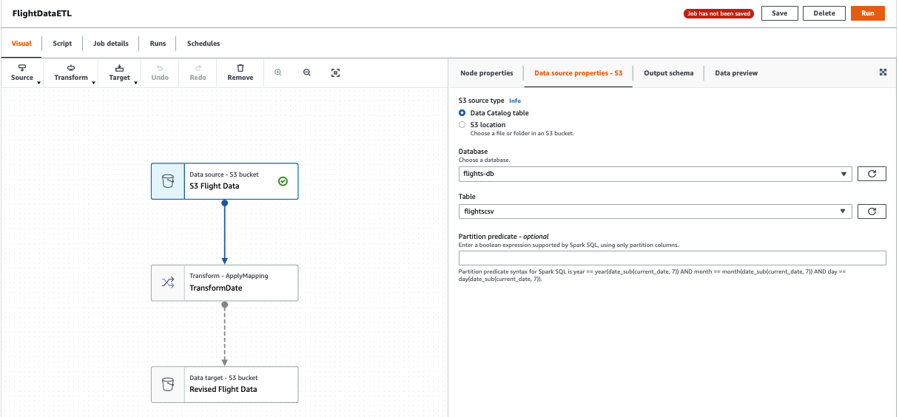
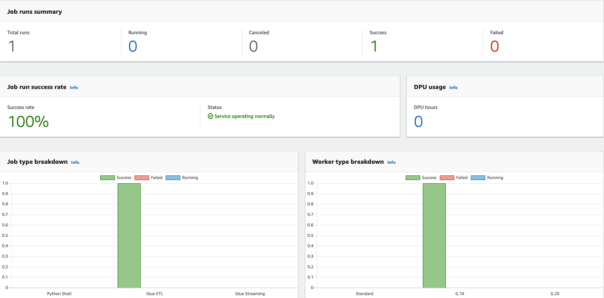

# Glue_Studio_GetStart

## Prepare the data
Follow up the guide https://docs.amazonaws.cn/en_us/glue/latest/ug/tutorial-add-crawler.html

If you running on China region, you can sync the data to your china region S3 bucket
```bash
aws s3 sync s3://crawler-public-us-east-1/flight/2016/csv . --region us-east-1 --profile global
aws s3 sync . s3://your_s3_bucket/flight/2016/csv/ --region cn-north-1 --profile china
```
Then set `Crawl data in` to `your_s3_bucket`

## Start create job and running the job
Follow up the guide https://docs.amazonaws.cn/en_us/glue/latest/ug/tutorial-create-job.html



