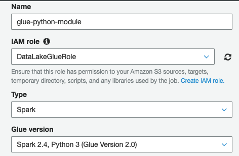
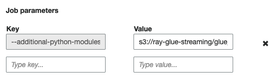
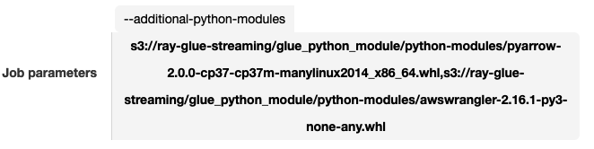
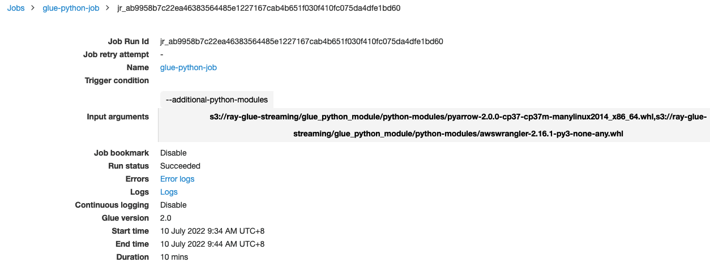
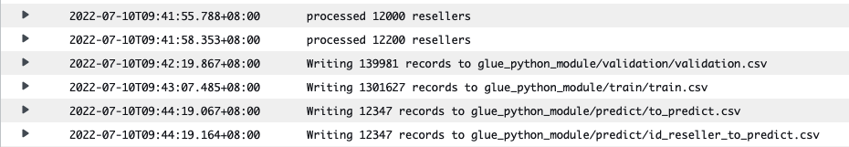

# Building Python modules for Spark ETL workloads using AWS Glue
- [Building Python modules for Spark ETL workloads using AWS Glue](#building-python-modules-for-spark-etl-workloads-using-aws-glue)
  - [How to Using Python Libraries with AWS Glue?](#how-to-using-python-libraries-with-aws-glue)
  - [Example: For glue Development Endpoint](#example-for-glue-development-endpoint)
    - [About --extra-python-libs-s3-path](#about---extra-python-libs-s3-path)
    - [Create a glue Development Endpoint](#create-a-glue-development-endpoint)
    - [Use a SageMaker Notebook with Your Development Endpoint](#use-a-sagemaker-notebook-with-your-development-endpoint)
    - [Dev and Debug the pyspark script](#dev-and-debug-the-pyspark-script)
  - [Example: For Glue Job](#example-for-glue-job)
    - [About --additional-python-modules](#about---additional-python-modules)
    - [Create a glue job](#create-a-glue-job)
    - [Start a glue job](#start-a-glue-job)
  - [Network consideration for building Python depenency modules](#network-consideration-for-building-python-depenency-modules)
  
## How to Using Python Libraries with AWS Glue?
[How do I use external Python libraries in my AWS Glue 2.0 ETL job](https://aws.amazon.com/premiumsupport/knowledge-center/glue-version2-external-python-libraries/)

[Using Python Libraries with AWS Glue](https://docs.aws.amazon.com/glue/latest/dg/aws-glue-programming-python-libraries.html) and note [Python Modules Already Provided in AWS Glue Version 2.0](https://docs.aws.amazon.com/glue/latest/dg/aws-glue-programming-python-libraries.html#glue20-modules-provided)

## Example: For glue Development Endpoint

### About --extra-python-libs-s3-path
I want to use the [aws-data-wrangler](https://github.com/awslabs/aws-data-wrangler) to easy integration with Athena, Glue, Redshift, Timestream, OpenSearch, Neptune, QuickSight, Chime, CloudWatchLogs, DynamoDB, EMR, SecretManager, PostgreSQL, MySQL, SQLServer and S3 (Parquet, CSV, JSON and EXCEL)

Base on the [aws-data-wrangler document](https://aws-data-wrangler.readthedocs.io/en/2.16.1/install.html#aws-glue-pyspark-jobs), for my Glue Dev endpoint, I need set the --extra-python-libs-s3-path with Python wheel

- For global region:
    - For example: s3://aws-data-wrangler-public-artifacts/releases/2.16.1/awswrangler-2.16.1-py3-none-any.whl or s3://aws-data-wrangler-public-artifacts/releases/2.16.1/awswrangler-layer-2.16.1-py3.8.zip
        - Bucket: aws-data-wrangler-public-artifacts
        - Prefix: releases/<version>/
        - Python wheel: awswrangler-<version>-py3-none-any.whl

- For China region, you need download from [github release](https://github.com/awslabs/aws-data-wrangler/releases), and store in your bucket
```bash
wget https://github.com/awslabs/aws-data-wrangler/releases/download/2.16.1/awswrangler-2.16.1-py3-none-any.whl
aws s3 cp awswrangler-2.16.1-py3-none-any.whl s3://ray-glue-streaming/glue_python_module/python-modules/ --region cn-north-1 --profile china_ruiliang
```

### Create a glue Development Endpoint
Guide to [Adding a Development Endpoint](https://docs.aws.amazon.com/glue/latest/dg/add-dev-endpoint.html)

```bash
aws glue create-dev-endpoint --endpoint-name endpoint2 --role-arn arn:aws-cn:iam::876820548815:role/DataLakeGlueRole --glue-version 1.0 --arguments '{"GLUE_PYTHON_VERSION": "3"}' --extra-python-libs-s3-path 's3://ray-glue-streaming/glue_python_module/python-modules/awswrangler-2.16.1-py3-none-any.whl' --region cn-north-1 --profile china_ruiliang
```

### Use a SageMaker Notebook with Your Development Endpoint
FOllow the guide [Use a SageMaker Notebook with Your Development Endpoint](https://docs.aws.amazon.com/glue/latest/dg/dev-endpoint-tutorial-sage.html)

### Dev and Debug the pyspark script
In the SageMaker Notebook, you can edit and debug the [notebook script](scripts/python_depends/glue_job.ipynb)
To avoid Memory Error, you should use the ml.m5.xlarge notebook instance type
After your finish the notebook running, then you can convert your notebook to a glue [pyspark job script](scripts/python_depends/glue_job.py).

## Example: For Glue Job

### About --additional-python-modules
I want to use the [aws-data-wrangler](https://github.com/awslabs/aws-data-wrangler) to easy integration with Athena, Glue, Redshift, Timestream, OpenSearch, Neptune, QuickSight, Chime, CloudWatchLogs, DynamoDB, EMR, SecretManager, PostgreSQL, MySQL, SQLServer and S3 (Parquet, CSV, JSON and EXCEL)

Base on the [aws-data-wrangler document](https://aws-data-wrangler.readthedocs.io/en/2.16.1/install.html#aws-glue-pyspark-jobs), for my Glue PySpark job, I create a new Job parameters key/value:
- For global region:
    - Key: --additional-python-modules
    - Value: pyarrow==2,s3://aws-data-wrangler-public-artifacts/releases/2.16.1/awswrangler-2.16.1-py3-none-any.whl
        - Bucket: aws-data-wrangler-public-artifacts
        - Prefix: releases/<version>/
        - Python wheel: awswrangler-<version>-py3-none-any.whl


- For China region, you need download from [github release](https://github.com/awslabs/aws-data-wrangler/releases), and store in your bucket
```bash
wget https://github.com/awslabs/aws-data-wrangler/releases/download/2.16.1/awswrangler-2.16.1-py3-none-any.whl
wget https://files.pythonhosted.org/packages/2e/8d/c002e27767595f22aa09ed0d364327922f673d12b36526c967a2bf6b2ed7/pyarrow-2.0.0-cp37-cp37m-manylinux2014_x86_64.whl
aws s3 cp awswrangler-2.16.1-py3-none-any.whl s3://ray-glue-streaming/glue_python_module/python-modules/ --region cn-north-1 --profile china_ruiliang
aws s3 cp pyarrow-2.0.0-cp37-cp37m-manylinux2014_x86_64.whl s3://ray-glue-streaming/glue_python_module/python-modules/ --region cn-north-1 --profile china_ruiliang
```

### Create a glue job
There are three types of jobs in AWS Glue: Spark, Streaming ETL, and Python shell.
- A Spark job is run in an Apache Spark environment managed by AWS Glue. It processes data in batches.
- A streaming ETL job is similar to a Spark job, except that it performs ETL on data streams. It uses the Apache Spark Structured Streaming framework. Some Spark job features are not available to streaming ETL jobs.
-  A Python shell job runs Python scripts as a shell and supports a Python version that depends on the AWS Glue version you are using. You can use these jobs to schedule and run tasks that don't require an Apache Spark environment.

Please note the AWS Glue version and Supported Spark and Python versions by check the guide to [create glue job](https://docs.aws.amazon.com/glue/latest/dg/add-job.html#create-job)

Using the a glue [pyspark job script](scripts/python_depends/glue_job.py) to create a glue job

- CLI
    ```bash
    aws glue create-job --name glue-python-job --role DataLakeGlueRole --glue-version 2.0 \
    --command '{"PythonVersion":"3", "Name":"glueetl", "ScriptLocation":"s3://aws-glue-scripts-876820548815-cn-north-1/admin/glue_job.py"}' \
    --default-arguments '{"--additional-python-modules":"s3://ray-glue-streaming/glue_python_module/python-modules/pyarrow-2.0.0-cp37-cp37m-manylinux2014_x86_64.whl,s3://ray-glue-streaming/glue_python_module/python-modules/awswrangler-2.16.1-py3-none-any.whl"}' --region cn-north-1 --profile china_ruiliang
    ```
- Console
  
  
  
  

### Start a glue job
- CLI
```bash
aws glue start-job-run --job-name glue-python-job --region cn-north-1 --profile china_ruiliang
```
- Console
Click start job

- Check the Cloudwatch logs
    - The awswrangler and pyarrow has been installed by glue
        
        
    - Job Success
        
        

## Network consideration for building Python depenency modules 
- Glue job or dev endpoint with Public internet access 
- Glue job or dev endpoint without Public internet access
Please check below document:
[Building Python modules from a wheel for Spark ETL workloads using AWS Glue 2.0](https://noise.getoto.net/2020/11/18/building-python-modules-from-a-wheel-for-spark-etl-workloads-using-aws-glue-2-0/)


[Adding Jobs in AWS Glue](https://docs.aws.amazon.com/glue/latest/dg/add-job.html#create-job)