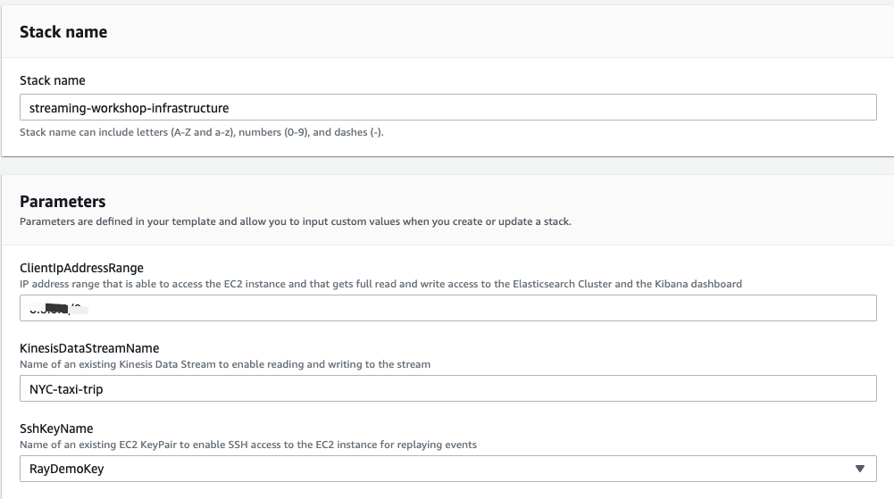

# Ingest Data into a Kinesis Data Stream

Running a producer client program on an EC2 instance that streams a data set of taxi trips in New York City. Ingest the stream data to Amazon Kinesis Data Stream.

## Option1 Build manually

### Create Kinesis Data Stream
Create Kinesis Data Stream `ingest-taxi-trips` with 8 Shards

### Stream Producer Client
- Build client
```bash
git clone https://github.com/aws-samples/amazon-kinesis-replay
cd amazon-kinesis-replay
mvn clean install
```

- Produce the stream data
```
java -jar amazon-kinesis-replay-1.0-SNAPSHOT.jar -streamName ingest-taxi-trips -streamRegion us-west-2 -speedup 3600 -aggregate
```

### Process stream with analytics application

1. Create the Kinesis Analytics Application 


- Application Name: taxi-trip-KDA
- Source Stream: ingest-taxi-trips
- Record pre-processing with AWS Lambda: Disable
- Click Discover Schema


Once Disocver Schema Successfully complete, you can `Edit the Schema`


- trip.id, change the type from INT to BIGINT
- type, change the Length from 4 to 9. 

Complete this step by pressing Save schema and update stream samples.

2. Go to SQL editor

Our first stream is called cleaned_trips which is populated by our clean_pump pump which selects only those records of the type='trip' that have valid longitude and latitudes.
Our second stream is called trip_statistics which is populated by our statistics_pump pump. The statistics_pump pump calculates summary statistics for every 2 second interval. These results can give you a real-time look at what is happening as data arrives into the stream.

```sql
    CREATE OR REPLACE STREAM cleaned_trips (
        pickup_latitude     DOUBLE,    
        pickup_longitude    DOUBLE,    
        dropoff_latitude    DOUBLE,    
        dropoff_longitude   DOUBLE,
        trip_id             BIGINT,
        trip_distance       REAL,
        passenger_count     INTEGER,
        pickup_datetime     TIMESTAMP,
        dropoff_datetime    TIMESTAMP,
        total_amount        REAL
    );
    
    CREATE OR REPLACE PUMP clean_pump AS 
        INSERT INTO cleaned_trips
            SELECT STREAM
                "pickup_latitude", 
                "pickup_longitude", 
                "dropoff_latitude", 
                "dropoff_longitude", 
                "trip_id", 
                "trip_distance", 
                "passenger_count", 
                "pickup_datetime",
                "dropoff_datetime",
                "total_amount"
            FROM source_sql_stream_001
            WHERE "type" LIKE 'trip' AND ("pickup_latitude" <> 0 AND "pickup_longitude" <> 0 AND "dropoff_latitude" <> 0 AND "dropoff_longitude" <> 0);
    
    
    CREATE OR REPLACE STREAM trip_statistics (
        trip_count          INTEGER,
        passenger_count     INTEGER,
        total_amount        REAL
    );
    
    CREATE OR REPLACE PUMP statistics_pump AS 
        INSERT INTO trip_statistics
            SELECT STREAM
                COUNT(1) as trip_count, 
                SUM(passenger_count) as passenger_count, 
                SUM(total_amount) as total_amount
            FROM cleaned_trips
            GROUP BY STEP(cleaned_trips.ROWTIME BY INTERVAL '2' SECOND)
            ORDER BY STEP(cleaned_trips.ROWTIME BY INTERVAL '2' SECOND);
```

The random cut forest algorithm takes a couple of minutes to initialize (during which the ANOMALY_SCORE will be zero). Once the initialization phase has completed, you should see a meaningful ANOMALY_SCORE value and ANOMALY_SCORE_EXPLANATION.

```sql
    CREATE OR REPLACE STREAM trip_statistics_anomaly_tmp (
        trip_count          INTEGER,
        passenger_count     INTEGER,
        total_amount        REAL,
        anomaly_score       DOUBLE,
        anomaly_explanation VARCHAR(20480),
        resolution          VARCHAR(8)
    );
    
    CREATE OR REPLACE STREAM trip_statistics_anomaly (
        rowtime_ts          TIMESTAMP,
        trip_count          INTEGER,
        passenger_count     INTEGER,
        total_amount        REAL,
        anomaly_score       DOUBLE,
        anomaly_explanation VARCHAR(20480),
        resolution          VARCHAR(8)
    );
    
    
    CREATE OR REPLACE PUMP trip_statistics_anomaly_pump AS 
        INSERT INTO trip_statistics_anomaly
            SELECT STREAM FLOOR(trip_statistics_anomaly_tmp.ROWTIME TO SECOND) AS rowtime_ts, trip_count, passenger_count, total_amount, anomaly_score, anomaly_explanation, resolution
            FROM trip_statistics_anomaly_tmp
            ORDER BY FLOOR(trip_statistics_anomaly_tmp.ROWTIME TO SECOND), ANOMALY_SCORE DESC;
    
    CREATE OR REPLACE PUMP trip_statistics_anomaly_60min_pump AS 
        INSERT INTO trip_statistics_anomaly_tmp
            SELECT STREAM trip_count, passenger_count, total_amount, anomaly_score, anomaly_explanation, '60min'
            FROM TABLE(RANDOM_CUT_FOREST_WITH_EXPLANATION(
                CURSOR(SELECT STREAM trip_count, passenger_count, total_amount FROM trip_statistics),
                100, 256, 100000, 24, false));

```


## Option2 Using CloudFormation to create the Lab environment resources

Launch CloudFormation Stack by using below template:

https://aws-data-analytics-workshops.s3.amazonaws.com/kinesis/templates/streaming-workshop-infrastructure_v2.yml




## Cleanup
```bash
Stop (Ctrl-c) the java application.
Go to the Kinesis Data Analytics console, click on the radio button next to the application you created in this lab, go to Actions and click on Delete Application.
Delete the Kinesis Data Stream created in this lab.
Go to the Kinesis Data Stream console, click on the checkbox next to the name of your KDS stream, go to the Actions drop-down and click on Delete.
```