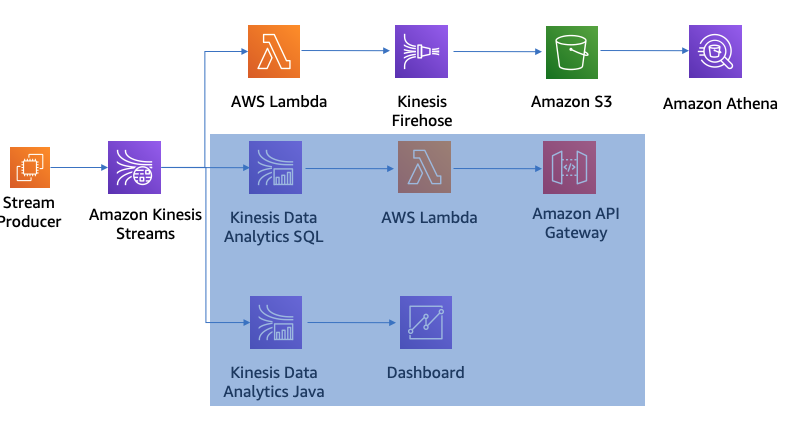
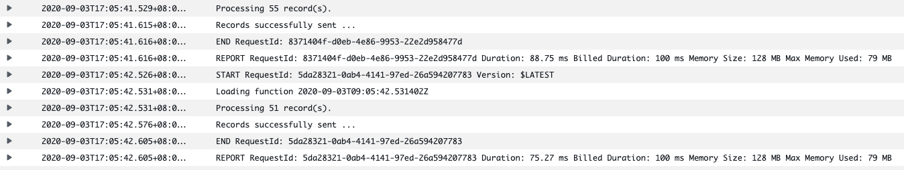
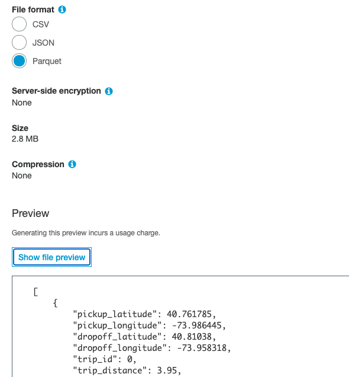

# Lambda + Kinesis Data Firehose 

- Create a Lambda function that reads from a Kinesis Data Stream. 
- Create an Amazon Kinesis Data Firehose delivery stream to write to a S3 bucket.
    Lambda function filters out the spurious data in the incoming events and then sends the clean events to Firehose Delivery Stream in batch mode (using the PutRecordBatch API).
    Kinesis Firehose write data to S3 using the parquet file format
- Discover the schema of taxi trips dataset using AWS Glue and query data via Amazon Athena



## Create the Glue and Athena Resource

- Glue Database name: kinesislab

- Create S3 bucket: kinesislab-nyctaxitrips-initials

- Create the Athena external table under kinesislab database. This table will be used by Kinesis Data Firehose as a schema for data format conversion

```sql
CREATE EXTERNAL TABLE nyctaxitrips(
    `pickup_latitude` double, 
    `pickup_longitude` double, 
    `dropoff_latitude` double, 
    `dropoff_longitude` double, 
    `trip_id` bigint, 
    `trip_distance` double, 
    `passenger_count` int, 
    `pickup_datetime` timestamp, 
    `dropoff_datetime` timestamp, 
    `total_amount` double)
    PARTITIONED BY ( 
    `year` string, 
    `month` string, 
    `day` string, 
    `hour` string)
    ROW FORMAT SERDE 
    'org.apache.hadoop.hive.ql.io.parquet.serde.ParquetHiveSerDe' 
    STORED AS INPUTFORMAT 
    'org.apache.hadoop.hive.ql.io.parquet.MapredParquetInputFormat' 
    OUTPUTFORMAT 
    'org.apache.hadoop.hive.ql.io.parquet.MapredParquetOutputFormat'
    LOCATION
    's3://kinesislab-nyctaxitrips-initials/nyctaxitrips/'
    TBLPROPERTIES ('has_encrypted_data'='false');
```

## Create Kinesis Data Firehose Delivery Stream

- Kinesis Data Firehose Delivery Stream： `nyc-taxi-trips`
- Source:  `Direct PUT or other sources`
- Choose `Transform source records with AWS Lambda` as `Disabled` 
- `Record format conversion` as Enabled and choose `Output format` as `Apache Parquet`
- AWS Glue region choose the region that you created the AWS Glue database 
- AWS Glue database: kinesislab
- AWS Glue table: nyctaxitrips
- AWS Glue table version: Latest
- Destination: S3
- S3 Bucket: kinesislab-nyctaxitrips-initials
- S3 prefix: `nyctaxitrips/year=!{timestamp:YYYY}/month=!{timestamp:MM}/day=!{timestamp:dd}/hour=!{timestamp:HH}/`
- S3 error prefix: `nyctaxitripserror/!{firehose:error-output-type}/year=!{timestamp:YYYY}/month=!{timestamp:MM}/day=!{timestamp:dd}/hour=!{timestamp:HH}/`
- Source record S3 backup: Disable
- Buffer size： 128 MiB
- Buffer interval: 180 seconds
- Keep the default settings for S3 compression and encryption
- Enabled for Error logging


## Create the Lambda function to process records from the Kinesis Data Stream

1. Create the IAM role to use with the Lambda function
- Role name: `NYCTaxiTripsLambdaRole`
- AWS service: `Lambda`
- Permission: `AWSLambdaBasicExecutionRole`
- Add inline policy: `NYCTaxiTripsKinesisPolicy`
```json
{
    "Version": "2012-10-17",
    "Statement": [{
            "Sid": "Effect",
            "Effect": "Allow",
            "Action": [
                "kinesis:GetShardIterator",
                "kinesis:GetRecords",
                "firehose:PutRecordBatch",
                "kinesis:DescribeStream"
            ],
            "Resource": [
                "arn:aws:kinesis:us-west-2:<accountid>:stream/ingest-taxi-trips",
                "arn:aws:firehose:us-west-2:<accountid>:deliverystream/nyc-taxi-trips"
            ]
        },
        {
            "Sid": "KinesisPerm2",
            "Effect": "Allow",
            "Action": [
                "kinesis:ListStreams",
                "kinesis:SubscribeToShard",
                "kinesis:DescribeStreamSummary",
                "firehose:ListDeliveryStreams",
                "cloudwatch:*"
            ],
            "Resource": "*"
        },
        {
            "Sid": "KinesisPerm3",
            "Effect": "Allow",
            "Action": "kinesis:ListShards",
            "Resource": [
                "arn:aws:kinesis:us-west-2:<accountid>:stream/ingest-taxi-trips"
            ]
        }
    ]
}
```

2.  Create lambda function `NYCTaxiTrips-KDSLambdaTrigger`
- Runtime: `Python 3.7`
- Execution role: `NYCTaxiTripsLambdaRole`
- Python Code: [lambda_function.py](scripts/lambda_function.py)
- Environment variables
```
delivery_stream_name = nyc-taxi-trips
exponential_backoff_seed = 35
number_of_retries = 3
```
- Add Trigger: `Kinesis`
  - Kinesis stream: `ingest-taxi-trips`
  - Batch size: 100
  - Batch window: 0
  - Starting position: Latest
  - Enable trigger

## Process Data using a Lambda Function and Sent output to Kiensis Firehose

1. Produce the stream data
```bash
#java -jar amazon-kinesis-replay-1.0-SNAPSHOT.jar -streamName ingest-taxi-trips -streamRegion us-west-2 -speedup 3600 -aggregate
java -jar amazon-kinesis-replay-1.0-SNAPSHOT.jar -streamName ingest-taxi-trips -streamRegion us-west-2 -speedup 180
```

2. Monitoring
- Monitoring tab of Kinesis stream: `ingest-taxi-trips`
- Monitoring tab of Kinesis firehose delivery-stream: `nyc-taxi-trips`
- Lambda `NYCTaxiTrips-KDSLambdaTrigger` CloudWatch logs



- S3 bucket
```
aws s3 ls --recursive s3://kinesislab-nyctaxitrips-initials --region us-west-2

2020-09-03 09:06:00    2912271 nyctaxitrips/year=2020/month=09/day=03/hour=09/nyc-taxi-trips-1-2020-09-03-09-02-39-3cfbfd94-2146-41f8-be8f-a2080abac30b.parquet
2020-09-03 09:09:16    5935074 nyctaxitrips/year=2020/month=09/day=03/hour=09/nyc-taxi-trips-1-2020-09-03-09-05-40-edbf3068-4ff1-4533-beb4-6b1ec835cd4a.parquet
```



3. Query from Athena
```sql
MSCK REPAIR TABLE nyctaxitrips;

SELECT * FROM "kinesislab"."nyctaxitrips" limit 10;
```

## Cleanup
```
aws lambda delete-function --function-name NYCTaxiTrips-KDSLambdaTrigger --region us-west-2
aws kinesis delete-stream --stream-name ingest-taxi-trips --region us-west-2
aws firehose delete-delivery-stream --delivery-stream-name nyc-taxi-trips --region us-west-2
```
