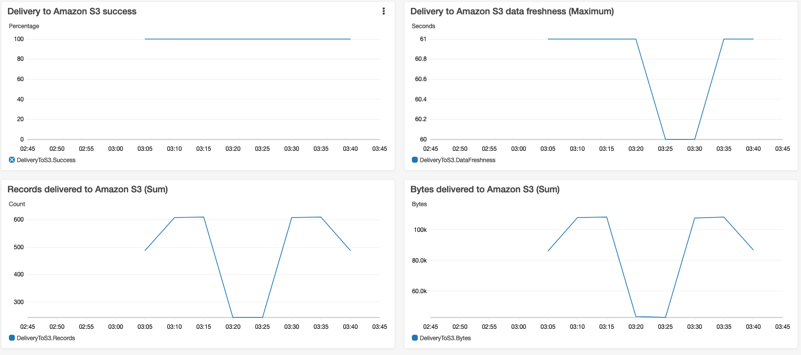
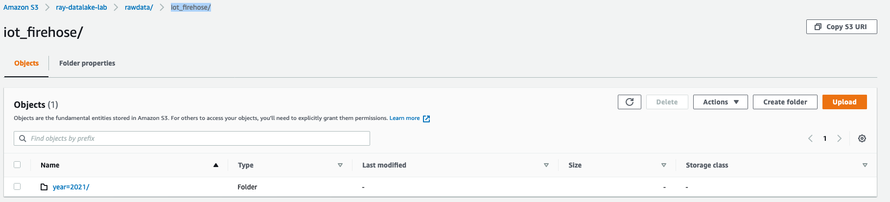

# Writing to Kinesis Data Firehose Using Kinesis Agent

[Sending Data to an Amazon Kinesis Data Firehose Delivery Stream](https://docs.aws.amazon.com/firehose/latest/dev/basic-write.html)

[Kinesis Agent for Microsoft Windows](https://docs.aws.amazon.com/kinesis-agent-windows/latest/userguide/what-is-kinesis-agent-windows.html)

- Case 1: Linux agent
- Case 2: Windows agent

# Case 1: Linux agent

## Prerequisites

1. Prepare your system follow the [prerequisites guide](https://docs.aws.amazon.com/firehose/latest/dev/writing-with-agents.html#prereqs). Here I use the EC2 running Amazon Linux as example

2. Credentials, follow up the [guide](https://docs.aws.amazon.com/firehose/latest/dev/writing-with-agents.html#agent-credentials) to set the AWS Credentials

```bash
aws sts get-caller-identity
```

3. Create the S3 bucket and Kiensis Firehose deliver stream
   [kinsis-firehose-s3](media/kinsis-firehose-s3.png)

- S3 bucket prefix

```bash
rawdata/iot_firehose/year=!{timestamp:yyyy}/month=!{timestamp:MM}/day=!{timestamp:dd}/
```

- S3 bucket error prefix

```bash
rawdata/iot_firehose/year=!{timestamp:yyyy}/month=!{timestamp:MM}/day=!{timestamp:dd}/!{firehose:error-output-type}
```

- buffer 5MB size or interval 60 seconds

## Install and configure the Agent

3. Download and Install the Agent

```bash
sudo yum install –y aws-kinesis-agent
```

4. Configure and Start the Agent

- Create or Edit `/etc/aws-kinesis/agent.json`, I use the Ningxia region cn-northwest-1 as example

```bash
{
  "cloudwatch.emitMetrics": true,
  "cloudwatch.endpoint": "monitoring.cn-northwest-1.amazonaws.com.cn",
  "firehose.endpoint": "firehose.cn-northwest-1.amazonaws.com.cn",

  "flows": [
    {
      "filePattern": "/tmp/iot-app.log*",
      "deliveryStream": "iot-data-collector"
    }
  ]
}
```

- Start the agent manually

```bash
sudo service aws-kinesis-agent start
```

Agent activity is logged in `/var/log/aws-kinesis-agent/aws-kinesis-agent.log`.

```bash
tail -f /var/log/aws-kinesis-agent/aws-kinesis-agent.log

2021-01-29 03:04:21.538+0000  (Agent STARTING) com.amazon.kinesis.streaming.agent.Agent [INFO] Agent: Starting tailer for file fh:iot-data-collector:/tmp/iot-app.log*
2021-01-29 03:04:21.561+0000  (FileTailer[fh:iot-data-collector:/tmp/iot-app.log*]) com.amazon.kinesis.streaming.agent.tailing.FirehoseParser [INFO] FirehoseParser[fh:iot-data-collector:/tmp/iot-app.log*]: Opening /tmp/iot-app.log for parsing.
2021-01-29 03:04:21.570+0000  (Agent STARTING) com.amazon.kinesis.streaming.agent.Agent [INFO] Agent: Startup completed in 37 ms.
2021-01-29 03:04:51.573+0000  (Agent.MetricsEmitter RUNNING) com.amazon.kinesis.streaming.agent.Agent [INFO] Agent: Progress: 30 records parsed (43790 bytes), and 0 records sent successfully to destinations. Uptime: 30041ms
.....
2021-01-29 03:05:51.574+0000  (cw-metrics-publisher) com.amazon.kinesis.streaming.agent.metrics.CWPublisherRunnable [INFO] Successfully published 5 datums.
2021-01-29 03:05:51.574+0000  (FileTailer[fh:iot-data-collector:/tmp/iot-app.log*].MetricsEmitter RUNNING) com.amazon.kinesis.streaming.agent.tailing.FileTailer [INFO] FileTailer[fh:iot-data-collector:/tmp/iot-app.log*]: Tailer Progress: Tailer has parsed 150 records (64840 bytes), transformed 0 records, skipped 0 records, and has successfully sent 122 records to destination.
2021-01-29 03:05:51.576+0000  (Agent.MetricsEmitter RUNNING) com.amazon.kinesis.streaming.agent.Agent [INFO] Agent: Progress: 150 records parsed (64840 bytes), and 122 records sent successfully to destinations. Uptime: 90040ms
```

(Optional) Configure the agent to start on system startup:

```bash
sudo chkconfig aws-kinesis-agent on
```

## Send test logs

Here use python3 generate the dummy logs

```bash
python scripts/dummy-logs.py
```

## Check the Firehose monitoring and S3 bucket





# Case 2: Windows agent

[Stream JSON Log Files to Amazon S3 Using Kinesis Agent for Windows ](https://docs.aws.amazon.com/kinesis-agent-windows/latest/userguide/directory-source-to-s3-tutorial.html)

## Prerequisites

1. Prepare your system follow the [prerequisites guide](https://docs.aws.amazon.com/kinesis-agent-windows/latest/userguide/getting-started.html#getting-started-prerequisites). Here I use the EC2 running Windows Server 2019 as example

Check the Microsoft .NET Framework >= 4.6

```bash
     [System.Version](
     (Get-ChildItem 'HKLM:\SOFTWARE\Microsoft\NET Framework Setup\NDP' -recurse `
     | Get-ItemProperty -Name Version -ErrorAction SilentlyContinue `
     | Where-Object { ($_.PSChildName -match 'Full') } `
     | Select-Object Version | Sort-Object -Property Version -Descending)[0]).Version
```

2. [Configure AWS Services](https://docs.aws.amazon.com/kinesis-agent-windows/latest/userguide/kaw-ds2s3-tutorial-step1.html). For China region, please change the `arn:aws` to `arn:aws-cn`

- Configure IAM Policies and Roles
- Create the Amazon S3 Bucket
- Create the Kinesis Data Firehose Delivery Stream
  - S3 bucket prefix
  ```bash
  rawdata/iot_firehose/year=!{timestamp:yyyy}/month=!{timestamp:MM}/day=!{timestamp:dd}/
  ```
  - S3 bucket error prefix
  ```bash
  rawdata/iot_firehose/year=!{timestamp:yyyy}/month=!{timestamp:MM}/day=!{timestamp:dd}/!{firehose:error-output-type}
  ```
  - buffer 5MB size or interval 60 seconds

## Install, Configure, and Run Kinesis Agent for Windows

1. On the instance, use Windows Server Manager to disable Microsoft Internet Explorer Enhanced Security Configuration for users and administrators. For more information, see [How To Turn Off Internet Explorer Enhanced Security Configuration](https://docs.microsoft.com/en-us/archive/blogs/chenley/how-to-turn-off-internet-explorer-enhanced-security-configuration) on the Microsoft TechNet website.

2. Installing Kinesis Agent for Windows

- Install from AWS Systems Manager - Global region
- Run a PowerShell script - China region as below

- Get [InstallKinesisAgent.ps1](https://s3-us-west-2.amazonaws.com/kinesis-agent-windows/downloads/index.html)

- Install, you can choice one of installation type

```PowerShell
# Install using MSI (Recommended)
Download from https://s3-us-west-2.amazonaws.com/kinesis-agent-windows/downloads/index.html
msiexec /i AWSKinesisTap.1.1.216.4.msi /q

# Install using PowerShell
Invoke-Expression ((New-Object System.Net.WebClient).DownloadString('https://s3-us-west-2.amazonaws.com/kinesis-agent-windows/downloads/InstallKinesisAgent.ps1'))

# Install locally
PowerShell.exe -File ".\InstallKinesisAgent.ps1"
PowerShell.exe -File ".\InstallKinesisAgent.ps1" -version "version"
```

- Configure `%PROGRAMFILES%\Amazon\AWSKinesisTap\appsettings.json`

```json
{
  "Sources": [
    {
      "Id": "JsonLogSource",
      "SourceType": "DirectorySource",
      "RecordParser": "SingleLineJson",
      "Directory": "C:\\LogSource\\",
      "FileNameFilter": "*.log",
      "InitialPosition": 0
    }
  ],
  "Sinks": [
    {
      "Id": "FirehoseLogStream",
      "SinkType": "KinesisFirehose",
      "StreamName": "iot-data-collector",
      "Region": "cn-northwest-1",
      "Format": "json",
      "ObjectDecoration": "ComputerName={ComputerName};DT={timestamp:yyyy-MM-dd HH:mm:ss}"
    }
  ],
  "Pipes": [
    {
      "Id": "JsonLogSourceToFirehoseLogStream",
      "SourceRef": "JsonLogSource",
      "SinkRef": "FirehoseLogStream"
    }
  ]
}
```

3. Update the AWSKinesisTap.exe.config file in the %PROGRAMFILES%\Amazon\AWSKinesisTap directory to specify the name of the AWS profile. More details, please refer: [Sink Security Configuration](https://docs.aws.amazon.com/kinesis-agent-windows/latest/userguide/sink-object-declarations.html#configuring-kinesis-agent-windows-sink-security-configuration)

```
<configuration>
  <appSettings>
    <add key="AWSProfileName" value="development"/>
    <add key="AWSProfilesLocation" value="C:\Users\USERNAME\.aws\credentials"/>
  </appSettings>
</configuration>
```

## Send test logs

- Create directory: `C:\LogSource` and create c:\LogSource\windows-iot-app.log

```bash
python scripts/dummy-logs-windows.py
```

- Start Agent

```PowerShell
# To start the agent:
Start-Service -Name AWSKinesisTap

# You can make sure the agent is running:
Get-Service -Name AWSKinesisTap

Status   Name               DisplayName
------   ----               -----------
Running  AWSKinesisTap      Amazon Kinesis Agent for Microsoft ...

# To stop the agent:
Stop-Service -Name AWSKinesisTap
```

- Viewing the Amazon Kinesis Agent for Windows log file

The agent writes its logs to C:\ProgramData\Amazon\AWSKinesisTap\logs\KinesisTap.log.

## Check the Firehose monitoring and S3 bucket


## Step 3: Query the Log Data in Amazon S3 by using Athena

```bash
CREATE EXTERNAL TABLE iotlogs (
  Critical int,
  AlertMessage string,
  AlertCount int,
  Device string,
  EventTime timestamp,
  ComputerName string,
  DT timestamp
)
PARTITIONED BY(year string, month string, day string)
ROW FORMAT SERDE 'org.openx.data.jsonserde.JsonSerDe'
LOCATION 's3://ray-datalake-lab/rawdata/iot_firehose/'

MSCK REPAIR TABLE iotlogs;
SELECT * FROM "blogdb"."iotlogs" limit 10;
SELECT * FROM "blogdb"."iotlogs" WHERE Critical = 1
```

# Configure agent with proxy
https://docs.aws.amazon.com/kinesis-agent-windows/latest/userguide/sink-object-declarations.html#configuring-kinesis-agent-windows-sink-proxy

# Limit
Kinesis Agent right now do not support the gz,zip compression file. Here is tracking issue. https://github.com/awslabs/amazon-kinesis-agent/issues/37
From the source code, these files have been ignored https://github.com/awslabs/amazon-kinesis-agent/blob/master/src/com/amazon/kinesis/streaming/agent/tailing/SourceFile.java#L124 

- Using the rar as package format and Kinesis Agent setting as below. However the Kinesis Agent will use the base64 encoding the stream. So you need decode the file on S3 bucket before use it.

```json
{
  "Sources": [
    {
      "Id": "JsonLogSource",
      "SourceType": "DirectorySource",
      "RecordParser": "SingleLine",
      "Directory": "C:\\LogSource\\",
      "InitialPosition": 0
    }
  ],
  "Sinks": [
    {
      "Id": "FirehoseLogStream",
      "SinkType": "KinesisFirehose",
      "StreamName": "iot-data-collector",
      "Region": "cn-northwest-1",
      "ObjectDecoration": "ComputerName={ComputerName};DT={timestamp:yyyy-MM-dd HH:mm:ss}"
    }
  ],
  "Pipes": [
    {
      "Id": "JsonLogSourceToFirehoseLogStream",
      "SourceRef": "JsonLogSource",
      "SinkRef": "FirehoseLogStream"
    }
  ],
  "SelfUpdate": 0 //minutes
}
```

