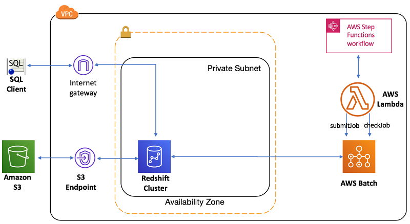

# Automate the AWS Redshift ETL

In this sample, I will show how to use lambda to automate the AWS Redshift SQL scripts execution
1. Create the 2 source tables
2. Copy the data into 2 source tables
3. Create sematic table by select and join 2 source tables
4. Query sematic table and unload the result to S3


## Build the python code for Redshift ETL demo

1. Python library connect to Redshift

- psycopg2

    The advantage of psycopg2 is popular usage. But the AWS Lambda missing the required PostgreSQL libraries in the AMI image, we needed to compile psycopg2 with the PostgreSQL libpq.so library statically linked libpq library instead of the default dynamic link. [awslambda-psycopg2](https://github.com/jkehler/awslambda-psycopg2), [psycopg2-lambda-layer](https://github.com/jetbridge/psycopg2-lambda-layer)

```bash
cd scripts
pip install -i https://pypi.tuna.tsinghua.edu.cn/simple psycopg2
pip install -i https://pypi.tuna.tsinghua.edu.cn/simple boto3
```

- pg8000

    The advantage of pg8000 over the more popular psycopg2 is that it isn’t compiled, which makes installing the dependencies in AWS Lambda easier

2. The redshift_utils.py is the utility to handle the Redshift script execution

3. The redshift_etl_demo.py to run the Redshift ETL

```bash
cd scripts
export REDSHIFT_DATABASE = YOUR_REDSHIFT_DATABASE
export REDSHIFT_USER = YOUR_REDSHIFT_USER_Name
export REDSHIFT_PASSWD = YOUR_REDSHIFT_PASSWD
export REDSHIFT_PORT = YOUR_REDSHIFT_PORT
export REDSHIFT_ENDPOINT = YOUR_REDSHIFT_ENDPOINT
export SCRIPT_PATH = YOUR_SCRIPT_PATH
export REDSHIFT_CLUSTER = YOUR_REDSHIFT_CLUSTER
```

- flights_table_demo: create the flights table, copy the data to Redshfit table, query the data

```bash
python redshift_etl_demo.py -f flights_table_demo

#OR you can direct specify the SQL 

python redshift_etl_demo.py -f redshift_update -s create_flights_table_data.ddl
python redshift_etl_demo.py -f redshift_query -s query_flights_table.ddl
```

```sql
SELECT COUNT(*) FROM flights;

SELECT * FROM flights ORDER BY random() LIMIT 10;

SELECT carrier, SUM (departures) as sum_departures FROM flights GROUP BY carrier ORDER BY 2 DESC LIMIT 10;

SELECT carrier, SUM (passengers) as sum_passengers FROM flights GROUP BY carrier ORDER BY 2 DESC LIMIT 10;

SELECT carrier, SUM (miles) as sum_miles FROM flights GROUP BY carrier ORDER BY 2 DESC LIMIT 10;

SELECT carrier, SUM (passengers * miles) as sum_miles_passengers FROM flights GROUP BY carrier ORDER BY 2 DESC LIMIT 10;

SELECT carrier, SUM (freight_pounds) as sum_freight_pounds FROM flights GROUP BY carrier ORDER BY 2 DESC LIMIT 10;
```

- aircraft_table_demo: create the aircraft table, copy the data to Redshfit table, query the data, join query the aircraft and flights

```bash
python redshift_etl_demo.py -f aircraft_table_demo

#OR you can direct specify the SQL 

python redshift_etl_demo.py -f redshift_update -s create_aircraft_table.ddl
python redshift_etl_demo.py -f redshift_update -s copy_aircraft_table_data.ddl
python redshift_etl_demo.py -f redshift_query -s query_aircraft_table.ddl
```

```sql
SELECT * FROM aircraft ORDER BY random() LIMIT 10;

SELECT aircraft, SUM(departures) AS trips FROM flights
JOIN aircraft using (aircraft_code)
GROUP BY aircraft ORDER BY trips DESC LIMIT 10;
```

- airports_table_demo: create the airports table by select data from aircraft and flights table, query the data

```bash
python redshift_etl_demo.py -f airports_table_demo

#OR you can direct specify the SQL 

python redshift_etl_demo.py -f redshift_update -s create_airports_table.ddl
python redshift_etl_demo.py -f redshift_update -s copy_airports_table_data.ddl
python redshift_etl_demo.py -f redshift_update -s create_as_select_table.ddl
python redshift_etl_demo.py -f redshift_update -s query_create_as_select_table.ddl
python redshift_etl_demo.py -f redshift_update -s query_create_as_select_table2.ddl
```

```sql
CREATE TABLE vegas_flights
  DISTKEY (origin)
  SORTKEY (origin)
AS
SELECT
  flights.*,
  airport
FROM flights
JOIN airports ON origin = airport_code
WHERE dest = 'LAS';

SELECT * from vegas_flights ORDER BY random() LIMIT 10;

SELECT airport, passengers FROM vegas_flights ORDER BY airport LIMIT 10;

SELECT airport, passengers FROM vegas_flights GROUP BY airport ORDER BY SUM(passengers) desc LIMIT 10;

SELECT
 airport,
 to_char(SUM(passengers), '999,999,999') as passengers
FROM vegas_flights
GROUP BY airport
ORDER BY SUM(passengers) desc;

UNLOAD ('SELECT airport, passengers FROM vegas_flights ORDER BY airport')
to 's3://ray-redshift-training/results/redshift_etl_demo/vegas_flights_'
IAM_ROLE 'arn:aws-cn:iam::your-account-id:role/rayRedshiftRole'
parallel off;
```


## Orchestrate an ETL process using AWS Batch and Step Functions

Archiecture




### AWS Batch Script for Redshift ETL
```bash
cd scripts
export REDSHIFT_DATABASE = YOUR_REDSHIFT_DATABASE
export REDSHIFT_USER = YOUR_REDSHIFT_USER_Name
export REDSHIFT_PASSWD = YOUR_REDSHIFT_PASSWD
export REDSHIFT_PORT = YOUR_REDSHIFT_PORT
export REDSHIFT_ENDPOINT = YOUR_REDSHIFT_ENDPOINT
export SCRIPT_PATH = YOUR_SCRIPT_PATH
export REDSHIFT_CLUSTER = YOUR_REDSHIFT_CLUSTER

aws s3 cp redshift_etl_demo.py s3://ray-redshift-training/batch-demo/scripts/redshift_etl_demo.py
aws s3 cp redshift_utils.py s3://ray-redshift-training/batch-demo/scripts/redshift_utils.py
aws s3 cp create_flights_table_data.ddl s3://ray-redshift-training/batch-demo/scripts/create_flights_table_data.ddl
aws s3 cp query_flights_table.ddl s3://ray-redshift-training/batch-demo/scripts/query_flights_table.ddl

export BATCH_FILE_LIBRARY_S3_URL="s3://ray-redshift-training/batch-demo/scripts/redshift_utils.py"
export BATCH_FILE_S3_URL="s3://ray-redshift-training/batch-demo/scripts/redshift_etl_demo.py"
export BATCH_FILE_TYPE="script_python"
export S3_BUCKET_REGION="cn-northwest-1"
export BATCH_FILE_SQL_S3_URL="s3://ray-redshift-training/batch-demo/scripts/create_flights_table_data.ddl"
export PYTHON_PARAMS="redshift_update"
./fetch_and_run.sh

export BATCH_FILE_SQL_S3_URL="s3://ray-redshift-training/batch-demo/scripts/query_flights_table.ddl"
export PYTHON_PARAMS="redshift_query"
./fetch_and_run.sh
```

### Prepare the ECR image used for AWS Batch Service
```
docker build -t awsbatch/fetch_and_run .

aws ecr create-repository --repository-name awsbatch/fetch_and_run --region cn-northwest-1

aws ecr get-login-password --region cn-northwest-1 | docker login --username AWS --password-stdin 012345678901.dkr.ecr.cn-northwest-1.amazonaws.com.cn
docker tag awsbatch/fetch_and_run:latest 012345678901.dkr.ecr.cn-northwest-1.amazonaws.com.cn/awsbatch/fetch_and_run:latest
docker push 012345678901.dkr.ecr.cn-northwest-1.amazonaws.com.cn/awsbatch/fetch_and_run:latest
```

### Setup the AWS Batch jobs

Follow up the [guide to setup the AWS Batch environment](https://aws.amazon.com/blogs/compute/creating-a-simple-fetch-and-run-aws-batch-job/)

1. IAM Role with permission: AmazonRedshiftFullAccess, AmazonS3ReadOnlyAccess 

2. Submit and run a job
```bash
aws batch submit-job --cli-input-json file://batch-cli-input.json --endpoint-url https://batch.cn-northwest-1.amazonaws.com.cn
aws batch describe-jobs --endpoint-url https://batch.cn-northwest-1.amazonaws.com.cn --jobs 
```

In the job details page, you can also choose View logs for this job in CloudWatch console to see your job log


# Cleanup
```bash
Delete the Redshift cluster
```


# Reference
1. [psycopg2 example](http://zetcode.com/python/psycopg2/)
2. [psycopg2 guide](https://www.psycopg.org/docs/cursor.html)
3. [Orchestrate an ETL process using AWS Step Functions for Amazon Redshift](https://aws.amazon.com/blogs/big-data/orchestrating-an-etl-process-using-aws-step-functions-for-amazon-redshift/)
