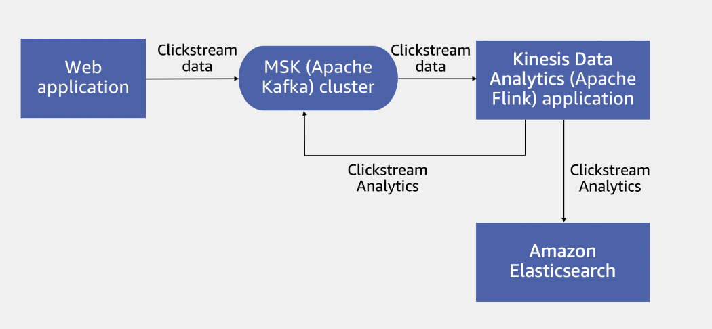
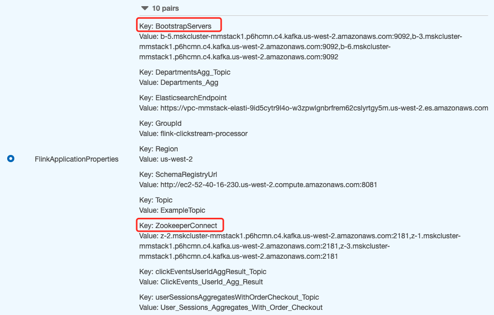
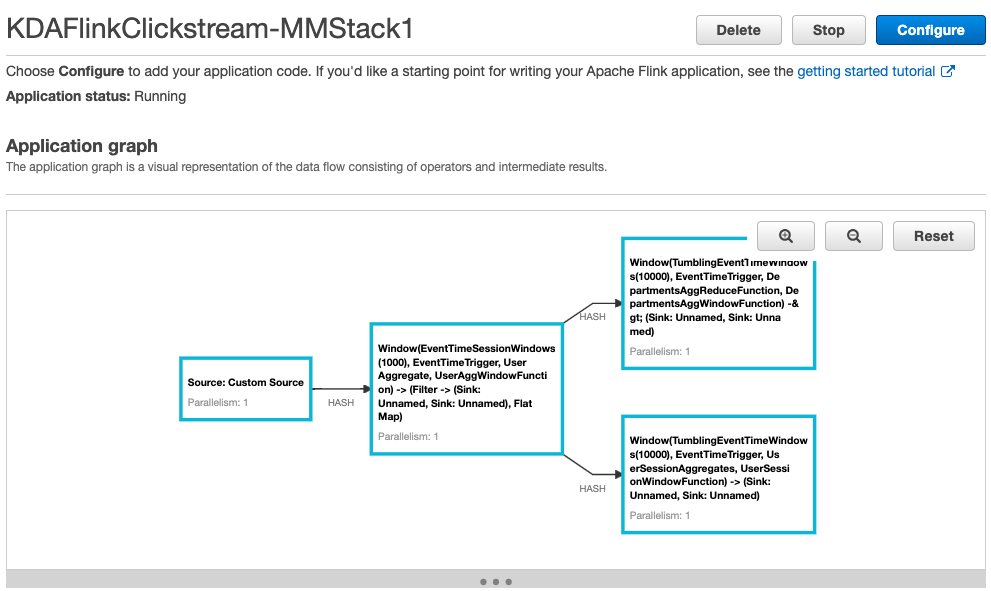
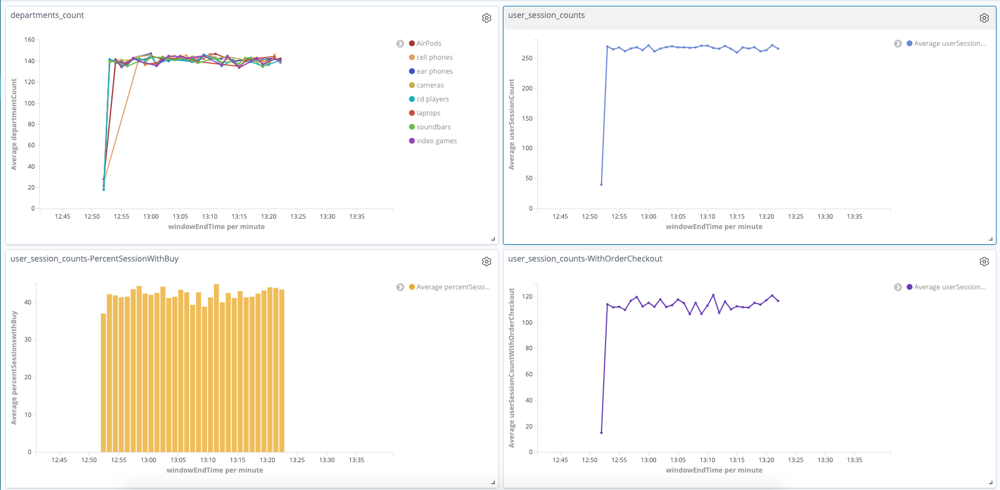

# Steaming processing the ClickStream by Flink

The high level architecture:



1. A data producer to produce Clickstream messages to a topic (ExampleTopic) in an Amazon MSK cluster. 
2. A Kinesis Data Analytics for Java App using the Apache Flink engine which is a managed serverless Apache Flink service to read events from the ExampleTopic topic in Amazon MSK, process and aggregate it and then send the aggegated events (analytics) to both topics in Amazon MSK and Amazon Elasticsearch. 
3. Consume Flink processed messages from Amazon MSK to illustrate how consumers can get real-time clickstream analytics. Then reate Kibana visualizations and a Kibana dashboard to visualize the real-time clickstream analytics.

- Setup
Using CloudFormation: https://s3.amazonaws.com/reinvent2019-msk-liftandshift/MSKLabs/MSKFlinkPrivate.yml

## Produce Clickstream data into the Amazon MSK cluster

- SSH into the KafkaClientEC2Instance

```bash
ClusterArn=<YOUR_MSK_ARN>
ZookeeperConnectString=$(aws kafka describe-cluster --cluster-arn $ClusterArn --region us-west-2 | jq .ClusterInfo.ZookeeperConnectString | sed 's/"//g' )
echo ${ZookeeperConnectString}

BootstrapBrokerString=$(aws kafka get-bootstrap-brokers --region us-west-2 --cluster-arn $ClusterArn | jq .BootstrapBrokerString | sed 's/"//g' )
echo ${BootstrapBrokerString}
```

- /tmp/kafka/producer.properties_msk
```bash
BOOTSTRAP_SERVERS_CONFIG=b-4.mskcluster-mmstack1.p6hcmn.c4.kafka.us-west-2.amazonaws.com:9092,b-6.mskcluster-mmstack1.p6hcmn.c4.kafka.us-west-2.amazonaws.com:9092,b-1.mskcluster-mmstack1.p6hcmn.c4.kafka.us-west-2.amazonaws.com:9092
SCHEMA_REGISTRY_URL_CONFIG=http://ip-10-0-0-240.us-west-2.compute.internal:8081
SSL_KEYSTORE_PASSWORD_CONFIG=password
SSL_KEY_PASSWORD_CONFIG=password
```

- /tmp/kafka/schema-registry.properties
```bash
kafkastore.bootstrap.servers=b-4.mskcluster-mmstack1.p6hcmn.c4.kafka.us-west-2.amazonaws.com:9092,b-6.mskcluster-mmstack1.p6hcmn.c4.kafka.us-west-2.amazonaws.com:9092,b-1.mskcluster-mmstack1.p6hcmn.c4.kafka.us-west-2.amazonaws.com:9092
```

- Start Schema Registry service
```bash
sudo systemctl start confluent-schema-registry
sudo systemctl status confluent-schema-registry
```

- Create input `ExampleTopic` topic 
```bash
cd kafka_2.12-2.2.1/
bin/kafka-topics.sh --create --zookeeper $ZookeeperConnectString --replication-factor 3 --partitions 3 --topic ExampleTopic
```

- Create the output topics where the Kinesis Data Analytics Apache Flink application would send the clickstream analytics to.
```bash
bin/kafka-topics.sh --create --zookeeper $ZookeeperConnectString --replication-factor 3 --partitions 3 --topic Departments_Agg

bin/kafka-topics.sh --create --zookeeper $ZookeeperConnectString --replication-factor 3 --partitions 3 --topic ClickEvents_UserId_Agg_Result

bin/kafka-topics.sh --create --zookeeper $ZookeeperConnectString --replication-factor 3 --partitions 3 --topic User_Sessions_Aggregates_With_Order_Checkout

bin/kafka-topics.sh --zookeeper $ZookeeperConnectString --list
```

- Run the KafkaClickstreamClient-1.0-SNAPSHOT.jar program to generate the clickstream
```bash
cd /tmp/kafka
java -jar KafkaClickstreamClient-1.0-SNAPSHOT.jar -t ExampleTopic -pfp /tmp/kafka/producer.properties_msk -nt 8 -rf 1800 
```

## Configure Amazon Kinesis Data Analytics for Java Application 
- FlinkApplicationProperties

    BootstrapServers - Bootstrap servers of MSK.

    ZookeeperConnect - Zookeeper connect of MSK.

- Enable the Monitoring with CloudWatch Logs

- VPC configuration based on Amazon MSK cluster

    Select the VPC of `MSKCluster`

    Security Group: remove the default `MSKSecurityGroup`, select the `KDASecurityGroup`



- Update the configuration

- Run the `Amazon KDA Application`
```
Successfully started application
Next, monitor your application by using the Application graph and Monitoring tab.
```



- After the application starts running, refresh the page to see the `Application graph`.

- Check the `Monitoring` of Amazon KDA Application. Make sure the `Downtime` is keeping zero.

## Consuming Clickstream analytics events from the Amazon MSK cluster
```bash
bin/kafka-console-consumer.sh --bootstrap-server $BootstrapBrokerString --topic Departments_Agg --from-beginning

{"departmentName":"AirPods","departmentCount":28,"windowBeginTime":1598849560000,"windowEndTime":1598849570000}
{"departmentName":"video games","departmentCount":16,"windowBeginTime":1598849560000,"windowEndTime":1598849570000}
....

bin/kafka-console-consumer.sh --bootstrap-server $BootstrapBrokerString --topic ClickEvents_UserId_Agg_Result --from-beginning

{"userSessionCount":40,"userSessionCountWithOrderCheckout":15,"percentSessionswithBuy":37.0,"windowBeginTime":1598849560000,"windowEndTime":1598849570000}
{"userSessionCount":272,"userSessionCountWithOrderCheckout":109,"percentSessionswithBuy":40.0,"windowBeginTime":1598849590000,"windowEndTime":1598849600000}
....

bin/kafka-console-consumer.sh --bootstrap-server $BootstrapBrokerString --topic User_Sessions_Aggregates_With_Order_Checkout --from-beginning

{"userId":29263154,"eventCount":49,"orderCheckoutEventCount":49,"deptList":["cameras","soundbars","AirPods","ear phones","laptops","video games","cell phones","cd players"],"eventKey":1,"windowBeginTime":1598850662992,"windowEndTime":1598850663994}
{"userId":29262521,"eventCount":6,"orderCheckoutEventCount":6,"deptList":["soundbars","ear phones"],"eventKey":1,"windowBeginTime":1598850662990,"windowEndTime":1598850663991}
....
```

## Consume data from Kibana Dashboard
1. Amazon Elasticsearch endpoint and the Kibana endpoint are not available over the internet. In order to access the endpoints, we have to create a ssh tunnel and do local port forwarding.
```
Host estunnel  
 HostName <KafkaClientEC2InstancePublicDNS>  
 User ec2-user  
 IdentitiesOnly yes  
 IdentityFile ~/.ssh/RayDemoKey.pem  
 LocalForward 9200 <ElasticsearchEndpoint without https>:443
```

```bash
cd ~/.ssh
nano config
ssh estunnel
```

2. Access the Kibana: https://127.0.0.1:9200/_plugin/kibana

3. Create the index patterns
 - `departments_count` with Time Filter `windowEndTime`
 - `user_session_counts` with Time Filter `windowEndTime`
 - `user_session_details` with Time Filter `windowEndTime`

4. Create the Visualize and Dashboard



## Cleanup
- Delete the Amazon Kinesis Data Analytics for Java Application
- Delete the CloudFormation Stack