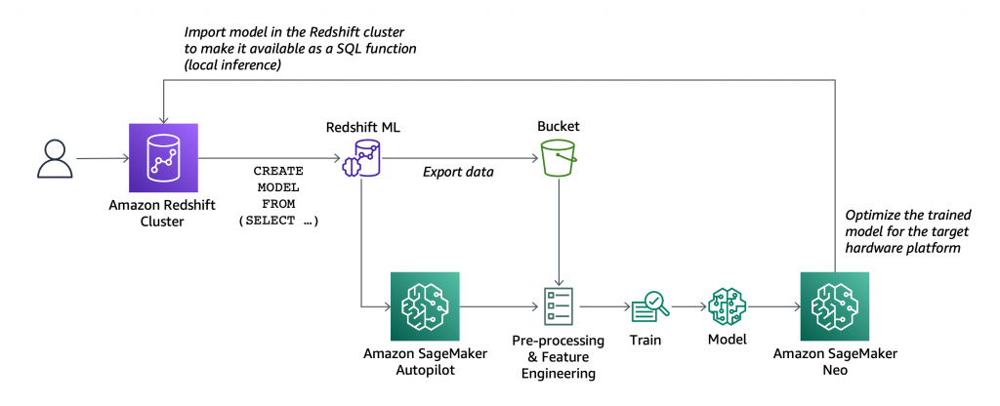
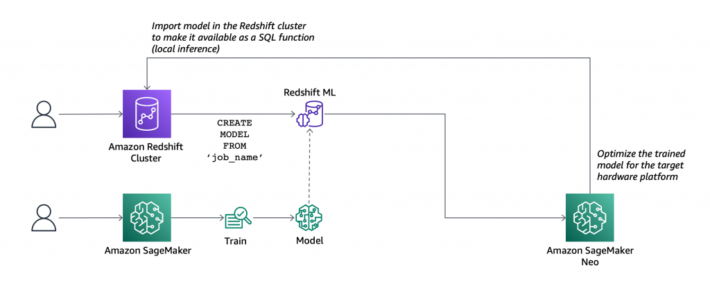
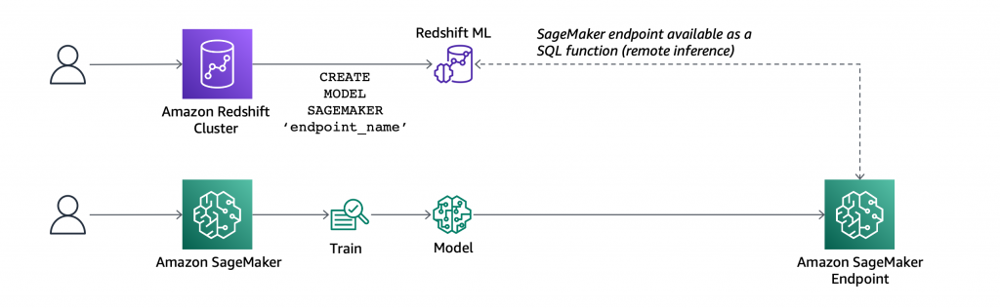

# Redshift ML

With Amazon Redshift ML, you can create, train, and deploy machine learning models directly from your Amazon Redshift cluster. 
- To create a machine learning model, you use a simple SQL query to specify the data you want to use to train your model, and the output value you want to predict.
- To train a machine learning model, Redshift ML securely exports the specified data from Amazon Redshift to your S3 bucket and calls Amazon SageMaker Autopilot to prepare the data (pre-processing and feature engineering), select the appropriate pre-built algorithm, and apply the algorithm for model training. You can optionally specify the algorithm to use as well.
- To deploy a machine learning model, Redshift ML uses Amazon SageMaker Neo to optimize the model for deployment and makes it available as a SQL function. You can use the SQL function to apply the machine learning model to your data in queries, reports, and dashboards.

- Model Creation


- Model inference
    - local mode
    
    - remote mode
    

# Cluster setup for using Amazon Redshift ML
1. Create an Amazon Redshift cluster
    - ra3.xlplus | 2 nodes
    - 
2. Create the IAM role to use Amazon Redshift with Amazon SageMaker. 
 - AmazonS3FullAccess and AmazonSageMakerFullAccess policies
  - Note that the trust policy of the role allows both Amazon Redshift and SageMaker to assume the role to interact with other AWS services.

# Redshift ML predict marketing campaign enroll
1. Dataset 
```bash
wget -N https://sagemaker-sample-data-us-west-2.s3-us-west-2.amazonaws.com/autopilot/direct_marketing/bank-additional.zip
unzip -o bank-additional.zip

local_data_path = "./bank-additional/bank-additional-full.csv"
aws s3 cp $local_data_path s3://YOUR_BUCKET/redshift-ml/
```

2. Create a table to load the data
```sql
CREATE TABLE direct_marketing (
	age DECIMAL NOT NULL, 
	job VARCHAR NOT NULL, 
	marital VARCHAR NOT NULL, 
	education VARCHAR NOT NULL, 
	credit_default VARCHAR NOT NULL, 
	housing VARCHAR NOT NULL, 
	loan VARCHAR NOT NULL, 
	contact VARCHAR NOT NULL, 
	month VARCHAR NOT NULL, 
	day_of_week VARCHAR NOT NULL, 
	duration DECIMAL NOT NULL, 
	campaign DECIMAL NOT NULL, 
	pdays DECIMAL NOT NULL, 
	previous DECIMAL NOT NULL, 
	poutcome VARCHAR NOT NULL, 
	emp_var_rate DECIMAL NOT NULL, 
	cons_price_idx DECIMAL NOT NULL, 
	cons_conf_idx DECIMAL NOT NULL, 
	euribor3m DECIMAL NOT NULL, 
	nr_employed DECIMAL NOT NULL, 
	y BOOLEAN NOT NULL
);
```

```sql
COPY direct_marketing 
FROM 's3://your-bucket/sagemaker/autopilot-dm/bank-additional/bank-additional-full.csv' 
DELIMITER ',' IGNOREHEADER 1
IAM_ROLE 'arn:aws-cn:iam::account-id:role/rayRedshiftRole'
REGION 'cn-north-1';
```

3. Create the ML model
```sql
CREATE MODEL direct_marketing
FROM direct_marketing
TARGET y
FUNCTION predict_direct_marketing
IAM_ROLE 'arn:aws-cn:iam::account-id:role/rayRedshiftRole'
SETTINGS (
  S3_BUCKET 'ray-ai-ml-bjs'
);
```

You can set the other addtional options: 
- `MODEL_TYPE`: such as XGBoost or multilayer perceptron (MLP)
- `PROBLEM_TYPE`: regression, binary classification, or multiclass classification
- `OBJECTIVE`: the default behavior is to use mean squared error (MSE) for regression, the F1 score for binary classification, and accuracy for multiclass classification. 

4. Check model status
```sql
SHOW MODEL direct_marketing
```

5. Create model with selected columns (the previous create model use full columns)
```sql
CREATE MODEL simple_direct_marketing
FROM (
        SELECT age, job, marital, education, housing, contact, month, day_of_week, y
 	  FROM direct_marketing
)
TARGET y
FUNCTION predict_simple_direct_marketing
IAM_ROLE 'arn:aws-cn:iam::account-id:role/rayRedshiftRole'
SETTINGS (
  S3_BUCKET 'ray-ai-ml-bjs'
);
```

6. Check model status
```sql
SHOW MODEL simple_direct_marketing
```

7. Make Predictions
- check how many false positives (wrong positive predictions) and false negatives (wrong negative predictions)
```sql
SELECT predict_direct_marketing, y, COUNT(*)
  FROM (SELECT predict_direct_marketing(
                   age, job, marital, education, credit_default, housing,
                   loan, contact, month, day_of_week, duration, campaign,
                   pdays, previous, poutcome, emp_var_rate, cons_price_idx,
                   cons_conf_idx, euribor3m, nr_employed), y
          FROM direct_marketing)
 GROUP BY predict_direct_marketing, y;
```

- check how many customers might be interested in a marketing campaign
```sql
SELECT COUNT(*)
  FROM direct_marketing
 WHERE predict_simple_direct_marketing(
           age, job, marital, education, housing,
           contact, month, day_of_week) = true;
```

8. Cleanup
```sql
DROP MODEL IF EXISTS simple_direct_marketing;
DROP MODEL IF EXISTS direct_marketing;
drop table IF EXISTS public.direct_marketing;
```

# Redshift ML customer churn model use case
1. Create the table and load the data
```sql
/* Create table */
DROP TABLE IF EXISTS customer_activity;

CREATE TABLE customer_activity (
state varchar(2), 
account_length int, 
area_code int,
phone varchar(8), 
intl_plan varchar(3), 
vMail_plan varchar(3),
vMail_message int, 
day_mins float, 
day_calls int, 
day_charge float,
total_charge float,
eve_mins float, 
eve_calls int, 
eve_charge float, 
night_mins float,
night_calls int, 
night_charge float, 
intl_mins float, 
intl_calls int,
intl_charge float, 
cust_serv_calls int, 
churn varchar(6),
record_date date);

/* Load data */
COPY customer_activity
FROM 's3://your-bucket/redshift-ml/customer_activity/customer_activity.csv'
IAM_ROLE 'arn:aws-cn:iam::account-id:role/rayRedshiftRole'
REGION 'cn-north-1'
DELIMITER ',' IGNOREHEADER 1;

/*  check the error */
select * from customer_activity limit 5;
select * from stl_load_errors;
```

2. Create the model - AUTO with binary classification
```sql
DROP MODEL IF EXISTS customer_churn_auto_model;

CREATE MODEL customer_churn_auto_model
FROM (SELECT state,
             account_length,
             area_code,
             total_charge/account_length AS average_daily_spend, 
             cust_serv_calls/account_length AS average_daily_cases,
             churn 
      FROM customer_activity
      WHERE  record_date < '2020-01-01' 
     )
TARGET churn
FUNCTION ml_fn_customer_churn_auto
IAM_ROLE 'arn:aws-cn:iam::account-id:role/rayRedshiftRole'
SETTINGS (
  S3_BUCKET 'ray-ai-ml-bjs',
  max_runtime 1800
);
```


2. check model training status
```sql
SELECT schema_name, model_name, model_state 
FROM stv_ml_model_info;
```

3. inference query on customer joined after 2020-01-01 to predict customer churn
```sql
SELECT phone, 
       ml_fn_customer_churn_auto( 
          state,
          account_length,
          area_code, 
          total_charge/account_length , 
          cust_serv_calls/account_length )
          AS active
FROM customer_activity
WHERE record_date > '2020-01-01';
```

4. inference query predicting customer churn after 2020-01-01 among states
```sql
WITH infered AS (
SELECT state,
       ml_fn_customer_churn_auto( 
          state,
          account_length,
          area_code, 
          total_charge/account_length, 
          cust_serv_calls/account_length )::varchar(6)
          AS active
FROM customer_activity
WHERE record_date > '2020-01-01' )
SELECT state,SUM(CASE when active = 'True.' THEN 1 else 0 end) as churners ,SUM(CASE when active = 'False.' THEN 1 else 0 end) as nonchurners, count(*) as total_per_state from infered group by state order by state;
```

5. Cleanup
```sql
DROP MODEL IF EXISTS ml_fn_customer_churn_auto;
drop table IF EXISTS public.customer_activity;
```

# Redshift ML predict abalone number using XGBOOST
1. Create table and load data
```sql
/* create the table */
DROP TABLE IF EXISTS abalone_xgb;

CREATE TABLE abalone_xgb (
length_val float, 
diameter float, 
height float,
whole_weight float, 
shucked_weight float, 
viscera_weight float,
shell_weight float, 
rings int,
record_number int);

/* load the data */
COPY abalone_xgb 
FROM 's3://your-bucket/redshift-ml/abalone_xgb/abalone.csv' 
IAM_ROLE 'arn:aws-cn:iam::account-id:role/rayRedshiftRole'
REGION 'cn-north-1'
IGNOREHEADER 1 CSV;

/* check the load result or error */
select * from abalone_xgb limit 5;
select * from stl_load_errors;
```

2. create model using modified abalone data set as the training data set with record number
   less than 2500
```sql
drop model IF EXISTS abalone_xgboost_multi_predict_age;

CREATE MODEL abalone_xgboost_multi_predict_age
FROM ( SELECT length_val,
              diameter,
              height,
              whole_weight,
              shucked_weight,
              viscera_weight,
              shell_weight,
              rings 
        FROM abalone_xgb WHERE record_number < 2500 )
TARGET rings FUNCTION ml_fn_abalone_xgboost_multi_predict_age
IAM_ROLE 'arn:aws-cn:iam::account-id:role/rayRedshiftRole'
AUTO OFF
MODEL_TYPE XGBOOST
OBJECTIVE 'multi:softmax'
PREPROCESSORS 'none'
HYPERPARAMETERS DEFAULT EXCEPT (NUM_ROUND '100', NUM_CLASS '30')
settings (S3_BUCKET 'ray-ai-ml-bjs', max_runtime 1800);
```

3. check model training status
```sql
SELECT schema_name, model_name, model_state 
FROM stv_ml_model_info;
```

4. Inference query to predict the age of abalone for record numbers greater than 2500
```sql
select ml_fn_abalone_xgboost_multi_predict_age(length_val, 
                                               diameter, 
                                               height, 
                                               whole_weight, 
                                               shucked_weight, 
                                               viscera_weight, 
                                               shell_weight)+1.5 as age 
from abalone_xgb where record_number > 2500;
```

5. Cleanup
```sql
DROP MODEL IF EXISTS ml_fn_abalone_xgboost_multi_predict_age;
drop table IF EXISTS abalone_xgb;
```