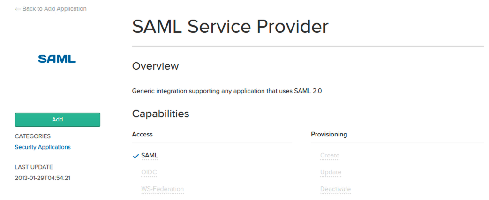
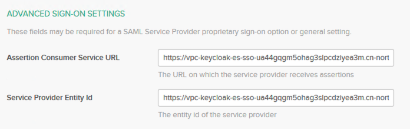
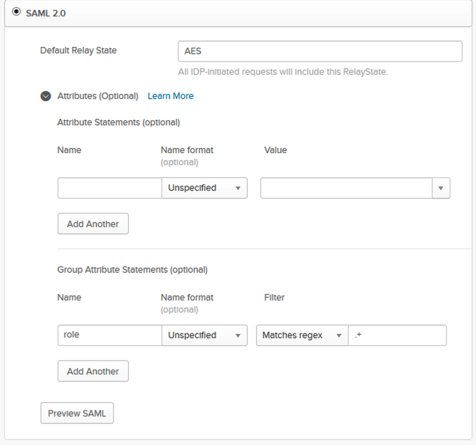
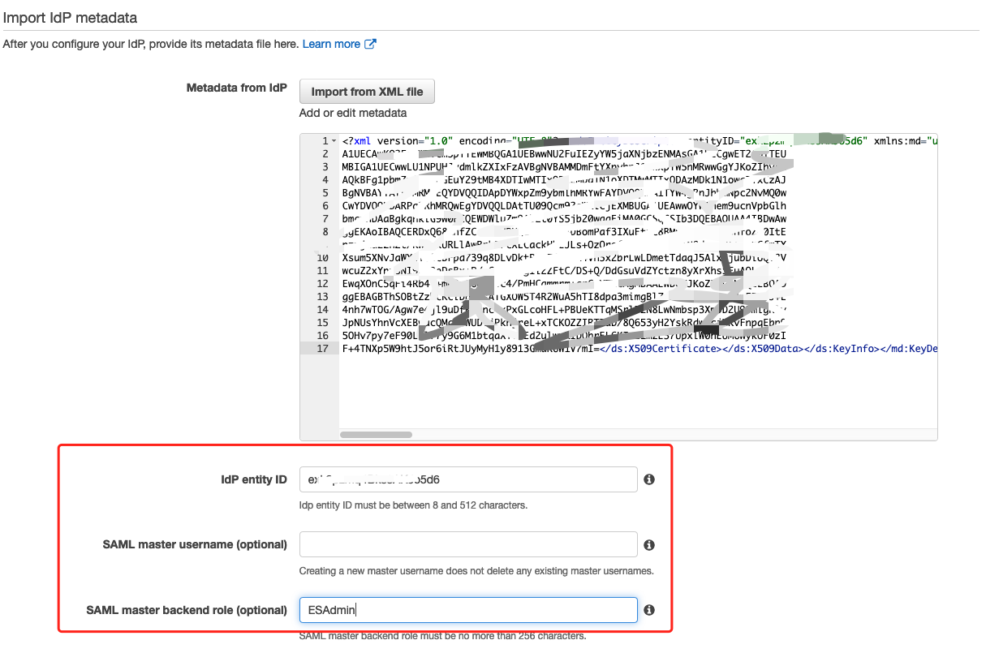
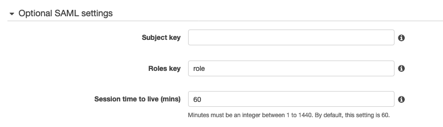
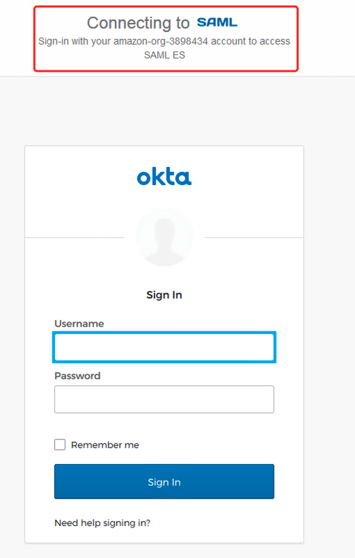

# SAML Authentication for Kibana

When you authentication for Kibana, you can
1. Authenticating through Amazon Cognito
2. Authenticating through the Fine-grained access control [internal user database](https://docs.amazonaws.cn/en_us/elasticsearch-service/latest/developerguide/fgac.html#fgac-kibana)
3. SAML authentication for Kibana lets you use your existing identity provider to offer single sign-on (SSO) for Kibana on domains running `Elasticsearch 6.7 or later`. To use this feature, you must enable `fine-grained access control`.

## Create a domain and authenticate through internal user database
1. Create a domain with the following settings:
- Elasticsearch 7.8
- Private access
- Fine-grained access control with a master user in the internal user database (TheMasterUser for the rest of this tutorial)
- Amazon Cognito authentication for Kibana disabled
- access policy
```json
{
  "Version": "2012-10-17",
  "Statement": [
    {
      "Effect": "Allow",
      "Principal": {
        "AWS": [
          "*"
        ]
      },
      "Action": [
        "es:*"
      ],
      "Resource": "arn:aws-cn:es:cn-north-1:account:domain/domain-name/*"
    }
  ]
}
```
- HTTPS required for all traffic to the domain
- Node-to-node encryption
- Encryption of data at rest

2. Sign in Kibana using `TheMasterUser` and `Try our sample data` for `Sample flight data`

3. Assign different permission for internal user or role
- `Security`->`Internal User Database`->`Create internal user` with name `new-user`
- `Security`->`Role`->`Create role` with name `new-flight-role` 
  - `Index Permissions` specify the `kibana_sample_data_fli*` as index pattern 
  - `action group` as `read`
  - `Document Level Security Query` with 
  ```json
  {
    "match": {
        "FlightDelay": true
    }
   }
  ```
  - `Exclude fields` with `FlightNum`
  - ` Anonymize fields` with `Dest`
- `Security`->`Role Mappings`
  - Map `new-user` with `new-flight-role`
  - Map `new-user` with `kibana_user`

4. open a new private browser window and sign in Kibana with `new-user`
- run query
    ```json
    GET _search
    {
        "query": {
            "match_all": {}
        }
    }
    ```

    Failed with error `no permissions for [indices:data/read/search] and User [name=new-user, backend_roles=[], requestedTenant=__user__]`

- run query against `kibana_sample_data_flights`
    ```json
    GET kibana_sample_data_flights/_search
    {
        "query": {
            "match_all": {}
        }
    }
    ```

    Return the index documents

5. Run above queries with `TheMasterUser`, all queries can Return the index documents


**Limitations for internal user database authentication**

Users in the internal user database can't change their own passwords. Master users (or users with equivalent permissions) must change their passwords for them.


## SAML Authentication for Kibana

Follow up the guide: [Amazon ElasticSearch SAML Authentication for Kibana](https://docs.amazonaws.cn/en_us/elasticsearch-service/latest/developerguide/saml.html)

The Kibana login flow can take one of two forms:

- Service provider (SP) initiated: You navigate to Kibana (for example, https://<es-domain>/_plugin/kibana), which redirects you to the login screen. After you log in, the identity provider redirects you to Kibana.

- Identity provider (IdP) initiated: You navigate to your identity provider, log in, and choose Kibana from an application directory.

Amazon ES provides two single sign-on URLs, `SP-initiated` and `IdP-initiated`, you can choice any of them

1. Enabling SAML Authentication
- `You domain`->`Actions`->`Modify authentication` -> `Check Enable SAML authentication`.
- Note the service provider entity ID and the two SSO URLs, you only need one of the SSO URLs
```bash
Service provider entity ID: https://<es-domain>

IdP-initiated SSO URL: https://<es-domain>/_plugin/kibana/_opendistro/_security/saml/acs/idpinitiated

SP-initiated SSO URL: https://<es-domain>/_plugin/kibana/_opendistro/_security/saml/acs 
```

2. I use the Okta as my identity provider
- In Okta, for example, you create a "SAML 2.0 application." 


  - For Single sign on URL, specify the SSO URL that you chose in step 1. 
  - For Audience URI (SP Entity ID), specify the SP entity ID.


  For Group Attribute Statements, we recommend adding `role` to the Name field and the `regular expression` as `.+` to the Filter field. 


3. After you configure your identity provider, it generates an IdP metadata file.


- `Import from XML file` button to import `IdP metadata file`
- Copy and paste the `entityID` property from your metadata file into the `IDP entity ID`
- Provide a `SAML master username` (only that user receives full permissions) and/or a `SAML master backend role` (any user who belongs to the group receives full permissions).


- Leave the `Subject key` field `empty` to use the `NameID` element of the SAML assertion for the username, you can check the SAML preview to get correct `attribute name`
- Specify `role` from the assertion in the `Role key` field, you can check the SAML preview to get correct `attribute name`


- Choose `Submit`. The domain enters a `processing` state for approximately one minute and change to `Active` state

4. Access to kibana via https://<es-domain>/_plugin/kibana, the Okta SAML login window will shown up


Tips: view a sample assertion during the process, and tools like [SAML-tracer](https://addons.mozilla.org/en-US/firefox/addon/saml-tracer/)

A [sample of saml assertion](saml.xml) get from [SAML-tracer](https://addons.mozilla.org/en-US/firefox/addon/saml-tracer/)

5. After Kibana loads, choose `Security` and `Roles`.
`Map` roles to allow other users to access Kibana with different permission


- Login user belong to `ESAmin` to verify the full access to the Kibana
- Login user belong to `ESRead` to verify the read only access to the Kibana

# Reference
[OKTA Apps_App_Integration_Wizard_SAML](https://help.okta.com/en/prod/Content/Topics/Apps/Apps_App_Integration_Wizard_SAML.htm)

[SAML Authentication for Kibana](https://docs.amazonaws.cn/en_us/elasticsearch-service/latest/developerguide/saml.html)