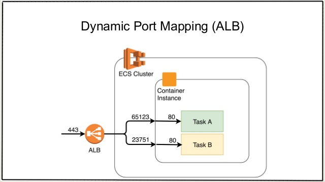

# How can I create an Application Load Balancer and then register Amazon ECS tasks automatically

https://aws.amazon.com/premiumsupport/knowledge-center/create-alb-auto-register/




# How can I a ECS service serve traffic from multiple port?

Solutions: [Registering Multiple Target Groups with a Service](https://aws.amazon.com/cn/about-aws/whats-new/2019/07/amazon-ecs-services-now-support-multiple-load-balancer-target-groups/)


## Example 1: Exposing multiple ports from the same container
A service uses one load balancer but exposes multiple ports from the same container. For example, a Jenkins container might expose port 8080 for the Jenkins web interface and port 50000 for the API.
```json
"loadBalancers":[
   {  
      "targetGroupArn":"arn:aws:elasticloadbalancing:region:123456789012:targetgroup/target_group_name_1/1234567890123456",
      "containerName":"jenkins",
      "containerPort":8080
   },
   {  
      "targetGroupArn":"arn:aws:elasticloadbalancing:region:123456789012:targetgroup/target_group_name_2/6543210987654321",
      "containerName":"jenkins",
      "containerPort":50000
   }
]
```


## Example 2: Having separate load balancers for internal and external traffic
A service uses two separate load balancers, one for internal traffic and a second for internet-facing traffic, for the same container and port.
```json
"loadBalancers":[
   //Internal ELB
   {  
      "targetGroupArn":"arn:aws:elasticloadbalancing:region:123456789012:targetgroup/target_group_name_1/1234567890123456",
      "containerName":"nginx",
      "containerPort":8080
   },
   //Internet-facing ELB
   {  
      "targetGroupArn":"arn:aws:elasticloadbalancing:region:123456789012:targetgroup/target_group_name_2/6543210987654321",
      "containerName":"nginx",
      "containerPort":8080
   }
]
```


## Example 3: Exposing ports from multiple containers
A service uses one load balancer and two target groups to expose ports from separate containers.
```json
"loadBalancers":[
   {  
      "targetGroupArn":"arn:aws:elasticloadbalancing:region:123456789012:targetgroup/target_group_name_1/1234567890123456",
      "containerName":"webserver",
      "containerPort":80
   },
   {  
      "targetGroupArn":"arn:aws:elasticloadbalancing:region:123456789012:targetgroup/target_group_name_2/6543210987654321",
      "containerName":"database",
      "containerPort":3306
   }
]
```