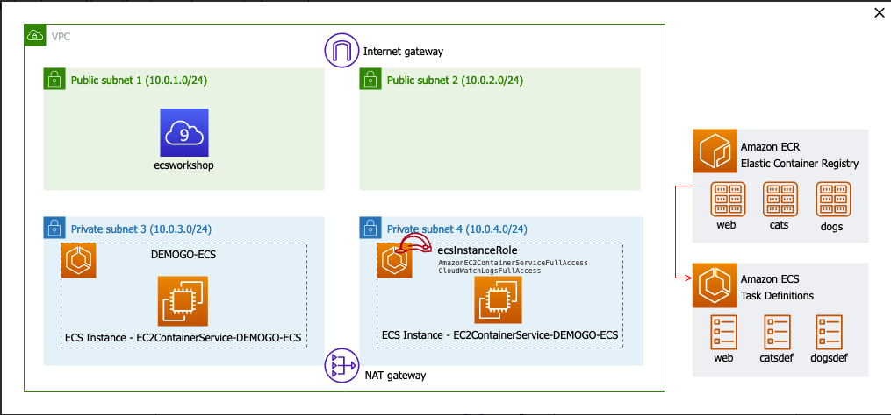
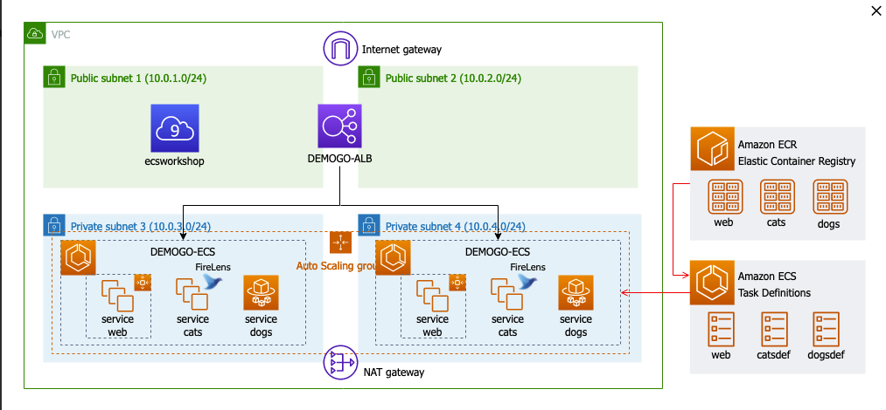
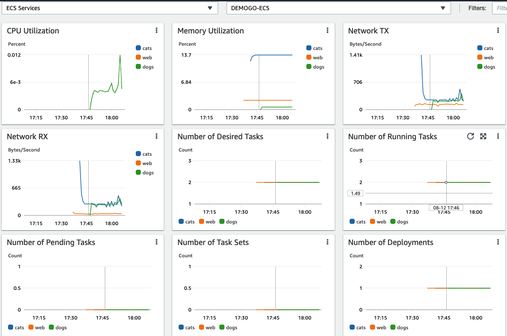
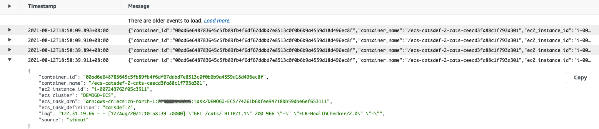

## ECS Firelens demo

FireLens for Amazon ECS enables you to use task definition parameters to route logs to an AWS service or AWS Partner Network (APN) destination for log storage and analytics. FireLens works with Fluentd and Fluent Bit

AWS provide the AWS for Fluent Bit image or you can use your own Fluentd or Fluent Bit image.

Creating Amazon ECS task definitions with a FireLens configuration is supported using the AWS SDKs, AWS CLI, and AWS Management Console. More information, please check [official doc](https://docs.aws.amazon.com/AmazonECS/latest/developerguide/using_firelens.html)

## Setup the ECR

```bash
curl "https://awscli.amazonaws.com/awscli-exe-linux-x86_64.zip" -o "awscliv2.zip"
unzip awscliv2.zip
sudo ./aws/install
sudo ln /usr/local/bin/aws /home/ec2-user/.local/bin/aws

sudo yum install -y jq

export AWS_REGION=cn-north-1
aws configure set default.region ${AWS_REGION}
aws configure get default.region
```

## Create Repositories

1. Create 2 ECR priviate repository: name `cats`, `dogs`, `web`

2. Build Docker Images

```bash
git clone https://github.com/jimini55/catsdogs-cloud9
cd catsdogs-cloud9

cd cats
cat Dockerfile
docker build -t cats .

cd ..
cd dogs
cat Dockerfile
docker build -t dogs .

cd ..
cd web
cat Dockerfile
docker build -t web .
```

3. Tag and Push to ECR

- Move to Amazon ECR. Select cats and click View push commands.
- Do the same for dogs too.

## Create ECS Cluster

1. Create Cluster

   - Type: EC2 Linux + Networking
   - Cluster name: DEMOGO-ECS
   - Instance Configuration
     - Provisioning model: On-Demand Instance
     - EC2 Instance type: m5d.large
     - Number of instances: 2
     - EC2 AMI id: Amazon Linux 2 AMI
     - EBS storage: 30
     - Key pair: Choose your key pair.
   - Networking:
     - VPC: YOUR_VPC
     - Subnets: Private subnet 1,2
     - Security Group: ECSInstanceSG
   - Container instance IAM role: ecsInstanceRole
   - CloudWatch Container Insight: check Enable Container Insights
   - click Create.

2. Cluster IAM Role: ecsInstancerole

- Attach Policy `CloudWatchLogsFullAccess` to `ecsInstancerole`

3. ECS Task Definition



- Create web task definition

  - name: web
  - Configure via JSON

  ```json
  {
      "requiresCompatibilities": [
          "EC2"
      ],
      "inferenceAccelerators": [],
      "containerDefinitions": [
      {
          "dnsSearchDomains": null,
          "environmentFiles": null,
          "logConfiguration": null,
          "entryPoint": null,
          "portMappings": [
          {
              "hostPort": 0,
              "protocol": "tcp",
              "containerPort": 80
          }
          ],
          "command": null,
          "linuxParameters": null,
          "cpu": 0,
          "environment": [],
          "resourceRequirements": null,
          "ulimits": null,
          "dnsServers": null,
          "mountPoints": [],
          "workingDirectory": null,
          "secrets": null,
          "dockerSecurityOptions": null,
          "memory": 128,
          "memoryReservation": null,
          "volumesFrom": [],
          "stopTimeout": null,
          "image": "12345678.dkr.ecr.cn-north-1.amazonaws.com.cn/cats:latest", # Replace 1234567890 with your account ID.
          "startTimeout": null,
          "firelensConfiguration": null,
          "dependsOn": null,
          "disableNetworking": null,
          "interactive": null,
          "healthCheck": null,
          "essential": true,
          "links": null,
          "hostname": null,
          "extraHosts": null,
          "pseudoTerminal": null,
          "user": null,
          "readonlyRootFilesystem": null,
          "dockerLabels": null,
          "systemControls": null,
          "privileged": null,
          "name": "web"
      }],
      "volumes": [],
      "networkMode": null,
      "memory": null,
      "cpu": null,
      "placementConstraints": [],
      "tags": [],
      "family": "web"
  }
  ```

  OR you can Step-by-step Configuraton via AWS Management Console

  - Container name: web
  - Image: 038445823716.dkr.ecr.ap-northeast-2.amazonaws.com/web:latest
  - Memory Limits - Hard limit 128
  - Port mappings
    - Host port: 0
    - Container port: 80

- Create catsdef task definition
  ```json
  {
      "requiresCompatibilities": [
          "EC2"
      ],
      "inferenceAccelerators": [],
      "containerDefinitions": [
          {
          "dnsSearchDomains": null,
          "environmentFiles": null,
          "entryPoint": null,
          "portMappings": [],
          "command": null,
          "linuxParameters": null,
          "cpu": 0,
          "environment": [],
          "resourceRequirements": null,
          "ulimits": null,
          "dnsServers": null,
          "mountPoints": [],
          "workingDirectory": null,
          "secrets": null,
          "dockerSecurityOptions": null,
          "memory": 128,
          "memoryReservation": null,
          "volumesFrom": [],
          "stopTimeout": null,
          "image": "128054284489.dkr.ecr.cn-north-1.amazonaws.com.cn/aws-for-fluent-bit:latest",
          "startTimeout": null,
          "firelensConfiguration": {
              "type": "fluentbit",
              "options": null
          },
          "logConfiguration": {
              "logDriver": "awslogs",
              "options": {
                  "awslogs-group": "firelens-container",
                  "awslogs-region": "cn-north-1", # Your region
                  "awslogs-create-group": "true",
                  "awslogs-stream-prefix": "firelens"
              }
          },
          "dependsOn": null,
          "disableNetworking": null,
          "interactive": null,
          "healthCheck": null,
          "essential": true,
          "links": null,
          "hostname": null,
          "extraHosts": null,
          "pseudoTerminal": null,
          "user": "0",
          "readonlyRootFilesystem": null,
          "dockerLabels": null,
          "systemControls": null,
          "privileged": null,
          "name": "log_router"
          },
          {
          "dnsSearchDomains": null,
          "environmentFiles": null,
          "logConfiguration": {
              "logDriver": "awsfirelens",
              "secretOptions": null,
              "options": {
                  "log_group_name": "ecs-demogo-log",
                  "auto_create_group": "true",
                  "log_stream_prefix": "from-fluent-bit",
                  "region": "cn-north-1", # Your region
                  "Name": "cloudwatch"
              }
          },
          "entryPoint": null,
          "portMappings": [
          {
              "hostPort": 0,
              "protocol": "tcp",
              "containerPort": 80
          }
          ],
          "command": null,
          "linuxParameters": null,
          "cpu": 0,
          "environment": [],
          "resourceRequirements": null,
          "ulimits": null,
          "dnsServers": null,
          "mountPoints": [],
          "workingDirectory": null,
          "secrets": null,
          "dockerSecurityOptions": null,
          "memory": 128,
          "memoryReservation": null,
          "volumesFrom": [],
          "stopTimeout": null,
          "image": "12345678.dkr.ecr.cn-north-1.amazonaws.com.cn/cats:latest", # Replace 1234567890 with your account ID.
          "startTimeout": null,
          "firelensConfiguration": null,
          "dependsOn": null,
          "disableNetworking": null,
          "interactive": null,
          "healthCheck": null,
          "essential": true,
          "links": null,
          "hostname": null,
          "extraHosts": null,
          "pseudoTerminal": null,
          "user": null,
          "readonlyRootFilesystem": null,
          "dockerLabels": null,
          "systemControls": null,
          "privileged": null,
          "name": "cats"
          }
      ],
      "volumes": [],
      "networkMode": null,
      "memory": null,
      "cpu": null,
      "placementConstraints": [],
      "tags": [],
      "family": "catsdef"
  }
  ```
- Create dogsdef task definition

  - launch type compatibility: Fargate
  - Task Definition Name: dogsdef
  - Task size:
    - Task memory (GB): 0.5GB
    - Task CPU (vCPU): 0.25 vCPU
  - Add container: 
    - Configure `log_router` container, Image: `128054284489.dkr.ecr.cn-north-1.amazonaws.com.cn/aws-for-fluent-bit:latest`
    - Memory Limits: Soft limit 128
    - Port mappings: None
    - Configure CloudWatch Logs
        - Log driver: awslogs
        - awslogs-group: firelens-container
        - awslogs-region: cn-north-1
        - awslogs-create-group: true
        - awslogs-stream-prefix: firelens
  - Add container: 
    - Configure `dogs` container, Image: your dogs latest image URI
    - Memory Limits: Soft limit 128
    - Port mappings: Container port 80
    - Configure CloudWatch Logs
        - Log driver: awsfirelens
        - Name: cloudwatch
        - log_group_name: ecs-demogo-log
        - awslogs-region: cn-north-1
        - auto_create_group: true
        - log_stream_prefix: from-fluent-bit
        - region: cn-north-1
  - Log Router Integration: Enable FireLens integration
    - Type: fluentbit
    - Image: 128054284489.dkr.ecr.cn-north-1.amazonaws.com.cn/aws-for-fluent-bit:latest

3. Create ECS Services



These services are associated with the `target groups` by `ALB path patterns`.
    - `web` target group - path pattern /
    - `cats` target group - path pattern /cats
    - `dogs` target group - path pattern /dogs

- Create Application Load Balancer `DEMOGO-ALB`
    - Name: demogo-alb
    - Listeners: 80 port
    - 2 public subnet
    - Security Group: allow 80 port
    - Configure Routing 
        - Target group: New target group
        - Name: web
        - Target type: Instance (Because web task definition is EC2 type.)
        - Port: 80
        - path pattern /

- Create `web` service
    - Launch type: EC2
    - Task Definition
        - Family: web
        - Revision: latest
    - Service type: Replica
    - Service name: web
    - Number of tasks: 2
    - Task Placement: Select AZ Balanced Spread
    - Configure network
        - Load balancer type: Application Load Balancer
        - Service IAM role: AWSServiceRoleForECS (If you don’t have any, select create new role.)
        - Load balancer name: Select demogo-alb
        - Container to load balance: Select web:0:80
            - Production listener port: Select 80:HTTP from the dropdown.
            - Target group name: Select web from the dropdown then other options will be automatically filled.
        - Service discovery (optional) – Uncheck
        - Set Auto Scaling: Do not adjust the service’s desired count

- Create service `cats`
    - Launch type: EC2
    - Task Definition
        - Family: catsdef
        - Revision: latest
    - Service type: Replica
    - Service name: cats
    - Number of tasks: 2
    - Task Placement: Select AZ Balanced Spread
    - Configure network
        - Load balancer type: Application Load Balancer
        - Service IAM role: AWSServiceRoleForECS (If you don’t have any, select create new role.)
        - Load balancer name: Select demogo-alb
        - Container to load balance: Select cats:0:80
            - Production listener port: Select 80:HTTP from the dropdown.
            - Target group name: Click create new and type `cats`
            - path pattern: /cats*, Evaluation order: 1
            - Health check path: /cats/
        - Service discovery (optional) – Uncheck
        - Set Auto Scaling: Do not adjust the service’s desired count


- Create service `dogs`
    - Launch type: Fargate
    - Task Definition
        - Family: dogsdef
        - Revision: latest
    - Platform version: latest
    - Service name: dogs
    - Number of tasks: 2
    - Configure network
        - Select Cluster VPC and 2 Private Subnet
        - Security Group: It will be auto-created.
        - Auto-assgin public IP: DISABLED
        - Load balancer type: Application Load Balancer
        - Service IAM role: AWSServiceRoleForECS (If you don’t have any, select create new role.)
        - Load balancer name: Select demogo-alb
        - Container to load balance: Select dogs:80:80
            - Production listener port: Select 80:HTTP from the dropdown.
            - Target group name: Click create new and type `dogs`
            - path pattern: //dogs*, Evaluation order: 2
            - Health check path: /dogs/
        - Service discovery (optional) – Uncheck
        - Set Auto Scaling: Do not adjust the service’s desired count

- Service Check: 
  - Make sure all the services are `active` and `Desired tasks` number == `Running tasks` number
  - Go to Tasks tab and check each task’s status is `RUNNING`. What Container instance each service is running on. You can see `dogs` services do not have Container instance information because it uses `FARGATE`.
  - Move to Amazon EC2 Load Balancers. Copy DNS name of `demogo-alb` DNS Name and paste to your web browser.
  - Click `I♥Cats` and `I♥Dogs`. And you can refresh the page of the path `/dogs/` and `/cats/`

## Monitoring
1. Monitoring Amazon ECS with Container Insights
- Navigate Resources


- Navigate performance_monitoring ECS Clusters, ECS Services, and ECS Tasks

![performance_monitoring_container_performance]/media/performance_monitoring_container_performance.png)

2. Log routing using AWS FireLens

FireLens works with Fluentd and Fluent Bit. AWS provide the AWS for Fluent Bit image or you can use your own Fluentd or Fluent Bit image. FireLens for Amazon ECS enables you to use task definition parameters to route logs to an AWS service for log storage and analytics. In this lab, you will learn one of the simplest use cases: Firelens Fluent Bit and CloudWatch Logs.

- Move to CloudWatch Log groups - Filter `ecs-demogo-log`
- Click `ecs-demogo-log` and navigate each log stream `from-fluent-bitcats-firelens-*`
- You can find information about container_id, ecs_cluster, etcs_task_definition and logs etc.


3. log insights for `ecs-demogo-log`
```bash
fields @timestamp, @message
| sort @timestamp desc
| limit 20
```

## Reference

[Amazon ECS FireLens Examples](https://github.com/aws-samples/amazon-ecs-firelens-examples)
