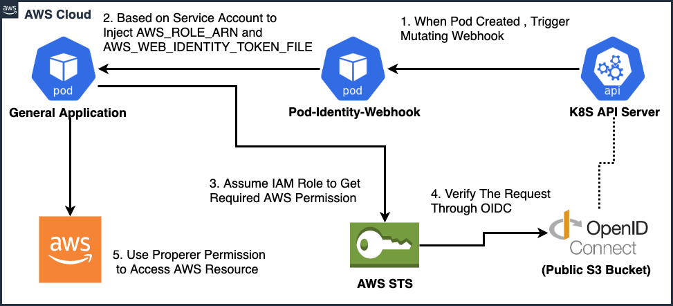

# How to eks上附加iam role到pod级别

## 如何深入理解 EKS IRSA 的实现机制
https://blog.51cto.com/wzlinux/2463715

## EKS利用iamserviceaccount 去实现

当用户使用 kubectl 去创建一个 Pod 的时候，并且 Pod 的 serviceaccount 是一个 iamserviceaccount 的时候，会被 admission control eks-pod-identity-webhook 所拦截，这里的 pod-identity-webhook 是 k8s 的  mutating admission webhook，由 eks-pod-identity-webhook 协助将由 kube-controller-manager 所签署的 Token 信息写入到 etcd 中，然后以  Projected Volume 的形式把 token 挂载到 Pod 中，并把 iamserviceaccount 中的 role-arn 和刚刚生成的 token 注入到 Pod 的环境变量AWS_WEB_IDENTITY_TOKEN_FILE中

## kube2iam for Self-hosted K8S
kube2iam的机制跟IRSA不太一样，如果要模拟eks的irsa可以参考下这个blog：https://blog.amis.com/aws-irsa-for-self-hosted-kubernetes-e045564494af