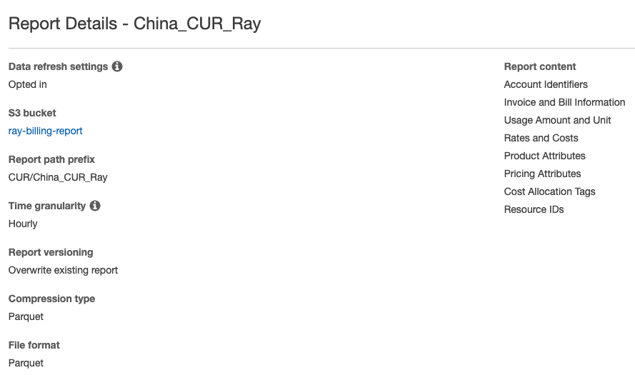
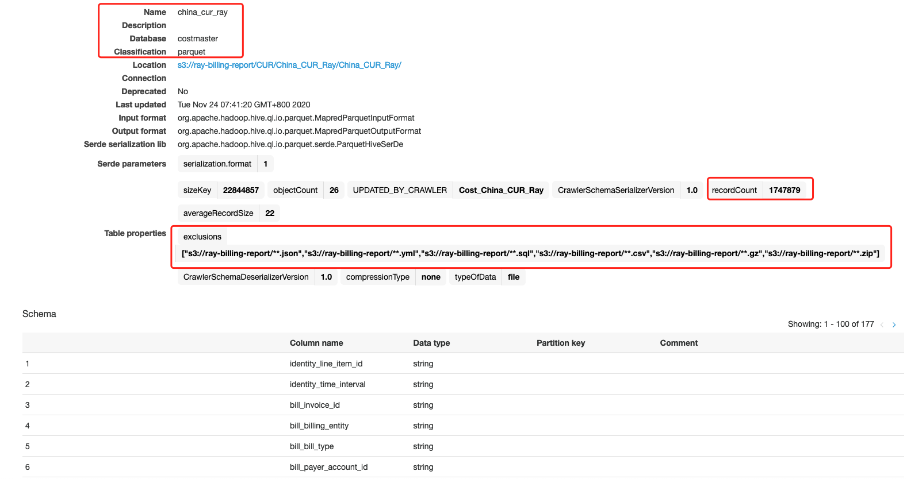

# Cost and Usage Report analysis
[Lab guide](https://www.wellarchitectedlabs.com/cost/200_labs/200_4_cost_and_usage_analysis/)

Highlight steps:

## Enable Cost Usage Report



## CLI query
```bash
aws ce get-cost-and-usage \
    --time-period Start=2021-01-01,End=2021-02-01 \
    --granularity MONTHLY \
    --metrics "BlendedCost" "UnblendedCost" "UsageQuantity" \
    --group-by Type=DIMENSION,Key=USAGE_TYPE\
    --region cn-north-1 --profile cn-north-1
  
aws ce get-cost-and-usage \
    --time-period Start=2021-01-01,End=2021-02-01 \
    --granularity MONTHLY \
    --metrics "BlendedCost" "UnblendedCost" "UsageQuantity" \
    --group-by Type=DIMENSION,Key=SERVICE\
    --region cn-north-1 --profile cn-north-1
```

## Glue Crawler Job

- Glue Crawler Job


- Table created by Glue Crawler


## Common Anlysis SQL

1. What are all the columns and data are in the CUR table?
```sql
SELECT * FROM "costmaster"."china_cur_ray" limit 10;
```

2. What are all the different values in a specific column?
```sql
SELECT "line_item_line_item_description" FROM "costmaster"."china_cur_ray" limit 10;
```

3. What are all the columns from the CUR, where a specific value is in the column
```sql
SELECT * from "costmaster"."china_cur_ray"
WHERE "line_item_line_item_type" like '%Usage%'
LIMIT 10;
```

4. What billing periods are available?
```sql
SELECT distinct bill_billing_period_start_date FROM "costmaster"."china_cur_ray"
LIMIT 10;
```

5. Top10 Costs by AccountID
```sql
SELECT "line_item_usage_account_id", round(sum("line_item_unblended_cost"),2) as cost from"costmaster"."china_cur_ray"
GROUP BY "line_item_usage_account_id"
ORDER BY cost desc
LIMIT 10;
```

6. Top10 Costs by Product/Services
```sql
SELECT "line_item_product_code", round(sum("line_item_unblended_cost"),2) as cost from"costmaster"."china_cur_ray"
GROUP BY "line_item_product_code"
ORDER BY cost desc
LIMIT 10;
```

7. Top10 Costs by Line Item Description
```sql
SELECT "line_item_product_code", "line_item_line_item_description", round(sum("line_item_unblended_cost"),2) as cost from "costmaster"."china_cur_ray"
GROUP BY "line_item_product_code", "line_item_line_item_description"
ORDER BY cost desc
LIMIT 10;
```

8. Top EC2 Cost
```sql
 SELECT "line_item_product_code", "line_item_line_item_description", round(sum("line_item_unblended_cost"),2) as cost from "costmaster"."china_cur_ray"
 WHERE "line_item_product_code" like '%AmazonEC2%'
 GROUP BY "line_item_product_code", "line_item_line_item_description"
 ORDER BY cost desc
 LIMIT 10;
```

9. Top EC2 OnDemand Costs
```sql
 SELECT "line_item_product_code", "line_item_line_item_description", round(sum("line_item_unblended_cost"),2) as cost from "costmaster"."china_cur_ray"
 WHERE "line_item_product_code" like '%AmazonEC2%' and "line_item_usage_type" like '%BoxUsage%'
 GROUP BY "line_item_product_code", "line_item_line_item_description"
 ORDER BY cost desc
 LIMIT 10;

```

10. Top 20 costs by line item description, with a `Name` Tag
```sql
 SELECT "bill_payer_account_id", "product_product_name", "line_item_usage_type", "line_item_line_item_description", "resource_tags_user_name", round(sum(line_item_unblended_cost),2) as cost FROM "costmaster"."china_cur_ray"
 WHERE length("resource_tags_user_name") >0
 GROUP BY "resource_tags_user_name", "bill_payer_account_id", "product_product_name", "line_item_usage_type", "line_item_line_item_description"
 ORDER BY cost desc
 LIMIT 20
```

11. Who used Reserved Instances and what they would have paid with public pricing. 
```sql
 SELECT "bill_payer_account_id", "bill_billing_period_start_date", "line_item_usage_account_id", "reservation_subscription_id", "line_item_product_code", "line_item_usage_type", sum("line_item_usage_amount") as Usage, "line_item_unblended_rate", sum("line_item_unblended_cost") as Cost, "line_item_line_item_description", "pricing_public_on_demand_rate", sum("pricing_public_on_demand_cost") as PublicCost from "costmaster"."china_cur_ray"
 WHERE "line_item_line_item_Type" like '%DiscountedUsage%'
 GROUP BY "bill_payer_account_id", "bill_billing_period_start_date", "line_item_usage_account_id", "reservation_subscription_id", "line_item_product_code", "line_item_usage_type", "line_item_unblended_rate", "line_item_line_item_description", "pricing_public_on_demand_rate"
 LIMIT 20

```


12. How much is being spent on each different family (usage type) and how much is covered by Reserved instances.
```sql
 SELECT "line_item_usage_type", sum("line_item_usage_amount") as usage, round(sum("line_item_unblended_cost"),2) as cost from "costmaster"."china_cur_ray"
 WHERE "line_item_usage_type" like '%t2.%'
 GROUP BY "line_item_usage_type"
 ORDER BY "line_item_usage_type"
 LIMIT 20
```

13. Costs By running type Divide the cost by usage (hrs), and see how much is being spent per hour on each of the usage types. Compare BoxUsage (On Demand), to HeavyUsage (Reserved instance), to SpotUsage (Spot).
```sql
 SELECT "line_item_usage_type", round(sum("line_item_usage_amount"),2) as usage, round(sum("line_item_unblended_cost"),2) as cost, round(avg("line_item_unblended_cost"/"line_item_usage_amount"),4) as hourly_rate from "costmaster"."china_cur_ray"
 WHERE "line_item_product_code" like '%AmazonEC2%' and "line_item_usage_type" like '%Usage%'
 GROUP BY "line_item_usage_type"
 ORDER BY "line_item_usage_type"
 LIMIT 20

```

14. Show unused Reserved Instances 
```sql
  SELECT bill_billing_period_start_date, product_region, line_item_usage_type, reservation_subscription_id, reservation_unused_quantity, reservation_unused_recurring_fee from "costmaster"."china_cur_ray"
  WHERE length(reservation_subscription_id) > 0 and reservation_unused_quantity > 0
  ORDER BY bill_billing_period_start_date, reservation_unused_recurring_fee desc
  LIMIT 20
```