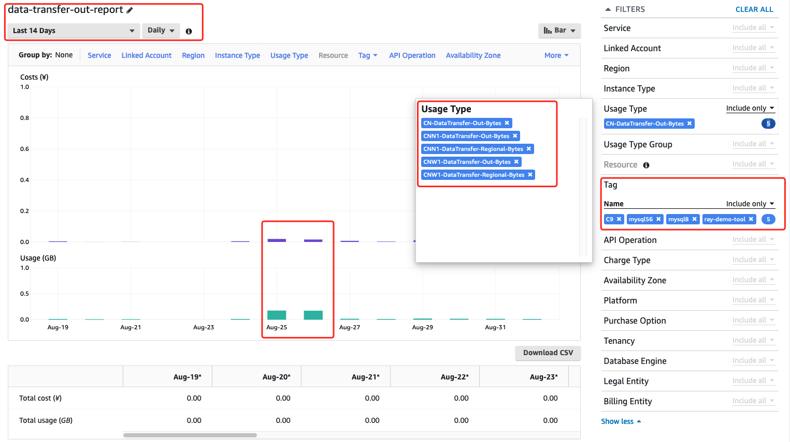

# Simple generate a report using the AWS Cost Explorer.

## Get the data transfer out report fron AWS Cost Explorer



## Get the data transfer out report fron AWS Cost Explorer API
```bash
python aws-cost-and-usage-report.py --days=14 > results.csv
```

results.csv output sample

```bash
TimePeriod  LinkedAccount   Service Cost    Cost-Unit   Usage   Usage-Unit  Estimated
2020-08-19   your-account-id    Amazon Elastic Compute Cloud - Compute   0.0040055354    CNY     0.0042931782    GB      True
2020-08-20   your-account-id    Amazon Elastic Compute Cloud - Compute   0.0002919752    CNY     0.0003129422    GB      True
2020-08-21   your-account-id    Amazon Elastic Compute Cloud - Compute   0.0006365276    CNY     0.0006822375    GB      True
2020-08-24   your-account-id    EC2 - Other      0.0000045292    CNY     0.000067601     GB      True
2020-08-24   your-account-id    Amazon Elastic Compute Cloud - Compute   0.0044711048    CNY     0.0047921809    GB      True
2020-08-25   your-account-id    EC2 - Other      0.0106448582    CNY     0.158878485     GB      True
2020-08-25   your-account-id    Amazon Elastic Compute Cloud - Compute   0.0086245605    CNY     0.0092439016    GB      True
2020-08-26   your-account-id    EC2 - Other      0.0106634752    CNY     0.1591563449    GB      True
2020-08-26   your-account-id    Amazon Elastic Compute Cloud - Compute   0.0049693036    CNY     0.0053261558    GB      True
2020-08-27   your-account-id    EC2 - Other      0.0001193828    CNY     0.0017818361    GB      True
2020-08-27   your-account-id    Amazon Elastic Compute Cloud - Compute   0.0069894375    CNY     0.0074913585    GB      True
2020-08-28   your-account-id    EC2 - Other      0.0001217973    CNY     0.0018178656    GB      True
2020-08-28   your-account-id    Amazon Elastic Compute Cloud - Compute   0.0023326291    CNY     0.0025001382    GB      True
2020-08-29   your-account-id    EC2 - Other      0.000127484     CNY     0.0019027473    GB      True
2020-08-29   your-account-id    Amazon Elastic Compute Cloud - Compute   0.0101656242    CNY     0.0108956314    GB      True
2020-08-30   your-account-id    EC2 - Other      0.0002242014    CNY     0.003346283     GB      True
2020-08-30   your-account-id    Amazon Elastic Compute Cloud - Compute   0.0056153003    CNY     0.0060185428    GB      True
2020-08-31   your-account-id    EC2 - Other      0.0000568822    CNY     0.0008489911    GB      True
2020-08-31   your-account-id    Amazon Elastic Compute Cloud - Compute   0.0063176741    CNY     0.0067713548    GB      True
2020-09-01   your-account-id    EC2 - Other      0.000105001     CNY     0.0015671746    GB      True
2020-09-01   your-account-id    Amazon Elastic Compute Cloud - Compute   0.002173082     CNY     0.0023291337    GB      True
```

- get_tags example
```python
tags = ce.get_tags(TimePeriod={'Start': start, 'End':  end},
    **kwargs)
    print(tags)
```

Results
```
{'Tags': ['aws:autoscaling:groupName', 'aws:cloudformation:logical-id', 'aws:cloudformation:stack-id', 'aws:cloudformation:stack-name', 'Customer', 'Name', 'STAGE', 'workload-type'], 
    'ReturnSize': 8, 'TotalSize': 8, 'ResponseMetadata': {'RequestId': '0d4eddd4-d24b-49d4-87d0-b221eb20f99b', 'HTTPStatusCode': 200, 
    'HTTPHeaders': {'date': 'Thu, 03 Sep 2020 14:49:03 GMT', 'content-type': 'application/x-amz-json-1.1', 'content-length': '203', 'connection': 'keep-alive', 'x-amzn-requestid': '0d4eddd4-d24b-49d4-87d0-b221eb20f99b', 'cache-control': 'no-cache'}, 
    'RetryAttempts': 0}}
```

- get_tags example
```python
tags = ce.get_tags(TimePeriod={'Start': start, 'End':  end},
    **kwargs)
    print(tags)
```

Results
```
{'Tags': ['aws:autoscaling:groupName', 'aws:cloudformation:logical-id', 'aws:cloudformation:stack-id', 'aws:cloudformation:stack-name', 'Customer', 'Name', 'STAGE', 'workload-type'], 
    'ReturnSize': 8, 'TotalSize': 8, 'ResponseMetadata': {'RequestId': '0d4eddd4-d24b-49d4-87d0-b221eb20f99b', 'HTTPStatusCode': 200, 
    'HTTPHeaders': {'date': 'Thu, 03 Sep 2020 14:49:03 GMT', 'content-type': 'application/x-amz-json-1.1', 'content-length': '203', 'connection': 'keep-alive', 'x-amzn-requestid': '0d4eddd4-d24b-49d4-87d0-b221eb20f99b', 'cache-control': 'no-cache'}, 
    'RetryAttempts': 0}}
```

## Reference
[Using AWS Cost Explorer to analyze data transfer costs](https://aws.amazon.com/blogs/mt/using-aws-cost-explorer-to-analyze-data-transfer-costs/)

[AWS Cost Explorer Report Generator](https://github.com/aws-samples/aws-cost-explorer-report)

[Querying Cost and Usage Reports using Amazon Athena](https://docs.aws.amazon.com/cur/latest/userguide/cur-query-athena.html)

[Boto3 CostExplorer API](https://boto3.amazonaws.com/v1/documentation/api/latest/reference/services/ce.html)