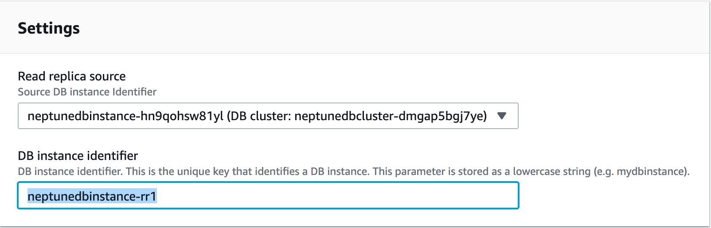
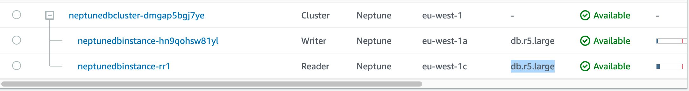
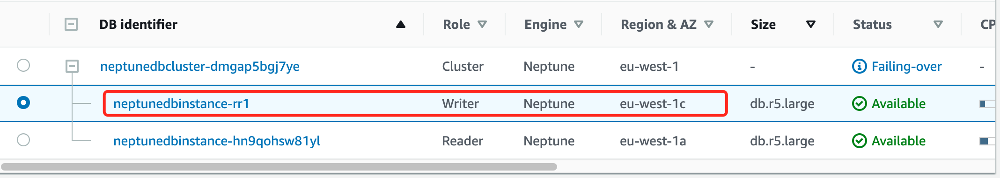

# Working on Neptune DB Cluster

Amazon Neptune: Amazon Neptune is a fully-managed graph database service.

## Create Neptune DB Cluster

Follow up the guide to create the [Neptune DB Cluster](https://docs.aws.amazon.com/neptune/latest/userguide/get-started-create-cluster.html)

## Launch Neptune Workbench to run the Jupyter Notebooks

The best way to get started with Amazon Neptune is to use the [Neptune workbench](https://docs.aws.amazon.com/neptune/latest/userguide/notebooks.html). 


## Create the SageMaker Jupyter Notebooks existing the Amazon Neptune Cluster

For the Neptune Workbench not available Region, you can use the SageMaker Jupyter Notebooks connecting to Amazon Neptune


Running the CloudFormation template `neptune-sagemaker-nested-stack.json` template

- NeptuneClusterEndpoint: Cluster endpoint of your existing Neptune cluster.
- NeptuneClusterPort: Port of your existing Neptune cluster.
- NeptuneClusterVpc: VPC ID of the VPC in which your Neptune cluster is running. 
- NeptuneClusterSubnetId: ID of one of the subnets in which your Neptune cluster is running.
- NeptuneClientSecurityGroup: A VPC security group with access to your Neptune cluster.
NeptuneLoadFromS3RoleArn: ARN of the IAM role that allows Amazon Neptune to access Amazon S3 resources. This ARN is used when a notebook populates the database by submitting a load request to the loader API. Follow up the [guide to create it](https://docs.aws.amazon.com/neptune/latest/userguide/bulk-load-tutorial-IAM.html)
- NotebookContentS3Locations: Comma-separated S3 locations of the notebooks to install into the notebook instance.
- NeptuneReaderEndpoint: Reader endpoint of an existing Neptune cluster.

## Using SageMaker Jupyter Notebooks analysis the Amazon Neptune Graphs

### Install the Apache TinkerPop Gremlin client

Launch the Terminal from Jupyter Notebooks

```bash
sudo yum install -y java-1.8.0-devel
# set Java 8 as the default runtime
sudo /usr/sbin/alternatives --config java
# Download Gremlin Console
wget https://archive.apache.org/dist/tinkerpop/3.4.3/apache-tinkerpop-gremlin-console-3.4.3-bin.zip
unzip apache-tinkerpop-gremlin-console-3.4.3-bin.zip
cd apache-tinkerpop-gremlin-console-3.4.3
# Download the CA certificate
wget https://www.amazontrust.com/repository/SFSRootCAG2.pem
# In the `conf` subdirectory, create a file named neptune-remote.yaml with the following text.
hosts: [your-neptune-endpoint]
port: 8182
connectionPool: { enableSsl: true, trustCertChainFile: "SFSRootCAG2.pem"}
serializer: { className: org.apache.tinkerpop.gremlin.driver.ser.GryoMessageSerializerV3d0, config: { serializeResultToString: true }}
# run the Gremlin Console
bin/gremlin.sh

Sep 24, 2020 12:27:38 PM java.util.prefs.FileSystemPreferences$1 run
INFO: Created user preferences directory.

         \,,,/
         (o o)
-----oOOo-(3)-oOOo-----
plugin activated: tinkerpop.server
plugin activated: tinkerpop.utilities
plugin activated: tinkerpop.tinkergraph
gremlin>

# connect to the Neptune DB instance
gremlin> :remote connect tinkerpop.server conf/neptune-remote.yaml
WARN  org.apache.tinkerpop.gremlin.driver.Cluster  - Using deprecated SSL trustCertChainFile support
WARN  org.apache.tinkerpop.gremlin.driver.Cluster  - Using deprecated SSL trustCertChainFile support
==>Configured neptunedbcluster-dmgap5bgj7ye.cluster-cjua4dpnn7vv.eu-west-1.neptune.amazonaws.com/172.30.1.48:8182

# switch to remote mode
remlin> :remote console
==>All scripts will now be sent to Gremlin Server - [neptunedbcluster-dmgap5bgj7ye.cluster-cjua4dpnn7vv.eu-west-1.neptune.amazonaws.com/172.30.1.48:8182] - type ':remote console' to return to local mode

# create a simple graph using a single Gremlin traversal
gg.addV('person').property('name','marko').property('age',29).as('marko').
addV('person').property('name','vadas').property('age',27).as('vadas').
addV('person').property('name','peter').property('age',35).as('peter').
addV('person').property('name','josh').property('age',32).as('josh').
addV('software').property('name','lop').property('lang','java').as('lop').
addV('software').property('name','ripple').property('lang','java').as('ripple').
addE('knows').from('marko').to('vadas').property('weight',0.5).
addE('created').from('marko').to('lop').property('weight',0.4).
addE('created').from('peter').to('lop').property('weight',0.2).
addE('created').from('josh').to('lop').property('weight',0.4).
addE('created').from('josh').to('ripple').property('weight',1.0).
addE('knows').from('marko').to('josh').property('weight',1.0).iterate()

# run the following Gremlin traversal
gremlin> g.V().hasLabel('software').has('name','lop').in('created').values('name')
==>marko
==>peter
==>josh

# exit the console
gremlin> :exit

```

## Create a read replica and Fail over to the read replica

1. Create the read replica

Name: `neptunedbinstance-rr1`
Instance: `db.r5.large`





2. Fail over to the read replica

Click the radio button for the instance listed as the `writer`, then click `Actions > Failover`

Go back to the terminal in the SageMaker notebook and attempt to run a traversal, you can find the traversal will be interupt but go back to normal very soon: less than 1 min



```bash
gremlin> :remote connect tinkerpop.server conf/neptune-remote.yaml
gremlin> :remote console
gremlin> g.V()
Host did not respond in a timely fashion - check the server status and submit again.
Type ':help' or ':h' for help.
Display stack trace? [yN]WARN  org.apache.tinkerpop.gremlin.driver.Cluster  - Using deprecated SSL trustCertChainFile support
WARN  org.apache.tinkerpop.gremlin.driver.Cluster  - Using deprecated SSL trustCertChainFile support
yy
gremlin> g.V()
==>v[1]
==>v[52ba600c-2b16-dc26-a406-682f0462a976]
==>v[84ba600c-2b17-babb-e8d5-c5b567a2ba4d]
==>v[a2ba600c-2b1a-dae5-3853-96af78c90bd8]
==>v[20ba600c-2b1a-c036-4c4d-32c593baa3c6]
==>v[52ba600c-2b1b-01e1-4ad1-3c50b842284b]
==>v[5cba600c-2b1b-de0b-4ca2-f2d72c5c4d0e]
==>v[2]
==>v[3]
==>v[4]
==>v[5]
==>v[6]
==>v[7]
==>v[8]
==>v[9]

gremlin> g.V().hasLabel('person').drop()
gremlin> g.V().hasLabel('software').drop()
```


# Reference
[neptune-deep-dive.workshop](https://neptune-deep-dive.workshop.aws/en/intro/)

[amazon-neptune-samples](https://github.com/aws-samples/amazon-neptune-samples)