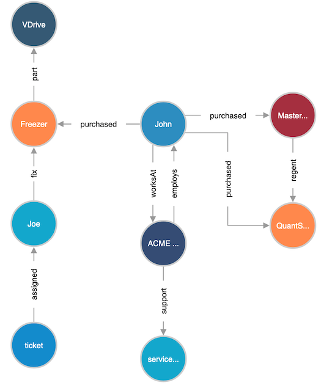

# Integrating Sales and Service for Asset Management with AWS Neptune



John (dark blue cake) is a scientist and an employee of ACME lab corporation (light blue cake). John has purchased an freezer, DNA Sequencer (QuantStudio), and a master mix regent to perform his experiments. As John works with these instruments, his freezer door malfunctions. ACME corporation has a ‘silver’ tier contract and notifies the manufacturer that the freezer door has malfunctioned. The manufacturer of the freezer assigns a service ticket to a knowledgeable service technician, Joe (orange cake).

## Creating a Neptune Database

- DB Engine: 1.0.3.0.R1
- Dev and Testing environment
- DB instance size: db.r5.large
- Enable High Availability – No
- Instance identifier: <asset-mgnt-db>

Or you can use the CloudFormation to create the [getting start database](scripts/neptune-full-stack-nested-template.json)

## Launch Neptune Workbench

The best way to get started with Amazon Neptune is to use the [Neptune workbench](https://docs.aws.amazon.com/neptune/latest/userguide/notebooks.html). 

- Create notebook
- Name: <asset-mgnt-notebook>
- Create IAM Role

## Run the Asset Management Notebook

Upload the assetmanagement.ipynb and run it

## Run Air Routes Notebook

1. Launch the Terminal from Jupyter Notebooks to install dependency

```bash
/home/ec2-user/anaconda3/bin/python3 -m  pip install --target /home/ec2-user/anaconda3/envs/python3/lib/python3.6/site-packages/ msgpack
/home/ec2-user/anaconda3/bin/python3 -m  pip install --target /home/ec2-user/anaconda3/envs/python3/lib/python3.6/site-packages/ ipython-gremlin
/home/ec2-user/anaconda3/bin/python3 -m  pip install --target /home/ec2-user/anaconda3/envs/python3/lib/python3.6/site-packages/ gremlinpython
/home/ec2-user/anaconda3/bin/python3 -m  pip install --target /home/ec2-user/anaconda3/envs/python3/lib/python3.6/site-packages/ tornado
/home/ec2-user/anaconda3/bin/python3 -m  pip install --target /home/ec2-user/anaconda3/envs/python3/lib/python3.6/site-packages/ ipython_unittest
/home/ec2-user/anaconda3/bin/python3 -m  pip install --target /home/ec2-user/anaconda3/envs/python3/lib/python3.6/site-packages/ jupyter_dojo
/home/ec2-user/anaconda3/bin/python3 -m  pip install --target /home/ec2-user/anaconda3/envs/python3/lib/python3.6/site-packages/ sparqlwrapper
/home/ec2-user/anaconda3/bin/python3 -m  pip install --target /home/ec2-user/anaconda3/envs/python3/lib/python3.6/site-packages/ ipython-sparql
/home/ec2-user/anaconda3/bin/python3 -m  pip install --target /home/ec2-user/anaconda3/envs/python3/lib/python3.6/site-packages/ ipywidgets

aws s3 cp s3://aws-neptune-customer-samples-us-west-2/neptune-sagemaker/bin/neptune-python-utils/neptune_python_utils.zip /home/ec2-user/anaconda3/envs/python3/lib/python3.6/site-packages/
unzip -n /home/ec2-user/anaconda3/envs/python3/lib/python3.6/site-packages/neptune_python_utils.zip -d /home/ec2-user/anaconda3/envs/python3/lib/python3.6/site-packages/
```

# Reference
[Integrating Sales and Service with AWS Neptune](https://github.com/aws-samples/aws-neptune-asset-management)

[Building a customer identity graph with Amazon Neptune](https://aws.amazon.com/blogs/database/building-a-customer-identity-graph-with-amazon-neptune/)

[Analyze Amazon Neptune Graphs using Amazon SageMaker Jupyter Notebooks](https://aws.amazon.com/blogs/database/analyze-amazon-neptune-graphs-using-amazon-sagemaker-jupyter-notebooks/)

[Let Me Graph That For You – Part 1 – Air Routes](https://aws.amazon.com/blogs/database/let-me-graph-that-for-you-part-1-air-routes/)