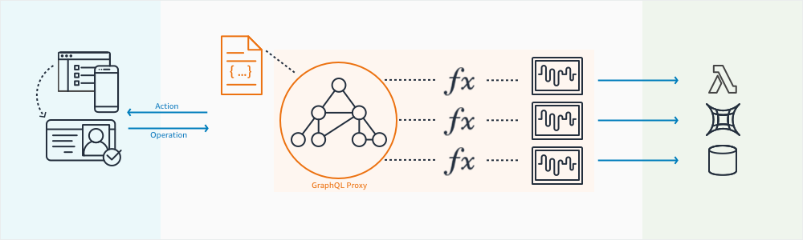
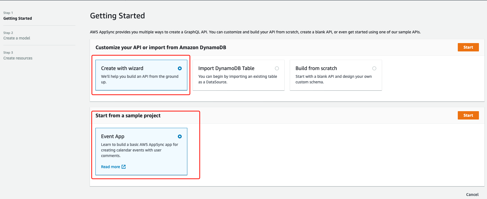
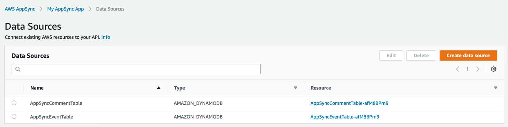
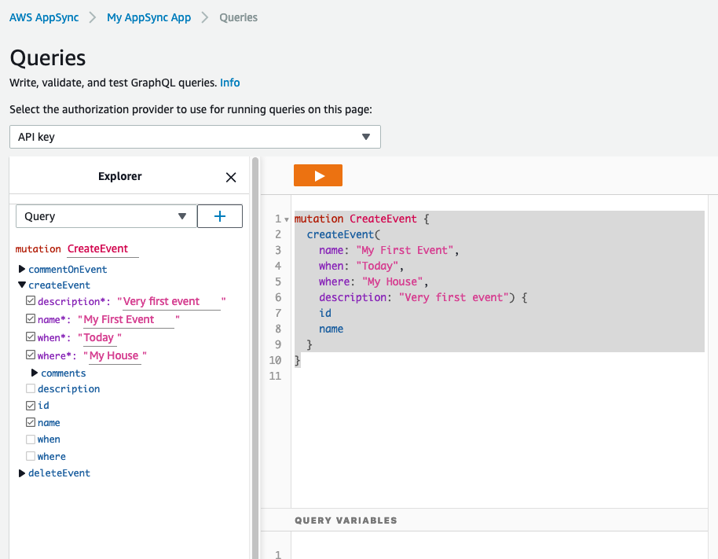
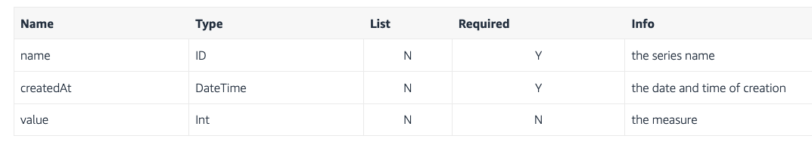
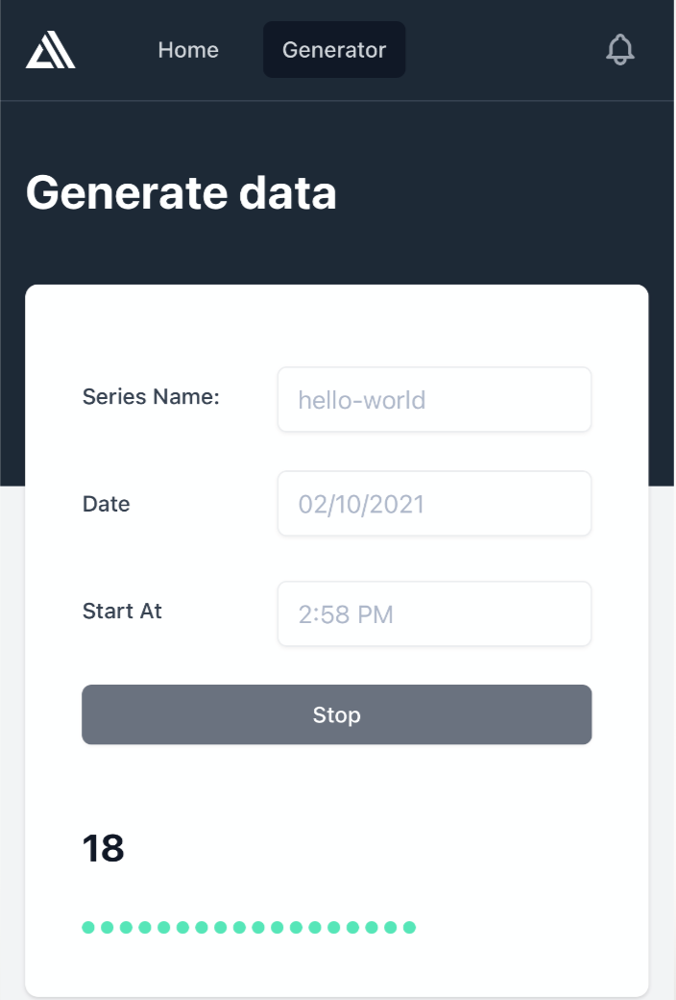
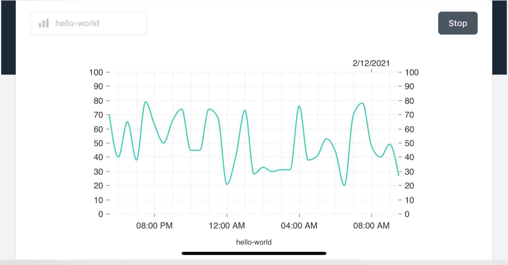

# AppSync Workshop

AWS AppSync provides a robust, scalable GraphQL interface for application developers to combine data from multiple sources, including Amazon DynamoDB, AWS Lambda, and HTTP REST APIs. AWS AppSync also support Streamlined data caching



## Prepare
1. Setup the AWS CLI
2. Setup NodeJS, AWS CDK and Utilities
```bash
# install node v12
nvm install v12
# configure node v12 as the default
nvm alias default 12
# version should be v12.*
node --version

# install the aws-cdk CLI
npm install -g aws-cdk
# check the toolkit version:
cdk --version

# Install tree
sudo yum install tree -y
# Install jq
sudo yum install jq -y

```

## Work on AppSync with Console - Quick Start
1. Launch a Sample Schema
- Go to AWS AppSync console and choose `Create API`.
- Select `Event App` and choose Start.


Waite the AppSync create the resource for you. You can check the resources by review the
[schema.graphql](script/schema.graphql)

2. Data Sources

Connect existing AWS resources to your API.



3. Run Queries and Mutations 

GraphQL has three top-level operations:
- Query - read-only fetch
- Mutation - write, followed by a fetch
- Subscription - long-lived connection for receiving data

Let's write data and query the data

- Add Data with a GraphQL Mutation


```js
mutation CreateEvent {
  createEvent(
    name: "My First Event", 
    when: "Today", 
    where: "My House", 
    description: "Very first event") {
    id
    name
  }
}

mutation add {
    createEvent(
        name:"My second GraphQL event"
        where:"Friend House"
        when:"Friday night"
        description:"Catching up with friends"
    ){
        id
        name
        where
        when
        description
    }
}

mutation CreateComments {
  commentOnEvent(
    content: 
    "I Have pick up the friends", 
    createdAt: "Sunday Monitoring", 
    eventId: "c2b6a3f2-d955-43bd-84c3-276ddb677675")
    {
      content
      createdAt
      eventId
      commentId
    }
}
```

- Retrieve Data with a GraphQL Query 
```js
query ListEvents {
  listEvents {
    items {
      id
      name
      when
      where
    }
  }
}

# Response
{
  "data": {
    "listEvents": {
      "items": [
        {
          "id": "6334d926-e2f1-42a6-9ead-bf70bc49996f",
          "name": "My First Event",
          "when": "Today",
          "where": "My House"
        },
        {
          "id": "c2b6a3f2-d955-43bd-84c3-276ddb677675",
          "name": "My second GraphQL event",
          "when": "Friday night",
          "where": "Friend House"
        }
      ]
    }
  }
}

query getAllEvents {
    listEvents{
        items{
            id
            name
            when
        }
    }
}
# Response
{
  "data": {
    "listEvents": {
      "items": [
        {
          "id": "6334d926-e2f1-42a6-9ead-bf70bc49996f",
          "name": "My First Event",
          "when": "Today"
        },
        {
          "id": "c2b6a3f2-d955-43bd-84c3-276ddb677675",
          "name": "My second GraphQL event",
          "when": "Friday night"
        }
      ]
    }
  }
}

query getAllComments {
  listEvents {
    items {
      comments {
        items {
          commentId
          content
          createdAt
          eventId
        }
      }
    }
  }
}

# Response
{
  "data": {
    "listEvents": {
      "items": [
        {
          "comments": {
            "items": []
          }
        },
        {
          "comments": {
            "items": [
              {
                "commentId": "3016a507-7d4a-4820-860f-adf3c284252e",
                "content": "I Have pick up the friends",
                "createdAt": "Sunday Monitoring",
                "eventId": "c2b6a3f2-d955-43bd-84c3-276ddb677675"
              }
            ]
          }
        }
      ]
    }
  }
}
```
- Queries single event
```js
query MyQuery {
  getEvent(id: "c2b6a3f2-d955-43bd-84c3-276ddb677675") {
    id
    name
    when
    where
    description
  }
}

# Response
{
  "data": {
    "getEvent": {
      "id": "c2b6a3f2-d955-43bd-84c3-276ddb677675",
      "name": "My second GraphQL event",
      "when": "Friday night",
      "where": "Friend House",
      "description": "Catching up with friends"
    }
  }
}
```

## Work on AppSync with Console - Create a new API using the wizard
1. Design and schema overview

Build an application that supports visualization of time series data points. 

GraphQL Scalars supported by AppSync, see [Scalar types in AWS AppSync](https://docs.aws.amazon.com/appsync/latest/devguide/scalars.html)

```js
type DataPoint {
  name: String!
  createdAt: AWSDateTime!
  value: Int!
}
```

2. Create a new API using the wizard
- Go to AWS AppSync console 
- Create with Wizard

    - model name: `DataPoint`
    - configure the model fields 
    
    - Expand the `Configure model table (optional) section` and set the `Primary Key` to `name` and the `Sort Key` to `createdAt`.
    - API name: `DataPoint API`
- Interact with the API
Follow up the [Interact with the API guide](https://appsync-immersionday.workshop.aws/lab1/1_with-console.html#3-interact-with-the-api) to create the [DataPoint API](script/datapoint-schema.graphql)
```js
mutation createDataPoint($createdatapointinput: CreateDataPointInput!) {
  createDataPoint(input: $createdatapointinput) {
    name
    createdAt
    value
  }
}

{
  "createdatapointinput": {
    "name": "hello-world",
    "createdAt": "1970-01-02T12:30:00.000Z",
    "value": 50
  }
}

mutation updateDataPoint($updatedatapointinput: UpdateDataPointInput!) {
  updateDataPoint(input: $updatedatapointinput) {
    createdAt
    name
    value
  }
}

{
  "updatedatapointinput": {
    "name": "hello-world",
    "createdAt": "1970-01-02T12:30:00.000Z",
    "value": -10
  }
}

query listDataPoints {
  listDataPoints {
    items {
      name
      createdAt
      value
    }
  }
}

query getDataPoint {
  getDataPoint(createdAt: "1970-01-02T12:30:00.000Z", name: "hello-world") {
    name
    createdAt
    value
  }
}

subscription onCreateDataPoint {
  onCreateDataPoint(name: "hello-world") {
    createdAt
    name
    value
  }
}
```

## Work on AppSync with Console - Update the API
1. Add new query: queryDataPointsByNameAndDateTime

Edit the schema of API

```
input ModelStringKeyConditionInput {
  eq: String
  le: String
  lt: String
  ge: String
  gt: String
  between: [String]
  beginsWith: String
}

enum ModelSortDirection {
  ASC
  DESC
}

type Query {
	getDataPoint(name: ID!, createdAt: AWSDateTime!): DataPoint
	listDataPoints(filter: TableDataPointFilterInput, limit: Int, nextToken: String): DataPointConnection
  queryDataPointsByNameAndDateTime( name: ID!, createdAt: ModelStringKeyConditionInput, sortDirection: ModelSortDirection, 
    filter: TableDataPointFilterInput, limit: Int, nextToken: String): DataPointConnection
}
```

2. Run query
```js
query queryDataPointsByNameAndTimeRage {
  queryDataPointsByNameAndDateTime(name: "hello-world", createdAt: {between: ["1970", "1985"]}, limit: 10, sortDirection: DESC) {
    items {
      createdAt
      name
      value
    }
  }
}
```

3. Update the createDataPoint mutation 
Follow up the [guide](https://appsync-immersionday.workshop.aws/lab1/1_with-console.html#2-update-the-createdatapoint-mutation)

## Connect your app
1. Build the sample APP
```bash
mkdir appsync-application
cd appsync-application
wget https://appsync-immersionday.workshop.aws/lab1/3_connect/_index.en.files/application.zip
unzip application.zip
cd application

# Edit the src/aws-exports.js
const awsmobile = {
  aws_appsync_graphqlEndpoint: 'YOUR_API_URL',
  aws_appsync_apiKey: 'YOUR_API_ID',
  aws_appsync_authenticationType: 'API_KEY',
}

export default awsmobile

## build and start
npm install
npm run start
```

2. View the dashboard
Visit the dashboard http://<IP>:3000/

- Generator the real time stream data by call `createDataPoint`


- Live view the data by call `listDataPoints`



# Reference
[appsync-immersionday](https://appsync-immersionday.workshop.aws/)