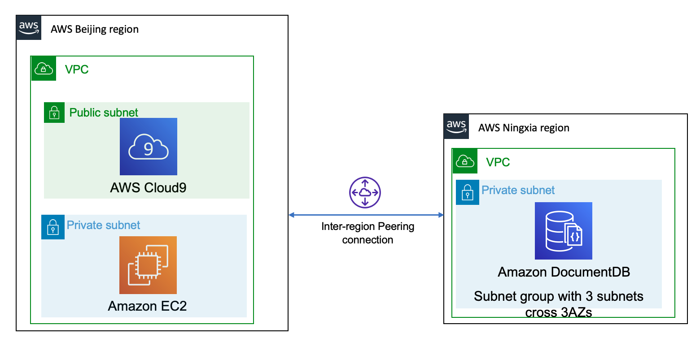
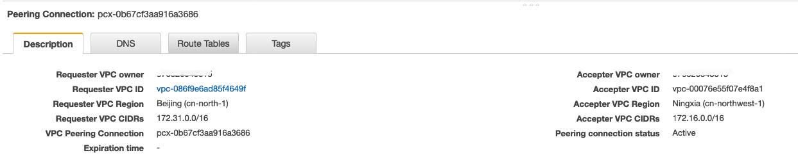
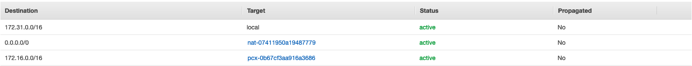
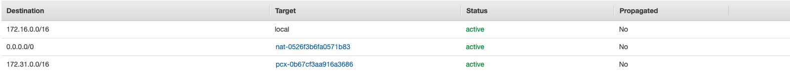
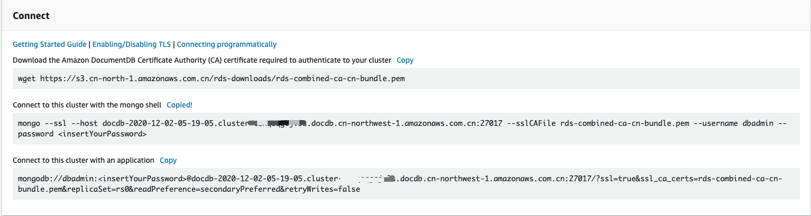

# Get Start with Amazon DocumentDB
## Prerequisites
1. Create a security group

Port 27017 is the default port for Amazon DocumentDB.

2. Create an Amazon DocumentDB cluster

3. Install the mongo shell on EC2 or Cloud 9 environment
```bash
# install the mongo shell 
echo -e "[mongodb-org-4.0] \nname=MongoDB Repository\nbaseurl=https://repo.mongodb.org/yum/amazon/2013.03/mongodb-org/4.0/x86_64/\ngpgcheck=1 \nenabled=1 \ngpgkey=https://www.mongodb.org/static/pgp/server-4.0.asc" | sudo tee /etc/yum.repos.d/mongodb-org-4.0.repo

sudo yum install -y mongodb-org-shell

# To encrypt data in transit, download the public key for Amazon DocumentDB
# Global region
wget https://s3.amazonaws.com/rds-downloads/rds-combined-ca-bundle.pem
# China region
wget https://s3.cn-north-1.amazonaws.com.cn/rds-downloads/rds-combined-ca-cn-bundle.pem
```

## Quick start use
1. Connect to your Amazon DocumentDB cluster

    Amazon DocumentDB (with MongoDB compatibility) clusters are deployed within an Amazon VPC. They can be accessed directly by Amazon EC2 instances or other AWS services that are deployed in the same Amazon VPC. Additionally, Amazon DocumentDB can be accessed in different VPCs in the same AWS Region or other Regions via `VPC peering`.

- Cross region connection


- Inter-region peering


- Application VPC Route Table


- DocumentDB VPC Route Table


    If your application) access your Amazon DocumentDB resources from outside the cluster's VPC. In that case, you can use `SSH tunneling` (also known as port forwarding) to access your Amazon DocumentDB resources. 

    https://docs.aws.amazon.com/documentdb/latest/developerguide/connect-from-outside-a-vpc.html

2. Get the conntion info


```bash
mongo --ssl --host <docDB_endpoint>:27017 --sslCAFile rds-combined-ca-cn-bundle.pem --username dbadmin --password <insertYourPassword>
```

    When you enter your password and your prompt becomes `rs0:PRIMARY>` prompt, you are successfully connected to your Amazon DocumentDB cluster. 

3. Insert and query data
```bash
# insert a single document
s0:PRIMARY> db.collection.insert({"hello":"DocumentDB"})
WriteResult({ "nInserted" : 1 })

# read one document 
rs0:PRIMARY> db.collection.findOne()
{ "_id" : ObjectId("5fc72948c2e9c52076de75fb"), "hello" : "DocumentDB" }

# insert a few entries into a collection
rs0:PRIMARY> db.profiles.insertMany([
...             { "_id" : 1, "name" : "Matt", "status": "active", "level": 12, "score":202},
...             { "_id" : 2, "name" : "Frank", "status": "inactive", "level": 2, "score":9},
...             { "_id" : 3, "name" : "Karen", "status": "active", "level": 7, "score":87},
...             { "_id" : 4, "name" : "Katie", "status": "active", "level": 3, "score":27}
...             ])
{ "acknowledged" : true, "insertedIds" : [ 1, 2, 3, 4 ] }

# return all the documents in the profiles collection
rs0:PRIMARY> db.profiles.find()
{ "_id" : 1, "name" : "Matt", "status" : "active", "level" : 12, "score" : 202 }
{ "_id" : 2, "name" : "Frank", "status" : "inactive", "level" : 2, "score" : 9 }
{ "_id" : 3, "name" : "Karen", "status" : "active", "level" : 7, "score" : 87 }
{ "_id" : 4, "name" : "Katie", "status" : "active", "level" : 3, "score" : 27 }

# query for a single document using a filter
rs0:PRIMARY> db.profiles.find({name: "Katie"})
{ "_id" : 4, "name" : "Katie", "status" : "active", "level" : 3, "score" : 27 }

# find a profile and modify it using the findAndModify command
rs0:PRIMARY>     db.profiles.findAndModify({
...         query: { name: "Matt", status: "active"},
...         update: { $inc: { score: 10 } }
...     })
{
        "_id" : 1,
        "name" : "Matt",
        "status" : "active",
        "level" : 12,
        "score" : 202
}

# verify that value has changed
rs0:PRIMARY> db.profiles.find({name: "Matt"})
{ "_id" : 1, "name" : "Matt", "status" : "active", "level" : 12, "score" : 212 }
rs0:PRIMARY>
```

# Reference
[Amazon DocumentDB Official guide](https://docs.amazonaws.cn/en_us/documentdb/latest/developerguide/get-started-guide.html)

[Amazon DocumentDB Quick Start Using AWS CloudFormation](https://docs.amazonaws.cn/en_us/documentdb/latest/developerguide/quick_start_cfn.html)