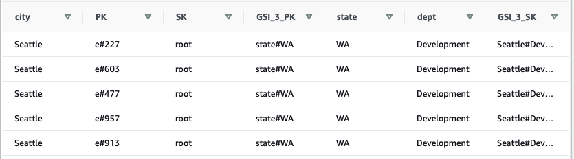

# Composite keys

In this sample, query the employees by geographic location (state and city) and by department. You have the attributes: `state`, `city`, and `dept`. 

In DynamoDB you can query the items using a combination of the partition key and the sort key, for `employees` table, the PK is employee id `e#xxx`, how about the sort key design?

Carefully choosing the sort key attribute is important because it can significantly improve the selectivity of the items retrieved by a query. You may want to query the items to use more than two attributes, such as `state=TX` and `dept=IT`, in this case, you will create a composite-key structure that allows you to query with more than two attributes.

You can create a global secondary index that will combine multiple attributes to allow queries by using this composite-key.

## Create new GSI based on composite key attribute

In the `employees` table, we have `state`, `city`, and `dept` attibutes. We will create new GSI GSI_3:
- Partition Key: new `GSI_3_PK` attribute, value with prefix `#state`. E.g: `state#WA`
- Sort Key: new `GSI_3_SK` attribute, value with format `city#dept`. E.g: `Seattle#Development`

You can still overload this global secondary index in the future for different entities types
- `employee-location` (`state`, `city`, and `dept`) - This composite-key sample used.
- `metadata` (for employee details), 
- `employee-title` (current_title or previous_title), 

1. GSI key schema
- gsi_city_dept.json
```json
"Create": {
      "IndexName": "GSI_3",
      "KeySchema": [
        {
          "AttributeName": "GSI_3_PK",
          "KeyType": "HASH"
        },
        {
          "AttributeName": "GSI_3_SK",
          "KeyType": "RANGE"
        }
      ],
      "Projection": {
        "ProjectionType": "ALL"
      },
      "ProvisionedThroughput": {
        "ReadCapacityUnits": 10,
        "WriteCapacityUnits": 10
      }
    }
```

2. update the table to create the new GSI `GSI_3`
```bash
aws dynamodb update-table --table-name employees \
--attribute-definitions AttributeName=state,AttributeType=S AttributeName=city_dept,AttributeType=S \
--global-secondary-index-updates file://gsi_city_dept.json

aws dynamodb describe-table --table-name employees --query "Table.GlobalSecondaryIndexes[].IndexStatus"
```

3. populate the index with the composite key attribute
```python
            newEmployee['GSI_3_PK'] = "state#{}".format(row[5])
            newEmployee['GSI_3_SK'] = "{}#{}".format(row[4], row[3])
```

```bash
python load_employees.py employees ./data/employees.csv
```

```sql
SELECT PK, SK, GSI_3_PK, GSI_3_SK, state, city, dept FROM "employees"."GSI_3"
```



4. Query the data with new 

For the sort key, you can use the `begins_with` expression to query item via GSI based on composite key attribute. Then you can use the `KeyConditionExpression`. For example `Key('GSI_3_PK').eq("state#{}".format('TX')) & Key('GSI_3_SK').begins_with('Austin')`

- query code
```python
def query_gsi(tableName, value1, value2):
    dynamodb = boto3.resource(**boto_args)
    table = dynamodb.Table(tableName)

    if value2 == "-":
        ke = Key('GSI_3_PK').eq("state#{}".format(value1))
    else:
        ke = Key('GSI_3_PK').eq("state#{}".format(value1)) & Key('GSI_3_SK').begins_with(value2)

    response = table.query(
        IndexName='GSI_3',
        KeyConditionExpression=ke
        )

    print('List of employees . State: %s' % (value1))

    for i in response['Items']:
        city,dept = i['city_dept'].split('#')
        print('\tName: %s. City: %s. Dept: %s' % (i['name'], city, dept))

    return response['Count']

count = query_gsi(tableName, value1, value2)
```

- Query all the employees from a state
```bash
python query_city_dept.py employees TX

List of employees . State: TX
        Name: Malinde Spellman. City: Austin. Dept: Development
        Name: Lida Flescher. City: Austin. Dept: Development
        Name: Keir Cashell. City: Austin. Dept: Development
...
Total of employees: 197. Execution time: 0.18724584579467773 seconds
```

- Query all the employees of a city
```bash
python query_city_dept.py employees TX --citydept Dallas
List of employees . State: TX
        Name: Dominica Northage. City: Dallas. Dept: Development
        Name: Dwayne Fransemai. City: Dallas. Dept: Development
        Name: Lucretia Ruffell. City: Dallas. Dept: Development
...
Total of employees: 47. Execution time: 0.1241462230682373 seconds
```

- Querying all the employees of a city and a specific department
```bash
python query_city_dept.py employees TX --citydept 'Dallas#Op'

List of employees . State: TX
        Name: Waneta Parminter. City: Dallas. Dept: Operation
        Name: Arlan Cummings. City: Dallas. Dept: Operation
        Name: Audra Leahey. City: Dallas. Dept: Operation
...
Total of employees: 9. Execution time: 0.1348414421081543 seconds
```