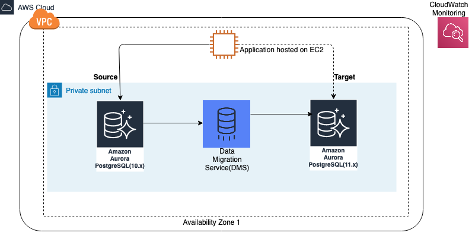

# Achieving minimum downtime for major version upgrades in Amazon RDS PostgreSQL

## Know your source database
1. source and target version
2. Use the multi-AZ or not
3. Contain the Read replica or not
4. Total data volume

## Choosing a major version upgrade for PostgreSQL
You can upgrade a PostgreSQL database to its next major version. From some PostgreSQL database versions, you can skip to a higher major version when upgrading. If your upgrade skips a major version, the read replicas are also upgraded to that target major version. 

The following table lists the source PostgreSQL database versions and the associated target major versions available for upgrading

https://docs.amazonaws.cn/en_us/AmazonRDS/latest/UserGuide/USER_UpgradeDBInstance.PostgreSQL.html#USER_UpgradeDBInstance.PostgreSQL.MajorVersion

## Preparation and check list
- Follow up the [preparation guide and check list](https://docs.amazonaws.cn/en_us/AmazonRDS/latest/UserGuide/USER_UpgradeDBInstance.PostgreSQL.html#USER_UpgradeDBInstance.PostgreSQL.MajorVersion.Process)

- You can't upgrade read replicas separately. An upgrade also upgrades the in-Region read replicas along with the primary instance. To prevent a replica upgrade, promote the replica to a standalone instance or delete it before starting the upgrade process. 

## Options
1. Create the target version PostgreSQL database and use AWS DMS, [logical replication](https://www.postgresql.org/docs/current/logical-replication.html), or the [pglogical extension](https://github.com/2ndQuadrant/pglogical) to set up replication between two different major versions from source to target. When both instances are in sync, cut over and point applications to the new master RDS instance. 

Below are sample [Achieving minimum downtime for major version upgrades in Amazon Aurora for PostgreSQL using AWS DMS](https://aws.amazon.com/cn/blogs/database/achieving-minimum-downtime-for-major-version-upgrades-in-amazon-aurora-for-postgresql-using-aws-dms/)

2. Promote the replica, making it a standalone instance, upgrade to newer major version. And cut-off the DNS once the upgrade complete. Then you can upgrade the primary instance to the newer major version. 

3. Use the default upgrade option, this will upgrading primary and replicas concurrently
Multi-AZ configuration doesn’t help avoid an outage during a database engine upgrade. Multi-AZ reduces outage time during an instance scale compute, but because storage level changes are required during a database engine upgrade, both instances upgrade at the same time.

Comparison the outage: #1 < #2 < #3

## Reference
[Upgrading the PostgreSQL DB engine for Amazon RDS](https://docs.amazonaws.cn/en_us/AmazonRDS/latest/UserGuide/USER_UpgradeDBInstance.PostgreSQL.html#USER_UpgradeDBInstance.PostgreSQL.MajorVersion)

[Best practices for upgrading Amazon RDS to major and minor versions of PostgreSQL](https://aws.amazon.com/cn/blogs/database/best-practices-for-upgrading-amazon-rds-to-major-and-minor-versions-of-postgresql/)

[Best practices for Amazon RDS for PostgreSQL major upgrades and replicas](https://aws.amazon.com/cn/blogs/database/best-practices-for-amazon-rds-for-postgresql-major-upgrades-and-replicas/)